# Java基础知识
## 基础概念与常识
### JVM vs JDK vs JRE

在 Java 中，JVM 可以理解的代码就叫做字节码（即扩展名为 .class 的文件），它不面向任何特定的处理器，只面向虚拟机。Java 语言通过字节码的方式，在一定程度上解决了传统解释型语言执行效率低的问题，同时又保留了解释型语言可移植的特点。所以 Java 程序运行时比较高效，而且，由于字节码并不针对一种特定的机器，因此，Java 程序无须重新编译便可在多种不同操作系统的计算机上运行。

我们需要格外注意的是 .class->机器码 这一步。在这一步 JVM 类加载器首先加载字节码文件，然后通过解释器逐行解释执行，这种方式的执行速度会相对比较慢。而且，有些方法和代码块是经常需要被调用的(也就是所谓的热点代码)，所以后面引进了 JIT 编译器，而 JIT 属于运行时编译。当 JIT 编译器完成第一次编译后，其会将字节码对应的机器码保存下来，下次可以直接使用。而我们知道，机器码的运行效率肯定是高于 Java 解释器的。这也解释了我们为什么经常会说 Java 是编译与解释共存的语言。


HotSpot 采用了惰性评估(Lazy Evaluation)的做法，根据二八定律，消耗大部分系统资源的只有那一小部分的代码（热点代码），而这也就是 JIT 所需要编译的部分。JVM 会根据代码每次被执行的情况收集信息并相应地做出一些优化，因此执行的次数越多，它的速度就越快。JDK 9 引入了一种新的编译模式 AOT(Ahead of Time Compilation)，它是直接将字节码编译成机器码，这样就避免了 JIT 预热等各方面的开销。JDK 支持分层编译和 AOT 协作使用。但是 ，AOT 编译器的编译质量是肯定比不上 JIT 编译器的。


Java 语言既具有编译型语言的特征，也具有解释型语言的特征，因为 Java 程序要经过先编译，后解释两个步骤，由 Java 编写的程序需要先经过编译步骤，生成字节码（\*.class 文件），这种字节码必须由 Java 解释器来解释执行。因此，我们可以认为 Java 语言编译与解释并存。


### 什么是字节码?采用字节码的好处是什么?

在 Java 中，JVM 可以理解的代码就叫做字节码（即扩展名为 .class 的文件），它不面向任何特定的处理器，只面向虚拟机。Java 语言通过字节码的方式，在一定程度上解决了传统解释型语言执行效率低的问题，同时又保留了解释型语言可移植的特点。所以， Java 程序运行时相对来说还是高效的（不过，和 C++，Rust，Go 等语言还是有一定差距的），而且，由于字节码并不针对一种特定的机器，因此，Java 程序无须重新编译便可在多种不同操作系统的计算机上运行。
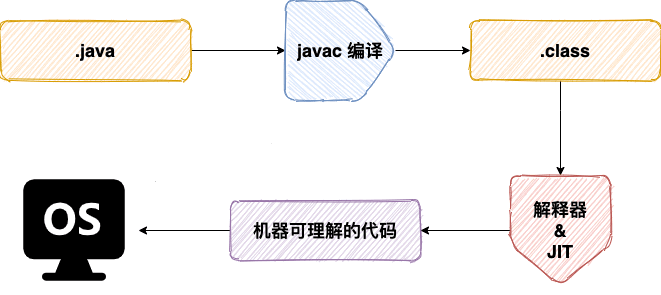

我们需要格外注意的是 .class->机器码 这一步。在这一步 JVM 类加载器首先加载字节码文件，然后通过解释器逐行解释执行，这种方式的执行速度会相对比较慢。而且，有些方法和代码块是经常需要被调用的(也就是所谓的热点代码)，所以后面引进了 JIT（just-in-time compilation） 编译器，而 JIT 属于运行时编译。当 JIT 编译器完成第一次编译后，其会将字节码对应的机器码保存下来，下次可以直接使用。而我们知道，机器码的运行效率肯定是高于 Java 解释器的。**这也解释了我们为什么经常会说 Java 是编译与解释共存的语言** 。
>HotSpot 采用了惰性评估(Lazy Evaluation)的做法，根据二八定律，消耗大部分系统资源的只有那一小部分的代码（热点代码），而这也就是 JIT 所需要编译的部分。JVM 会根据代码每次被执行的情况收集信息并相应地做出一些优化，因此执行的次数越多，它的速度就越快。JDK 9 引入了一种新的编译模式 AOT(Ahead of Time Compilation)，它是直接将字节码编译成机器码，这样就避免了 JIT 预热等各方面的开销。JDK 支持分层编译和 AOT 协作使用。但是 ，AOT 编译器的编译质量是肯定比不上 JIT 编译器的。

### Oracle JDK 和 OpenJDK 的对比

1. OpenJDK 是一个参考模型并且是完全开源的，而 Oracle JDK 是 OpenJDK 的一个实现，并不是完全开源的；

2. Oracle JDK 比 OpenJDK 更稳定。OpenJDK 和 Oracle JDK 的代码几乎相同，但 Oracle JDK 有更多的类和一些错误修复。因此，如果您想开发企业/商业软件，我建议您选择 Oracle JDK，因为它经过了彻底的测试和稳定。某些情况下，有些人提到在使用 OpenJDK 可能会遇到了许多应用程序崩溃的问题，但是，只需切换到 Oracle JDK 就可以解决问题；
3. 在响应性和 JVM 性能方面，Oracle JDK 与 OpenJDK 相比提供了更好的性能；
4. Oracle JDK 不会为即将发布的版本提供长期支持，用户每次都必须通过更新到最新版本获得支持来获取最新版本；

### Java 和 C++的区别

* 都是面向对象的语言，都支持封装、继承和多态
* Java 不提供指针来直接访问内存，程序内存更加安全
* Java 的类是单继承的，C++ 支持多重继承；虽然 Java 的类不可以多继承，但是接口可以多继承。
* Java 有自动内存管理垃圾回收机制(GC)，不需要程序员手动释放无用内存。
* C ++同时支持方法重载和操作符重载，但是 Java 只支持方法重载（操作符重载增加了复杂性，这与 Java 最初的设计思想不符）。


## 基本语法

### 字符型常量和字符串常量的区别

* 形式 : 字符常量是单引号引起的一个字符，字符串常量是双引号引起的 0 个或若干个字符

* 含义 : 字符常量相当于一个整型值( ASCII 值),可以参加表达式运算; 字符串常量代表一个地址值(该字符串在内存中存放位置)

* 占内存大小 ： 字符常量只占 2 个字节; 字符串常量占若干个字节 (注意： char 在 Java 中占两个字节)

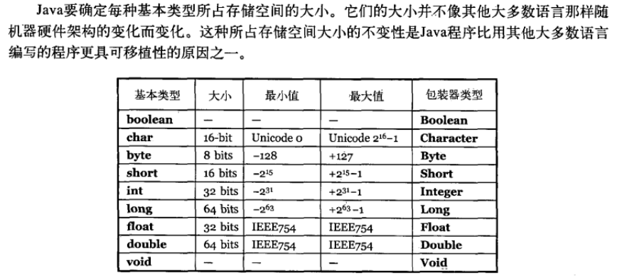


### continue、break、和 return 的区别


在循环结构中，当循环条件不满足或者循环次数达到要求时，循环会正常结束。但是，有时候可能需要在循环的过程中，当发生了某种条件之后 ，提前终止循环，这就需要用到下面几个关键词：

* continue ：指跳出当前的这一次循环，继续下一次循环。

* break ：指跳出整个循环体，继续执行循环下面的语句。


return 用于跳出所在方法，结束该方法的运行。


### Java 泛型了解么？什么是类型擦除？介绍一下常用的通配符


Java 泛型（generics）是 JDK 5 中引入的一个新特性, 泛型提供了编译时类型安全检测机制，该机制允许程序员在编译时检测到非法的类型。泛型的本质是参数化类型，也就是说所操作的数据类型被指定为一个参数。
Java 的泛型是伪泛型，这是因为 Java 在编译期间，所有的泛型信息都会被擦掉，这也就是通常所说类型擦除 。

泛型一般有三种使用方式:泛型类、泛型接口、泛型方法。


常用的通配符为： T，E，K，V，？

* ？ 表示不确定的 java 类型

* T (type) 表示具体的一个 java 类型

* K V (key value) 分别代表 java 键值中的 Key Value

* E (element) 代表 Element


### ==和 equals 的区别

对于基本数据类型来说，==比较的是值。对于引用数据类型来说，==比较的是对象的内存地址。


因为 Java 只有值传递，所以，对于 == 来说，不管是比较基本数据类型，还是引用数据类型的变量，其本质比较的都是值，只是引用类型变量存的值是对象的地址。


equals() 作用不能用于判断基本数据类型的变量，只能用来判断两个对象是否相等。equals()方法存在于Object类中，而Object类是所有类的直接或间接父类。


equals() 方法存在两种使用情况：类没有覆盖 equals()方法 ：通过equals()比较该类的两个对象时，等价于通过“==”比较这两个对象，使用的默认是 Object类equals()方法。类覆盖了 equals()方法 ：一般我们都覆盖 equals()方法来比较两个对象中的属性是否相等；若它们的属性相等，则返回 true(即，认为这两个对象相等)。

### hashCode()与 equals()

面试官可能会问你：“你重写过 hashcode 和 equals么，为什么重写 equals 时必须重写 hashCode 方法？”


1)hashCode()介绍:
hashCode() 的作用是获取哈希码，也称为散列码；它实际上是返回一个 int 整数。这个哈希码的作用是确定该对象在哈希表中的索引位置。hashCode()定义在 JDK 的 Object 类中，这就意味着 Java 中的任何类都包含有 hashCode() 函数。另外需要注意的是： Object 的 hashcode 方法是本地方法，也就是用 c 语言或 c++ 实现的，该方法通常用来将对象的 内存地址 转换为整数之后返回。
```
public native int hashCode();
```
散列表存储的是键值对(key-value)，它的特点是：能根据“键”快速的检索出对应的“值”。这其中就利用到了散列码！（可以快速找到所需要的对象）

2)为什么要有 hashCode？
我们以“HashSet 如何检查重复”为例子来说明为什么要有 hashCode？当你把对象加入 HashSet 时，HashSet 会先计算对象的 hashcode 值来判断对象加入的位置，同时也会与其他已经加入的对象的 hashcode 值作比较，如果没有相符的 hashcode，HashSet 会假设对象没有重复出现。但是如果发现有相同 hashcode 值的对象，这时会调用 equals() 方法来检查 hashcode 相等的对象是否真的相同。如果两者相同，HashSet 就不会让其加入操作成功。如果不同的话，就会重新散列到其他位置。（摘自我的 Java 启蒙书《Head First Java》第二版）。这样我们就大大减少了 equals 的次数，相应就大大提高了执行速度。

3)为什么重写 equals 时必须重写 hashCode 方法？
如果两个对象相等，则 hashcode 一定也是相同的。两个对象相等,对两个对象分别调用 equals 方法都返回 true。但是，两个对象有相同的 hashcode 值，它们也不一定是相等的 。因此，equals 方法被覆盖过，则 hashCode 方法也必须被覆盖。hashCode()的默认行为是对堆上的对象产生独特值。如果没有重写 hashCode()，则该 class 的两个对象无论如何都不会相等（即使这两个对象指向相同的数据）


4)为什么两个对象有相同的 hashcode 值，它们也不一定是相等的？
在这里解释一位小伙伴的问题。以下内容摘自《Head Fisrt Java》。因为 hashCode() 所使用的哈希算法也许刚好会让多个对象传回相同的哈希值。越糟糕的哈希算法越容易碰撞，但这也与数据值域分布的特性有关（所谓碰撞也就是指的是不同的对象得到相同的 hashCode。我们刚刚也提到了 HashSet,如果 HashSet 在对比的时候，同样的 hashcode 有多个对象，它会使用 equals() 来判断是否真的相同。也就是说 hashcode 只是用来缩小查找成本。


## 基本数据类型

### Java 中的几种基本数据类型是什么？对应的包装类型是什么？各自占用多少字节呢？

Java 中有 8 种基本数据类型，分别为：

1. 6 种数字类型 ：byte、short、int、long、float、double
2. 1 种字符类型：char
3. 1 种布尔型：boolean


这 8 种基本数据类型的默认值以及所占空间的大小如下：

| 基本类型 | 位数 | 字节 | 默认值  |
| -------- | ---- | ---- | ------- |
| int      | 32   | 4    | 0       |
| short    | 16   | 2    | 0       |
| long     | 64   | 8    | 0L      |
| byte     | 8    | 1    | 0       |
| char     | 16   | 2    | 'u0000' |
| float    | 32   | 4    | 0f      |
| double   | 64   | 8    | 0d      |
| boolean  | 1    |      | false   |


这八种基本类型都有对应的包装类分别为：Byte、Short、Integer、Long、Float、Double、Character、Boolean 。包装类型不赋值就是 Null ，而基本类型有默认值且不是 Null。

另外，这个问题建议还可以先从 JVM 层面来分析。基本数据类型直接存放在 Java 虚拟机栈中的局部变量表中，而包装类型属于对象类型，我们知道对象实例都存在于堆中。相比于对象类型， 基本数据类型占用的空间非常小。

《深入理解 Java 虚拟机》 ：局部变量表主要存放了编译期可知的基本数据类型（boolean、byte、char、short、int、float、long、double）、对象引用（reference 类型，它不同于对象本身，可能是一个指向对象起始地址的引用指针，也可能是指向一个代表对象的句柄或其他与此对象相关的位置）。

### 自动装箱与拆箱

* **装箱**：将基本类型用它们对应的引用类型包装起来；
* **拆箱**：将包装类型转换为基本数据类型；


从字节码中，我们发现装箱其实就是调用了 包装类的valueOf()方法，拆箱其实就是调用了 xxxValue()方法。因此，

* Integer i = 10 等价于 Integer i = Integer.valueOf(10)
* int n = i 等价于 int n = i.intValue();


注意：如果频繁拆装箱的话，也会严重影响系统的性能。我们应该尽量避免不必要的拆装箱操作。

为什么说是几乎所有对象实例呢？ 这是因为 HotSpot 虚拟机引入了 JIT 优化之后，会对对象进行逃逸分析，如果发现某一个对象并没有逃逸到方法外部，那么就可能通过标量替换来实现栈上分配，而避免堆上分配内存。

### 8 种基本类型的包装类和常量池

Java 基本类型的包装类的大部分都实现了常量池技术（缓存技术）。Byte,Short,Integer,Long 这 4 种包装类默认创建了数值 [-128，127] 的相应类型的缓存数据，Character 创建了数值在[0,127]范围的缓存数据，Boolean 直接返回 True Or False。

Integer 缓存源码：
```

/** *此方法将始终缓存-128 到 127（包括端点）范围内的值，并可以缓存此范围之外的其他值。 */ 
public static Integer valueOf(int i) { 
    if (i >= IntegerCache.low && i <= IntegerCache.high) 
        return IntegerCache.cache[i + (-IntegerCache.low)]; 
    return new Integer(i);
} 
private static class IntegerCache { 
    static final int low = -128; 
    static final int high; 
    static final Integer cache[]; 
}
```

如果超出对应范围仍然会去创建新的对象，缓存的范围区间的大小只是在性能和资源之间的权衡。两种浮点数类型的包装类 Float,Double 并没有实现常量池技术。

记住：**所有整型包装类对象之间值的比较，全部使用 equals 方法比较。**
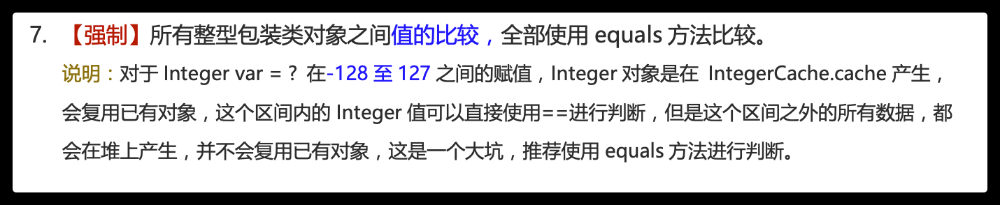


### 浮点数运算的时候会有精度丢失的风险
```
float a = 2.0f - 1.9f;
float b = 1.8f - 1.7f;
System.out.println(a);// 0.100000024
System.out.println(b);// 0.099999905
System.out.println(a == b);// false
```

这个和计算机保存浮点数的机制有很大关系。我们知道计算机是二进制的，而且计算机在表示一个数字时，宽度是有限的，无限循环的小数存储在计算机时，只能被截断，所以就会导致小数精度发生损失的情况。这也就是解释了为什么浮点数没有办法用二进制精确表示。

BigDecimal 可以实现对浮点数的运算，不会造成精度丢失。通常情况下，大部分需要浮点数精确运算结果的业务场景（比如涉及到钱的场景）都是通过 BigDecimal 来做的。

## 方法（函数）

### 为什么 Java 中只有值传递？
example 2
```
public static void main(String[] args) { 
    int[] arr = { 1, 2, 3, 4, 5 }; 
    System.out.println(arr[0]); 
    change(arr); 
    System.out.println(arr[0]); 
} 
public static void change(int[] array) {
    // 将数组的第一个元素变为0 
    array[0] = 0;
}
```

**结果：**
```
1
0
```

**解析：**


array 被初始化 arr 的拷贝也就是一个对象的引用，也就是说 array 和 arr 指向的是同一个数组对象。 因此，外部对引用对象的改变会反映到所对应的对象上。通过 example2 我们已经看到，实现一个改变对象参数状态的方法并不是一件难事。理由很简单，方法得到的是对象引用的拷贝，对象引用及其他的拷贝同时引用同一个对象。

很多程序设计语言（特别是，C++和 Pascal)提供了两种参数传递的方式：值调用和引用调用。有些程序员（甚至本书的作者）认为 Java 程序设计语言对对象采用的是引用调用，实际上，这种理解是不对的。由于这种误解具有一定的普遍性，所以下面给出一个反例来详细地阐述一下这个问题。

example 3
```

public class Test {

    public static void main(String[] args) {
        // TODO Auto-generated method stub
        Student s1 = new Student("小张");
        Student s2 = new Student("小李");
        Test.swap(s1, s2);
        System.out.println("s1:" + s1.getName());
        System.out.println("s2:" + s2.getName());
    }

    public static void swap(Student x, Student y) {
        Student temp = x;
        x = y;
        y = temp;
        System.out.println("x:" + x.getName());
        System.out.println("y:" + y.getName());
    }}
```

结果：
```
x:小李
y:小张
s1:小张
s2:小李
```
解析：交换之前：


交换之后：


通过上面两张图可以很清晰的看出： 方法并没有改变存储在变量 s1 和 s2 中的对象引用。swap 方法的参数 x 和 y 被初始化为两个对象引用的拷贝，这个方法交换的是这两个拷贝

总结

Java 程序设计语言对对象采用的不是引用调用，实际上，对象引用是按 值传递的。下面再总结一下 Java 中方法参数的使用情况：

* 一个方法不能修改一个基本数据类型的参数（即数值型或布尔型）。
* 一个方法可以改变一个对象参数的状态。
* 一个方法不能让对象参数引用一个新的对象。


### 重载和重写的区别

重载就是同样的一个方法能够根据输入数据的不同，做出不同的处理
重写就是当子类继承自父类的相同方法，输入数据一样，但要做出有别于父类的响应时，你就要覆盖父类方法


重写发生在运行期，是子类对父类的允许访问的方法的实现过程进行重新编写。

* 返回值类型、方法名、参数列表必须相同，抛出的异常范围小于等于父类，访问修饰符范围大于等于父类。
* 如果父类方法访问修饰符为 private/final/static 则子类就不能重写该方法，但是被 static 修饰的方法能够被再次声明。
* 构造方法无法被重写
综上：重写就是子类对父类方法的重新改造，外部样子不能改变，内部逻辑可以改变

**关于 重写的返回值类型 这里需要额外多说明一下，上面的表述不太清晰准确：如果方法的返回类型是 void 和基本数据类型，则返回值重写时不可修改。但是如果方法的返回值是引用类型，重写时是可以返回该引用类型的子类的。**
### 深拷贝 vs 浅拷贝

* 浅拷贝：浅拷贝会在堆上创建一个新的对象（区别于引用拷贝的一点），不过，如果原对象内部的属性是引用类型的话，浅拷贝会直接复制内部对象的引用地址，也就是说拷贝对象和原对象共用同一个内部对象。
* 深拷贝：深拷贝会完全复制整个对象，包括这个对象所包含的内部对象。

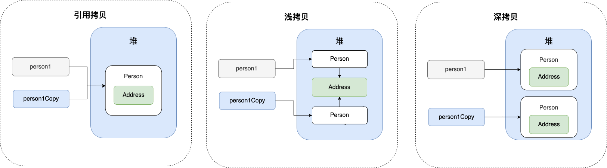

## Java 面向对象

* 面向过程 ：面向过程性能比面向对象高。 因为类调用时需要实例化，开销比较大，比较消耗资源，所以当性能是最重要的考量因素的时候，比如单片机、嵌入式开发、Linux/Unix 等一般采用面向过程开发。但是，面向过程没有面向对象易维护、易复用、易扩展。
* 面向对象 ：面向对象易维护、易复用、易扩展。 因为面向对象有封装、继承、多态性的特性，所以可以设计出低耦合的系统，使系统更加灵活、更加易于维护。但是，面向对象性能比面向过程低。

**面向过程 ：面向过程性能比面向对象高？**
这个并不是根本原因，面向过程也需要分配内存，计算内存偏移量，Java 性能差的主要原因并不是因为它是面向对象语言，而是 Java 是半编译语言，最终的执行代码并不是可以直接被 CPU 执行的二进制机械码。而面向过程语言大多都是直接编译成机械码在电脑上执行，并且其它一些面向过程的脚本语言性能也并不一定比 Java 好。


### 成员变量与局部变量的区别有哪些？

* 从语法形式上看，成员变量是属于类的，而局部变量是在代码块或方法中定义的变量或是方法的参数；成员变量可以被 public,private,static 等修饰符所修饰，而局部变量不能被访问控制修饰符及 static 所修饰；但是，成员变量和局部变量都能被 final 所修饰。
* 从变量在内存中的存储方式来看,如果成员变量是使用 static 修饰的，那么这个成员变量是属于类的，如果没有使用 static 修饰，这个成员变量是属于实例的。而对象存在于堆内存，局部变量则存在于栈内存。
* 从变量在内存中的生存时间上看，成员变量是对象的一部分，它随着对象的创建而存在，而局部变量随着方法的调用而自动消失。
* 从变量是否有默认值来看，成员变量如果没有被赋初，则会自动以类型的默认值而赋值（一种情况例外:被 final 修饰的成员变量也必须显式地赋值），而局部变量则不会自动赋值。


### 一个类的构造方法的作用是什么? 若一个类没有声明构造方法，该程序能正确执行吗? 为什么?

构造方法主要作用是完成对类对象的初始化工作。如果一个类没有声明构造方法，也可以执行！因为一个类即使没有声明构造方法也会有默认的不带参数的构造方法。如果我们自己添加了类的构造方法（无论是否有参），Java 就不会再添加默认的无参数的构造方法了，这时候，就不能直接 new 一个对象而不传递参数了，所以我们一直在不知不觉地使用构造方法，这也是为什么我们在创建对象的时候后面要加一个括号（因为要调用无参的构造方法）。如果我们重载了有参的构造方法，记得都要把无参的构造方法也写出来（无论是否用到），因为这可以帮助我们在创建对象的时候少踩坑。

### 构造方法有哪些特点？是否可被 override?

**特点：**

* 名字与类名相同。
* 没有返回值，但不能用 void 声明构造函数。
* 生成类的对象时自动执行，无需调用。

构造方法不能被 override（重写）,但是可以 overload（重载）,所以你可以看到一个类中有多个构造函数的情况。


### String StringBuffer 和 StringBuilder 的区别是什么? String 为什么是不可变的?

**可变性**

简单的来说：String 类中使用 final 关键字修饰字符数组来保存字符串，private final char value[]，所以String 对象是不可变的。

**补充：**在 Java 9 之后，String 、StringBuilder 与 StringBuffer 的实现改用 byte 数组存储字符串 private final byte[] value


而 StringBuilder 与 StringBuffer 都继承自 AbstractStringBuilder 类，在 AbstractStringBuilder 中也是使用字符数组保存字符串char[]value 但是没有用 final 关键字修饰，所以这两种对象都是可变的。

StringBuilder 与 StringBuffer 的构造方法都是调用父类构造方法也就是AbstractStringBuilder 实现的，大家可以自行查阅源码。

**线程安全性**
String 中的对象是不可变的，也就可以理解为常量，线程安全AbstractStringBuilder 是 StringBuilder 与 StringBuffer 的公共父类，定义了一些字符串的基本操作，如 expandCapacity、append、insert、indexOf 等公共方法。StringBuffer 对方法加了同步锁或者对调用的方法加了同步锁，所以是线程安全的。StringBuilder 并没有对方法进行加同步锁，所以是非线程安全的。

**性能**

每次对 String 类型进行改变的时候，都会生成一个新的 String 对象，然后将指针指向新的 String 对象。StringBuffer 每次都会对 StringBuffer 对象本身进行操作，而不是生成新的对象并改变对象引用。相同情况下使用 StringBuilder 相比使用 StringBuffer 仅能获得 10%~15% 左右的性能提升，但却要冒多线程不安全的风险。

#### 字符串拼接用“+” 还是 StringBuilder
字符串对象通过“+”的字符串拼接方式，实际上是通过 StringBuilder 调用 append() 方法实现的，拼接完成之后调用 toString() 得到一个 String 对象 。
不过，**在循环内使用“+”进行字符串的拼接的话，存在比较明显的缺陷：编译器不会创建单个 StringBuilder 以复用，会导致创建过多的 StringBuilder 对象。**

#### String 类型的变量和常量做“+”运算

先来看字符串不加 final 关键字拼接的情况（JDK1.8）：
```
String str1 = "str";
String str2 = "ing";
String str3 = "str" + "ing";
String str4 = str1 + str2;
String str5 = "string";
System.out.println(str3 == str4);//false
System.out.println(str3 == str5);//true
System.out.println(str4 == str5);//false
```

对于编译期可以确定值的字符串，也就是常量字符串 ，jvm 会将其存入字符串常量池。并且，字符串常量拼接得到的字符串常量在编译阶段就已经被存放字符串常量池，这个得益于编译器的优化。

在编译过程中，Javac 编译器（下文中统称为编译器）会进行一个叫做 常量折叠(Constant Folding) 的代码优化。《深入理解 Java 虚拟机》中是也有介绍到：
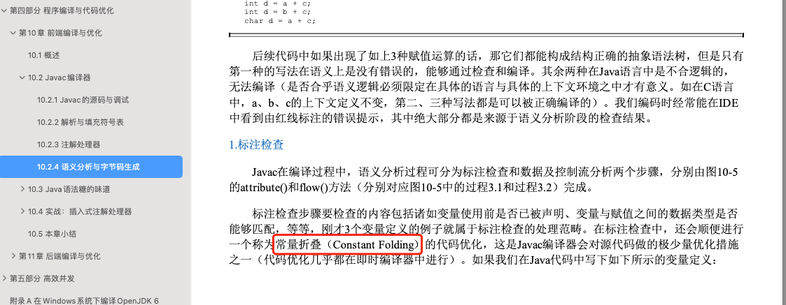

常量折叠会把常量表达式的值求出来作为常量嵌在最终生成的代码中，这是 Javac 编译器会对源代码做的极少量优化措施之一(代码优化几乎都在即时编译器中进行)。对于 String str3 = "str" + "ing"; 编译器会给你优化成 String str3 = "string"; 。


并不是所有的常量都会进行折叠，只有编译器在程序编译期就可以确定值的常量才可以：

* 基本数据类型( byte、boolean、short、char、int、float、long、double)以及字符串常量。
* final 修饰的基本数据类型和字符串变量
* 字符串通过 “+”拼接得到的字符串、基本数据类型之间算数运算（加减乘除）、基本数据类型的位运算（<<、>>、>>> ）

**引用的值在程序编译期是无法确定的，编译器无法对其进行优化。**


### Object 类的常见方法总结


Object 类是一个特殊的类，是所有类的父类。它主要提供了以下 11 个方法：
```

public final native Class<?> getClass()//native方法，用于返回当前运行时对象的Class对象，使用了final关键字修饰，故不允许子类重写。

public native int hashCode() //native方法，用于返回对象的哈希码，主要使用在哈希表中，比如JDK中的HashMap。public boolean equals(Object obj)//用于比较2个对象的内存地址是否相等，String类对该方法进行了重写用户比较字符串的值是否相等。

protected native Object clone() throws CloneNotSupportedException//naitive方法，用于创建并返回当前对象的一份拷贝。一般情况下，对于任何对象 x，表达式 x.clone() != x 为true，x.clone().getClass() == x.getClass() 为true。Object本身没有实现Cloneable接口，所以不重写clone方法并且进行调用的话会发生CloneNotSupportedException异常。

public String toString()//返回类的名字@实例的哈希码的16进制的字符串。建议Object所有的子类都重写这个方法。

public final native void notify()//native方法，并且不能重写。唤醒一个在此对象监视器上等待的线程(监视器相当于就是锁的概念)。如果有多个线程在等待只会任意唤醒一个。

public final native void notifyAll()//native方法，并且不能重写。跟notify一样，唯一的区别就是会唤醒在此对象监视器上等待的所有线程，而不是一个线程。

public final native void wait(long timeout) throws InterruptedException//native方法，并且不能重写。暂停线程的执行。注意：sleep方法没有释放锁，而wait方法释放了锁 。timeout是等待时间。

public final void wait(long timeout, int nanos) throws InterruptedException//多了nanos参数，这个参数表示额外时间（以毫微秒为单位，范围是 0-999999）。 所以超时的时间还需要加上nanos毫秒。

public final void wait() throws InterruptedException//跟之前的2个wait方法一样，只不过该方法一直等待，没有超时时间这个概念

protected void finalize() throws Throwable { }//实例被垃圾回收器回收的时候触发的操作
```

## 反射

### 反射机制优缺点

* 优点 ： 可以让咱们的代码更加灵活、为各种框架提供开箱即用的功能提供了便利
* 缺点 ：让我们在运行时有了分析操作类的能力，这同样也增加了安全问题。比如可以无视泛型参数的安全检查（泛型参数的安全检查发生在编译时）。另外，反射的性能也要稍差点，不过，对于框架来说实际是影响不大的。

### 反射的应用场景


像 Spring/Spring Boot、MyBatis 等等框架中都大量使用了反射机制，这些框架中也大量使用了动态代理，而动态代理的实现也依赖反射。另外，像 Java 中的一大利器 注解 的实现也用到了反射。

### 获取 Class 对象的四种方式

1.知道具体类的情况下可以使用：
通过此方式获取 Class 对象不会进行初始化
```
Class alunbarClass = TargetObject.class;
```

2.通过 Class.forName()传入类的路径获取：
```
Class alunbarClass1 = Class.forName("cn.javaguide.TargetObject");
```

3.通过对象实例instance.getClass()获取：
```
TargetObject o = new TargetObject();
Class alunbarClass2 = o.getClass();
```

4.通过类加载器xxxClassLoader.loadClass()传入类路径获取:
```
Class clazz = ClassLoader.loadClass("cn.javaguide.TargetObject");
```

通过类加载器获取 Class 对象不会进行初始化，意味着不进行包括初始化等一些列步骤，**静态块和静态对象不会得到执行**


## Java 代理模式详解

代理模式是一种比较好理解的设计模式。简单来说就是我们使用代理对象来代替对真实对象(real object)的访问，这样就可以在不修改原目标对象的前提下，提供额外的功能操作，扩展目标对象的功能。代理模式的主要作用是扩展目标对象的功能，比如说在目标对象的某个方法执行前后你可以增加一些自定义的操作。

代理模式有静态代理和动态代理两种实现方式。

### 静态代理

静态代理中，我们对目标对象的每个方法的增强都是手动完成的（后面会具体演示代码），非常不灵活（比如接口一旦新增加方法，目标对象和代理对象都要进行修改）且麻烦(需要对每个目标类都单独写一个代理类）。 实际应用场景非常非常少，日常开发几乎看不到使用静态代理的场景。上面我们是从实现和应用角度来说的静态代理，从 JVM 层面来说， 静态代理在编译时就将接口、实现类、代理类这些都变成了一个个实际的 class 文件。

静态代理实现步骤:

1. 定义一个接口及其实现类；
2. 创建一个代理类同样实现这个接口；
3. 将目标对象注入进代理类，然后在代理类的对应方法调用目标类中的对应方法。这样的话，我们就可以通过代理类屏蔽对目标对象的访问，并且可以在目标方法执行前后做一些自己想做的事情。


### 动态代理

相比于静态代理来说，动态代理更加灵活。我们不需要针对每个目标类都单独创建一个代理类，并且也不需要我们必须实现接口，我们可以直接代理实现类( CGLIB 动态代理机制)。
**从JVM角度来说，动态代理是在运行时动态生成类字节码，并加载到 JVM 中的**。说到动态代理，Spring AOP、RPC 框架应该是两个不得不提的，它们的实现都依赖了动态代理。

就 Java 来说，动态代理的实现方式有很多种，比如 JDK 动态代理、CGLIB 动态代理等等。

#### JDK 动态代理机制

在 Java 动态代理机制中InvocationHandler接口和Proxy类是核心。Proxy类中使用频率最高的方法是：newProxyInstance() ，这个方法主要用来生成一个代理对象。


#### CGLIB 动态代理机制

JDK动态代理有一个最致命的问题是其只能代理实现了接口的类。为了解决这个问题，我们可以用 CGLIB 动态代理机制来避免。

CGLIB(Code Generation Library)是一个基于ASM的字节码生成库，它允许我们在运行时对字节码进行修改和动态生成。CGLIB 通过继承方式实现代理。很多知名的开源框架都使用到了CGLIB， 例如 Spring 中的AOP模块中：如果目标对象实现了接口，则默认采用JDK动态代理，否则采用CGLIB动态代理。

在 CGLIB 动态代理机制中 MethodInterceptor 接口和 Enhancer 类是核心。
你需要自定义 MethodInterceptor 并重写 intercept 方法，intercept 用于拦截增强被代理类的方法。
```
public interface MethodInterceptor extends Callback{
    // 拦截被代理类中的方法
    public Object intercept(Object obj, java.lang.reflect.Method method, Object[] args,MethodProxy proxy) throws Throwable;
}
```

1. obj : 动态生成的代理对象
2. method : 被拦截的方法（需要增强的方法）
3. args : 方法入参
4. proxy : 用于调用原始方法


你可以通过 Enhancer类来动态获取被代理类，当代理类调用方法的时候，实际调用的是 MethodInterceptor 中的 intercept 方法。


**JDK 动态代理和 CGLIB 动态代理对比**：

1. JDK 动态代理只能代理实现了接口的类或者直接代理接口，而 CGLIB 可以代理未实现任何接口的类。 另外， CGLIB 动态代理是通过生成一个被代理类的子类来拦截被代理类的方法调用，因此不能代理声明为 final 类型的类和方法。
2. 就二者的效率来说，大部分情况都是 JDK 动态代理更优秀，随着 JDK 版本的升级，这个优势更加明显。

## 注解

Annontation （注解） 是Java5 开始引入的新特性，可以看作是一种特殊的注释，主要用于修饰类、方法或者变量。

注解本质是一个继承了Annotation 的特殊接口：
```
@Target(ElementType.METHOD)
@Retention(RetentionPolicy.SOURCE)
public @interface Override {

}

public interface Override extends Annotation{
    
}

```

注解只有被解析之后才会生效，常见的解析方法有两种：

* **编译期直接扫描** ：编译器在编译 Java 代码的时候扫描对应的注解并处理，比如某个方法使用@Override 注解，编译器在编译的时候就会检测当前的方法是否重写了父类对应的方法。
* **运行期通过反射处理** ：像框架中自带的注解(比如 Spring 框架的 @Value 、@Component)都是通过反射来进行处理的。


JDK 提供了很多内置的注解（比如 @Override 、@Deprecated），同时，我们还可以自定义注解。


## SPI

### 何为 SPI

SPI 即 Service Provider Interface ，字面意思就是：“服务提供者的接口”，我的理解是：专门提供给服务提供者或者扩展框架功能的开发者去使用的一个接口。SPI 将服务接口和具体的服务实现分离开来，将服务调用方和服务实现者解耦，能够提升程序的扩展性、可维护性。修改或者替换服务实现并不需要修改调用方。很多框架都使用了 Java 的 SPI 机制，比如：Spring 框架、数据库加载驱动、日志接口、以及 Dubbo 的扩展实现等等。
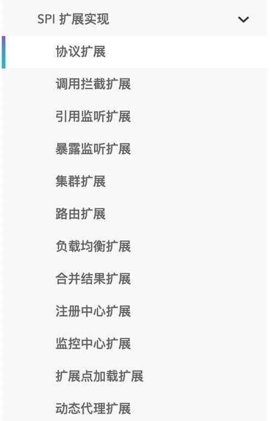

### SPI和API的区别

一般模块之间都是通过通过接口进行通讯，那我们在服务调用方和服务实现方（也称服务提供者）之间引入一个“接口”。
当实现方提供了接口和实现，我们可以通过调用实现方的接口从而拥有实现方给我们提供的能力，这就是 API ，这种接口和实现都是放在实现方的。当接口存在于调用方这边时，就是 SPI ，由接口调用方确定接口规则，然后由不同的厂商去根绝这个规则对这个接口进行实现，从而提供服务。

### SPI 的优缺点

通过 SPI 机制能够大大地提高接口设计的灵活性，但是 SPI 机制也存在一些缺点，比如：

* 需要遍历加载所有的实现类，不能做到按需加载，这样效率还是相对较低的。
* 当多个 ServiceLoader 同时 load 时，会有并发问题。


## 异常
Java 异常类层次结构图


在 Java 中，所有的异常都有一个共同的祖先 java.lang 包中的 Throwable 类。Throwable 类有两个重要的子类 Exception（异常）和 Error（错误）。Exception 能被程序本身处理(try-catch)， Error 是无法处理的(只能尽量避免)。

Exception 和 Error 二者都是 Java 异常处理的重要子类，各自都包含大量子类。

* Exception :程序本身可以处理的异常，可以通过 catch 来进行捕获。Exception 又可以分为 受检查异常(必须处理) 和 不受检查异常(可以不处理)。
* Error ：Error 属于程序无法处理的错误 ，我们没办法通过 catch 来进行捕获 。例如，Java 虚拟机运行错误（Virtual MachineError）、虚拟机内存不够错误(OutOfMemoryError)、类定义错误（NoClassDefFoundError）等 。这些异常发生时，Java 虚拟机（JVM）一般会选择线程终止。

**受检查异常**

Java 代码在编译过程中，如果受检查异常没有被 catch/throw 处理的话，就没办法通过编译 。除了RuntimeException及其子类以外，其他的Exception类及其子类都属于受检查异常 。常见的受检查异常有： IO 相关的异常、ClassNotFoundException 、SQLException...。

**不受检查异常**

Java 代码在编译过程中 ，我们即使不处理不受检查异常也可以正常通过编译。

RuntimeException 及其子类都统称为非受检查异常，例如：NullPointerException、NumberFormatException（字符串转换为数字）、ArrayIndexOutOfBoundsException（数组越界）、ClassCastException（类型转换错误）、ArithmeticException（算术错误）等。

### try-catch-finally

* try块： 用于捕获异常。其后可接零个或多个 catch 块，如果没有 catch 块，则必须跟一个 finally 块。
* catch块： 用于处理 try 捕获到的异常。
* finally 块： 无论是否捕获或处理异常，finally 块里的语句都会被执行。当在 try 块或 catch 块中遇到 return 语句时，finally 语句块将在方法返回之前被执行。

在以下 3 种特殊情况下，finally 块不会被执行：

1. 在 try 或 finally块中用了 System.exit(int)退出程序。但是，如果 System.exit(int) 在异常语句之后，finally 还是会被执行
2. 程序所在的线程死亡
3. 关闭 CPU


**注意**： 当 try 语句和 finally 语句中都有 return 语句时，在方法返回之前，finally 语句的内容将被执行，并且 finally 语句的返回值将会覆盖原始的返回值。如下：
```

public class Test {
    public static int f(int value) {
        try {
            return value * value;
        } finally {
            if (value == 2) {
                return 0;
            }
        }
    }}
```

如果调用 f(2)，返回值将是 0，因为 finally 语句的返回值覆盖了 try 语句块的返回值。

### 使用 try-with-resources 来代替try-catch-finally

1. 适用范围（资源的定义）： 任何实现 java.lang.AutoCloseable或者 java.io.Closeable 的对象
2. 关闭资源和 finally 块的执行顺序： 在 try-with-resources 语句中，任何 catch 或 finally 块在声明的资源关闭后运行

面对必须要关闭的资源，我们总是应该优先使用 try-with-resources 而不是try-finally。随之产生的代码更简短，更清晰，产生的异常对我们也更有用。try-with-resources语句让我们更容易编写必须要关闭的资源的代码，若采用try-finally则几乎做不到这点。

Java 中类似于InputStream、OutputStream 、Scanner 、PrintWriter等的资源都需要我们调用close()方法来手动关闭，一般情况下我们都是通过try-catch-finally语句来实现这个需求，如下：
```

        //读取文本文件的内容
        Scanner scanner = null;
        try {
            scanner = new Scanner(new File("D://read.txt"));
            while (scanner.hasNext()) {
                System.out.println(scanner.nextLine());
            }
        } catch (FileNotFoundException e) {
            e.printStackTrace();
        } finally {
            if (scanner != null) {
                scanner.close();
            }
        }
```

使用 Java 7 之后的 try-with-resources 语句改造上面的代码:
```

try (Scanner scanner = new Scanner(new File("test.txt"))) {
    while (scanner.hasNext()) {
        System.out.println(scanner.nextLine());
    }} catch (FileNotFoundException fnfe) {
    fnfe.printStackTrace();}
```

当然多个资源需要关闭的时候，使用 try-with-resources 实现起来也非常简单，如果你还是用try-catch-finally可能会带来很多问题。

通过使用分号分隔，可以在try-with-resources块中声明多个资源。
```

try (BufferedInputStream bin = new BufferedInputStream(new FileInputStream(new File("test.txt")));
             BufferedOutputStream bout = new BufferedOutputStream(new FileOutputStream(new File("out.txt")))) {
            int b;
            while ((b = bin.read()) != -1) {
                bout.write(b);
            }
        }
        catch (IOException e) {
            e.printStackTrace();
        }
```

## I/O 流


### 何为 I/O

我们先从计算机结构的角度来解读一下 I/O。根据冯.诺依曼结构，计算机结构分为 5 大部分：运算器、控制器、存储器、输入设备、输出设备。
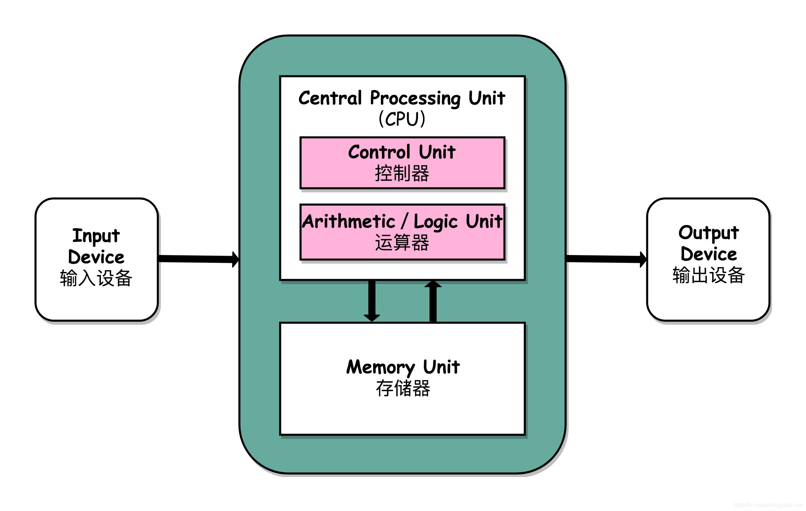

输入设备（比如键盘）和输出设备（比如显示器）都属于外部设备。网卡、硬盘这种既可以属于输入设备，也可以属于输出设备。输入设备向计算机输入数据，输出设备接收计算机输出的数据。

从计算机结构的视角来看的话， I/O 描述了计算机系统与外部设备之间通信的过程。我们再先从应用程序的角度来解读一下 I/O。

根据大学里学到的操作系统相关的知识：为了保证操作系统的稳定性和安全性，一个进程的地址空间划分为 **用户空间**（User space） 和 **内核空间**（Kernel space ） 。像我们平常运行的应用程序都是运行在用户空间，只有内核空间才能进行系统态级别的资源有关的操作，比如文件管理、进程通信、内存管理等等。也就是说，我们想要进行 IO 操作，一定是要依赖内核空间的能力。并且，用户空间的程序不能直接访问内核空间。当想要执行 IO 操作时，由于没有执行这些操作的权限，只能发起**系统调用请求操作系统帮忙完成**。因此，用户进程想要执行 IO 操作的话，必须通过**系统调用**来间接访问内核空间我们在平常开发过程中接触最多的就是**磁盘 IO**（读写文件） 和 **网络 IO**（网络请求和响应）。

**从应用程序的视角来看的话，我们的应用程序对操作系统的内核发起 IO 调用（系统调用），操作系统负责的内核执行具体的 IO 操作。也就是说，我们的应用程序实际上只是发起了 IO 操作的调用而已，具体 IO 的执行是由操作系统的内核来完成的。**

### 常见的 IO 模型

UNIX 系统下， IO 模型一共有 5 种： 同步阻塞 I/O、同步非阻塞 I/O、I/O 多路复用、信号驱动 I/O 和异步 I/O。这也是我们经常提到的 5 种 IO 模型。


### Java 中 3 种常见 IO 模型

#### BIO (Blocking I/O)

BIO 属于同步阻塞 IO 模型 。同步阻塞 IO 模型中，应用程序发起 read 调用后，会一直阻塞，直到内核把数据拷贝到用户空间。
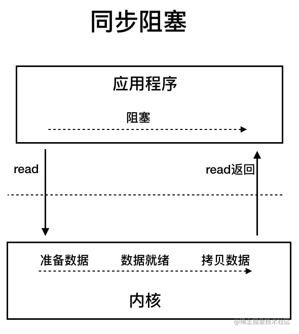

在客户端连接数量不高的情况下，是没问题的。但是，当面对十万甚至百万级连接的时候，传统的 BIO 模型是无能为力的。因此，我们需要一种更高效的 I/O 处理模型来应对更高的并发量。

#### NIO (Non-blocking/New I/O)

Java 中的 NIO 于 Java 1.4 中引入，对应 java.nio 包，提供了 Channel , Selector，Buffer 等抽象。NIO 中的 N 可以理解为 Non-blocking，不单纯是 New。它是支持面向缓冲的，基于通道的 I/O 操作方法。 对于高负载、高并发的（网络）应用，应使用 NIO 。

Java 中的 NIO 可以看作是 I/O 多路复用模型。也有很多人认为，Java 中的 NIO 属于同步非阻塞 IO 模型。
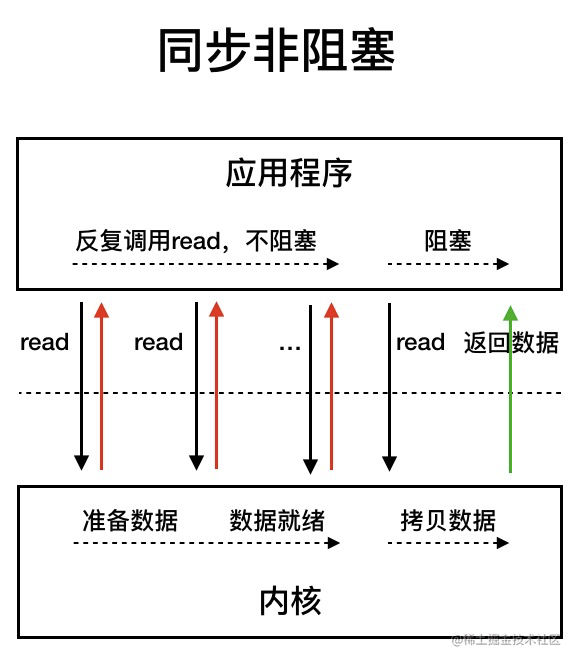

同步非阻塞 IO 模型中，应用程序会一直发起read调用，等待数据从内核空间拷贝到用户空间的这段时间里，线程依然是阻塞的，直到在内核把数据拷贝到用户空间。

相比于同步阻塞 IO 模型，同步非阻塞 IO 模型确实有了很大改进。通过轮询操作，避免了一直阻塞。但是，这种 IO 模型同样存在问题：**应用程序不断进行 I/O 系统调用轮询数据是否已经准备好的过程是十分消耗 CPU 资源的**。
这个时候，**I/O 多路复用模型**就上场了。
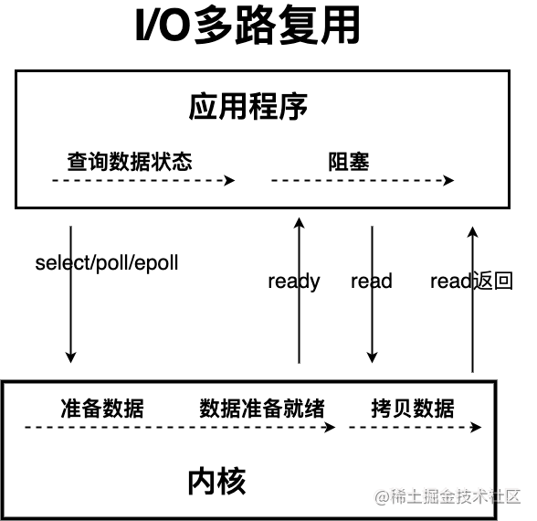

IO 多路复用模型中，线程首先发起select调用，询问内核数据是否准备就绪，等内核把数据准备好了，用户线程再发起read调用。read调用的过程（数据从内核空间 -> 用户空间）还是阻塞的。

>目前支持 IO 多路复用的系统调用，有 select，epoll 等等。select 系统调用，目前几乎在所有的操作系统上都有支持。
>* select 调用 ：内核提供的系统调用，它支持一次查询多个系统调用的可用状态。几乎所有的操作系统都支持。
>* epoll 调用 ：linux 2.6 内核，属于 select 调用的增强版本，优化了 IO 的执行效率。

**IO 多路复用模型，通过减少无效的系统调用，减少了对 CPU 资源的消耗。**

Java 中的 NIO ，有一个非常重要的选择器 ( Selector ) 的概念，也可以被称为 多路复用器。通过它，只需要一个线程便可以管理多个客户端连接。当客户端数据到了之后，才会为其服务。
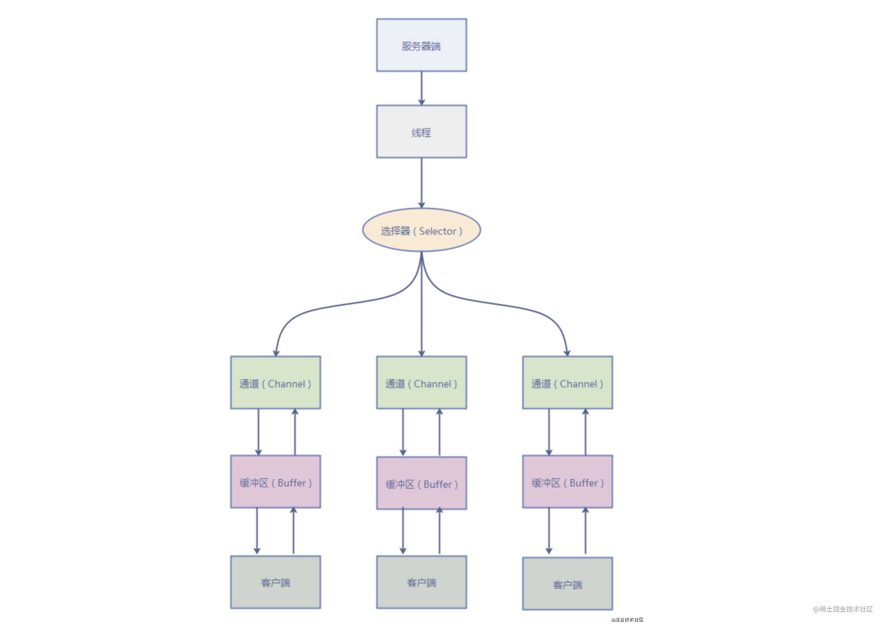

#### AIO (Asynchronous I/O)

AIO 也就是 NIO 2。Java 7 中引入了 NIO 的改进版 NIO 2,它是异步 IO 模型。
异步 IO 是基于事件和回调机制实现的，也就是应用操作之后会直接返回，不会堵塞在那里，当后台处理完成，操作系统会通知相应的线程进行后续的操作。
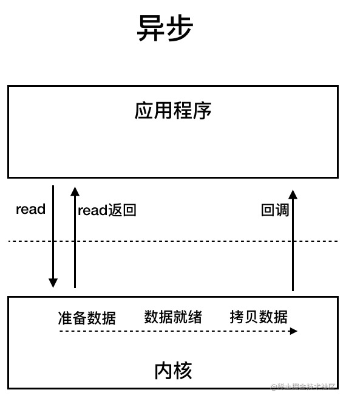

目前来说 AIO 的应用还不是很广泛。Netty 之前也尝试使用过 AIO，不过又放弃了。这是因为，Netty 使用了 AIO 之后，在 Linux 系统上的性能并没有多少提升。


### 什么是序列化?什么是反序列化?
如果我们需要持久化 Java 对象比如将 Java 对象保存在文件中，或者在网络传输 Java 对象，这些场景都需要用到序列化。

简单来说：

* 序列化： 将数据结构或对象转换成二进制字节流的过程
* 反序列化：将在序列化过程中所生成的二进制字节流的过程转换成数据结构或者对象的过程


实际开发中有哪些用到序列化和反序列化的场景：

* 对象在进行网络传输（比如远程方法调用 RPC 的时候）之前需要先被序列化，接收到序列化的对象之后需要再进行反序列化；
* 将对象存储到文件中的时候需要进行序列化，将对象从文件中读取出来需要进行反序列化。
* 将对象存储到缓存数据库（如 Redis）时需要用到序列化，将对象从缓存数据库中读取出来需要反序列化。

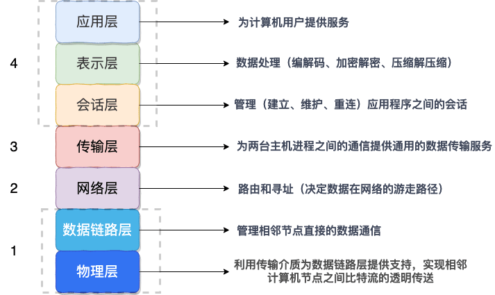

如上图所示，OSI 七层协议模型中，表示层做的事情主要就是对应用层的用户数据进行处理转换为二进制流。反过来的话，就是将二进制流转换成应用层的用户数据。这不就对应的是序列化和反序列化么？因为，OSI 七层协议模型中的应用层、表示层和会话层对应的都是 TCP/IP 四层模型中的应用层，所以序列化协议属于 TCP/IP 协议应用层的一部分。


### Java 序列化中如果有些字段不想进行序列化，怎么办？

对于不想进行序列化的变量，使用 transient 关键字修饰。transient 关键字的作用是：阻止实例中那些用此关键字修饰的的变量序列化；当对象被反序列化时，被 transient 修饰的变量值不会被持久化和恢复。

**关于 transient 还有几点注意：**
* transient 只能修饰变量，不能修饰类和方法。
* transient 修饰的变量，在反序列化后变量值将会被置成类型的默认值。例如，如果是修饰 int 类型，那么反序列后结果就是 0。
* static 变量因为不属于任何对象(Object)，所以无论有没有 transient 关键字修饰，均不会被序列化。


### 常见序列化协议对比

JDK 自带的序列化方式一般不会用 ，因为序列化效率低并且部分版本有安全漏洞。比较常用的序列化协议有 hessian、kyro、protostuff。下面提到的都是基于二进制的序列化协议，像 JSON 和 XML 这种属于文本类序列化方式。虽然 JSON 和 XML 可读性比较好，但是性能较差，一般不会选择。

#### JDK 自带的序列化方式

JDK 自带的序列化，只需实现 java.io.Serializable接口即可。
```
@AllArgsConstructor
@NoArgsConstructor
@Getter
@Builder
@ToString
public class RpcRequest implements Serializable {
    private static final long serialVersionUID = 1905122041950251207L;
    private String requestId;
    private String interfaceName;
    private String methodName;
    private Object[] parameters;
    private Class<?>[] paramTypes;
    private RpcMessageTypeEnum rpcMessageTypeEnum;
}
```

>序列化号 serialVersionUID 属于版本控制的作用。序列化的时候 serialVersionUID 也会被写入二级制序列，当反序列化时会检查 serialVersionUID 是否和当前类的 serialVersionUID 一致。如果 serialVersionUID 不一致则会抛出 InvalidClassException 异常。强烈推荐每个序列化类都手动指定其 serialVersionUID，如果不手动指定，那么编译器会动态生成默认的序列化号


我们很少或者说几乎不会直接使用这个序列化方式，主要原因有两个：

* 不支持跨语言调用 : 如果调用的是其他语言开发的服务的时候就不支持了。
* 性能差 ：相比于其他序列化框架性能更低，主要原因是序列化之后的字节数组体积较大，导致传输成本加大。


#### Kryo

Kryo是一个高性能的序列化/反序列化工具，由于其变长存储特性并使用了字节码生成机制，拥有较高的运行速度和较小的字节码体积。另外，Kryo已经是一种非常成熟的序列化实现了，已经在 Twitter、Groupon、Yahoo 以及多个著名开源项目（如 Hive、Storm）中广泛的使用。

Kryo 是一个高性能的序列化/反序列化工具，由于其变长存储特性并使用了字节码生成机制，拥有较高的运行速度和较小的字节码体积。另外，Kryo 已经是一种非常成熟的序列化实现了，已经在 Twitter、Groupon、Yahoo 以及多个著名开源项目（如 Hive、Storm）中广泛的使用。guide-rpc-frameworkopen in new window 就是使用的 kyro 进行序列化，序列化和反序列化相关的代码如下：
```
/**
 * Kryo serialization class, Kryo serialization efficiency is very high, but only compatible with Java language
 *
 * @author shuang.kou
 * @createTime 2020年05月13日 19:29:00
 */
@Slf4j
public class KryoSerializer implements Serializer {

    /**
     * Because Kryo is not thread safe. So, use ThreadLocal to store Kryo objects
     */
    private final ThreadLocal<Kryo> kryoThreadLocal = ThreadLocal.withInitial(() -> {
        Kryo kryo = new Kryo();
        kryo.register(RpcResponse.class);
        kryo.register(RpcRequest.class);
        return kryo;
    });

    @Override
    public byte[] serialize(Object obj) {
        try (ByteArrayOutputStream byteArrayOutputStream = new ByteArrayOutputStream();
             Output output = new Output(byteArrayOutputStream)) {
            Kryo kryo = kryoThreadLocal.get();
            // Object->byte:将对象序列化为byte数组
            kryo.writeObject(output, obj);
            kryoThreadLocal.remove();
            return output.toBytes();
        } catch (Exception e) {
            throw new SerializeException("Serialization failed");
        }
    }

    @Override
    public <T> T deserialize(byte[] bytes, Class<T> clazz) {
        try (ByteArrayInputStream byteArrayInputStream = new ByteArrayInputStream(bytes);
             Input input = new Input(byteArrayInputStream)) {
            Kryo kryo = kryoThreadLocal.get();
            // byte->Object:从byte数组中反序列化出对对象
            Object o = kryo.readObject(input, clazz);
            kryoThreadLocal.remove();
            return clazz.cast(o);
        } catch (Exception e) {
            throw new SerializeException("Deserialization failed");
        }
    }

}
```

#### Protobuf

Protobuf 出自于 Google，性能还比较优秀，也支持多种语言，同时还是跨平台的。就是在使用中过于繁琐，因为你需要自己定义 IDL 文件和生成对应的序列化代码。这样虽然不然灵活，但是，另一方面导致 protobuf 没有序列化漏洞的风险。

>Protobuf 包含序列化格式的定义、各种语言的库以及一个 IDL 编译器。正常情况下你需要定义 proto 文件，然后使用 IDL 编译器编译成你需要的语言

#### ProtoStuff

由于 Protobuf 的易用性，它的哥哥 Protostuff 诞生了。protostuff 基于 Google protobuf，但是提供了更多的功能和更简易的用法。虽然更加易用，但是不代表 ProtoStuff 性能更差。Github 地址：https://github.com/protostuff/protostuffopen in new window

#### hessian

hessian 是一个轻量级的,自定义描述的二进制 RPC 协议。hessian 是一个比较老的序列化实现了，并且同样也是跨语言的。
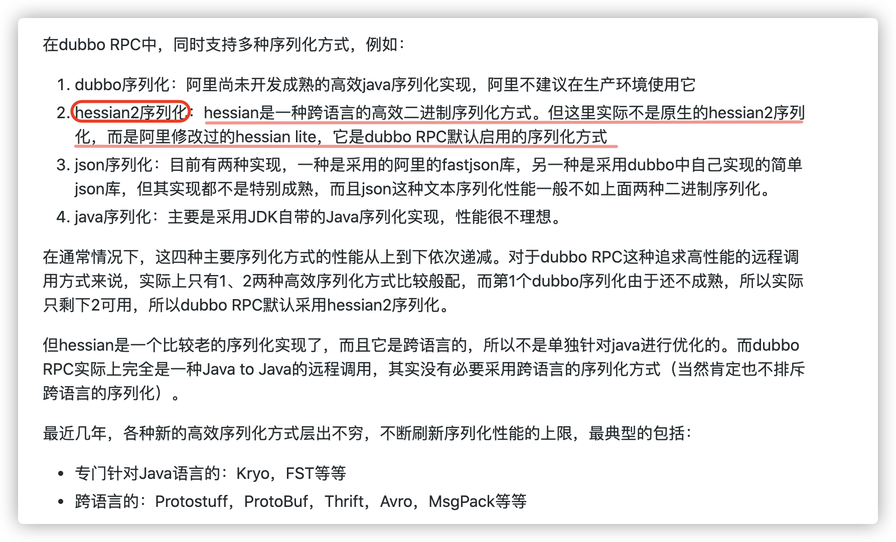

dubbo RPC 默认启用的序列化方式是 hessian2 ,但是，Dubbo 对 hessian2 进行了修改，不过大体结构还是差不多。

#### 总结

Kryo 是专门针对 Java 语言序列化方式并且性能非常好，如果你的应用是专门针对 Java 语言的话可以考虑使用，并且 Dubbo 官网的一篇文章中提到说推荐使用 Kryo 作为生产环境的序列化方式。
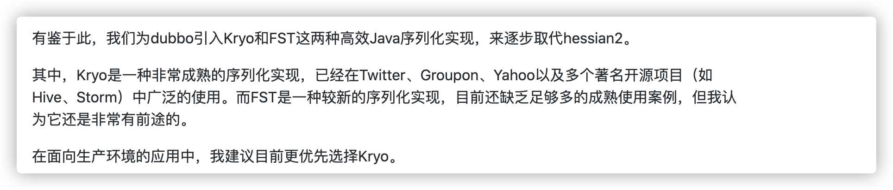

像 Protobuf、 ProtoStuff、hessian 这类都是跨语言的序列化方式，如果有跨语言需求的话可以考虑使用。除了我上面介绍到的序列化方式的话，还有像 Thrift，Avro 这些。

### 获取用键盘输入常用的两种方法
方法 1：通过 Scanner
```
Scanner input = new Scanner(System.in);
String s  = input.nextLine();
input.close();
```
方法 2：通过 BufferedReader
```
BufferedReader input = new BufferedReader(new InputStreamReader(System.in));
String s = input.readLine();
```
### Java 中 IO 流分为几种?

* 按照流的流向分，可以分为输入流和输出流；
* 按照操作单元划分，可以划分为字节流和字符流；
* 按照流的角色划分为节点流和处理流。

Java IO 流共涉及 40 多个类，这些类看上去很杂乱，但实际上很有规则，而且彼此之间存在非常紧密的联系， Java IO 流的 40 多个类都是从如下 4 个抽象类基类中派生出来的。

* InputStream/Reader: 所有的输入流的基类，前者是字节输入流，后者是字符输入流。
* OutputStream/Writer: 所有输出流的基类，前者是字节输出流，后者是字符输出流。

按操作方式分类结构图：

按操作对象分类结构图：


# Java易错点
## 正确使用 equals 方法

Object的equals方法容易抛空指针异常，应使用常量或确定有值的对象来调用 equals。
**注意：**
* 每种原始类型都有默认值一样，如int默认值为 0，boolean 的默认值为 false，null 是任何引用类型的默认值，不严格的说是所有 Object 类型的默认值。
* 可以使用 == 或者 != 操作来比较null值，但是不能使用其他算法或者逻辑操作。在Java中null == null将返回true。
* 不能使用一个值为null的引用类型变量来调用非静态方法，否则会抛出异常

## 整型包装类值的比较

所有整型包装类对象值的比较必须使用equals方法。
```
Integer i1 = 40;
Integer i2 = new Integer(40);
System.out.println(i1==i2);//false
```
Integer i1=40 这一行代码会发生装箱，也就是说这行代码等价于 Integer i1=Integer.valueOf(40) 。因此，i1 直接使用的是常量池中的对象。而Integer i1 = new Integer(40) 会直接创建新的对象。因此，输出 false 。
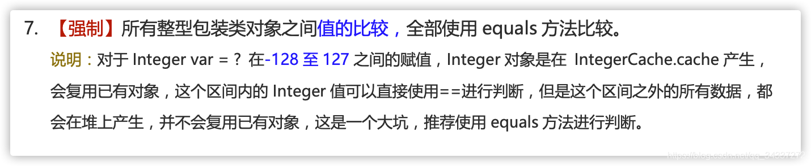

## BigDecimal
### BigDecimal 的用处
《阿里巴巴Java开发手册》中提到：浮点数之间的等值判断，基本数据类型不能用==来比较，包装数据类型不能用 equals 来判断。 具体原理和浮点数的编码方式有关，这里就不多提了，我们下面直接上实例：
```
float a = 1.0f - 0.9f;
float b = 0.9f - 0.8f;
System.out.println(a);// 0.100000024
System.out.println(b);// 0.099999964
System.out.println(a == b);// false
```
具有基本数学知识的我们很清楚的知道输出并不是我们想要的结果（精度丢失），我们如何解决这个问题呢？一种很常用的方法是：使用 BigDecimal 来定义浮点数的值，再进行浮点数的运算操作。
```
BigDecimal a = new BigDecimal("1.0");
BigDecimal b = new BigDecimal("0.9");
BigDecimal c = new BigDecimal("0.8");

BigDecimal x = a.subtract(b); 
BigDecimal y = b.subtract(c); 

System.out.println(x); /* 0.1 */
System.out.println(y); /* 0.1 */
System.out.println(Objects.equals(x, y)); /* true */
```
### BigDecimal 的大小比较
a.compareTo(b) : 返回 -1 表示 a 小于 b，0 表示 a 等于 b ， 1表示 a 大于 b。

### BigDecimal 保留几位小数
通过 setScale方法设置保留几位小数以及保留规则。保留规则有挺多种，不需要记，IDEA会提示。

### BigDecimal 的使用注意事项

注意：我们在使用BigDecimal时，为了防止精度丢失，推荐使用它的 BigDecimal(String) 构造方法来创建对象。《阿里巴巴Java开发手册》对这部分内容也有提到如下图所示。


BigDecimal 主要用来操作（大）浮点数，BigInteger 主要用来操作大整数（超过 long 类型）。BigDecimal 的实现利用到了 BigInteger, 所不同的是 BigDecimal 加入了小数位的概念。


### BigDecimal 工具类分享

```
import java.math.BigDecimal;
import java.math.RoundingMode;

/**
 * 简化BigDecimal计算的小工具类
 */
public class BigDecimalUtil {

    /**
     * 默认除法运算精度
     */
    private static final int DEF_DIV_SCALE = 10;

    private BigDecimalUtil() {
    }

    /**
     * 提供精确的加法运算。
     *
     * @param v1 被加数
     * @param v2 加数
     * @return 两个参数的和
     */
    public static double add(double v1, double v2) {
        BigDecimal b1 = BigDecimal.valueOf(v1);
        BigDecimal b2 = BigDecimal.valueOf(v2);
        return b1.add(b2).doubleValue();
    }

    /**
     * 提供精确的减法运算。
     *
     * @param v1 被减数
     * @param v2 减数
     * @return 两个参数的差
     */
    public static double subtract(double v1, double v2) {
        BigDecimal b1 = BigDecimal.valueOf(v1);
        BigDecimal b2 = BigDecimal.valueOf(v2);
        return b1.subtract(b2).doubleValue();
    }

    /**
     * 提供精确的乘法运算。
     *
     * @param v1 被乘数
     * @param v2 乘数
     * @return 两个参数的积
     */
    public static double multiply(double v1, double v2) {
        BigDecimal b1 = BigDecimal.valueOf(v1);
        BigDecimal b2 = BigDecimal.valueOf(v2);
        return b1.multiply(b2).doubleValue();
    }

    /**
     * 提供（相对）精确的除法运算，当发生除不尽的情况时，精确到
     * 小数点以后10位，以后的数字四舍五入。
     *
     * @param v1 被除数
     * @param v2 除数
     * @return 两个参数的商
     */
    public static double divide(double v1, double v2) {
        return divide(v1, v2, DEF_DIV_SCALE);
    }

    /**
     * 提供（相对）精确的除法运算。当发生除不尽的情况时，由scale参数指
     * 定精度，以后的数字四舍五入。
     *
     * @param v1    被除数
     * @param v2    除数
     * @param scale 表示表示需要精确到小数点以后几位。
     * @return 两个参数的商
     */
    public static double divide(double v1, double v2, int scale) {
        if (scale < 0) {
            throw new IllegalArgumentException(
                    "The scale must be a positive integer or zero");
        }
        BigDecimal b1 = BigDecimal.valueOf(v1);
        BigDecimal b2 = BigDecimal.valueOf(v2);
        return b1.divide(b2, scale, RoundingMode.HALF_UP).doubleValue();
    }

    /**
     * 提供精确的小数位四舍五入处理。
     *
     * @param v     需要四舍五入的数字
     * @param scale 小数点后保留几位
     * @return 四舍五入后的结果
     */
    public static double round(double v, int scale) {
        if (scale < 0) {
            throw new IllegalArgumentException(
                    "The scale must be a positive integer or zero");
        }
        BigDecimal b = BigDecimal.valueOf(v);
        BigDecimal one = new BigDecimal("1");
        return b.divide(one, scale, RoundingMode.HALF_UP).doubleValue();
    }

    /**
     * 提供精确的类型转换(Float)
     *
     * @param v 需要被转换的数字
     * @return 返回转换结果
     */
    public static float convertToFloat(double v) {
        BigDecimal b = new BigDecimal(v);
        return b.floatValue();
    }

    /**
     * 提供精确的类型转换(Int)不进行四舍五入
     *
     * @param v 需要被转换的数字
     * @return 返回转换结果
     */
    public static int convertsToInt(double v) {
        BigDecimal b = new BigDecimal(v);
        return b.intValue();
    }

    /**
     * 提供精确的类型转换(Long)
     *
     * @param v 需要被转换的数字
     * @return 返回转换结果
     */
    public static long convertsToLong(double v) {
        BigDecimal b = new BigDecimal(v);
        return b.longValue();
    }

    /**
     * 返回两个数中大的一个值
     *
     * @param v1 需要被对比的第一个数
     * @param v2 需要被对比的第二个数
     * @return 返回两个数中大的一个值
     */
    public static double returnMax(double v1, double v2) {
        BigDecimal b1 = new BigDecimal(v1);
        BigDecimal b2 = new BigDecimal(v2);
        return b1.max(b2).doubleValue();
    }

    /**
     * 返回两个数中小的一个值
     *
     * @param v1 需要被对比的第一个数
     * @param v2 需要被对比的第二个数
     * @return 返回两个数中小的一个值
     */
    public static double returnMin(double v1, double v2) {
        BigDecimal b1 = new BigDecimal(v1);
        BigDecimal b2 = new BigDecimal(v2);
        return b1.min(b2).doubleValue();
    }

    /**
     * 精确对比两个数字
     *
     * @param v1 需要被对比的第一个数
     * @param v2 需要被对比的第二个数
     * @return 如果两个数一样则返回0，如果第一个数比第二个数大则返回1，反之返回-1
     */
    public static int compareTo(double v1, double v2) {
        BigDecimal b1 = BigDecimal.valueOf(v1);
        BigDecimal b2 = BigDecimal.valueOf(v2);
        return b1.compareTo(b2);
    }
}
```

浮点数没有办法用二进制精确表示，因此存在精度丢失的风险。不过，Java 提供了BigDecimal 来操作浮点数。BigDecimal 的实现利用到了 BigInteger （用来操作大整数）, 所不同的是 BigDecimal 加入了小数位的概念。

## 基本数据类型与包装数据类型的使用标准

* 【强制】所有的 POJO 类属性必须使用包装数据类型。
* 【强制】RPC 方法的返回值和参数必须使用包装数据类型。
* 【推荐】所有的局部变量使用基本数据类型。


## Java 魔法类 Unsafe 详解

### Unsafe 介绍

Unsafe 是位于sun.misc包下的一个类，主要提供一些用于执行低级别、不安全操作的方法，如直接访问系统内存资源、自主管理内存资源等，这些方法在提升Java运行效率、增强 Java 语言底层资源操作能力方面起到了很大的作用。但由于Unsafe类使Java语言拥有了类似 C 语言指针一样操作内存空间的能力，这无疑也增加了程序发生相关指针问题的风险。在程序中过度、不正确使用 Unsafe 类会使得程序出错的概率变大，使得 Java 这种安全的语言变得不再“安全”，因此对 Unsafe 的使用一定要慎重。

另外，Unsafe 提供的这些功能的实现需要依赖本地方法（Native Method）。你可以将本地方法看作是 Java 中使用其他编程语言编写的方法。本地方法使用native关键字修饰，Java 代码中只是声明方法头，具体的实现则交给**本地代码**。

**为什么要使用本地方法呢？**

1. 需要用到 Java 中不具备的依赖于操作系统的特性，Java 在实现跨平台的同时要实现对底层的控制，需要借助其他语言发挥作用。
2. 对于其他语言已经完成的一些现成功能，可以使用 Java 直接调用。
3. 程序对时间敏感或对性能要求非常高时，有必要使用更加底层的语言，例如 C/C++甚至是汇编。

在 JUC 包的很多并发工具类在实现并发机制时，都调用了本地方法，通过它们打破了Java运行时的界限，能够接触到操作系统底层的某些功能。对于同一本地方法，不同的操作系统可能会通过不同的方式来实现，但是对于使用者来说是透明的，最终都会得到相同的结果。

## 枚举

枚举在很多时候会和常量拿来对比，可能因为本身我们大量实际使用枚举的地方就是为了替代常量。那么这种方式由什么优势呢？
**以这种方式定义的常量使代码更具可读性，允许进行编译时检查，预先记录可接受值的列表，并避免由于传入无效值而引起的意外行为。**

### 使用 == 比较枚举类型

由于枚举类型确保JVM中仅存在一个常量实例，因此我们可以安全地使用 == 运算符比较两个变量，如上例所示；此外，== 运算符可提供编译时和运行时的安全性。

首先，让我们看一下以下代码段中的运行时安全性，其中 == 运算符用于比较状态，并且如果两个值均为null 都不会引发 NullPointerException。相反，如果使用equals方法，将抛出 NullPointerException：
```
Pizza.PizzaStatus pizza = null;
System.out.println(pizza.equals(Pizza.PizzaStatus.DELIVERED));//空指针异常System.out.println(pizza == Pizza.PizzaStatus.DELIVERED);//正常运行
```
对于编译时安全性，我们看另一个示例，两个不同枚举类型进行比较：
```
if (Pizza.PizzaStatus.DELIVERED.equals(TestColor.GREEN)); // 编译正常if (Pizza.PizzaStatus.DELIVERED == TestColor.GREEN);    // 编译失败，类型不匹配
```
### 在 switch 语句中使用枚举类型

### 枚举类型的属性,方法和构造函数

你可以通过在枚举类型中定义属性,方法和构造函数让它变得更加强大。
下面，让我们扩展上面的示例，实现从比萨的一个阶段到另一个阶段的过渡，并了解如何摆脱之前使用的if语句和switch语句：
```
public class Pizza {
 
    private PizzaStatus status;
    public enum PizzaStatus {
        ORDERED (5){
            @Override
            public boolean isOrdered() {
                return true;
            }
        },
        READY (2){
            @Override
            public boolean isReady() {
                return true;
            }
        },
        DELIVERED (0){
            @Override
            public boolean isDelivered() {
                return true;
            }
        };
 
        private int timeToDelivery;
 
        public boolean isOrdered() {return false;}
 
        public boolean isReady() {return false;}
 
        public boolean isDelivered(){return false;}
 
        public int getTimeToDelivery() {
            return timeToDelivery;
        }
 
        PizzaStatus (int timeToDelivery) {
            this.timeToDelivery = timeToDelivery;
        }
    }
 
    public boolean isDeliverable() {
        return this.status.isReady();
    }
 
    public void printTimeToDeliver() {
        System.out.println("Time to delivery is " + 
          this.getStatus().getTimeToDelivery());
    }
     
    // Methods that set and get the status variable.}
```
下面这段代码展示它是如何 work 的：
```
@Testpublic void givenPizaOrder_whenReady_thenDeliverable() {
    Pizza testPz = new Pizza();
    testPz.setStatus(Pizza.PizzaStatus.READY);
    assertTrue(testPz.isDeliverable());}
```

### EnumSet and EnumMap

EnumSet

## 代理模式

代理模式有静态代理和动态代理两种实现方式

### 静态代理

静态代理中，我们对目标对象的每个方法的增强都是手动完成的，从 JVM 层面来说， 静态代理在编译时就将接口、实现类、代理类这些都变成了一个个实际的 class 文件。

静态代理实现步骤:

1. 定义一个接口及其实现类；
2. 创建一个代理类同样实现这个接口
3. 将目标对象注入进代理类，然后在代理类的对应方法调用目标类中的对应方法。这样的话，我们就可以通过代理类屏蔽对目标对象的访问，并且可以在目标方法执行前后做一些自己想做的事情。
### 动态代理

相比于静态代理来说，动态代理更加灵活。我们不需要针对每个目标类都单独创建一个代理类，并且也不需要我们必须实现接口，我们可以直接代理实现类( CGLIB 动态代理机制)。

从 JVM 角度来说，动态代理是在运行时动态生成类字节码，并加载到 JVM 中的。

就 Java 来说，动态代理的实现方式有很多种，比如 JDK 动态代理、CGLIB 动态代理等等。

#### JDK 动态代理机制

在 Java 动态代理机制中 InvocationHandler 接口和 Proxy 类是核心。

Proxy 类中使用频率最高的方法是：newProxyInstance() ，这个方法主要用来生成一个代理对象。
```
    public static Object newProxyInstance(ClassLoader loader,
                                          Class<?>[] interfaces,
                                          InvocationHandler h)
        throws IllegalArgumentException
    {
        ......
    }
```

要实现动态代理的话，还必须需要实现InvocationHandler 来自定义处理逻辑。 当我们的动态代理对象调用一个方法时，这个方法的调用就会被转发到实现InvocationHandler 接口类的 invoke 方法来调用。
```
public interface InvocationHandler {

    /**
     * 当你使用代理对象调用方法的时候实际会调用到这个方法
     */
    public Object invoke(Object proxy, Method method, Object[] args)
        throws Throwable;}
```

invoke() 方法有下面三个参数：

1. proxy :动态生成的代理类
2. method : 与代理类对象调用的方法相对应
3. args : 当前 method 方法的参数


也就是说：你通过Proxy 类的 newProxyInstance() 创建的代理对象在调用方法的时候，实际会调用到实现InvocationHandler 接口的类的 invoke()方法。 你可以在 invoke() 方法中自定义处理逻辑，比如在方法执行前后做什么事情。

#### CGLIB 动态代理机制

**JDK 动态代理有一个最致命的问题是其只能代理实现了接口的类。**

为了解决这个问题，我们可以用 CGLIB 动态代理机制来避免。

CGLIB(Code Generation Library)是一个基于ASM的字节码生成库，它允许我们在运行时对字节码进行修改和动态生成。CGLIB 通过继承方式实现代理。很多知名的开源框架都使用到了CGLIB， 例如 Spring 中的 AOP 模块中：如果目标对象实现了接口，则默认采用 JDK 动态代理，否则采用 CGLIB 动态代理。

在 CGLIB 动态代理机制中 MethodInterceptor 接口和 Enhancer 类是核心。

你需要自定义 MethodInterceptor 并重写 intercept 方法，intercept 用于拦截增强被代理类的方法。
```
public interface MethodInterceptor extends Callback{
    // 拦截被代理类中的方法
    public Object intercept(Object obj, java.lang.reflect.Method method, Object[] args,MethodProxy proxy) throws Throwable;
 }
```
说明：

1. obj :被代理的对象（需要增强的对象）
2. method :被拦截的方法（需要增强的方法）
3. args :方法入参
4. proxy :用于调用原始方法

你可以通过 Enhancer类来动态获取被代理类，当代理类调用方法的时候，实际调用的是 MethodInterceptor 中的 intercept 方法。

CGLIB 动态代理类使用步骤：

1. 定义一个类；
2. 自定义 MethodInterceptor 并重写 intercept 方法，intercept 用于拦截增强被代理类的方法，和 JDK 动态代理中的 invoke 方法类似；
3. 通过 Enhancer 类的 create()创建代理类；


不同于 JDK 动态代理不需要额外的依赖。CGLIB(Code Generation Library) 实际是属于一个开源项目，如果你要使用它的话，需要手动添加相关依赖。
```
<dependency>
  <groupId>cglib</groupId>
  <artifactId>cglib</artifactId>
  <version>3.3.0</version>
</dependency>
```

#### JDK 动态代理和 CGLIB 动态代理对比

1. JDK 动态代理只能代理实现了接口的类或者直接代理接口，而 CGLIB 可以代理未实现任何接口的类。 另外， CGLIB 动态代理是通过生成一个被代理类的子类来拦截被代理类的方法调用，因此不能代理声明为 final 类型的类和方法。
2. 就二者的效率来说，大部分情况都是 JDK 动态代理更优秀，随着 JDK 版本的升级，这个优势更加明显。


## Java集合框架基础知识

### 集合概述

#### Java 集合概览
Java 集合， 也叫作容器，主要是由两大接口派生而来：一个是 Collecton接口，主要用于存放单一元素；另一个是 Map 接口，主要用于存放键值对。对于Collection 接口，下面又有三个主要的子接口：List、Set 和 Queue。
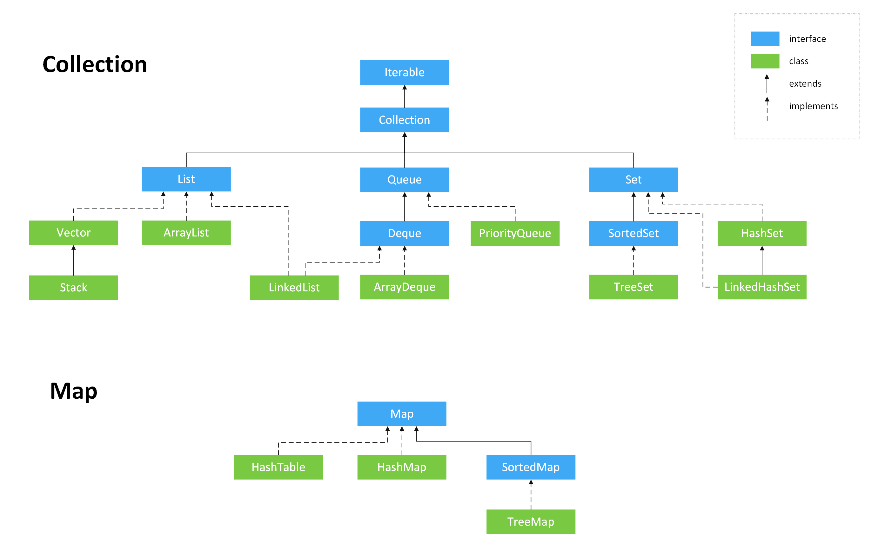

#### 集合框架底层数据结构总结

先来看一下 Collection 接口下面的集合。

* List

1. Arraylist： Object[] 数组
2. Vector：Object[] 数组
3. LinkedList： 双向链表(JDK1.6 之前为循环链表，JDK1.7 取消了循环)

* Set
1. HashSet(无序，唯一): 基于 HashMap 实现的，底层采用 HashMap 来保存元素
2. LinkedHashSet: LinkedHashSet 是 HashSet 的子类，并且其内部是通过 LinkedHashMap 来实现的。有点类似于我们之前说的 LinkedHashMap 其内部是基于 HashMap 实现一样，不过还是有一点点区别的
3. TreeSet(有序，唯一): 红黑树(自平衡的排序二叉树)

* Queue
1. PriorityQueue: Object[] 数组来实现二叉堆
2. ArrayQueue: Object[] 数组 + 双指针

* Map
1. HashMap： JDK1.8 之前 HashMap 由数组+链表组成的，数组是 HashMap 的主体，链表则是主要为了解决哈希冲突而存在的（“拉链法”解决冲突）。JDK1.8 以后在解决哈希冲突时有了较大的变化，当链表长度大于阈值（默认为 8）（将链表转换成红黑树前会判断，如果当前数组的长度小于 64，那么会选择先进行数组扩容，而不是转换为红黑树）时，将链表转化为红黑树，以减少搜索时间
2. LinkedHashMap： LinkedHashMap 继承自 HashMap，所以它的底层仍然是基于拉链式散列结构即由数组和链表或红黑树组成。另外，LinkedHashMap 在上面结构的基础上，增加了一条双向链表，使得上面的结构可以保持键值对的插入顺序。同时通过对链表进行相应的操作，实现了访问顺序相关逻辑。详细可以查看：《LinkedHashMap 源码详细分析（JDK1.8）》
3. Hashtable： 数组+链表组成的，数组是 Hashtable 的主体，链表则是主要为了解决哈希冲突而存在的
4. TreeMap： 红黑树（自平衡的排序二叉树）


#### 如何选用集合?

主要根据集合的特点来选用，比如我们需要根据键值获取到元素值时就选用 Map 接口下的集合，需要排序时选择 TreeMap,不需要排序时就选择 HashMap,需要保证线程安全就选用 ConcurrentHashMap。
当我们只需要存放元素值时，就选择实现Collection 接口的集合，需要保证元素唯一时选择实现 Set 接口的集合比如 TreeSet 或 HashSet，不需要就选择实现 List 接口的比如 ArrayList 或 LinkedList，然后再根据实现这些接口的集合的特点来选用。

#### 为什么要使用集合？

当我们需要保存一组类型相同的数据的时候，我们应该是用一个容器来保存，这个容器就是数组，但是，使用数组存储对象具有一定的弊端， 因为我们在实际开发中，存储的数据的类型是多种多样的，于是，就出现了“集合”，集合同样也是用来存储多个数据的。数组的缺点是一旦声明之后，长度就不可变了；同时，声明数组时的数据类型也决定了该数组存储的数据的类型；而且，数组存储的数据是有序的、可重复的，特点单一。 但是集合提高了数据存储的灵活性，Java 集合不仅可以用来存储不同类型不同数量的对象，还可以保存具有映射关系的数据。

### Collection 子接口之 List

#### Arraylist 和 Vector 的区别

* ArrayList 是 List 的主要实现类，底层使用 Object[ ]存储，适用于频繁的查找工作，线程不安全 ；
* Vector 是 List 的古老实现类，底层使用Object[ ] 存储，线程安全的。

#### Arraylist 与 LinkedList 区别

1. **是否保证线程安全**： ArrayList 和 LinkedList 都是不同步的，也就是不保证线程安全； 
2.**底层数据结构**： Arraylist 底层使用的是 Object 数组；LinkedList 底层使用的是 双向链表 数据结构（JDK1.6 之前为循环链表，JDK1.7 取消了循环。注意双向链表和双向循环链表的区别，下面有介绍到！）
3. **插入和删除是否受元素位置的影响**：
ArrayList 采用数组存储，所以插入和删除元素的时间复杂度受元素位置的影响。 比如：执行add(E e)方法的时候， ArrayList 会默认在将指定的元素追加到此列表的末尾，这种情况时间复杂度就是 O(1)。但是如果要在指定位置 i 插入和删除元素的话（add(int index, E element)）时间复杂度就为 O(n-i)。因为在进行上述操作的时候集合中第 i 和第 i 个元素之后的(n-i)个元素都要执行向后位/向前移一位的操作。LinkedList 采用链表存储，所以，如果是在头尾插入或者删除元素不受元素位置的影响（add(E e)、addFirst(E e)、addLast(E e)、removeFirst() 、 removeLast()），近似 O(1)，如果是要在指定位置 i 插入和删除元素的话（add(int index, E element)，remove(Object o)） 时间复杂度近似为 O(n) ，因为需要先移动到指定位置再插入。

4. **是否支持快速随机访问**： LinkedList 不支持高效的随机元素访问，而 ArrayList 支持。快速随机访问就是通过元素的序号快速获取元素对象(对应于get(int index)方法)。
5. **内存空间占用**： ArrayList 的空间浪费主要体现在在 list 列表的结尾会预留一定的容量空间，而 LinkedList 的空间花费则体现在它的每一个元素都需要消耗比 ArrayList 更多的空间（因为要存放直接后继和直接前驱以及数据）。


#### ArrayList 的扩容机制
```

   /**
     * 默认初始容量大小
     */
    private static final int DEFAULT_CAPACITY = 10;


    private static final Object[] DEFAULTCAPACITY_EMPTY_ELEMENTDATA = {};

    /**
     *默认构造函数，使用初始容量10构造一个空列表(无参数构造)
     */
    public ArrayList() {
        this.elementData = DEFAULTCAPACITY_EMPTY_ELEMENTDATA;
    }

    /**
     * 带初始容量参数的构造函数。（用户自己指定容量）
     */
    public ArrayList(int initialCapacity) {
        if (initialCapacity > 0) {//初始容量大于0
            //创建initialCapacity大小的数组
            this.elementData = new Object[initialCapacity];
        } else if (initialCapacity == 0) {//初始容量等于0
            //创建空数组
            this.elementData = EMPTY_ELEMENTDATA;
        } else {//初始容量小于0，抛出异常
            throw new IllegalArgumentException("Illegal Capacity: "+
                                               initialCapacity);
        }
    }


   /**
    *构造包含指定collection元素的列表，这些元素利用该集合的迭代器按顺序返回
    *如果指定的集合为null，throws NullPointerException。
    */
     public ArrayList(Collection<? extends E> c) {
        elementData = c.toArray();
        if ((size = elementData.length) != 0) {
            // c.toArray might (incorrectly) not return Object[] (see 6260652)
            if (elementData.getClass() != Object[].class)
                elementData = Arrays.copyOf(elementData, size, Object[].class);
        } else {
            // replace with empty array.
            this.elementData = EMPTY_ELEMENTDATA;
        }
    }
```

以无参数构造方法创建 ArrayList 时，实际上初始化赋值的是一个空数组。当真正对数组进行添加元素操作时，才真正分配容量。即向数组中添加第一个元素时，数组容量扩为 10。

##### 先来看 add 方法
```
    /**
     * 将指定的元素追加到此列表的末尾。
     */
    public boolean add(E e) {
   //添加元素之前，先调用ensureCapacityInternal方法
        ensureCapacityInternal(size + 1);  // Increments modCount!!
        //这里看到ArrayList添加元素的实质就相当于为数组赋值
        elementData[size++] = e;
        return true;
    }
```
**注意**：JDK11 移除了 ensureCapacityInternal() 和 ensureExplicitCapacity() 方法

##### 再来看看 ensureCapacityInternal() 方法
（JDK7）可以看到 add 方法 首先调用了ensureCapacityInternal(size + 1)
```
   //得到最小扩容量
    private void ensureCapacityInternal(int minCapacity) {
        if (elementData == DEFAULTCAPACITY_EMPTY_ELEMENTDATA) {
              // 获取默认的容量和传入参数的较大值
            minCapacity = Math.max(DEFAULT_CAPACITY, minCapacity);
        }

        ensureExplicitCapacity(minCapacity);
    }
```
当 要 add 进第 1 个元素时，minCapacity 为 1，在 Math.max()方法比较后，minCapacity 为 10。

##### ensureExplicitCapacity() 方法

如果调用 ensureCapacityInternal() 方法就一定会进入（执行）这个方法，下面我们来研究一下这个方法的源码！
```
  //判断是否需要扩容
    private void ensureExplicitCapacity(int minCapacity) {
        modCount++;

        // overflow-conscious code
        if (minCapacity - elementData.length > 0)
            //调用grow方法进行扩容，调用此方法代表已经开始扩容了
            grow(minCapacity);
    }
```
分析如下：

* 当我们要 add 进第 1 个元素到 ArrayList 时，elementData.length 为 0 （因为还是一个空的 list），因为执行了 ensureCapacityInternal() 方法 ，所以 minCapacity 此时为 10。此时，minCapacity - elementData.length > 0成立，所以会进入 grow(minCapacity) 方法。
* 当 add 第 2 个元素时，minCapacity 为 2，此时 e lementData.length(容量)在添加第一个元素后扩容成 10 了。此时，minCapacity - elementData.length > 0 不成立，所以不会进入 （执行）grow(minCapacity) 方法。
* 添加第 3、4···到第 10 个元素时，依然不会执行 grow 方法，数组容量都为 10。
* 直到添加第 11 个元素，minCapacity(为 11)比 elementData.length（为 10）要大。进入 grow 方法进行扩容。

##### grow() 方法
```
    /**
     * 要分配的最大数组大小
     */
    private static final int MAX_ARRAY_SIZE = Integer.MAX_VALUE - 8;

    /**
     * ArrayList扩容的核心方法。
     */
    private void grow(int minCapacity) {
        // oldCapacity为旧容量，newCapacity为新容量
        int oldCapacity = elementData.length;
        //将oldCapacity 右移一位，其效果相当于oldCapacity /2，
        //我们知道位运算的速度远远快于整除运算，整句运算式的结果就是将新容量更新为旧容量的1.5倍，
        int newCapacity = oldCapacity + (oldCapacity >> 1);
        //然后检查新容量是否大于最小需要容量，若还是小于最小需要容量，那么就把最小需要容量当作数组的新容量，
        if (newCapacity - minCapacity < 0)
            newCapacity = minCapacity;
       // 如果新容量大于 MAX_ARRAY_SIZE,进入(执行) `hugeCapacity()` 方法来比较 minCapacity 和 MAX_ARRAY_SIZE，
       //如果minCapacity大于最大容量，则新容量则为`Integer.MAX_VALUE`，否则，新容量大小则为 MAX_ARRAY_SIZE 即为 `Integer.MAX_VALUE - 8`。
        if (newCapacity - MAX_ARRAY_SIZE > 0)
            newCapacity = hugeCapacity(minCapacity);
        // minCapacity is usually close to size, so this is a win:
        elementData = Arrays.copyOf(elementData, newCapacity);
    }
```
int newCapacity = oldCapacity + (oldCapacity >> 1),所以 ArrayList 每次扩容之后容量都会变为原来的 1.5 倍左右（oldCapacity 为偶数就是 1.5 倍，否则是 1.5 倍左右）！ 奇偶不同，比如 ：10+10/2 = 15, 33+33/2=49。如果是奇数的话会丢掉小数.

##### hugeCapacity() 方法

从上面 grow() 方法源码我们知道： 如果新容量大于 MAX_ARRAY_SIZE,进入(执行) hugeCapacity() 方法来比较 minCapacity 和 MAX_ARRAY_SIZE，如果 minCapacity 大于最大容量，则新容量则为Integer.MAX_VALUE，否则，新容量大小则为 MAX_ARRAY_SIZE 即为 Integer.MAX_VALUE - 8。
```
    private static int hugeCapacity(int minCapacity) {
        if (minCapacity < 0) // overflow
            throw new OutOfMemoryError();
        //对minCapacity和MAX_ARRAY_SIZE进行比较
        //若minCapacity大，将Integer.MAX_VALUE作为新数组的大小
        //若MAX_ARRAY_SIZE大，将MAX_ARRAY_SIZE作为新数组的大小
        //MAX_ARRAY_SIZE = Integer.MAX_VALUE - 8;
        return (minCapacity > MAX_ARRAY_SIZE) ?
            Integer.MAX_VALUE :
            MAX_ARRAY_SIZE;
    }
```
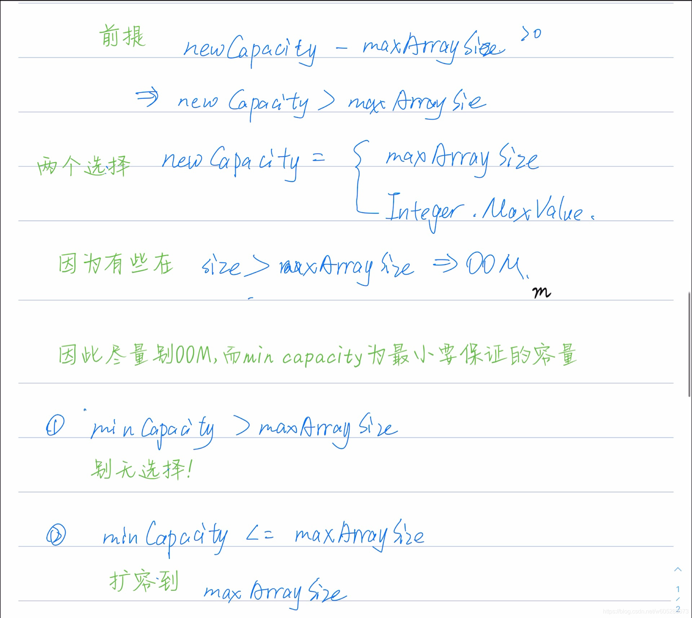

#### ensureCapacity方法

ArrayList 源码中有一个 ensureCapacity 方法不知道大家注意到没有，这个方法 ArrayList 内部没有被调用过，**最好在 add 大量元素之前用 ensureCapacity 方法，以减少增量重新分配的次数**
```

    /**
    如有必要，增加此 ArrayList 实例的容量，以确保它至少可以容纳由minimum capacity参数指定的元素数。
     *
     * @param   minCapacity   所需的最小容量
     */
    public void ensureCapacity(int minCapacity) {
        int minExpand = (elementData != DEFAULTCAPACITY_EMPTY_ELEMENTDATA)
            // any size if not default element table
            ? 0
            // larger than default for default empty table. It's already
            // supposed to be at default size.
            : DEFAULT_CAPACITY;

        if (minCapacity > minExpand) {
            ensureExplicitCapacity(minCapacity);
        }
    }
```

ArrayList是List接口的实现类，它是支持根据需要而动态增长的数组。java中标准数组是定长的，在数组被创建之后，它们不能被加长或缩短。这就意味着在创建数组时需要知道数组的所需长度，但有时我们需要动态程序中获取数组长度。ArrayList就是为此而生的,但是它不是线程安全的，外ArrayList按照插入的顺序来存放数据
①ArrayList扩容发生在add()方法调用的时候， 调用ensureCapacityInternal()来扩容的，
通过方法calculateCapacity(elementData, minCapacity)获取需要扩容的长度:
②ensureExplicitCapacity方法可以判断是否需要扩容：
③ArrayList扩容的关键方法grow():
获取到ArrayList中elementData数组的内存空间长度 扩容至原来的1.5倍
④调用Arrays.copyOf方法将elementData数组指向新的内存空间时newCapacity的连续空间
从此方法中我们可以清晰的看出其实ArrayList扩容的本质就是计算出新的扩容数组的size后实例化，并将原有数组内容复制到新数组中去。


### Collection 子接口之 Set

#### comparable 和 Comparator 的区别

* comparable 接口实际上是出自java.lang包 它有一个 compareTo(Object obj)方法用来排序
* comparator接口实际上是出自 java.util 包它有一个compare(Object obj1, Object obj2)方法用来排序


一般我们需要对一个集合使用自定义排序时，我们就要重写compareTo()方法或compare()方法，当我们需要对某一个集合实现两种排序方式，比如一个 song 对象中的歌名和歌手名分别采用一种排序方法的话，我们可以重写compareTo()方法和使用自制的Comparator方法或者以两个 Comparator 来实现歌名排序和歌星名排序，第二种代表我们只能使用两个参数版的 Collections.sort().

#### 比较 HashSet、LinkedHashSet 和 TreeSet 三者的异同

* HashSet、LinkedHashSet 和 TreeSet 都是 Set 接口的实现类，都能保证元素唯一，并且都不是线程安全的。
* HashSet、LinkedHashSet 和 TreeSet 的主要区别在于底层数据结构不同。HashSet 的底层数据结构是哈希表（基于 HashMap 实现）。LinkedHashSet 的底层数据结构是链表和哈希表，元素的插入和取出顺序满足 FIFO。TreeSet 底层数据结构是红黑树，元素是有序的，排序的方式有自然排序和定制排序。
* 底层数据结构不同又导致这三者的应用场景不同。HashSet 用于不需要保证元素插入和取出顺序的场景，LinkHashSet 用于保证元素的插入和取出顺序满足 FIFO 的场景，TreeSet 用于支持对元素自定义排序规则的场景。


### Collection 子接口之 Queue

#### Queue 与 Deque 的区别

Queue 是单端队列，只能从一端插入元素，另一端删除元素，实现上一般遵循 先进先出（FIFO） 规则。

Queue 扩展了 Collection 的接口，根据 因为容量问题而导致操作失败后处理方式的不同 可以分为两类方法: 一种在操作失败后会抛出异常，另一种则会返回特殊值。

| Queue 接口   | 抛出异常  | 返回特殊值 |
| ------------ | --------- | ---------- |
| 插入队尾     | add(E e)  | offer(E e) |
| 删除队首     | remove()  | poll()     |
| 查询队首元素 | element() | peek()     |


Deque 是双端队列，在队列的两端均可以插入或删除元素。
Deque 扩展了 Queue 的接口, 增加了在队首和队尾进行插入和删除的方法，同样根据失败后处理方式的不同分为两类：

| Deque 接口   | 抛出异常      | 返回特殊值      |
| ------------ | ------------- | --------------- |
| 插入队首     | addFirst(E e) | offerFirst(E e) |
| 插入队尾     | addLast(E e)  | offerLast(E e)  |
| 删除队首     | removeFirst() | pollFirst()     |
| 删除队尾     | removeLast()  | pollLast()      |
| 查询队首元素 | getFirst()    | peekFirst()     |
| 查询队尾元素 | getLast()     | peekLast()      |

事实上，Deque 还提供有 push() 和 pop() 等其他方法，可用于模拟栈。

#### ArrayDeque 与 LinkedList 的区别

ArrayDeque 和 LinkedList 都实现了 Deque 接口，两者都具有队列的功能，但两者有什么区别呢？

* ArrayDeque 是基于可变长的数组和双指针来实现，而 LinkedList 则通过链表来实现。
* ArrayDeque 不支持存储 NULL 数据，但 LinkedList 支持。
* ArrayDeque 是在 JDK1.6 才被引入的，而LinkedList 早在 JDK1.2 时就已经存在。
* ArrayDeque 插入时可能存在扩容过程, 不过均摊后的插入操作依然为 O(1)。虽然 LinkedList 不需要扩容，但是每次插入数据时均需要申请新的堆空间，均摊性能相比更慢。

从性能的角度上，选用 ArrayDeque 来实现队列要比 LinkedList 更好。此外，ArrayDeque 也可以用于实现栈。

#### PriorityQueue

PriorityQueue 是在 JDK1.5 中被引入的, 其与 Queue 的区别在于元素出队顺序是与优先级相关的，即总是优先级最高的元素先出队。

这里列举其相关的一些要点：

* PriorityQueue 利用了二叉堆的数据结构来实现的，底层使用可变长的数组来存储数据
* PriorityQueue 通过堆元素的上浮和下沉，实现了在 O(logn) 的时间复杂度内插入元素和删除堆顶元素。
* PriorityQueue 是非线程安全的，且不支持存储 NULL 和 non-comparable 的对象。
* PriorityQueue 默认是小顶堆，但可以接收一个 Comparator 作为构造参数，从而来自定义元素优先级的先后。

PriorityQueue 在面试中可能更多的会出现在手撕算法的时候，典型例题包括堆排序、求第K大的数、带权图的遍历等，所以需要会熟练使用才行。

### Map 接口

#### HashMap 和 Hashtable 的区别

1. **线程是否安全**：HashMap 是非线程安全的，Hashtable 是线程安全的,因为 Hashtable 内部的方法基本都经过synchronized 修饰。（如果你要保证线程安全的话就使用 ConcurrentHashMap 吧！）；
2. **效率**：因为线程安全的问题，HashMap 要比 Hashtable 效率高一点。另外，Hashtable 基本被淘汰，不要在代码中使用它；
3. **对 Null key 和 Null value 的支持**：HashMap 可以存储 null 的 key 和 value，但 null 作为键只能有一个，null 作为值可以有多个；Hashtable 不允许有 null 键和 null 值，否则会抛出 NullPointerException。
4. **初始容量大小和每次扩充容量大小的不同** ： ① 创建时如果不指定容量初始值，Hashtable 默认的初始大小为 11，之后每次扩充，容量变为原来的 2n+1。HashMap 默认的初始化大小为 16。之后每次扩充，容量变为原来的 2 倍。② 创建时如果给定了容量初始值，那么 Hashtable 会直接使用你给定的大小，而 HashMap 会将其扩充为 2 的幂次方大小（HashMap 中的tableSizeFor()方法保证，下面给出了源代码）。也就是说 **HashMap 总是使用 2 的幂作为哈希表的大小**,后面会介绍到为什么是 2 的幂次方。
5. 底层数据结构：JDK1.8 以后的 HashMap 在解决哈希冲突时有了较大的变化，当链表长度大于阈值（默认为 8）（将链表转换成红黑树前会判断，如果当前数组的长度小于 64，那么会选择先进行数组扩容，而不是转换为红黑树）时，将链表转化为红黑树，以减少搜索时间。Hashtable 没有这样的机制。

#### HashMap 和 HashSet 区别

如果你看过 HashSet 源码的话就应该知道：HashSet 底层就是基于 HashMap 实现的。（HashSet 的源码非常非常少，因为除了 clone()、writeObject()、readObject()是 HashSet 自己不得不实现之外，其他方法都是直接调用 HashMap 中的方法。

| HashMap                            | HashSet                                                      |
| ---------------------------------- | ------------------------------------------------------------ |
| 实现了 Map 接口                    | 实现 Set 接口                                                |
| 存储键值对                         | 仅存储对象                                                   |
| 调用 put()向 map 中添加元素        | 调用 add()方法向 Set 中添加元素                              |
| HashMap 使用键（Key）计算 hashcode | HashSet 使用成员对象来计算 hashcode 值，对于两个对象来说 hashcode 可能相同，所以equals()方法用来判断对象的相等性 |

#### HashMap 和 TreeMap 区别

TreeMap 和HashMap 都继承自AbstractMap ，但是需要注意的是TreeMap它还实现了NavigableMap接口和SortedMap 接口。
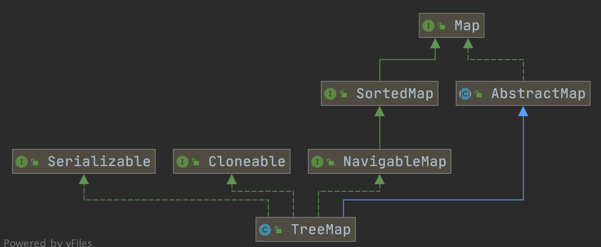

实现 NavigableMap 接口让 TreeMap 有了对集合内元素的搜索的能力。

实现SortedMap接口让 TreeMap 有了对集合中的元素根据键排序的能力。默认是按 key 的升序排序，不过我们也可以指定排序的比较器。

综上，相比于HashMap来说 TreeMap 主要多了对集合中的元素根据键排序的能力以及对集合内元素的搜索的能力。

#### HashSet 如何检查重复

当你把对象加入HashSet时，HashSet 会先计算对象的hashcode值来判断对象加入的位置，同时也会与其他加入的对象的 hashcode 值作比较，如果没有相符的 hashcode，HashSet 会假设对象没有重复出现。但是如果发现有相同 hashcode 值的对象，这时会调用equals()方法来检查 hashcode 相等的对象是否真的相同。如果两者相同，HashSet 就不会让加入操作成功。

在openjdk8中，HashSet的add()方法只是简单的调用了HashMap的put()方法，并且判断了一下返回值以确保是否有重复元素。直接看一下HashSet中的源码：
```
// Returns: true if this set did not already contain the specified element
// 返回值：当set中没有包含add的元素时返回真
public boolean add(E e) {
        return map.put(e, PRESENT)==null;
}
```
而在HashMap的putVal()方法中也能看到如下说明：
```

// Returns : previous value, or null if none
// 返回值：如果插入位置没有元素返回null，否则返回上一个元素
final V putVal(int hash, K key, V value, boolean onlyIfAbsent,
                   boolean evict) {
     ...
 }
```
也就是说，在openjdk8中，实际上无论HashSet中是否已经存在了某元素，HashSet都会直接插入，只是会在add()方法的返回值处告诉我们插入前是否存在相同元素。

**hashCode()与 equals() 的相关规定：**

1. 如果两个对象相等，则 hashcode 一定也是相同的
2. 两个对象相等,对两个 equals() 方法返回 true
3. 两个对象有相同的 hashcode 值，它们也不一定是相等的
4. 综上，equals() 方法被覆盖过，则 hashCode() 方法也必须被覆盖
5. hashCode()的默认行为是对堆上的对象产生独特值。如果没有重写 hashCode()，则该 class 的两个对象无论如何都不会相等（即使这两个对象指向相同的数据）。


对于引用类型（包括包装类型）来说，equals 如果没有被重写，对比它们的地址是否相等；如果 equals()方法被重写（例如 String），则比较的是地址里的内容。

#### HashMap 的底层实现

##### JDK1.8 之前

JDK1.8 之前 HashMap 底层是**数组和链表**结合在一起使用也就是链表散列。HashMap 通过 key 的 hashCode 经过**扰动函数**处理过后得到 hash 值，然后通过 (n - 1) & hash 判断当前元素存放的位置（这里的 n 指的是数组的长度），如果当前位置存在元素的话，就判断该元素与要存入的元素的 hash 值以及 key 是否相同，如果相同的话，直接覆盖，不相同就通过拉链法解决冲突。

所谓扰动函数指的就是 HashMap 的 hash 方法。使用 hash 方法也就是扰动函数是为了防止一些实现比较差的 hashCode() 方法 换句话说使用扰动函数之后可以减少碰撞。

JDK 1.8 的 hash 方法 相比于 JDK 1.7 hash 方法更加简化，但是原理不变。
```
    static final int hash(Object key) {
      int h;
      // key.hashCode()：返回散列值也就是hashcode
      // ^ ：按位异或
      // >>>:无符号右移，忽略符号位，空位都以0补齐
      return (key == null) ? 0 : (h = key.hashCode()) ^ (h >>> 16);
  }
```

对比一下 JDK1.7 的 HashMap 的 hash 方法源码.
```
static int hash(int h) {
    // This function ensures that hashCodes that differ only by
    // constant multiples at each bit position have a bounded
    // number of collisions (approximately 8 at default load factor).

    h ^= (h >>> 20) ^ (h >>> 12);
    return h ^ (h >>> 7) ^ (h >>> 4);}
```

相比于 JDK1.8 的 hash 方法 ，JDK 1.7 的 hash 方法的性能会稍差一点点，因为毕竟扰动了 4 次。

所谓 “拉链法” 就是：将链表和数组相结合。也就是说创建一个链表数组，数组中每一格就是一个链表。若遇到哈希冲突，则将冲突的值加到链表中即可。
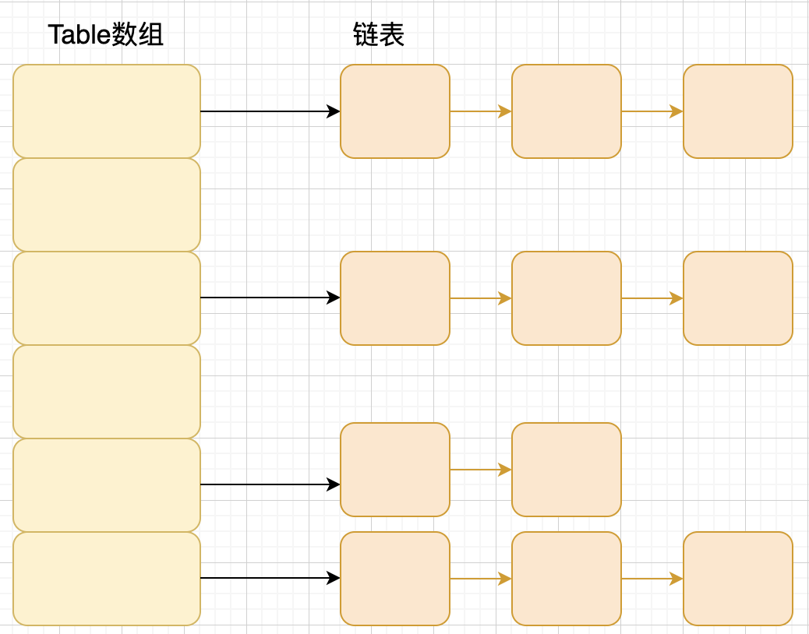

##### JDK1.8 之后

相比于之前的版本， JDK1.8 之后在解决哈希冲突时有了较大的变化，
当链表长度大于阈值（默认为 8）时，会首先调用 treeifyBin()方法。这个方法会根据 HashMap 数组来决定是否转换为红黑树，只有当数组长度大于或者等于 64 的情况下，才会执行转换红黑树操作，以减少搜索时间。否则，就是只是执行 resize() 方法对数组扩容。
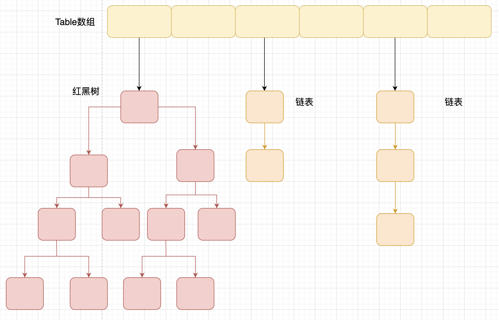

**TreeMap、TreeSet 以及 JDK1.8 之后的 HashMap 底层都用到了红黑树。红黑树就是为了解决二叉查找树的缺陷，因为二叉查找树在某些情况下会退化成一个线性结构。**

#### HashMap 的长度为什么是 2 的幂次方

为了能让 HashMap 存取高效，尽量较少碰撞，也就是要尽量把数据分配均匀。我们上面也讲到了过了，Hash 值的范围值-2147483648 到 2147483647，前后加起来大概 40 亿的映射空间，只要哈希函数映射得比较均匀松散，一般应用是很难出现碰撞的。但问题是一个 40 亿长度的数组，内存是放不下的。所以这个散列值是不能直接拿来用的。用之前还要先做对数组的长度取模运算，得到的余数才能用来要存放的位置也就是对应的数组下标。这个数组下标的计算方法是“ (n - 1) & hash”。（n 代表数组长度）。这也就解释了 HashMap 的长度为什么是 2 的幂次方。这个算法实际就是取模，hash%length，计算机中直接求余效率不如位移运算，源码中做了优化hash&(length-1)，hash%length==hash&(length-1)的前提是length是2的n次方；

**这个算法应该如何设计呢？**

我们首先可能会想到采用%取余的操作来实现。但是，重点来了：“取余(%)操作中如果除数是 2 的幂次则等价于与其除数减一的与(&)操作（也就是说 hash%length==hash&(length-1)的前提是 length 是 2 的 n 次方；）。” 并且 采用二进制位操作 &，相对于%能够提高运算效率，这就解释了 HashMap 的长度为什么是 2 的幂次方。

#### HashMap 源码分析

##### 类的属性
```
public class HashMap<K,V> extends AbstractMap<K,V> implements Map<K,V>, Cloneable, Serializable {
    // 序列号
    private static final long serialVersionUID = 362498820763181265L;
    // 默认的初始容量是16
    static final int DEFAULT_INITIAL_CAPACITY = 1 << 4;
    // 最大容量
    static final int MAXIMUM_CAPACITY = 1 << 30;
    // 默认的填充因子
    static final float DEFAULT_LOAD_FACTOR = 0.75f;
    // 当桶(bucket)上的结点数大于这个值时会转成红黑树
    static final int TREEIFY_THRESHOLD = 8;
    // 当桶(bucket)上的结点数小于这个值时树转链表
    static final int UNTREEIFY_THRESHOLD = 6;
    // 桶中结构转化为红黑树对应的table的最小大小
    static final int MIN_TREEIFY_CAPACITY = 64;
    // 存储元素的数组，总是2的幂次倍
    transient Node<k,v>[] table;
    // 存放具体元素的集
    transient Set<map.entry<k,v>> entrySet;
    // 存放元素的个数，注意这个不等于数组的长度。
    transient int size;
    // 每次扩容和更改map结构的计数器
    transient int modCount;
    // 临界值 当实际大小(容量*填充因子)超过临界值时，会进行扩容
    int threshold;
    // 加载因子
    final float loadFactor;}
```

* loadFactor 加载因子
loadFactor 加载因子是控制数组存放数据的疏密程度，loadFactor 越趋近于 1，那么 数组中存放的数据(entry)也就越多，也就越密，也就是会让链表的长度增加，loadFactor 越小，也就是趋近于 0，数组中存放的数据(entry)也就越少，也就越稀疏。
**loadFactor 太大导致查找元素效率低，太小导致数组的利用率低，存放的数据会很分散。loadFactor 的默认值为 0.75f 是官方给出的一个比较好的临界值。**
给定的默认容量为 16，负载因子为 0.75。Map 在使用过程中不断的往里面存放数据，当数量达到了 16 * 0.75 = 12 就需要将当前 16 的容量进行扩容，而扩容这个过程涉及到 rehash、复制数据等操作，所以非常消耗性能。
* threshold
threshold = capacity * loadFactor，当 Size>=threshold的时候，那么就要考虑对数组的扩增了，也就是说，这个的意思就是**衡量数组是否需要扩增的一个标准**。

##### Node 节点类源码
```
// 继承自 Map.Entry<K,V>static class Node<K,V> implements Map.Entry<K,V> {
       final int hash;// 哈希值，存放元素到hashmap中时用来与其他元素hash值比较
       final K key;//键
       V value;//值
       // 指向下一个节点
       Node<K,V> next;
       Node(int hash, K key, V value, Node<K,V> next) {
            this.hash = hash;
            this.key = key;
            this.value = value;
            this.next = next;
        }
        public final K getKey()        { return key; }
        public final V getValue()      { return value; }
        public final String toString() { return key + "=" + value; }
        // 重写hashCode()方法
        public final int hashCode() {
            return Objects.hashCode(key) ^ Objects.hashCode(value);
        }

        public final V setValue(V newValue) {
            V oldValue = value;
            value = newValue;
            return oldValue;
        }
        // 重写 equals() 方法
        public final boolean equals(Object o) {
            if (o == this)
                return true;
            if (o instanceof Map.Entry) {
                Map.Entry<?,?> e = (Map.Entry<?,?>)o;
                if (Objects.equals(key, e.getKey()) &&
                    Objects.equals(value, e.getValue()))
                    return true;
            }
            return false;
        }}
```

##### 树节点类源码
```
static final class TreeNode<K,V> extends LinkedHashMap.Entry<K,V> {
        TreeNode<K,V> parent;  // 父
        TreeNode<K,V> left;    // 左
        TreeNode<K,V> right;   // 右
        TreeNode<K,V> prev;    // needed to unlink next upon deletion
        boolean red;           // 判断颜色
        TreeNode(int hash, K key, V val, Node<K,V> next) {
            super(hash, key, val, next);
        }
        // 返回根节点
        final TreeNode<K,V> root() {
            for (TreeNode<K,V> r = this, p;;) {
                if ((p = r.parent) == null)
                    return r;
                r = p;
       }
```

##### 构造方法

HashMap 中有四个构造方法，它们分别如下：
```
    // 默认构造函数。
    public HashMap() {
        this.loadFactor = DEFAULT_LOAD_FACTOR; // all   other fields defaulted
     }

     // 包含另一个“Map”的构造函数
     public HashMap(Map<? extends K, ? extends V> m) {
         this.loadFactor = DEFAULT_LOAD_FACTOR;
         putMapEntries(m, false);//下面会分析到这个方法
     }

     // 指定“容量大小”的构造函数
     public HashMap(int initialCapacity) {
         this(initialCapacity, DEFAULT_LOAD_FACTOR);
     }

     // 指定“容量大小”和“加载因子”的构造函数
     public HashMap(int initialCapacity, float loadFactor) {
         if (initialCapacity < 0)
             throw new IllegalArgumentException("Illegal initial capacity: " + initialCapacity);
         if (initialCapacity > MAXIMUM_CAPACITY)
             initialCapacity = MAXIMUM_CAPACITY;
         if (loadFactor <= 0 || Float.isNaN(loadFactor))
             throw new IllegalArgumentException("Illegal load factor: " + loadFactor);
         this.loadFactor = loadFactor;
         this.threshold = tableSizeFor(initialCapacity);
     }
```

putMapEntries 方法：
```
final void putMapEntries(Map<? extends K, ? extends V> m, boolean evict) {
    int s = m.size();
    if (s > 0) {
        // 判断table是否已经初始化
        if (table == null) { // pre-size
            // 未初始化，s为m的实际元素个数
            float ft = ((float)s / loadFactor) + 1.0F;
            int t = ((ft < (float)MAXIMUM_CAPACITY) ?
                    (int)ft : MAXIMUM_CAPACITY);
            // 计算得到的t大于阈值，则初始化阈值
            if (t > threshold)
                threshold = tableSizeFor(t);
        }
        // 已初始化，并且m元素个数大于阈值，进行扩容处理
        else if (s > threshold)
            resize();
        // 将m中的所有元素添加至HashMap中
        for (Map.Entry<? extends K, ? extends V> e : m.entrySet()) {
            K key = e.getKey();
            V value = e.getValue();
            putVal(hash(key), key, value, false, evict);
        }
    }}
```
##### put 方法
HashMap 只提供了 put 用于添加元素，putVal 方法只是给 put 方法调用的一个方法，并没有提供给用户使用。

对 putVal 方法添加元素的分析如下：
1. 如果定位到的数组位置没有元素 就直接插入。
2. 如果定位到的数组位置有元素就和要插入的 key 比较，如果 key 相同就直接覆盖，如果 key 不相同，就判断 p 是否是一个树节点，如果是就调用e = ((TreeNode<K,V>)p).putTreeVal(this, tab, hash, key, value)将元素添加进入。如果不是就遍历链表插入(插入的是链表尾部)。
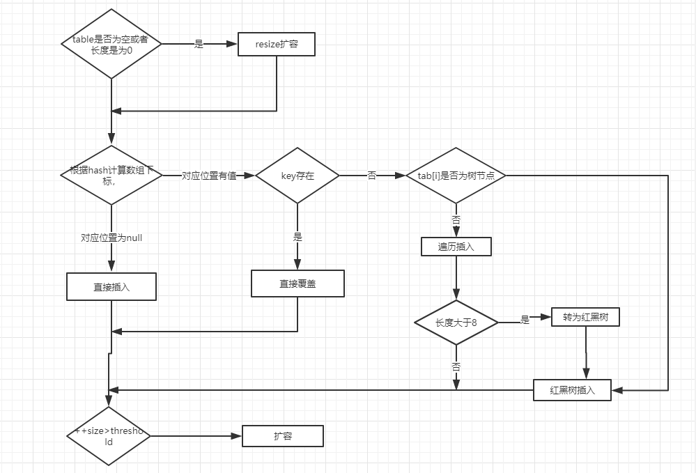
说明:上图有两个小问题：

* 直接覆盖之后应该就会 return，不会有后续操作。参考 JDK8 HashMap.java 658 行
* 当链表长度大于阈值（默认为 8）并且 HashMap 数组长度超过 64 的时候才会执行链表转红黑树的操作，否则就只是对数组扩容。参考 HashMap 的 treeifyBin() 方法
```
public V put(K key, V value) {
    return putVal(hash(key), key, value, false, true);}

final V putVal(int hash, K key, V value, boolean onlyIfAbsent,
                   boolean evict) {
    Node<K,V>[] tab; Node<K,V> p; int n, i;
    // table未初始化或者长度为0，进行扩容
    if ((tab = table) == null || (n = tab.length) == 0)
        n = (tab = resize()).length;
    // (n - 1) & hash 确定元素存放在哪个桶中，桶为空，新生成结点放入桶中(此时，这个结点是放在数组中)
    if ((p = tab[i = (n - 1) & hash]) == null)
        tab[i] = newNode(hash, key, value, null);
    // 桶中已经存在元素
    else {
        Node<K,V> e; K k;
        // 比较桶中第一个元素(数组中的结点)的hash值相等，key相等
        if (p.hash == hash &&
            ((k = p.key) == key || (key != null && key.equals(k))))
                // 将第一个元素赋值给e，用e来记录
                e = p;
        // hash值不相等，即key不相等；为红黑树结点
        else if (p instanceof TreeNode)
            // 放入树中
            e = ((TreeNode<K,V>)p).putTreeVal(this, tab, hash, key, value);
        // 为链表结点
        else {
            // 在链表最末插入结点
            for (int binCount = 0; ; ++binCount) {
                // 到达链表的尾部
                if ((e = p.next) == null) {
                    // 在尾部插入新结点
                    p.next = newNode(hash, key, value, null);
                    // 结点数量达到阈值(默认为 8 )，执行 treeifyBin 方法
                    // 这个方法会根据 HashMap 数组来决定是否转换为红黑树。
                    // 只有当数组长度大于或者等于 64 的情况下，才会执行转换红黑树操作，以减少搜索时间。否则，就是只是对数组扩容。
                    if (binCount >= TREEIFY_THRESHOLD - 1) // -1 for 1st
                        treeifyBin(tab, hash);
                    // 跳出循环
                    break;
                }
                // 判断链表中结点的key值与插入的元素的key值是否相等
                if (e.hash == hash &&
                    ((k = e.key) == key || (key != null && key.equals(k))))
                    // 相等，跳出循环
                    break;
                // 用于遍历桶中的链表，与前面的e = p.next组合，可以遍历链表
                p = e;
            }
        }
        // 表示在桶中找到key值、hash值与插入元素相等的结点
        if (e != null) {
            // 记录e的value
            V oldValue = e.value;
            // onlyIfAbsent为false或者旧值为null
            if (!onlyIfAbsent || oldValue == null)
                //用新值替换旧值
                e.value = value;
            // 访问后回调
            afterNodeAccess(e);
            // 返回旧值
            return oldValue;
        }
    }
    // 结构性修改
    ++modCount;
    // 实际大小大于阈值则扩容
    if (++size > threshold)
        resize();
    // 插入后回调
    afterNodeInsertion(evict);
    return null;}
```

我们再来对比一下 JDK1.7 put 方法的代码
对于 put 方法的分析如下：

* 如果定位到的数组位置没有元素 就直接插入。
* 如果定位到的数组位置有元素，遍历以这个元素为头结点的链表，依次和插入的 key 比较，如果 key 相同就直接覆盖，不同就采用头插法插入元素。
```
public V put(K key, V value)
    if (table == EMPTY_TABLE) {
    inflateTable(threshold);}
    if (key == null)
        return putForNullKey(value);
    int hash = hash(key);
    int i = indexFor(hash, table.length);
    for (Entry<K,V> e = table[i]; e != null; e = e.next) { // 先遍历
        Object k;
        if (e.hash == hash && ((k = e.key) == key || key.equals(k))) {
            V oldValue = e.value;
            e.value = value;
            e.recordAccess(this);
            return oldValue;
        }
    }

    modCount++;
    addEntry(hash, key, value, i);  // 再插入
    return null;}
```
##### get 方法
```
public V get(Object key) {
    Node<K,V> e;
    return (e = getNode(hash(key), key)) == null ? null : e.value;}

final Node<K,V> getNode(int hash, Object key) {
    Node<K,V>[] tab; Node<K,V> first, e; int n; K k;
    if ((tab = table) != null && (n = tab.length) > 0 &&
        (first = tab[(n - 1) & hash]) != null) {
        // 数组元素相等
        if (first.hash == hash && // always check first node
            ((k = first.key) == key || (key != null && key.equals(k))))
            return first;
        // 桶中不止一个节点
        if ((e = first.next) != null) {
            // 在树中get
            if (first instanceof TreeNode)
                return ((TreeNode<K,V>)first).getTreeNode(hash, key);
            // 在链表中get
            do {
                if (e.hash == hash &&
                    ((k = e.key) == key || (key != null && key.equals(k))))
                    return e;
            } while ((e = e.next) != null);
        }
    }
    return null;}
```
##### resize 方法

进行扩容，会伴随着一次重新 hash 分配，并且会遍历 hash 表中所有的元素，是非常耗时的。在编写程序中，要尽量避免 resize。
```
final Node<K,V>[] resize() {
    Node<K,V>[] oldTab = table;
    int oldCap = (oldTab == null) ? 0 : oldTab.length;
    int oldThr = threshold;
    int newCap, newThr = 0;
    if (oldCap > 0) {
        // 超过最大值就不再扩充了，就只好随你碰撞去吧
        if (oldCap >= MAXIMUM_CAPACITY) {
            threshold = Integer.MAX_VALUE;
            return oldTab;
        }
        // 没超过最大值，就扩充为原来的2倍
        else if ((newCap = oldCap << 1) < MAXIMUM_CAPACITY && oldCap >= DEFAULT_INITIAL_CAPACITY)
            newThr = oldThr << 1; // double threshold
    }
    else if (oldThr > 0) // initial capacity was placed in threshold
        newCap = oldThr;
    else {
        // signifies using defaults
        newCap = DEFAULT_INITIAL_CAPACITY;
        newThr = (int)(DEFAULT_LOAD_FACTOR * DEFAULT_INITIAL_CAPACITY);
    }
    // 计算新的resize上限
    if (newThr == 0) {
        float ft = (float)newCap * loadFactor;
        newThr = (newCap < MAXIMUM_CAPACITY && ft < (float)MAXIMUM_CAPACITY ? (int)ft : Integer.MAX_VALUE);
    }
    threshold = newThr;
    @SuppressWarnings({"rawtypes","unchecked"})
        Node<K,V>[] newTab = (Node<K,V>[])new Node[newCap];
    table = newTab;
    if (oldTab != null) {
        // 把每个bucket都移动到新的buckets中
        for (int j = 0; j < oldCap; ++j) {
            Node<K,V> e;
            if ((e = oldTab[j]) != null) {
                oldTab[j] = null;
                if (e.next == null)
                    newTab[e.hash & (newCap - 1)] = e;
                else if (e instanceof TreeNode)
                    ((TreeNode<K,V>)e).split(this, newTab, j, oldCap);
                else {
                    Node<K,V> loHead = null, loTail = null;
                    Node<K,V> hiHead = null, hiTail = null;
                    Node<K,V> next;
                    do {
                        next = e.next;
                        // 原索引
                        if ((e.hash & oldCap) == 0) {
                            if (loTail == null)
                                loHead = e;
                            else
                                loTail.next = e;
                            loTail = e;
                        }
                        // 原索引+oldCap
                        else {
                            if (hiTail == null)
                                hiHead = e;
                            else
                                hiTail.next = e;
                            hiTail = e;
                        }
                    } while ((e = next) != null);
                    // 原索引放到bucket里
                    if (loTail != null) {
                        loTail.next = null;
                        newTab[j] = loHead;
                    }
                    // 原索引+oldCap放到bucket里
                    if (hiTail != null) {
                        hiTail.next = null;
                        newTab[j + oldCap] = hiHead;
                    }
                }
            }
        }
    }
    return newTab;}
```
#### HashMap 多线程操作导致死循环问题

主要原因在于并发下的 Rehash 会造成元素之间会形成一个循环链表。不过，jdk 1.8 后解决了这个问题，但是还是不建议在多线程下使用 HashMap,因为多线程下使用 HashMap 还是会存在其他问题比如数据丢失。并发环境下推荐使用 ConcurrentHashMap 。

#### HashMap 有哪几种常见的遍历方式?

HashMap 遍历从大的方向来说，可分为以下 4 类：

1. 迭代器（Iterator）方式遍历；
2. For Each 方式遍历；
3. Lambda 表达式遍历（JDK 1.8+）;
4. Streams API 遍历（JDK 1.8+）。

但每种类型下又有不同的实现方式，因此具体的遍历方式又可以分为以下 7 种：

1. 使用迭代器（Iterator）EntrySet 的方式进行遍历；
2. 使用迭代器（Iterator）KeySet 的方式进行遍历；
3. 使用 For Each EntrySet 的方式进行遍历；
4. 使用 For Each KeySet 的方式进行遍历；
5. 使用 Lambda 表达式的方式进行遍历；
6. 使用 Streams API 单线程的方式进行遍历；
7. 使用 Streams API 多线程的方式进行遍历。

parallelStream 为多线程版本性能一定是最好的,两个 entrySet 的性能相近，并且执行速度最快，接下来是 stream ，然后是两个 keySet，性能最差的是 KeySet 。

我们不能在遍历中使用集合 map.remove() 来删除数据，这是非安全的操作方式，但我们可以使用迭代器的 iterator.remove() 的方法来删除数据，这是安全的删除集合的方式。同样的我们也可以使用 Lambda 中的 removeIf 来提前删除数据，或者是使用 Stream 中的 filter 过滤掉要删除的数据进行循环，这样都是安全的，当然我们也可以在 for 循环前删除数据在遍历也是线程安全的。

#### ConcurrentHashMap 和 Hashtable 的区别

ConcurrentHashMap 和 Hashtable 的区别主要体现在实现线程安全的方式上不同。

* 底层数据结构：JDK1.7 的 ConcurrentHashMap 底层采用 分段的数组+链表 实现，JDK1.8 采用的数据结构跟 HashMap1.8 的结构一样，数组+链表/红黑二叉树。Hashtable 和 JDK1.8 之前的 HashMap 的底层数据结构类似都是采用 数组+链表 的形式，数组是 HashMap 的主体，链表则是主要为了解决哈希冲突而存在的；
* 实现线程安全的方式（重要）：① 在 JDK1.7 的时候，ConcurrentHashMap（分段锁） 对整个桶数组进行了分割分段(Segment)，每一把锁只锁容器其中一部分数据，多线程访问容器里不同数据段的数据，就不会存在锁竞争，提高并发访问率。 到了 JDK1.8 的时候已经摒弃了 Segment 的概念，而是直接用 Node 数组+链表+红黑树的数据结构来实现，并发控制使用 synchronized 和 CAS 来操作。（JDK1.6 以后 对 synchronized 锁做了很多优化） 整个看起来就像是优化过且线程安全的 HashMap，虽然在 JDK1.8 中还能看到 Segment 的数据结构，但是已经简化了属性，只是为了兼容旧版本；② Hashtable(同一把锁) :使用 synchronized 来保证线程安全，效率非常低下。当一个线程访问同步方法时，其他线程也访问同步方法，可能会进入阻塞或轮询状态，如使用 put 添加元素，另一个线程不能使用 put 添加元素，也不能使用 get，竞争会越来越激烈效率越低。


#### ConcurrentHashMap 线程安全的具体实现方式/底层具体实现

##### JDK1.7（上面有示意图）
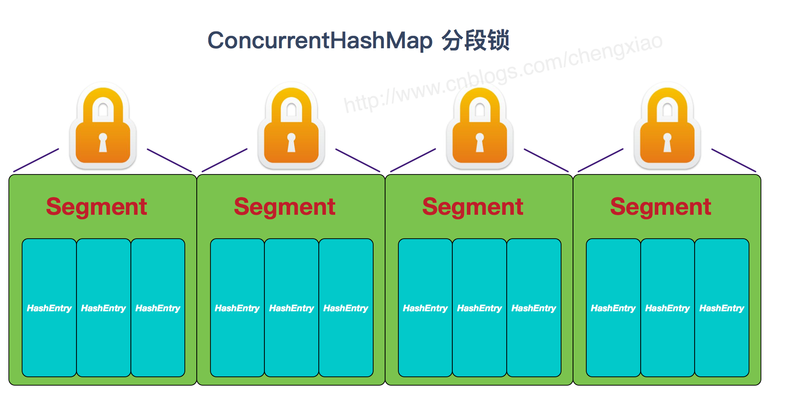

首先将数据分为一段一段的存储，然后给每一段数据配一把锁，当一个线程占用锁访问其中一个段数据时，其他段的数据也能被其他线程访问。ConcurrentHashMap 是由 Segment 数组结构和 HashEntry 数组结构组成。Segment 实现了 ReentrantLock,所以 Segment 是一种可重入锁，扮演锁的角色。HashEntry 用于存储键值对数据。
```
static class Segment<K,V> extends ReentrantLock implements Serializable {
}
```
一个 ConcurrentHashMap 里包含一个 Segment 数组。Segment 的结构和 HashMap 类似，是一种数组和链表结构，一个 Segment 包含一个 HashEntry 数组，每个 HashEntry 是一个链表结构的元素，每个 Segment 守护着一个 HashEntry 数组里的元素，当对 HashEntry 数组的数据进行修改时，必须首先获得对应的 Segment 的锁。

Java 7 中 ConcurrentHashMap 的存储结构如上图，ConcurrnetHashMap 由很多个 Segment 组合，而每一个 Segment 是一个类似于 HashMap 的结构，所以每一个 HashMap 的内部可以进行扩容。但是 Segment 的个数一旦初始化就不能改变，默认 Segment 的个数是 16 个，你也可以认为 ConcurrentHashMap 默认支持最多 16 个线程并发。
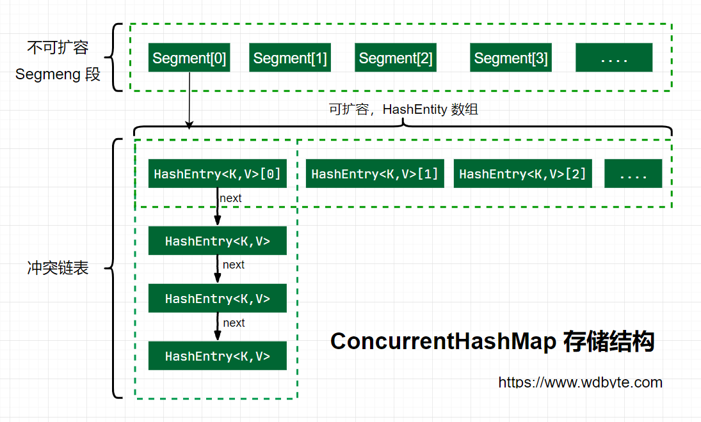

##### 初始化
通过 ConcurrentHashMap 的无参构造探寻 ConcurrentHashMap 的初始化流程。
```
    /**
     * Creates a new, empty map with a default initial capacity (16),
     * load factor (0.75) and concurrencyLevel (16).
     */
    public ConcurrentHashMap() {
        this(DEFAULT_INITIAL_CAPACITY, DEFAULT_LOAD_FACTOR, DEFAULT_CONCURRENCY_LEVEL);
    }
```

无参构造中调用了有参构造，传入了三个参数的默认值，他们的值是
```
    /**
     * 默认初始化容量
     */
    static final int DEFAULT_INITIAL_CAPACITY = 16;

    /**
     * 默认负载因子
     */
    static final float DEFAULT_LOAD_FACTOR = 0.75f;

    /**
     * 默认并发级别
     */
    static final int DEFAULT_CONCURRENCY_LEVEL = 16;
```

接着看下这个有参构造函数的内部实现逻辑。
```
@SuppressWarnings("unchecked")public ConcurrentHashMap(int initialCapacity,float loadFactor, int concurrencyLevel) {
    // 参数校验
    if (!(loadFactor > 0) || initialCapacity < 0 || concurrencyLevel <= 0)
        throw new IllegalArgumentException();
    // 校验并发级别大小，大于 1<<16，重置为 65536
    if (concurrencyLevel > MAX_SEGMENTS)
        concurrencyLevel = MAX_SEGMENTS;
    // Find power-of-two sizes best matching arguments
    // 2的多少次方
    int sshift = 0;
    int ssize = 1;
    // 这个循环可以找到 concurrencyLevel 之上最近的 2的次方值
    while (ssize < concurrencyLevel) {
        ++sshift;
        ssize <<= 1;
    }
    // 记录段偏移量
    this.segmentShift = 32 - sshift;
    // 记录段掩码
    this.segmentMask = ssize - 1;
    // 设置容量
    if (initialCapacity > MAXIMUM_CAPACITY)
        initialCapacity = MAXIMUM_CAPACITY;
    // c = 容量 / ssize ，默认 16 / 16 = 1，这里是计算每个 Segment 中的类似于 HashMap 的容量
    int c = initialCapacity / ssize;
    if (c * ssize < initialCapacity)
        ++c;
    int cap = MIN_SEGMENT_TABLE_CAPACITY;
    //Segment 中的类似于 HashMap 的容量至少是2或者2的倍数
    while (cap < c)
        cap <<= 1;
    // create segments and segments[0]
    // 创建 Segment 数组，设置 segments[0]
    Segment<K,V> s0 = new Segment<K,V>(loadFactor, (int)(cap * loadFactor),
                         (HashEntry<K,V>[])new HashEntry[cap]);
    Segment<K,V>[] ss = (Segment<K,V>[])new Segment[ssize];
    UNSAFE.putOrderedObject(ss, SBASE, s0); // ordered write of segments[0]
    this.segments = ss;}
```
总结一下在 Java 7 中 ConcurrnetHashMap 的初始化逻辑：

1. 必要参数校验。
2. 校验并发级别 concurrencyLevel 大小，如果大于最大值，重置为最大值。无参构造默认值是 16.
3. 寻找并发级别 concurrencyLevel 之上最近的 2 的幂次方值，作为初始化容量大小，默认是 16。
4. 记录 segmentShift 偏移量，这个值为【容量 = 2 的N次方】中的 N，在后面 Put 时计算位置时会用到。默认是 32 - sshift = 28.
5. 记录 segmentMask，默认是 ssize - 1 = 16 -1 = 15.
6. `初始化 segments[0]**，默认大小为 2，负载因子 0.75，扩容阀值是 2*0.75=1.5**，插入第二个值时才会进行扩容。`

##### put

接着上面的初始化参数继续查看 put 方法源码。
```

/**
 * Maps the specified key to the specified value in this table.
 * Neither the key nor the value can be null.
 *
 * <p> The value can be retrieved by calling the <tt>get</tt> method
 * with a key that is equal to the original key.
 *
 * @param key key with which the specified value is to be associated
 * @param value value to be associated with the specified key
 * @return the previous value associated with <tt>key</tt>, or
 *         <tt>null</tt> if there was no mapping for <tt>key</tt>
 * @throws NullPointerException if the specified key or value is null
 */public V put(K key, V value) {
    Segment<K,V> s;
    if (value == null)
        throw new NullPointerException();
    int hash = hash(key);
    // hash 值无符号右移 28位（初始化时获得），然后与 segmentMask=15 做与运算
    // 其实也就是把高4位与segmentMask（1111）做与运算
    int j = (hash >>> segmentShift) & segmentMask;
    if ((s = (Segment<K,V>)UNSAFE.getObject          // nonvolatile; recheck
         (segments, (j << SSHIFT) + SBASE)) == null) //  in ensureSegment
        // 如果查找到的 Segment 为空，初始化
        s = ensureSegment(j);
    return s.put(key, hash, value, false);}

/**
 * Returns the segment for the given index, creating it and
 * recording in segment table (via CAS) if not already present.
 *
 * @param k the index
 * @return the segment
 */@SuppressWarnings("unchecked")private Segment<K,V> ensureSegment(int k) {
    final Segment<K,V>[] ss = this.segments;
    long u = (k << SSHIFT) + SBASE; // raw offset
    Segment<K,V> seg;
    // 判断 u 位置的 Segment 是否为null
    if ((seg = (Segment<K,V>)UNSAFE.getObjectVolatile(ss, u)) == null) {
        Segment<K,V> proto = ss[0]; // use segment 0 as prototype
        // 获取0号 segment 里的 HashEntry<K,V> 初始化长度
        int cap = proto.table.length;
        // 获取0号 segment 里的 hash 表里的扩容负载因子，所有的 segment 的 loadFactor 是相同的
        float lf = proto.loadFactor;
        // 计算扩容阀值
        int threshold = (int)(cap * lf);
        // 创建一个 cap 容量的 HashEntry 数组
        HashEntry<K,V>[] tab = (HashEntry<K,V>[])new HashEntry[cap];
        if ((seg = (Segment<K,V>)UNSAFE.getObjectVolatile(ss, u)) == null) { // recheck
            // 再次检查 u 位置的 Segment 是否为null，因为这时可能有其他线程进行了操作
            Segment<K,V> s = new Segment<K,V>(lf, threshold, tab);
            // 自旋检查 u 位置的 Segment 是否为null
            while ((seg = (Segment<K,V>)UNSAFE.getObjectVolatile(ss, u))
                   == null) {
                // 使用CAS 赋值，只会成功一次
                if (UNSAFE.compareAndSwapObject(ss, u, null, seg = s))
                    break;
            }
        }
    }
    return seg;}
```


##### JDK1.8 
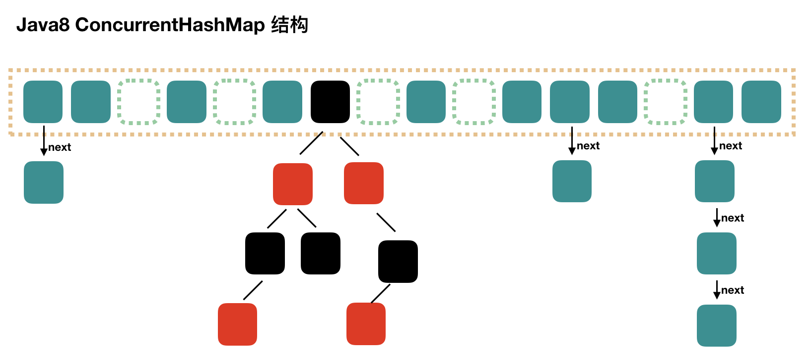

ConcurrentHashMap 取消了 Segment 分段锁，采用 CAS 和 synchronized 来保证并发安全。数据结构跟 HashMap1.8 的结构类似，数组+链表/红黑二叉树。Java 8 在链表长度超过一定阈值（8）时将链表（寻址时间复杂度为 O(N)）转换为红黑树（寻址时间复杂度为 O(log(N))）synchronized 只锁定当前链表或红黑二叉树的首节点，这样只要 hash 不冲突，就不会产生并发，效率又提升 N 倍。

### Collections 工具类

Collections 工具类常用方法:

1. 排序
2. 查找,替换操作
3. 同步控制(不推荐，需要线程安全的集合类型时请考虑使用 JUC 包下的并发集合)

#### 排序操作
```
void reverse(List list)//反转
void shuffle(List list)//随机排序
void sort(List list)//按自然排序的升序排序
void sort(List list, Comparator c)//定制排序，由Comparator控制排序逻辑
void swap(List list, int i , int j)//交换两个索引位置的元素
void rotate(List list, int distance)//旋转。当distance为正数时，将list后distance个元素整体移到前面。当distance为负数时，将 list的前distance个元素整体移到后面
```

#### 查找,替换操作
```

int binarySearch(List list, Object key)//对List进行二分查找，返回索引，注意List必须是有序的
int max(Collection coll)//根据元素的自然顺序，返回最大的元素。 类比int min(Collection coll)
int max(Collection coll, Comparator c)//根据定制排序，返回最大元素，排序规则由Comparatator类控制。类比int min(Collection coll, Comparator c)
void fill(List list, Object obj)//用指定的元素代替指定list中的所有元素
int frequency(Collection c, Object o)//统计元素出现次数
int indexOfSubList(List list, List target)//统计target在list中第一次出现的索引，找不到则返回-1，类比int lastIndexOfSubList(List source, list target)
boolean replaceAll(List list, Object oldVal, Object newVal)//用新元素替换旧元素
```

#### 同步控制

Collections 提供了多个synchronizedXxx()方法·，该方法可以将指定集合包装成线程同步的集合，从而解决多线程并发访问集合时的线程安全问题。我们知道 HashSet，TreeSet，ArrayList,LinkedList,HashMap,TreeMap 都是线程不安全的。Collections 提供了多个静态方法可以把他们包装成线程同步的集合。

**最好不要用下面这些方法，效率非常低，需要线程安全的集合类型时请考虑使用 JUC 包下的并发集合。**
```
synchronizedCollection(Collection<T>  c) //返回指定 collection 支持的同步（线程安全的）collection。
synchronizedList(List<T> list)//返回指定列表支持的同步（线程安全的）List。synchronizedMap(Map<K,V> m) //返回由指定映射支持的同步（线程安全的）Map。
synchronizedSet(Set<T> s) //返回指定 set 支持的同步（线程安全的）set。
```
## 并发

### 线程和进程
#### 进程

进程是程序的一次执行过程，是系统运行程序的基本单位，因此进程是动态的。系统运行一个程序即是一个进程从创建，运行到消亡的过程。
在 Java 中，当我们启动 main 函数时其实就是启动了一个 JVM 的进程，而 main 函数所在的线程就是这个进程中的一个线程，也称主线程。
#### 线程
线程与进程相似，但线程是一个比进程更小的执行单位。一个进程在其执行的过程中可以产生多个线程。与进程不同的是同类的多个线程共享进程的堆和方法区资源，但每个线程有自己的程序计数器、虚拟机栈和本地方法栈，所以系统在产生一个线程，或是在各个线程之间作切换工作时，负担要比进程小得多，也正因为如此，线程也被称为轻量级进程。
