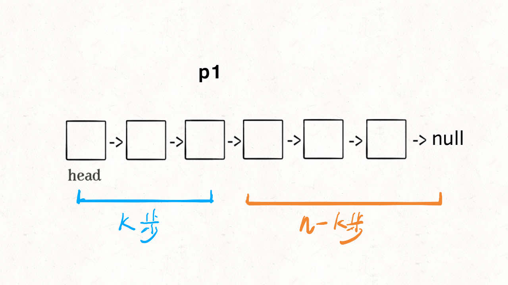
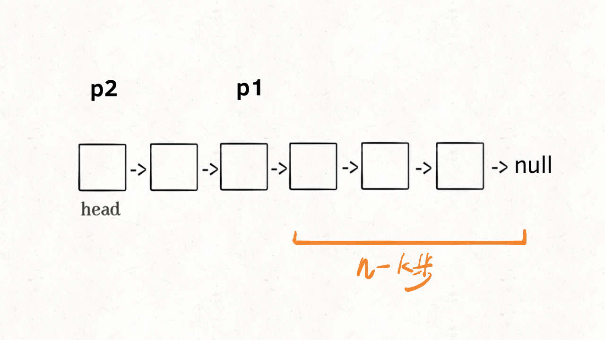
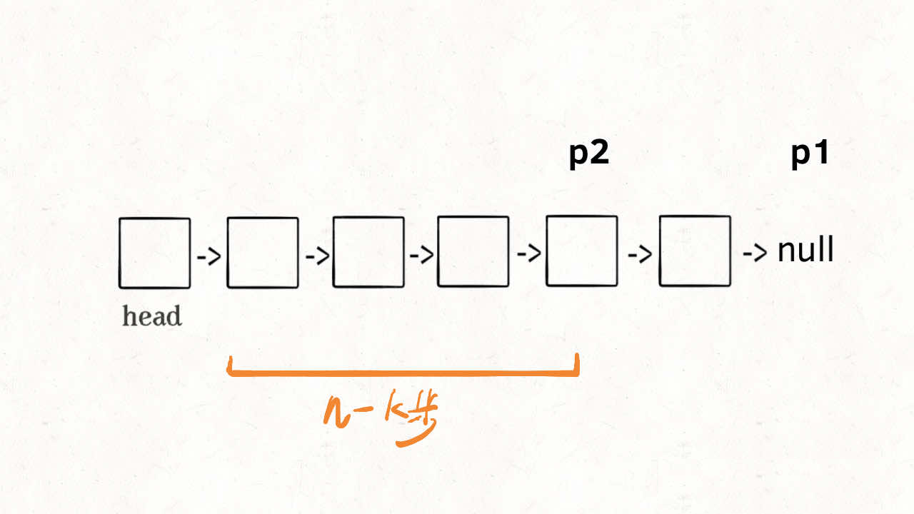
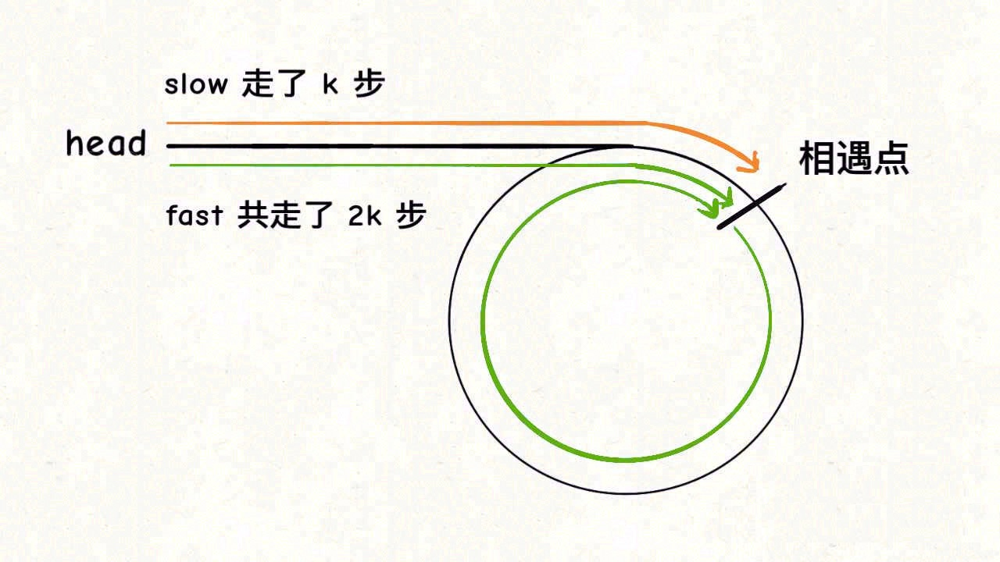
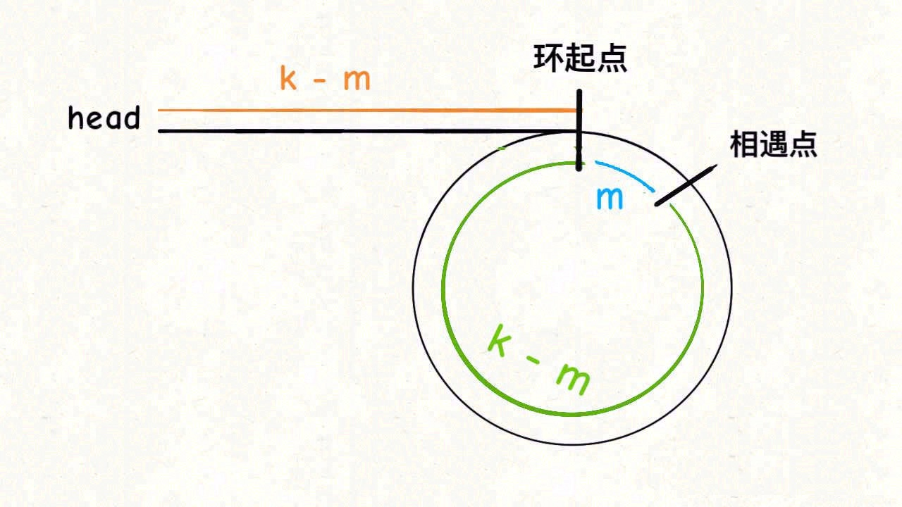
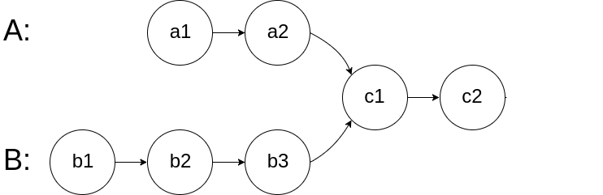
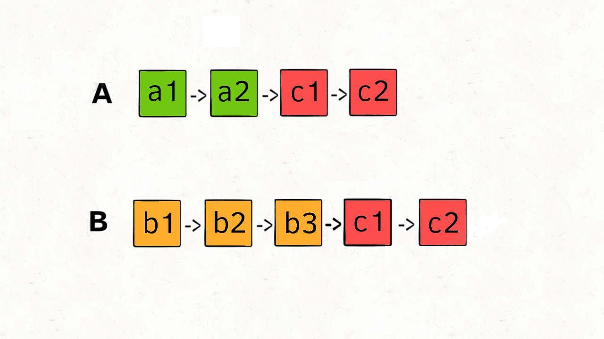
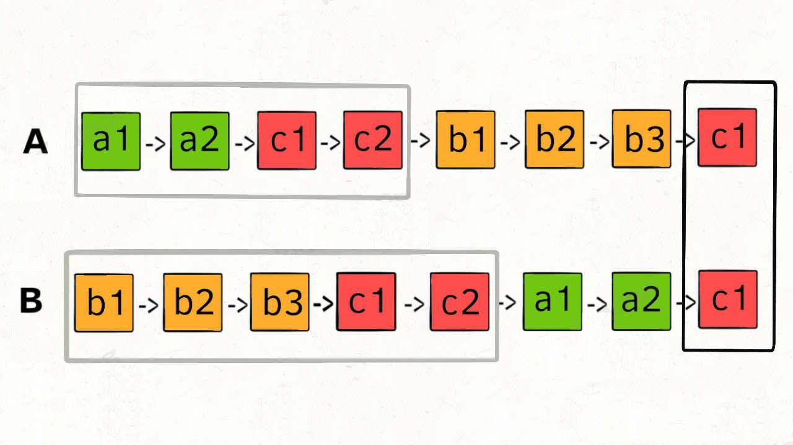

# 第一章 必读
## 学习算法和刷题的框架思维

### 数据结构的存储方式

**数据结构的存储方式只有两种：数组（顺序存储）和链表（链式存储）。**

这句话怎么理解，不是还有散列表、栈、队列、堆、树、图等等各种数据结构吗？我们分析问题，一定要有递归的思想，自顶向下，从抽象到具体。你上来就列出这么多，那些都属于「上层建筑」，而数组和链表才是「结构基础」。因为那些多样化的数据结构，究其源头，都是在链表或者数组上的特殊操作，API 不同而已。

比如说「队列」、「栈」这两种数据结构既可以使用链表也可以使用数组实现。用数组实现，就要处理扩容缩容的问题；用链表实现，没有这个问题，但需要更多的内存空间存储节点指针。
**图**的两种表示方法，邻接表就是链表，邻接矩阵就是二维数组。邻接矩阵判断连通性迅速，并可以进行矩阵运算解决一些问题，但是如果图比较稀疏的话很耗费空间。邻接表比较节省空间，但是很多操作的效率上肯定比不过邻接矩阵。

**散列表**就是通过散列函数把键映射到一个大数组里。而且对于解决散列冲突的方法，拉链法需要链表特性，操作简单，但需要额外的空间存储指针；线性探查法就需要数组特性，以便连续寻址，不需要指针的存储空间，但操作稍微复杂些。

**树**，用数组实现就是「堆」，因为「堆」是一个完全二叉树，用数组存储不需要节点指针，操作也比较简单；用链表实现就是很常见的那种「树」，因为不一定是完全二叉树，所以不适合用数组存储。为此，在这种链表「树」结构之上，又衍生出各种巧妙的设计，比如二叉搜索树、AVL 树、红黑树、区间树、B 树等等，以应对不同的问题。

了解 Redis 数据库的朋友可能也知道，Redis 提供列表、字符串、集合等等几种常用数据结构，但是对于每种数据结构，底层的存储方式都至少有两种，以便于根据存储数据的实际情况使用合适的存储方式。

综上，数据结构种类很多，甚至你也可以发明自己的数据结构，但是底层存储无非数组或者链表，二者的优缺点如下：

* **数组**由于是紧凑连续存储,可以随机访问，通过索引快速找到对应元素，而且相对节约存储空间。但正因为连续存储，内存空间必须一次性分配够，所以说数组如果要扩容，需要重新分配一块更大的空间，再把数据全部复制过去，时间复杂度 O(N)；而且你如果想在数组中间进行插入和删除，每次必须搬移后面的所有数据以保持连续，时间复杂度 O(N)。
* **链表**因为元素不连续，而是靠指针指向下一个元素的位置，所以不存在数组的扩容问题；如果知道某一元素的前驱和后驱，操作指针即可删除该元素或者插入新元素，时间复杂度 O(1)。但是正因为存储空间不连续，你无法根据一个索引算出对应元素的地址，所以不能随机访问；而且由于每个元素必须存储指向前后元素位置的指针，会消耗相对更多的储存空间。

### 数据结构的基本操作
对于任何数据结构，其基本操作无非遍历 + 访问，再具体一点就是：增删查改。

**数据结构种类很多，但它们存在的目的都是在不同的应用场景，尽可能高效地增删查改。**

如何遍历 + 访问？我们仍然从最高层来看，各种数据结构的遍历 + 访问无非两种形式：线性的和非线性的。线性就是 for/while 迭代为代表，非线性就是递归为代表。再具体一步，无非以下几种框架：

####  数组遍历框架，典型的线性迭代结构
```
void traverse(int[] arr) { 
    for (int i = 0; i < arr.length; i++) { 
        // 迭代访问 arr[i]  
    } 
}
```
#### 链表遍历框架，兼具迭代和递归结构
```
/* 基本的单链表节点 */
class ListNode {
    int val;
    ListNode next;
}

void traverse(ListNode head) {
    for (ListNode p = head; p != null; p = p.next) {
        // 迭代访问 p.val
    }
}

void traverse(ListNode head) {
    // 递归访问 head.val
    traverse(head.next);
}
```
#### 二叉树遍历框架，典型的非线性递归遍历结构
```
/* 基本的二叉树节点 */
class TreeNode {
    int val;
    TreeNode left, right;
}

void traverse(TreeNode root) {
    traverse(root.left);
    traverse(root.right);
}
```

你看二叉树的递归遍历方式和链表的递归遍历方式，相似不？再看看二叉树结构和单链表结构，相似不？如果再多几条叉，N 叉树你会不会遍历？

#### 二叉树框架可以扩展为 N 叉树的遍历框架
```
/* 基本的 N 叉树节点 */
class TreeNode {
    int val;
    TreeNode[] children;
}

void traverse(TreeNode root) {
    for (TreeNode child : root.children)
        traverse(child);
}
```
N 叉树的遍历又可以扩展为图的遍历，因为图就是好几 N 叉棵树的结合体。你说图是可能出现环的？这个很好办，用个布尔数组 visited 做标记就行了，这里就不写代码了。

**所谓框架，就是套路。不管增删查改，这些代码都是永远无法脱离的结构，**你可以把这个结构作为大纲，根据具体问题在框架上添加代码就行了，下面会具体举例。

### 算法刷题指南

首先要明确的是，数据结构是工具，算法是通过合适的工具解决特定问题的方法。也就是说，学习算法之前，最起码得了解那些常用的数据结构，了解它们的特性和缺陷。
所以我建议的刷题顺序是：

1. 先学习像数组、链表这种基本数据结构的常用算法，比如单链表翻转，前缀和数组，二分搜索等。因为这些算法属于会者不难难者不会的类型，难度不大，学习它们不会花费太多时间。而且这些小而美的算法经常让你大呼精妙，能够有效培养你对算法的兴趣。
2. 学会基础算法之后，不要急着上来就刷回溯算法、动态规划这类笔试常考题，而应该**先刷二叉树，先刷二叉树，先刷二叉树**，重要的事情说三遍。为什么要先刷二叉树呢，因为二叉树是最容易培养框架思维的，而且大部分算法技巧，本质上都是树的遍历问题。不要小看这几行破代码，几乎所有二叉树的题目都是一套这个框架就出来了：
```
void traverse(TreeNode root) {
    // 前序位置
    traverse(root.left);
    // 中序位置
    traverse(root.right);
    // 后序位置
}
```
比如说我随便拿几道题的解法出来，不用管具体的代码逻辑，只要看看框架在其中是如何发挥作用的就行。力扣第 124 题，难度困难，让你求二叉树中最大路径和，主要代码如下：
```
int res = Integer.MIN_VALUE;
int oneSideMax(TreeNode root) {
    if (root == null) return 0;
    int left = max(0, oneSideMax(root.left));
    int right = max(0, oneSideMax(root.right));
    // 后序位置
    res = Math.max(res, left + right + root.val);
    return Math.max(left, right) + root.val;
}
```
注意递归函数的位置，这就是个后序遍历嘛，无非就是把 traverse 函数名字改成 oneSideMax 了。

对于一个理解二叉树的人来说，刷一道二叉树的题目花不了多长时间。那么如果你对刷题无从下手或者有畏惧心理，不妨从二叉树下手，前 10 道也许有点难受；结合框架再做 20 道，也许你就有点自己的理解了；刷完整个专题，再去做什么回溯动规分治专题，你就会发现**只要涉及递归的问题，都是树的问题**。

其实很多动态规划问题就是在遍历一棵树，你如果对树的遍历操作烂熟于心，起码知道怎么把思路转化成代码，也知道如何提取别人解法的核心思路。

再看看回溯算法，前文回溯算法详解干脆直接说了，回溯算法就是个 N 叉树的前后序遍历问题，没有例外。比如全排列问题吧，本质上全排列就是在遍历下面这棵树，到叶子节点的路径就是一个全排列。

综上，对于畏惧算法的同学来说，**可以先刷树的相关题目，试着从框架上看问题，而不要纠结于细节问题。**

## 刷题心得

### 算法的本质

如果要让我一句话总结，我想说算法的本质就是**穷举**。

例外肯定是有的，比如前几天我还发了 一行代码就能解决的算法题，这些题目都是通过观察，发现规律，然后找到最优解法。再比如数学相关的算法，很多都是数学推论，然后用编程的形式表现出来了，所以它本质是数学，不是计算机算法。
从计算机算法的角度，结合我们大多数人的需求，这种秀智商的纯技巧题目绝对占少数，虽然很容易让人大呼精妙，但不能提炼出思考算法题的通用思维，真正通用的思维反而大道至简，就是穷举。

对计算机算法的误解也许是以前学数学留下的「后遗症」，数学题一般都是你仔细观察，找几何关系，列方程，然后算出答案。如果说你需要进行大规模穷举来寻找答案，那大概率是你的解题思路出问题了。而计算机解决问题的思维恰恰相反，有没有什么数学公式就交给你们人类去推导吧，如果能找到一些巧妙的定理那最好，但如果找不到，那就穷举呗，反正只要复杂度允许，没有什么答案是穷举不出来的。
技术岗笔试面试考的那些算法题，求个最大值最小值什么的，你怎么求？必须得把所有可行解穷举出来才能找到最值。

但是，你千万不要觉得穷举这个事儿很简单，**穷举有两个关键难点：无遗漏、无冗余。**

遗漏，会直接导致答案出错；冗余，会拖慢算法的运行速度。所以，当你看到一道算法题，可以从这两个维度去思考：

1. **如何穷举？即无遗漏地穷举所有可能解。**
2. **如何聪明地穷举？即避免所有冗余的计算。**


不同类型的题目，难点是不同的，有的题目难在**如何穷举**，有的题目难在**如何聪明地穷举**。

什么算法的难点在**如何穷举**呢？**一般是递归类问题，最典型的就是动态规划系列问题。**

前文 动态规划核心套路 阐述了动态规划系列问题的核心原理，无非就是先写出暴力穷举解法（状态转移方程），加个备忘录就成自顶向下的递归解法了，再改一改就成自底向上的递推迭代解法了， 动态规划的降维打击 里也讲过如何分析优化动态规划算法的空间复杂度。
上述过程就是在不断优化算法的时间、空间复杂度，也就是所谓如何聪明地穷举，这些技巧一听就会了。但很多读者留言说明白了这些原理，遇到动态规划题目还是不会做，因为第一步的暴力解法都写不出来。
这很正常，因为动态规划类型的题目可以千奇百怪，找状态转移方程才是难点，所以才有了 动态规划设计方法：数学归纳法 这篇文章，告诉你递归穷举的核心是数学归纳法，明确函数的定义，然后利用这个定义写递归函数，就可以穷举出所有可行解。

什么算法的难点在**如何聪明地穷举**呢？一些耳熟能详的非递归算法技巧，都可以归在这一类。


# 第一章、手把手刷数据结构

## 手把手刷链表算法

### 双指针技巧秒杀七道链表题目

#### 合并两个有序链表

给你输入两个有序链表，请你把他俩合并成一个新的有序链表，函数签名如下：
```
public ListNode mergeTwoLists(ListNode list1, ListNode list2) {
        ListNode temp = new ListNode(-1),p=temp;
        while(list1!=null && list2!=null){
            if(list1.val<=list2.val){
                p.next=list1;
                list1=list1.next;
            }else {
                p.next=list2;
                list2 = list2.next;
            }
            p=p.next;
        }
        if(list1!=null){
            p.next=list1;
        }
        if(list2!=null){
            p.next=list2;
        }
        return temp.next;
    }
```
我们的 while 循环每次比较 p1 和 p2 的大小，把较小的节点接到结果链表上，这个算法的逻辑类似于「拉拉链」，l1, l2 类似于拉链两侧的锯齿，指针 p 就好像拉链的拉索，将两个有序链表合并。
代码中还用到一个链表的算法题中是很常见的**虚拟头结点**技巧，也就是 **dummy 节点。你可以试试，如果不使用 dummy 虚拟节点，代码会复杂很多，**而有了 dummy 节点这个占位符，可以避免处理空指针的情况，降低代码的复杂性。

#### 合并 k 个有序链表
```
ListNode mergeKLists(ListNode[] lists) {
    if (lists.length == 0) return null;
    // 虚拟头结点
    ListNode dummy = new ListNode(-1);
    ListNode p = dummy;
    // 优先级队列，最小堆
    PriorityQueue<ListNode> pq = new PriorityQueue<>(
        lists.length, (a, b)->(a.val - b.val));
    // 将 k 个链表的头结点加入最小堆
    for (ListNode head : lists) {
        if (head != null)
            pq.add(head);
    }

    while (!pq.isEmpty()) {
        // 获取最小节点，接到结果链表中
        ListNode node = pq.poll();
        p.next = node;
        if (node.next != null) {
            pq.add(node.next);
        }
        // p 指针不断前进
        p = p.next;
    }
    return dummy.next;
}
```

合并 k 个有序链表的逻辑类似合并两个有序链表，难点在于，如何快速得到 k 个节点中的最小节点，接到结果链表上？这里我们就要用到 **优先级队列**（二叉堆） 这种数据结构，把链表节点放入一个最小堆，就可以每次获得 k 个节点中的最小节点：
优先队列 pq 中的元素个数最多是 k，所以一次 poll 或者 add 方法的时间复杂度是 O(logk)；所有的链表节点都会被加入和弹出 pq，所以算法整体的时间复杂度是 O(Nlogk)，其中 k 是链表的条数，N 是这些链表的节点总数。

#### 单链表的倒数第 k 个节点

首先，我们先让一个指针 p1 指向链表的头节点 head，然后走 k 步：



现在的 p1，只要再走 n - k 步，就能走到链表末尾的空指针了对吧？趁这个时候，再用一个指针 p2 指向链表头节点 head：


接下来就很显然了，让 p1 和 p2 同时向前走，p1 走到链表末尾的空指针时前进了 n - k 步，p2 也从 head 开始前进了 n - k 步，停留在第 n - k + 1 个节点上，即恰好停链表的倒数第 k 个节点上：


这样，只遍历了一次链表，就获得了倒数第 k 个节点 p2。
```
// 返回链表的倒数第 k 个节点
ListNode findFromEnd(ListNode head, int k) {
    ListNode p1 = head;
    // p1 先走 k 步
    for (int i = 0; i < k; i++) {
        p1 = p1.next;
    }
    ListNode p2 = head;
    // p1 和 p2 同时走 n - k 步
    while (p1 != null) {
        p2 = p2.next;
        p1 = p1.next;
    }
    // p2 现在指向第 n - k 个节点
    return p2;
}
```
##### 删除单链表的第K个节点
```
// 主函数
public ListNode removeNthFromEnd(ListNode head, int n) {
    // 虚拟头结点
    ListNode dummy = new ListNode(-1);
    dummy.next = head;
    // 删除倒数第 n 个，要先找倒数第 n + 1 个节点
    ListNode x = findFromEnd(dummy, n + 1);
    // 删掉倒数第 n 个节点
    x.next = x.next.next;
    return dummy.next;
}
    
private ListNode findFromEnd(ListNode head, int k) {
    // 代码见上文
}
```
这个逻辑就很简单了，要删除倒数第 n 个节点，就得获得倒数第 n + 1 个节点的引用，可以用我们实现的 findFromEnd 来操作。

**不过注意我们又使用了虚拟头结点的技巧，也是为了防止出现空指针的情况，比如说链表总共有 5 个节点，题目就让你删除倒数第 5 个节点，也就是第一个节点，那按照算法逻辑，应该首先找到倒数第 6 个节点。但第一个节点前面已经没有节点了，这就会出错。但有了我们虚拟节点 dummy 的存在，就避免了这个问题，能够对这种情况进行正确的删除。**


#### 单链表的中点

问题的关键也在于我们无法直接得到单链表的长度 n，常规方法也是先遍历链表计算 n，再遍历一次得到第 n / 2 个节点，也就是中间节点。

如果想一次遍历就得到中间节点，也需要耍点小聪明，使用「快慢指针」的技巧：
我们让两个指针 slow 和 fast 分别指向链表头结点 head。**每当慢指针 slow 前进一步，快指针 fast 就前进两步**，这样，当 fast 走到链表末尾时，slow 就指向了链表中点。上述思路的代码实现如下：
```
ListNode middleNode(ListNode head) {
    // 快慢指针初始化指向 head
    ListNode slow = head;
    // 快指针走到末尾时停止
    while (head != null && head.next != null) {
        // 慢指针走一步，快指针走两步
        slow = slow.next;
        head = head.next.next;
    }
    // 慢指针指向中点
    return slow;
}
```
需要注意的是，如果链表长度为偶数，也就是说中点有两个的时候，我们这个解法返回的节点是靠后的那个节点。另外，这段代码稍加修改就可以直接用到判断链表成环的算法题上。

#### 判断链表是否包含环

判断链表是否包含环属于经典问题了，解决方案也是用**快慢指针**：每当慢指针 slow 前进一步，快指针 fast 就前进两步。**如果 fast 最终遇到空指针，说明链表中没有环；如果 fast 最终和 slow 相遇，那肯定是 fast 超过了 slow 一圈，说明链表中含有环**。
```
boolean hasCycle(ListNode head) {
    // 快慢指针初始化指向 head
    ListNode slow = head, fast = head;
    // 快指针走到末尾时停止
    while (fast != null && fast.next != null) {
        // 慢指针走一步，快指针走两步
        slow = slow.next;
        fast = fast.next.next;
        // 快慢指针相遇，说明含有环
        if (slow == fast) {
            return true;
        }
    }
    // 不包含环
    return false;
}
```

当然，这个问题还有进阶版：如果链表中含有环，如何计算这个环的起点？
```
ListNode detectCycle(ListNode head) {
    ListNode fast, slow;
    fast = slow = head;
    while (fast != null && fast.next != null) {
        fast = fast.next.next;
        slow = slow.next;
        if (fast == slow) break;
    }
    // 上面的代码类似 hasCycle 函数
    if (fast == null || fast.next == null) {
        // fast 遇到空指针说明没有环
        return null;
    }

    // 重新指向头结点
    slow = head;
    // 快慢指针同步前进，相交点就是环起点
    while (slow != fast) {
        fast = fast.next;
        slow = slow.next;
    }
    return slow;
}
```
可以看到，当快慢指针相遇时，让其中任一个指针指向头节点，然后让它俩以相同速度前进，再次相遇时所在的节点位置就是环开始的位置。
我们假设快慢指针相遇时，慢指针 slow 走了 k 步，那么快指针 fast 一定走了 2k 步：


fast 一定比 slow 多走了 k 步，这多走的 k 步其实就是 fast 指针在环里转圈圈，所以 k 的值就是环长度的**整数倍**。

假设相遇点距环的起点的距离为 m，那么结合上图的 slow 指针，环的起点距头结点 head 的距离为 k - m，也就是说如果从 head 前进 k - m 步就能到达环起点。巧的是，如果从相遇点继续前进 k - m 步，也恰好到达环起点。因为结合上图的 fast 指针，从相遇点开始走k步可以转回到相遇点，那走 k - m 步肯定就走到环起点了：


所以，只要我们把快慢指针中的任一个重新指向 head，然后两个指针同速前进，k - m 步后一定会相遇，相遇之处就是环的起点了。

#### 两个链表是否相交

给你输入两个链表的头结点 headA 和 headB，这两个链表可能存在相交。如果相交，你的算法应该返回相交的那个节点；如果没相交，则返回 null。


那么我们的算法应该返回 c1 这个节点。这个题直接的想法可能是用 HashSet 记录一个链表的所有节点，然后和另一条链表对比，但这就需要额外的空间。

如果不用额外的空间，只使用两个指针，你如何做呢？难点在于，由于两条链表的长度可能不同，两条链表之间的节点无法对应：


如果用两个指针 p1 和 p2 分别在两条链表上前进，并不能同时走到公共节点，也就无法得到相交节点 c1。

解决这个问题的关键是，**通过某些方式，让 p1 和 p2 能够同时到达相交节点 c1**。
所以，我们可以让 p1 遍历完链表 A 之后开始遍历链表 B，让 p2 遍历完链表 B 之后开始遍历链表 A，这样相当于「逻辑上」两条链表接在了一起。如果这样进行拼接，就可以让 p1 和 p2 同时进入公共部分，也就是同时到达相交节点 c1：


那你可能会问，如果说两个链表没有相交点，是否能够正确的返回 null 呢？这个逻辑可以覆盖这种情况的，相当于 c1 节点是 null 空指针嘛，可以正确返回 null。

```
ListNode getIntersectionNode(ListNode headA, ListNode headB) {
    // p1 指向 A 链表头结点，p2 指向 B 链表头结点
    ListNode p1 = headA, p2 = headB;
    while (p1 != p2) {
        // p1 走一步，如果走到 A 链表末尾，转到 B 链表
        if (p1 == null) p1 = headB;
        else            p1 = p1.next;
        // p2 走一步，如果走到 B 链表末尾，转到 A 链表
        if (p2 == null) p2 = headA;
        else            p2 = p2.next;
    }
    return p1;
}
```

### 递归魔法：反转单链表

#### 递归反转整个链表

递归反转单链表的算法：
```
// 定义：输入一个单链表头结点，将该链表反转，返回新的头结点
ListNode reverse(ListNode head) {
    if (head == null || head.next == null) {
        return head;
    }
    ListNode last = reverse(head.next);
    head.next.next = head;
    head.next = null;
    return last;
}
```
对于递归算法，最重要的就是明确递归函数的定义。具体来说，我们的 reverse 函数定义是这样的：输入一个节点 head，将「以 head 为起点」的链表反转，并返回反转之后的头结点。
那么输入 reverse(head) 后，会在这里进行递归：
`ListNode last = reverse(head.next);`


这个 reverse(head.next) 执行完成后，整个链表就成了这样


并且根据函数定义，reverse 函数会返回反转之后的头结点，我们用变量 last 接收了。现在再来看下面的代码：`head.next.next = head;`


接下来：`head.next = null; return last;`


不过其中有两个地方需要注意：

1. 递归函数要有 base case，也就是这句：`if (head == null || head.next == null) {
    return head;
    }
    `
    意思是如果链表为空或者只有一个节点的时候，反转结果就是它自己，直接返回即可。

2. 当链表递归反转之后，新的头结点是 last，而之前的 head 变成了最后一个节点，别忘了链表的末尾要指向 null：

此外还可以通过栈的数据结构反转：
```
public ListNode reverseList(ListNode head) {
        if(head == null){
            return head;
        }
        Stack<ListNode> stack = new Stack<ListNode>();
        while(head != null){
            stack.push(head);
            head = head.next;
        }
        head = stack.pop();
        ListNode temp = head;
        while (!stack.isEmpty()){
            head.next=stack.pop();
            head = head.next;
            head.next=null;
        }
        return temp;
    }
```
也是需要注意置空（head.next=null;），防止链表的下一节点指向原来的节点而陷入循环。

#### 反转链表前 N 个节点

比如说对于下图链表，执行 reverseN(head, 3)：


解决思路和反转整个链表差不多，只要稍加修改即可：
```
ListNode successor = null; // 后驱节点

// 反转以 head 为起点的 n 个节点，返回新的头结点
ListNode reverseN(ListNode head, int n) {
    if (n == 1) {
        // 记录第 n + 1 个节点
        successor = head.next;
        return head;
    }
    // 以 head.next 为起点，需要反转前 n - 1 个节点
    ListNode last = reverseN(head.next, n - 1);

    head.next.next = head;
    // 让反转之后的 head 节点和后面的节点连起来
    head.next = successor;
    return last;
}
```

具体的区别：

1. base case 变为 n == 1，反转一个元素，就是它本身，同时要记录后驱节点。
2. 刚才我们直接把 head.next 设置为 null，因为整个链表反转后原来的 head 变成了整个链表的最后一个节点。但现在 head 节点在递归反转之后不一定是最后一个节点了，所以要记录后驱 successor（第 n + 1 个节点），反转之后将 head 连接上。


#### 反转链表的一部分

现在解决我们最开始提出的问题，给一个索引区间 [m, n]（索引从 1 开始），仅仅反转区间中的链表元素。
```
ListNode reverseBetween(ListNode head, int m, int n)
```

首先，如果 m == 1，就相当于反转链表开头的 n 个元素嘛，也就是我们刚才实现的功能：

如果 m != 1 怎么办？如果我们把 head 的索引视为 1，那么我们是想从第 m 个元素开始反转对吧；如果把 head.next 的索引视为 1 呢？那么相对于 head.next，反转的区间应该是从第 m - 1 个元素开始的；那么对于 head.next.next 呢……

区别于迭代思想，这就是递归思想，所以我们可以完成代码：
```
ListNode reverseBetween(ListNode head, int m, int n) {
    // base case
    if (m == 1) {
        return reverseN(head, n);
    }
    // 前进到反转的起点触发 base case
    head.next = reverseBetween(head.next, m - 1, n - 1);
    return head;
}
```
### 如何 K 个一组反转链表
