# 基础

## 数据基础知识总结

### 什么是数据库, 数据库管理系统, 数据库系统, 数据库管理员?

* **数据库** : 数据库(DataBase 简称 DB)就是信息的集合或者说数据库是由数据库管理系统管理的数据的集合。
* **数据库管理系统** : 数据库管理系统(Database Management System 简称 DBMS)是一种操纵和管理数据库的大型软件，通常用于建立、使用和维护数据库。
* **数据库系统** : 数据库系统(Data Base System，简称 DBS)通常由软件、数据库和数据管理员(DBA)组成。
* **数据库管理员** : 数据库管理员(Database Administrator, 简称 DBA)负责全面管理和控制数据库系统。

数据库系统基本构成如下图所示：


### 什么是元组, 码, 候选码, 主码, 外码, 主属性, 非主属性？

* **元组** ： 元组（tuple）是关系数据库中的基本概念，关系是一张表，表中的每行（即数据库中的每条记录）就是一个元组，每列就是一个属性。 在二维表里，元组也称为行。
* **码** ：码就是能唯一标识实体的属性，对应表中的列。
* **候选码** ： 若关系中的某一属性或属性组的值能唯一的标识一个元组，而其任何、子集都不能再标识，则称该属性组为候选码。例如：在学生实体中，“学号”是能唯一的区分学生实体的，同时又假设“姓名”、“班级”的属性组合足以区分学生实体，那么{学号}和{姓名，班级}都是候选码。
* **主码** : 主码也叫主键。主码是从候选码中选出来的。 一个实体集中只能有一个主码，但可以有多个候选码。
* **外码** : 外码也叫外键。如果一个关系中的一个属性是另外一个关系中的主码则这个属性为外码。
* **主属性** ： 候选码中出现过的属性称为主属性。比如关系 工人（工号，身份证号，姓名，性别，部门）. 显然工号和身份证号都能够唯一标示这个关系，所以都是候选码。工号、身份证号这两个属性就是主属性。如果主码是一个属性组，那么属性组中的属性都是主属性。
* **非主属性**： 不包含在任何一个候选码中的属性称为非主属性。比如在关系——学生（学号，姓名，年龄，性别，班级）中，主码是“学号”，那么其他的“姓名”、“年龄”、“性别”、“班级”就都可以称为非主属性。


### 主键和外键有什么区别?

* **主键(主码)** ：主键用于唯一标识一个元组，不能有重复，不允许为空。一个表只能有一个主键。
* **外键(外码)** ：外键用来和其他表建立联系用，外键是另一表的主键，外键是可以有重复的，可以是空值。一个表可以有多个外键。


### 为什么不推荐使用外键与级联？

对于外键和级联，阿里巴巴开发手册这样说到：
>【强制】不得使用外键与级联，一切外键概念必须在应用层解决。说明: 以学生和成绩的关系为例，学生表中的 student_id 是主键，那么成绩表中的 student_id 则为外键。如果更新学生表中的 student_id，同时触发成绩表中的 student_id 更新，即为级联更新。外键与级联更新适用于单机低并发，不适合分布式、高并发集群; 级联更新是强阻塞，存在数据库更新风暴的风 险; 外键影响数据库的插入速度

为什么不要用外键呢？大部分人可能会这样回答：
>1.增加了复杂性： a. 每次做DELETE 或者UPDATE都必须考虑外键约束，会导致开发的时候很痛苦, 测试数据极为不方便; b. 外键的主从关系是定的，假如那天需求有变化，数据库中的这个字段根本不需要和其他表有关联的话就会增加很多麻烦。
>2.增加了额外工作： 数据库需要增加维护外键的工作，比如当我们做一些涉及外键字段的增，删，更新操作之后，需要触发相关操作去检查，保证数据的的一致性和正确性，这样会不得不消耗资源；（个人觉得这个不是不用外键的原因，因为即使你不使用外键，你在应用层面也还是要保证的。所以，我觉得这个影响可以忽略不计。）
>3.对分库分表不友好 ：因为分库分表下外键是无法生效的。


我个人觉得上面这种回答不是特别的全面，只是说了外键存在的一个常见的问题。实际上，我们知道外键也是有很多好处的，比如：

1. 保证了数据库数据的一致性和完整性；
2. 级联操作方便，减轻了程序代码量；


### 什么是 ER 图？

E-R 图 也称实体-联系图(Entity Relationship Diagram)，提供了表示实体类型、属性和联系的方法，用来描述现实世界的概念模型。 它是描述现实世界关系概念模型的有效方法。 是表示概念关系模型的一种方式。
下图是一个学生选课的 ER 图，每个学生可以选若干门课程，同一门课程也可以被若干人选择，所以它们之间的关系是多对多（M: N）。另外，还有其他两种关系是：1 对 1（1:1）、1 对多（1: N）。
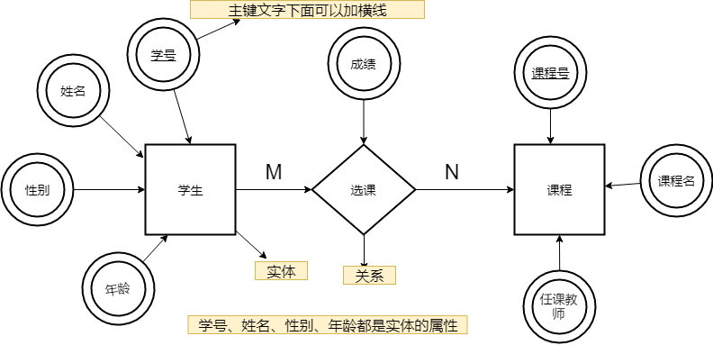

我们试着将上面的 ER 图转换成数据库实际的关系模型(实际设计中，我们通常会将任课教师也作为一个实体来处理)：


### 数据库范式

**1NF(第一范式)**
属性（对应于表中的字段）不能再被分割，也就是这个字段只能是一个值，不能再分为多个其他的字段了。1NF 是所有关系型数据库的最基本要求 ，也就是说关系型数据库中创建的表一定满足第一范式。


**2NF(第二范式)**

2NF 在 1NF 的基础之上，消除了非主属性对于码的部分函数依赖。如下图所示，展示了第一范式到第二范式的过渡。第二范式在第一范式的基础上增加了一个列，这个列称为主键，非主属性都依赖于主键。


一些重要的概念：

* **函数依赖**（functional dependency） ：若在一张表中，在属性（或属性组）X 的值确定的情况下，必定能确定属性 Y 的值，那么就可以说 Y 函数依赖于 X，写作 X → Y。
* **部分函数依赖**（partial functional dependency） ：如果 X→Y，并且存在 X 的一个真子集 X0，使得 X0→Y，则称 Y 对 X 部分函数依赖。比如学生基本信息表 R 中（学号，身份证号，姓名）当然学号属性取值是唯一的，在 R 关系中，（学号，身份证号）->（姓名），（学号）->（姓名），（身份证号）->（姓名）；所以姓名部分函数依赖与（学号，身份证号）；
* **完全函数依赖**(Full functional dependency) ：在一个关系中，若某个非主属性数据项依赖于全部关键字称之为完全函数依赖。比如学生基本信息表 R（学号，班级，姓名）假设不同的班级学号有相同的，班级内学号不能相同，在 R 关系中，（学号，班级）->（姓名），但是（学号）->(姓名)不成立，（班级）->(姓名)不成立，所以姓名完全函数依赖与（学号，班级）；
* **传递函数依赖** ： 在关系模式 R(U)中，设 X，Y，Z 是 U 的不同的属性子集，如果 X 确定 Y、Y 确定 Z，且有 X 不包含 Y，Y 不确定 X，（X∪Y）∩Z=空集合，则称 Z 传递函数依赖(transitive functional dependency) 于 X。传递函数依赖会导致数据冗余和异常。传递函数依赖的 Y 和 Z 子集往往同属于某一个事物，因此可将其合并放到一个表中。比如在关系 R(学号 , 姓名, 系名，系主任)中，学号 → 系名，系名 → 系主任，所以存在非主属性系主任对于学号的传递函数依赖。


**3NF(第三范式)**

3NF 在 2NF 的基础之上，消除了非主属性对于码的传递函数依赖 。符合 3NF 要求的数据库设计，基本上解决了数据冗余过大，插入异常，修改异常，删除异常的问题。比如在关系 R(学号 , 姓名, 系名，系主任)中，学号 → 系名，系名 → 系主任，所以存在非主属性系主任对于学号的传递函数依赖，所以该表的设计，不符合 3NF 的要求。

**总结**

* 1NF：属性不可再分。
* 2NF：1NF 的基础之上，消除了非主属性对于码的部分函数依赖。
* 3NF：3NF 在 2NF 的基础之上，消除了非主属性对于码的传递函数依赖 。


### 存储过程

我们可以把存储过程看成是一些 SQL 语句的集合，中间加了点逻辑控制语句。存储过程在业务比较复杂的时候是非常实用的，比如很多时候我们完成一个操作可能需要写一大串SQL语句，这时候我们就可以写有一个存储过程，这样也方便了我们下一次的调用。存储过程一旦调试完成通过后就能稳定运行，另外，使用存储过程比单纯 SQL 语句执行要快，因为存储过程是预编译过的。

存储过程在互联网公司应用不多，因为存储过程难以调试和扩展，而且没有移植性，还会消耗数据库资源。

阿里巴巴 Java 开发手册里要求禁止使用存储过程。

### 数据库设计通常步骤

1. 需求分析 : 分析用户的需求，包括数据、功能和性能需求。
2. 概念结构设计 : 主要采用 E-R 模型进行设计，包括画 E-R 图。
3. 逻辑结构设计 : 通过将 E-R 图转换成表，实现从 E-R 模型到关系模型的转换。
4. 物理结构设计 : 主要是为所设计的数据库选择合适的存储结构和存取路径。
5. 数据库实施 : 包括编程、测试和试运行
6. 数据库的运行和维护 : 系统的运行与数据库的日常维护。

### 字符集

MySQL 字符编码集中有两套 UTF-8 编码实现：

* **utf8** ： utf8编码只支持1-3个字节 。 在utf8编码中，中文是占3个字节，其他数字、英文、符号占一个字节。但emoji符号占4个字节，一些较复杂的文字、繁体字也是4个字节。
* **utf8mb4** ： UTF-8 的完整实现，正版！最多支持使用 4 个字节表示字符，因此，可以用来存储 emoji 符号。


因此，如果你需要存储emoji类型的数据或者一些比较复杂的文字、繁体字到 MySQL 数据库的话，数据库的编码一定要指定为utf8mb4 而不是utf8 ，要不然存储的时候就会报错了。


# MySQL

## MySQL 基础架构

从下图你可以很清晰的看到客户端的一条 SQL 语句在 MySQL 内部是如何执行的：


从上图可以看出， MySQL 主要由下面几部分构成：

* 连接器： 身份认证和权限相关(登录 MySQL 的时候)。
* 查询缓存： 执行查询语句的时候，会先查询缓存（MySQL 8.0 版本后移除，因为这个功能不太实用）。
* 分析器： 没有命中缓存的话，SQL语句就会经过分析器，分析器说白了就是要先看你的SQL语句要干嘛，再检查你的SQL语句语法是否正确。
* 优化器： 按照MySQL认为最优的方案去执行。
* 执行器： 执行语句，然后从存储引擎返回数据。 执行语句之前会先判断是否有权限，如果没有权限的话，就会报错。
* 插件式存储引擎 ： 主要负责数据的存储和读取，采用的是插件式架构，支持 InnoDB、MyISAM、Memory 等多种存储引擎。


## MySQL 存储引擎

### MySQL 支持哪些存储引擎？默认使用哪个？

MySQL 支持多种存储引擎，你可以通过 `show engines` 命令来查看 MySQL 支持的所有存储引擎。
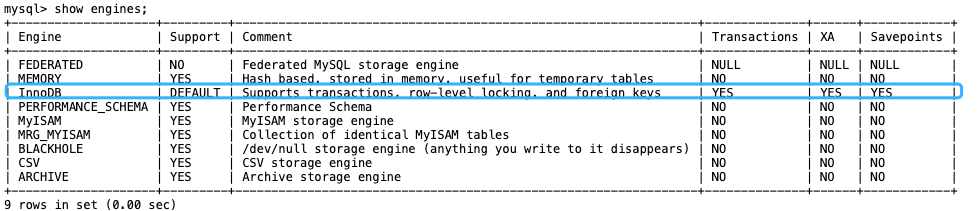

从上图我们可以查看出， MySQL 当前默认的存储引擎是 InnoDB。并且，所有的存储引擎中只有 InnoDB 是事务性存储引擎，也就是说只有 InnoDB 支持事务。
MySQL 5.5.5 之前，MyISAM 是 MySQL 的默认存储引擎。5.5.5 版本之后，InnoDB 是 MySQL 的默认存储引擎。

你也可以通过 `show variables like '%storage_engine%'` 命令直接查看 MySQL 当前默认的存储引擎。
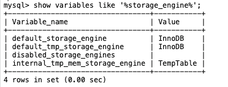

如果你只想查看数据库中某个表使用的存储引擎的话，可以使用 `show table status from db_name where name='table_name'`命令。
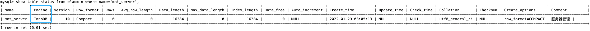


### MySQL 存储引擎架构

MySQL 存储引擎采用的是插件式架构，支持多种存储引擎，我们甚至可以为不同的数据库表设置不同的存储引擎以适应不同场景的需要。**存储引擎是基于表的，而不是数据库**。并且，你还可以根据 MySQL 定义的存储引擎实现标准接口来编写一个属于自己的存储引擎。


### MyISAM 和 InnoDB 的区别

虽然，MyISAM 的性能还行，各种特性也还不错（比如全文索引、压缩、空间函数等）。但是，MyISAM不支持事务和行级锁，而且最大的缺陷就是崩溃后无法安全恢复。
具体对比如下：

1. **是否支持行级锁**
   MyISAM 只有表级锁(table-level locking)，而 InnoDB 支持行级锁(row-level locking)和表级锁,默认为行级锁。
2. **是否支持事务**
MyISAM 不提供事务支持。InnoDB 提供事务支持，实现了SQL标准定义了四个隔离级别，具有提交(commit)和回滚(rollback)事务的能力。并且，InnoDB 默认使用的 REPEATABLE-READ（可重读）隔离级别是可以解决幻读问题发生的（基于 MVCC 和 Next-Key Lock）。
3. **是否支持数据库异常崩溃后的安全恢复**
MyISAM 不支持，而 InnoDB 支持。使用 InnoDB 的数据库在异常崩溃后，数据库重新启动的时候会保证数据库恢复到崩溃前的状态。这个恢复的过程依赖于 redo log 。
4. **是否支持外键**
   MyISAM 不支持，而 InnoDB 支持。外键对于维护数据一致性非常有帮助，但是对性能有一定的损耗。因此，通常情况下，我们是不建议在实际生产项目中使用外键的，在业务代码中进行约束即可！
5. **是否支持 MVCC**
MyISAM 不支持，而 InnoDB 支持。讲真，这个对比有点废话，毕竟 MyISAM 连行级锁都不支持。MVCC 可以看作是行级锁的一个升级，可以有效减少加锁操作，提高性能。
6. **索引实现不一样**
虽然 MyISAM 引擎和 InnoDB 引擎都是使用 B+Tree 作为索引结构，但是两者的实现方式不太一样。InnoDB 引擎中，其数据文件本身就是索引文件。相比 MyISAM，索引文件和数据文件是分离的，其表数据文件本身就是按 B+Tree 组织的一个索引结构，树的叶节点 data 域保存了完整的数据记录。


## MySQL 事务


大多数情况下，我们在谈论事务的时候，如果没有特指分布式事务，往往指的就是数据库事务。

简单来说，数据库事务可以保证多个对数据库的操作（也就是 SQL 语句）构成一个逻辑上的整体。构成这个逻辑上的整体的这些数据库操作遵循：要么全部执行成功,要么全部不执行 。
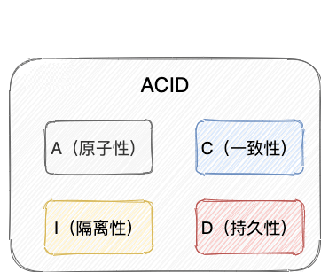

**只有保证了事务的持久性、原子性、隔离性之后，一致性才能得到保障。也就是说 A、I、D 是手段，C 是目的！**


### 并发事务带来的问题

在典型的应用程序中，多个事务并发运行，经常会操作相同的数据来完成各自的任务（多个用户对同一数据进行操作）。并发虽然是必须的，但可能会导致以下的问题：

* **脏读（Dirty read）**: 当一个事务正在访问数据并且对数据进行了修改，而这种修改还没有提交到数据库中，这时另外一个事务也访问了这个数据，然后使用了这个数据。因为这个数据是还没有提交的数据，那么另外一个事务读到的这个数据是“脏数据”，依据“脏数据”所做的操作可能是不正确的。
* **丢失修改（Lost to modify）**: 指在一个事务读取一个数据时，另外一个事务也访问了该数据，那么在第一个事务中修改了这个数据后，第二个事务也修改了这个数据。这样第一个事务内的修改结果就被丢失，因此称为丢失修改。 例如：事务 1 读取某表中的数据 A=20，事务 2 也读取 A=20，事务 1 修改 A=A-1，事务 2 也修改 A=A-1，最终结果 A=19，事务 1 的修改被丢失。
* **不可重复读（Unrepeatable read）**: 指在一个事务内多次读同一数据。在这个事务还没有结束时，另一个事务也访问该数据。那么，在第一个事务中的两次读数据之间，由于第二个事务的修改导致第一个事务两次读取的数据可能不太一样。这就发生了在一个事务内两次读到的数据是不一样的情况，因此称为不可重复读。
* **幻读（Phantom read）**: 幻读与不可重复读类似。它发生在一个事务（T1）读取了几行数据，接着另一个并发事务（T2）插入了一些数据时。在随后的查询中，第一个事务（T1）就会发现多了一些原本不存在的记录，就好像发生了幻觉一样，所以称为幻读。


不可重复读和幻读的区别：

* 不可重复读的重点是内容修改或者记录减少比如多次读取一条记录发现其中某些记录的值被修改；
* 幻读的重点在于记录新增比如多次执行同一条查询语句（DQL）时，发现查到的记录增加了。

幻读其实可以看作是不可重复读的一种特殊情况，单独把区分幻读的原因主要是解决幻读和不可重复读的方案不一样。举个例子：执行delete和update操作的时候，可以直接对记录加锁，保证事务安全。而执行insert操作的时候，由于记录锁（Record Lock）只能锁住已经存在的记录，为了避免插入新记录，需要依赖间隙锁（Gap Lock）。也就是说执行insert操作的时候需要依赖 Next-Key Lock（Record Lock+Gap Lock） 进行加锁来保证不出现幻读。


### SQL 标准定义的事务隔离级别

SQL 标准定义了四个隔离级别：

* **READ-UNCOMMITTED(读取未提交)** ： 最低的隔离级别，允许读取尚未提交的数据变更，可能会导致脏读、幻读或不可重复读。
* **READ-COMMITTED(读取已提交)** ： 允许读取并发事务已经提交的数据，可以阻止脏读，但是幻读或不可重复读仍有可能发生。
* **REPEATABLE-READ(可重复读)** ： 对同一字段的多次读取结果都是一致的，除非数据是被本身事务自己所修改，可以阻止脏读和不可重复读，但幻读仍有可能发生。
* **SERIALIZABLE(可串行化)** ： 最高的隔离级别，完全服从 ACID 的隔离级别。所有的事务依次逐个执行，这样事务之间就完全不可能产生干扰，也就是说，该级别可以防止脏读、不可重复读以及幻读。


#### MySQL 的隔离级别的实现方式

MySQL 的隔离级别基于锁和 MVCC 机制共同实现的。
**SERIALIZABLE 隔离级别，是通过锁来实现的。除了 SERIALIZABLE 隔离级别，其他的隔离级别都是基于 MVCC 实现。** 不过， SERIALIZABLE 之外的其他隔离级别可能也需要用到锁机制，就比如 REPEATABLE-READ 在当前读情况下需要使用加锁读来保证不会出现幻读。

MySQL InnoDB存储引擎的默认支持的隔离级别是 **REPEATABLE-READ（可重读）**。我们可以通过SELECT @@tx_isolation;命令来查看，MySQL 8.0 该命令改为SELECT @@transaction_isolation;

## MySQL 锁

MyISAM 仅仅支持表级锁(table-level locking)，一锁就锁整张表，这在并发写的情况下性非常差。InnoDB 不光支持表级锁(table-level locking)，还支持行级锁(row-level locking)，默认为行级锁。行级锁的粒度更小，仅对相关的记录上锁即可（对一行或者多行记录加锁），所以对于并发写入操作来说， InnoDB 的性能更高。

表级锁和行级锁对比 ：

* **表级锁**： MySQL 中锁定粒度最大的一种锁，是针对非索引字段加的锁，对当前操作的整张表加锁，实现简单，资源消耗也比较少，加锁快，不会出现死锁。其锁定粒度最大，触发锁冲突的概率最高，并发度最低，MyISAM 和 InnoDB 引擎都支持表级锁。
* **行级锁**： MySQL 中锁定粒度最小的一种锁，是针对索引字段加的锁，只针对当前操作的行记录进行加锁。 行级锁能大大减少数据库操作的冲突。其加锁粒度最小，并发度高，但加锁的开销也最大，加锁慢，会出现死锁。


### 行级锁的使用的注意事项

InnoDB 的行锁是针对索引字段加的锁，表级锁是针对非索引字段加的锁。当我们执行 UPDATE、DELETE 语句时，如果 WHERE条件中字段没有命中唯一索引或者索引失效的话，就会导致扫描全表对表中的所有行记录进行加锁。这个在我们日常工作开发中经常会遇到，一定要多多注意！！！不过，很多时候即使用了索引也有可能会走全表扫描，这是因为 MySQL 优化器的原因。

### 共享锁和排他锁

不论是表级锁还是行级锁，都存在共享锁（Share Lock，S 锁）和排他锁（Exclusive Lock，X 锁）这两类：

* **共享锁（S 锁）** ：又称读锁，事务在读取记录的时候获取共享锁，允许多个事务同时获取（锁兼容）。
* **排他锁（X 锁）** ：又称写锁/独占锁，事务在修改记录的时候获取排他锁，不允许多个事务同时获取。如果一个记录已经被加了排他锁，那其他事务不能再对这条事务加任何类型的锁（锁不兼容）。


由于MVCC的存在，对于一般的 SELECT 语句，InnoDB 不会加任何锁。不过， 你可以通过以下语句显式加共享锁或排他锁：
```
# 共享锁
SELECT ... LOCK IN SHARE MODE;
# 排他锁
SELECT ... FOR UPDATE;
```

### 意向锁

如果需要用到表锁的话，如何判断表中的记录没有行锁呢？一行一行遍历肯定是不行，性能太差。我们需要用到一个叫做意向锁的东东来快速判断是否可以对某个表使用表锁。

意向锁是表级锁，共有两种：

* **意向共享锁（Intention Shared Lock，IS 锁）**：事务有意向对表中的某些记录加共享锁（S 锁），加共享锁前必须先取得该表的 IS 锁。
* **意向排他锁（Intention Exclusive Lock，IX 锁）**：事务有意向对表中的某些记录加排他锁（X 锁），加排他锁之前必须先取得该表的 IX 锁。

意向锁是有数据引擎自己维护的，用户无法手动操作意向锁，在为数据行加共享 / 排他锁之前，InooDB 会先获取该数据行所在在数据表的对应意向锁。

意向锁之间是互相兼容的。

|      | IS锁 | IX锁 |
| ---- | ---- | ---- |
| IS锁 | 兼容 | 兼容 |
| IX锁 | 兼容 | 兼容 |

意向锁和共享锁和排它锁互斥（这里指的是表级别的共享锁和排他锁，意向锁不会与行级的共享锁和排他锁互斥）。
|      | IS锁 | IX锁 |
| ---- | ---- | ---- |
| S锁  | 兼容 | 互斥 |
| X锁  | 互斥 | 互斥 |

### InnoDB 支持的行锁

MySQL InnoDB 支持三种行锁定方式：

* **记录锁（Record Lock）** ：也被称为记录锁，属于单个行记录上的锁。
* **间隙锁（Gap Lock）** ：锁定一个范围，不包括记录本身。
* **临键锁（Next-key Lock）** ：Record Lock+Gap Lock，锁定一个范围，包含记录本身。记录锁只能锁住已经存在的记录，为了避免插入新记录，需要依赖间隙锁。

InnoDB 的默认隔离级别 RR（可重读）是可以解决幻读问题发生的，主要有下面两种情况：

* **快照读（一致性非锁定读）** ：由 MVCC 机制来保证不出现幻读。
* **当前读 （一致性锁定读）**： 使用 Next-Key Lock 进行加锁来保证不出现幻读。


#### 当前读和快照读的区别

快照读（一致性非锁定读）就是单纯的 SELECT 语句，但不包括下面这两类 SELECT 语句：
```
SELECT ... FOR UPDATE
SELECT ... LOCK IN SHARE MODE
```

快照即记录的历史版本，每行记录可能存在多个历史版本（多版本技术）。快照读的情况下，如果读取的记录正在执行 UPDATE/DELETE 操作，读取操作不会因此去等待记录上X锁的释放，而是会去读取行的一个快照。
只有在事务隔离级别 RC(读取已提交) 和 RR（可重读）下，InnoDB 才会使用一致性非锁定读：

* 在 RC 级别下，对于快照数据，一致性非锁定读总是读取被锁定行的最新一份快照数据。
* 在 RR 级别下，对于快照数据，一致性非锁定读总是读取本事务开始时的行数据版本。


快照读比较适合对于数据一致性要求不是特别高且追求极致性能的业务场景。**当前读 （一致性锁定读）就是给行记录加 X 锁或 S 锁**。

当前读的一些常见 SQL 语句类型如下：
```
# 对读的记录加一个X锁
SELECT...FOR UPDATE
# 对读的记录加一个S锁
SELECT...LOCK IN SHARE MODE
# 对修改的记录加一个X锁
INSERT...
UPDATE...
DELETE...
```

## MySQL索引详解

**索引是一种用于快速查询和检索数据的数据结构。常见的索引结构有: B 树， B+树和 Hash。**

### 索引的优缺点

**优点 ：**

* 使用索引可以大大加快 数据的检索速度（大大减少检索的数据量）, 这也是创建索引的最主要的原因。
* 通过创建唯一性索引，可以保证数据库表中每一行数据的唯一性。

**缺点 ：**

* 创建索引和维护索引需要耗费许多时间。当对表中的数据进行增删改的时候，如果数据有索引，那么索引也需要动态的修改，会降低 SQL 执行效率。
* 索引需要使用物理文件存储，也会耗费一定空间。

但是，**使用索引一定能提高查询性能吗?** 大多数情况下，索引查询都是比全表扫描要快的。但是如果数据库的数据量不大，那么使用索引也不一定能够带来很大提升。

### 索引的底层数据结构

#### Hash表

哈希表是键值对的集合，通过键(key)即可快速取出对应的值(value)，因此哈希表可以快速检索数据（接近 O（1））。
为何能够通过 key 快速取出 value呢？ 原因在于**哈希算法**（也叫散列算法）。通过哈希算法，我们可以快速找到 key 对应的 index，找到了 index 也就找到了对应的 value。
```
hash = hashfunc(key)
index = hash % array_size
```


但是！哈希算法有个**Hash冲突 问题**，也就是说多个不同的key最后得到的 index 相同。通常情况下，我们常用的解决办法是**链地址法**。链地址法就是将哈希冲突数据存放在链表中。就比如 JDK1.8 之前 HashMap 就是通过链地址法来解决哈希冲突的。不过，JDK1.8 以后HashMap为了减少链表过长的时候搜索时间过长引入了红黑树。


为了减少Hash冲突的发生，一个好的哈希函数应该“均匀地”将数据分布在整个可能的哈希值集合中。既然哈希表这么快，为什么MySQL 没有使用其作为索引的数据结构呢？

1. **Hash冲突问题** ：我们上面也提到过Hash 冲突了，不过对于数据库来说这还不算最大的缺点。
2. **Hash索引不支持顺序和范围查询**(Hash 索引不支持顺序和范围查询是它最大的缺点： 假如我们要对表中的数据进行排序或者进行范围查询，那 Hash 索引可就不行了。

试想一种情况:
```
SELECT * FROM tb1 WHERE id < 500;
```
在这种范围查询中，优势非常大，直接遍历比 500 小的叶子节点就够了。而 Hash 索引是根据 hash 算法来定位的，难不成还要把 1 - 499 的数据，每个都进行一次 hash 计算来定位吗?这就是 Hash 最大的缺点了。

#### B 树& B+树

B 树也称 B-树,全称为多路平衡查找树，B+ 树是 B 树的一种变体。B 树和 B+树中的 B 是 Balanced（平衡）的意思。目前大部分数据库系统及文件系统都采用 B-Tree 或其变种 B+Tree 作为索引结构。

**B 树& B+树两者有何异同呢？**

* B树的所有节点既存放键(key) 也存放 数据(data)，而 B+树只有叶子节点存放 key 和 data，其他内节点只存放 key。
* B树的叶子节点都是独立的;B+树的叶子节点有一条引用链指向与它相邻的叶子节点。
* B树的检索的过程相当于对范围内的每个节点的关键字做二分查找，可能还没有到达叶子节点，检索就结束了。而 B+树的检索效率就很稳定了，任何查找都是从根节点到叶子节点的过程，叶子节点的顺序检索很明显。

在 MySQL 中，MyISAM 引擎和 InnoDB 引擎都是使用 B+Tree 作为索引结构，但是，两者的实现方式不太一样。（下面的内容整理自《Java 工程师修炼之道》）

MyISAM 引擎中，B+Tree叶节点的data域存放的是数据记录的地址。在索引检索的时候，首先按照 B+Tree 搜索算法搜索索引，如果指定的Key存在，则取出其 data域的值，然后以data域的值为地址读取相应的数据记录。这被称为“非聚簇索引”。

InnoDB 引擎中，其数据文件本身就是索引文件。相比 MyISAM，索引文件和数据文件是分离的，其表数据文件本身就是按 B+Tree 组织的一个索引结构，树的叶节点 data 域保存了完整的数据记录。这个索引的 key 是数据表的主键，因此 InnoDB 表数据文件本身就是主索引。这被称为“聚簇索引（或聚集索引）”，而其余的索引都作为辅助索引，辅助索引的 data 域存储相应记录主键的值而不是地址，这也是和 MyISAM 不同的地方。在根据主索引搜索时，直接找到 key 所在的节点即可取出数据；在根据辅助索引查找时，则需要先取出主键的值，再走一遍主索引。 因此，在设计表的时候，不建议使用过长的字段作为主键，也不建议使用非单调的字段作为主键，这样会造成主索引频繁分裂。

### 索引类型

#### 主键索引(Primary Key)

数据表的主键列使用的就是主键索引。一张数据表有只能有一个主键，并且主键不能为 null，不能重复。
在 MySQL 的 InnoDB 的表中，当没有显示的指定表的主键时，InnoDB 会自动先检查表中是否有唯一索引且不允许存在null值的字段，如果有，则选择该字段为默认的主键，否则 InnoDB 将会自动创建一个 6Byte 的自增主键。
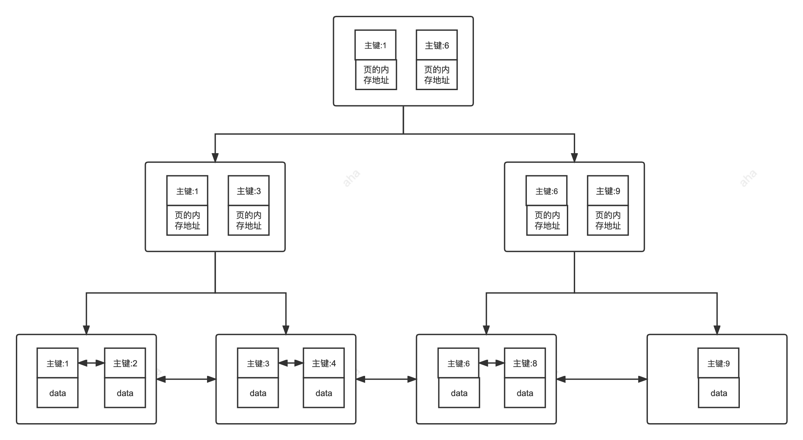

#### 二级索引(辅助索引)

二级索引又称为辅助索引，是因为二级索引的叶子节点存储的数据是主键。也就是说，通过二级索引，可以定位主键的位置。唯一索引，普通索引，前缀索引等索引属于二级索引。

* **唯一索引(Unique Key)** ：唯一索引也是一种约束。唯一索引的属性列不能出现重复的数据，但是允许数据为 NULL，一张表允许创建多个唯一索引。 建立唯一索引的目的大部分时候都是为了该属性列的数据的唯一性，而不是为了查询效率。
* **普通索引(Index)** ：普通索引的唯一作用就是为了快速查询数据，一张表允许创建多个普通索引，并允许数据重复和 NULL。
* **前缀索引(Prefix)** ：前缀索引只适用于字符串类型的数据。前缀索引是对文本的前几个字符创建索引，相比普通索引建立的数据更小， 因为只取前几个字符。
* **全文索引(Full Text)** ：全文索引主要是为了检索大文本数据中的关键字的信息，是目前搜索引擎数据库使用的一种技术。Mysql5.6 之前只有 MYISAM 引擎支持全文索引，5.6 之后 InnoDB 也支持了全文索引。


### 聚集索引与非聚集索引

#### 聚集索引

聚集索引即索引结构和数据一起存放的索引。主键索引属于聚集索引。
在 MySQL 中，InnoDB 引擎的表的 .ibd文件就包含了该表的索引和数据，对于InnoDB引擎表来说，该表的索引(B+树)的每个非叶子节点存储索引，叶子节点存储索引和索引对应的数据。

**优点：** 聚集索引的查询速度非常的快，因为整个 B+树本身就是一颗多叉平衡树，叶子节点也都是有序的，定位到索引的节点，就相当于定位到了数据。
**缺点：**

1. 依赖于有序的数据 ：因为 B+树是多路平衡树，如果索引的数据不是有序的，那么就需要在插入时排序，如果数据是整型还好，否则类似于字符串或 UUID 这种又长又难比较的数据，插入或查找的速度肯定比较慢。
2. 更新代价大 ： 如果对索引列的数据被修改时，那么对应的索引也将会被修改，而且聚集索引的叶子节点还存放着数据，修改代价肯定是较大的，所以对于主键索引来说，主键一般都是不可被修改的。

#### 非聚集索引

非聚集索引即索引结构和数据分开存放的索引。

二级索引属于非聚集索引。非聚集索引的叶子节点并不一定存放数据的指针，因为二级索引的叶子节点就存放的是主键，根据主键再回表查数据。
**优点：** 更新代价比聚集索引要小 。非聚集索引的更新代价就没有聚集索引那么大了，非聚集索引的叶子节点是不存放数据的

**缺点**：

1. 跟聚集索引一样，非聚集索引也依赖于有序的数据
2. 可能会二次查询(回表) :这应该是非聚集索引最大的缺点了。 当查到索引对应的指针或主键后，可能还需要根据指针或主键再到数据文件或表中查询。

这是 MySQL 的表的文件截图:
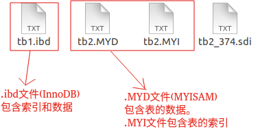

聚集索引和非聚集索引:
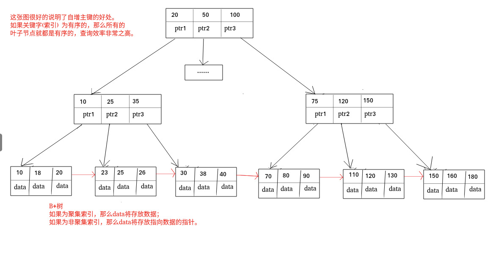

#### 非聚集索引一定回表查询吗

非聚集索引不一定回表查询。

试想一种情况，用户准备使用SQL查询用户名，而用户名字段正好建立了索引。
```
试想一种情况，用户准备使用 SQL 查询用户名，而用户名字段正好建立了索引。
```
那么这个索引的 key 本身就是 name，查到对应的 name 直接返回就行了，无需回表查询。

**即使是 MYISAM 也是这样，虽然 MYISAM 的主键索引确实需要回表， 因为它的主键索引的叶子节点存放的是指针。但是如果 SQL 查的就是主键呢?**
主键索引本身的 key 就是主键，查到返回就行了。这种情况就称之为覆盖索引了。

### 覆盖索引

如果一个索引包含（或者说覆盖）所有需要查询的字段的值，我们就称之为“覆盖索引”。我们知道在 InnoDB 存储引擎中，如果不是主键索引，叶子节点存储的是主键+列值。最终还是要“回表”，也就是要通过主键再查找一次。这样就会比较慢覆盖索引就是把要查询出的列和索引是对应的，不做回表操作！

**覆盖索引即需要查询的字段正好是索引的字段，那么直接根据该索引，就可以查到数据了，而无需回表查询。**
>如主键索引，如果一条 SQL 需要查询主键，那么正好根据主键索引就可以查到主键。再如普通索引，如果一条 SQL 需要查询 name，name 字段正好有索引， 那么直接根据这个索引就可以查到数据，也无需回表。

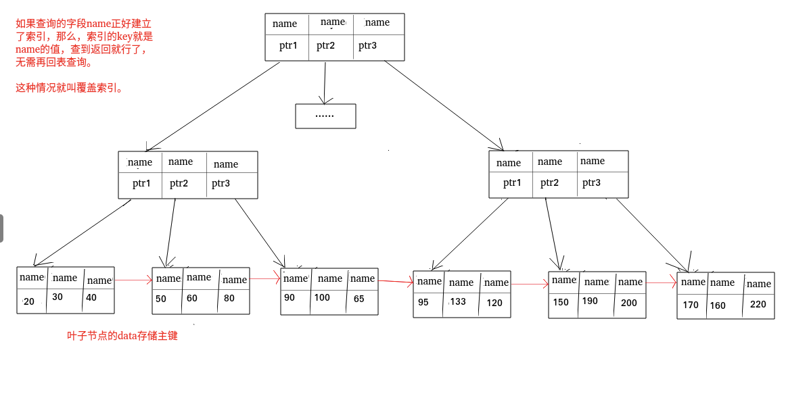

### 联合索引

使用表中的多个字段创建索引，就是 联合索引，也叫 组合索引 或 复合索引。

### 最左前缀匹配原则

最左前缀匹配原则指的是，在使用联合索引时，MySQL 会根据联合索引中的字段顺序，从左到右依次到查询条件中去匹配，如果查询条件中存在与联合索引中最左侧字段相匹配的字段，则就会使用该字段过滤一批数据，直至联合索引中全部字段匹配完成，或者在执行过程中遇到范围查询，如 >、<、between 和 以%开头的like查询 等条件，才会停止匹配。
**所以，我们在使用联合索引时，可以将区分度高的字段放在最左边，这也可以过滤更多数据。**

### 索引下推

索引下推是 MySQL 5.6版本中提供的一项索引优化功能，可以在非聚簇索引遍历过程中，对索引中包含的字段先做判断，过滤掉不符合条件的记录，减少回表次数。

### 创建索引的注意事项

1. 选择合适的字段创建索引

    * **不为 NULL 的字段** ：索引字段的数据应该尽量不为 NULL，因为对于数据为 NULL 的字段，数据库较难优化。如果字段频繁被查询，但又避免不了为 NULL，建议使用 0,1,true,false 这样语义较为清晰的短值或短字符作为替代。
    * **被频繁查询的字段** ：我们创建索引的字段应该是查询操作非常频繁的字段。
    * **被作为条件查询的字段** ：被作为 WHERE 条件查询的字段，应该被考虑建立索引。
    * **频繁需要排序的字段** ：索引已经排序，这样查询可以利用索引的排序，加快排序查询时间。
    * **被经常频繁用于连接的字段** ：经常用于连接的字段可能是一些外键列，对于外键列并不一定要建立外键，只是说该列涉及到表与表的关系。对于频繁被连接查询的字段，可以考虑建立索引，提高多表连接查询的效率。

2. 被频繁更新的字段应该慎重建立索引，虽然索引能带来查询上的效率，但是维护索引的成本也是不小的。 如果一个字段不被经常查询，反而被经常修改，那么就更不应该在这种字段上建立索引了。
3. 尽可能的考虑建立联合索引而不是单列索引，因为索引是需要占用磁盘空间的，可以简单理解为每个索引都对应着一颗 B+树。如果一个表的字段过多，索引过多，那么当这个表的数据达到一个体量后，索引占用的空间也是很多的，且修改索引时，耗费的时间也是较多的。如果是联合索引，多个字段在一个索引上，那么将会节约很大磁盘空间，且修改数据的操作效率也会提升。
4. 注意避免冗余索引，冗余索引指的是索引的功能相同，能够命中索引(a, b)就肯定能命中索引(a) ，那么索引(a)就是冗余索引。如（name,city ）和（name ）这两个索引就是冗余索引，能够命中前者的查询肯定是能够命中后者的 在大多数情况下，都应该尽量扩展已有的索引而不是创建新索引。
5. 考虑在字符串类型的字段上使用前缀索引代替普通索引。前缀索引仅限于字符串类型，较普通索引会占用更小的空间，所以可以考虑使用前缀索引带替普通索引。


### 使用索引的一些建议

* 对于中到大型表索引都是非常有效的，但是特大型表的话维护开销会很大，不适合建索引
* 避免 where 子句中对字段施加函数，这会造成无法命中索引。
* 在使用 InnoDB 时使用与业务无关的自增主键作为主键，即使用逻辑主键，而不要使用业务主键。
* 删除长期未使用的索引，不用的索引的存在会造成不必要的性能损耗 MySQL 5.7 可以通过查询 sys 库的 schema_unused_indexes 视图来查询哪些索引从未被使用
* 在使用 limit offset 查询缓慢时，可以借助索引来提高性能


## MySQL三大日志(binlog、redo log和undo log)详解

MySQL日志主要包括错误日志、查询日志、慢查询日志、事务日志、二进制日志几大类。其中，比较重要的还要属二进制日志binlog（归档日志）和事务日志 redo log（重做日志）和 undo log（回滚日志）。
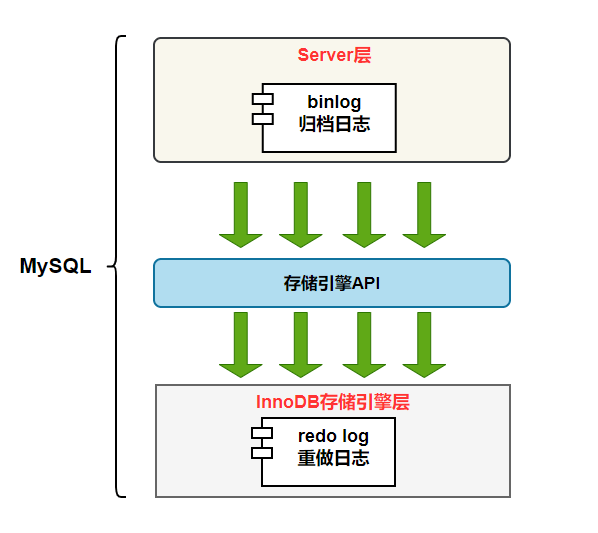

### redo log

redo log（重做日志）是InnoDB存储引擎独有的，它让MySQL拥有了崩溃恢复能力。比如MySQL实例挂了或宕机了，重启时，InnoDB存储引擎会使用redo log恢复数据，保证数据的持久性与完整性。
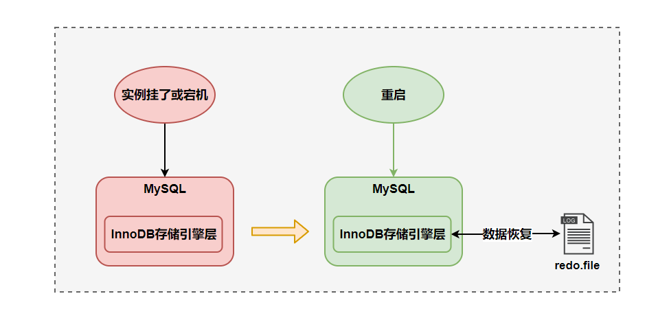

MySQL 中数据是以页为单位，你查询一条记录，会从硬盘把一页的数据加载出来，加载出来的数据叫数据页，会放入到 Buffer Pool 中。后续的查询都是先从 Buffer Pool 中找，没有命中再去硬盘加载，减少硬盘 IO 开销，提升性能。
更新表数据的时候，也是如此，发现 Buffer Pool 里存在要更新的数据，就直接在Buffer Pool里更新。然后会把“在某个数据页上做了什么修改”记录到重做日志缓存（redo log buffer）里，接着刷盘到 redo log 文件里。
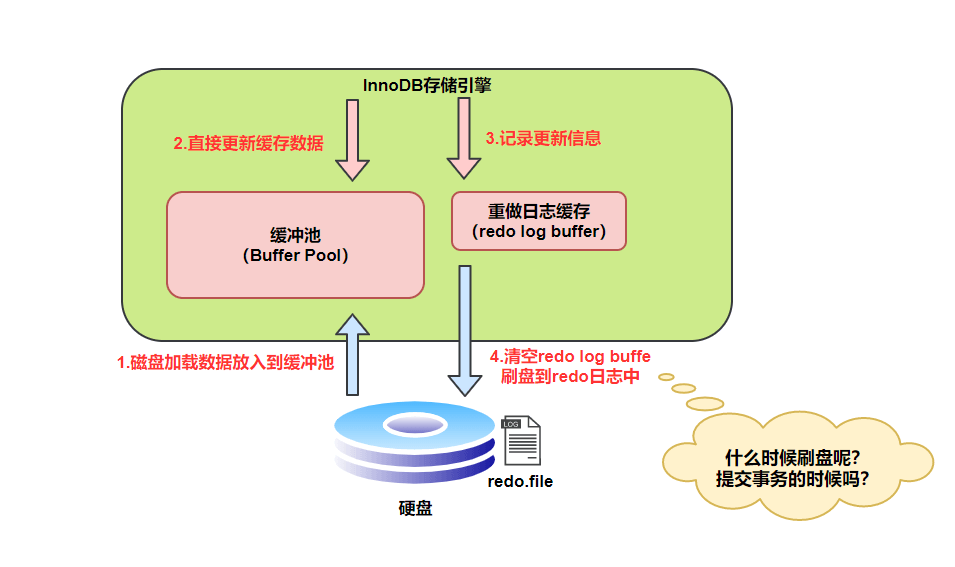

理想情况，事务一提交就会进行刷盘操作，但实际上，刷盘的时机是根据策略来进行的。

>每条 redo 记录由“表空间号+数据页号+偏移量+修改数据长度+具体修改的数据”组成

#### 刷盘时机

InnoDB存储引擎为redo log的刷盘策略提供了 innodb_flush_log_at_trx_commit 参数，它支持三种策略：

* 0 ：设置为 0 的时候，表示每次事务提交时不进行刷盘操作
* 1 ：设置为 1 的时候，表示每次事务提交时都将进行刷盘操作（默认值）
* 2 ：设置为 2 的时候，表示每次事务提交时都只把 redo log buffer 内容写入 page cache

innodb_flush_log_at_trx_commit 参数默认为 1 ，也就是说当事务提交时会调用 fsync 对 redo log 进行刷盘，另外，InnoDB存储引擎有一个后台线程，每隔1 秒，就会把redo log buffer 中的内容写到文件系统缓存（page cache），然后调用 fsync 刷盘。
也就是说，一个没有提交事务的 redo log 记录，也可能会刷盘。因为在事务执行过程 redo log 记录是会写入redo log buffer 中，这些 redo log 记录会被后台线程刷盘。
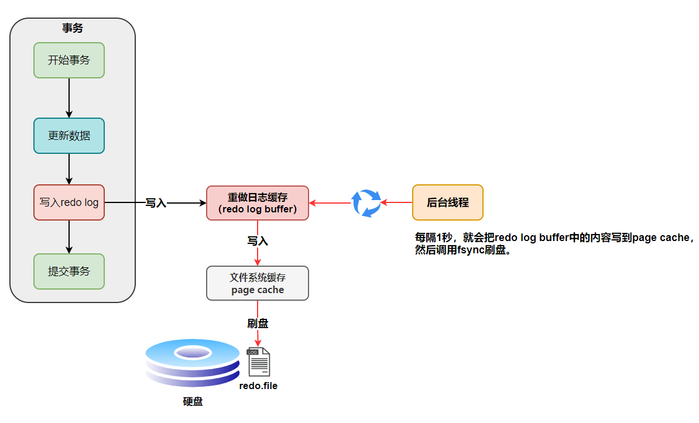

除了后台线程每秒1次的轮询操作，还有一种情况，当 redo log buffer 占用的空间即将达到 innodb_log_buffer_size 一半的时候，后台线程会主动刷盘。下面是不同刷盘策略的流程图。

##### innodb_flush_log_at_trx_commit=0
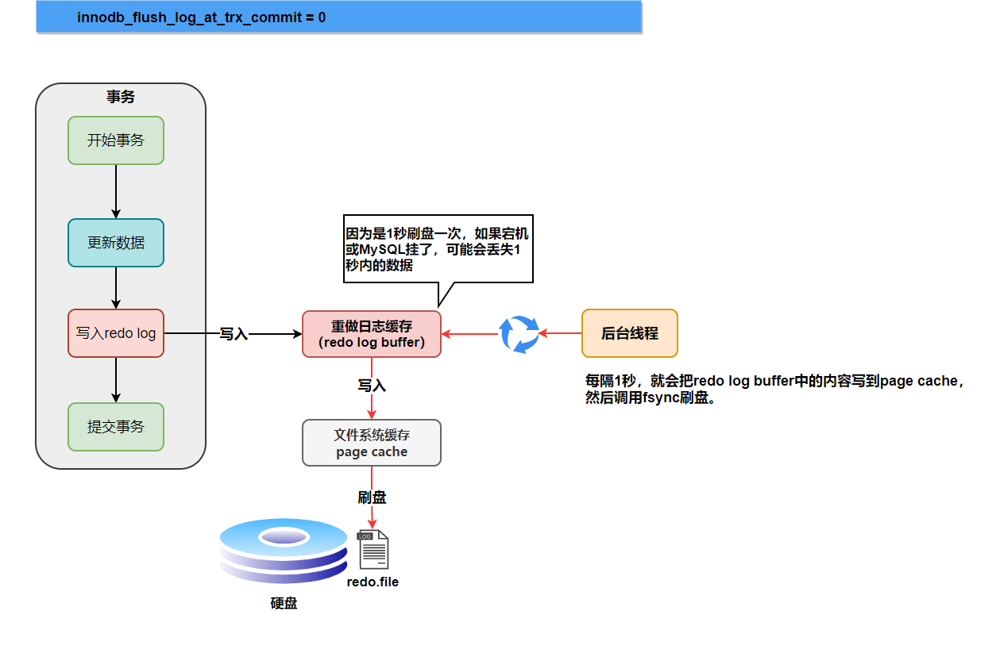

为0时，如果MySQL挂了或宕机可能会有1秒数据的丢失。

##### innodb_flush_log_at_trx_commit=1
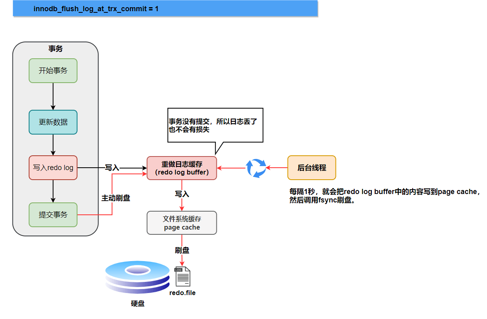

为1时， 只要事务提交成功，redo log记录就一定在硬盘里，不会有任何数据丢失。如果事务执行期间MySQL挂了或宕机，这部分日志丢了，但是事务并没有提交，所以日志丢了也不会有损失。

##### innodb_flush_log_at_trx_commit=2
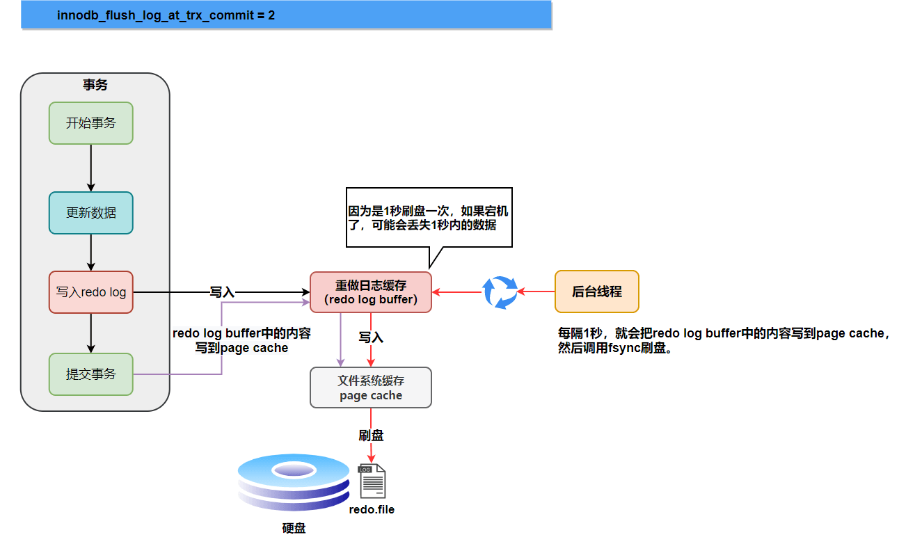

为2时， 只要事务提交成功，redo log buffer中的内容只写入文件系统缓存（page cache）。如果仅仅只是MySQL挂了不会有任何数据丢失，但是宕机可能会有1秒数据的丢失。

#### 日志文件组

硬盘上存储的redo log日志文件不只一个，而是以一个日志文件组的形式出现的，每个的redo日志文件大小都是一样的。比如可以配置为一组4个文件，每个文件的大小是 1GB，整个 redo log 日志文件组可以记录4G的内容。它采用的是环形数组形式，从头开始写，写到末尾又回到头循环写，如下图所示。
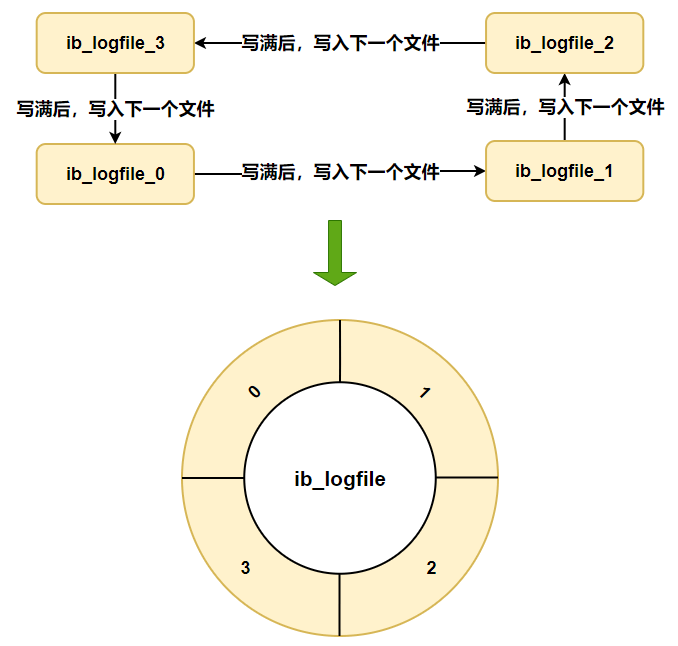

在个日志文件组中还有两个重要的属性，分别是 write pos、checkpoint：

* write pos 是当前记录的位置，一边写一边后移
* checkpoint 是当前要擦除的位置，也是往后推移

每次刷盘 redo log 记录到日志文件组中，write pos 位置就会后移更新。每次 MySQL 加载日志文件组恢复数据时，会清空加载过的 redo log 记录，并把 checkpoint 后移更新。write pos 和 checkpoint 之间的还空着的部分可以用来写入新的 redo log 记录。
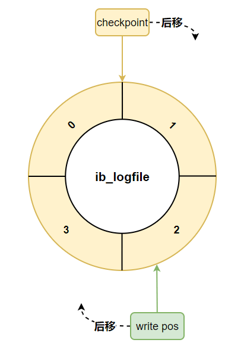

如果 write pos 追上 checkpoint ，表示日志文件组满了，这时候不能再写入新的 redo log 记录，MySQL 得停下来，清空一些记录，把 checkpoint 推进一下。
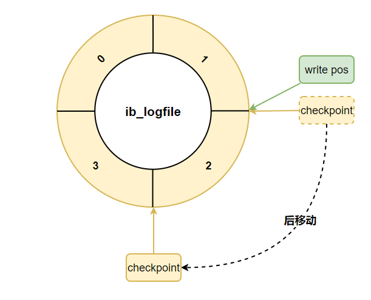

## MySQL 性能优化

### 数据库命令规范

* 所有数据库对象名称必须使用小写字母并用下划线分割
* 所有数据库对象名称禁止使用 MySQL 保留关键字（如果表名中包含关键字查询时，需要将其用单引号括起来）
* 数据库对象的命名要能做到见名识意，并且最后不要超过 32 个字符
* 临时库表必须以 tmp_ 为前缀并以日期为后缀，备份表必须以 bak_ 为前缀并以日期 (时间戳) 为后缀
* 所有存储相同数据的列名和列类型必须一致（一般作为关联列，如果查询时关联列类型不一致会自动进行数据类型隐式转换，会造成列上的索引失效，导致查询效率降低）


### 数据库基本设计规范

#### 所有表必须使用 InnoDB 存储引擎

没有特殊要求（即 InnoDB 无法满足的功能如：列存储，存储空间数据等）的情况下，所有表必须使用 InnoDB 存储引擎（MySQL5.5 之前默认使用 Myisam，5.6 以后默认的为 InnoDB）。InnoDB 支持事务，支持行级锁，更好的恢复性，高并发下性能更好。

#### 数据库和表的字符集统一使用 UTF8

兼容性更好，统一字符集可以避免由于字符集转换产生的乱码，不同的字符集进行比较前需要进行转换会造成索引失效，如果数据库中有存储 emoji 表情的需要，字符集需要采用 utf8mb4 字符集。

#### 所有表和字段都需要添加注释

使用 comment 从句添加表和列的备注，从一开始就进行数据字典的维护

#### 尽量控制单表数据量的大小，建议控制在 500 万以内

500 万并不是 MySQL 数据库的限制，过大会造成修改表结构，备份，恢复都会有很大的问题。
可以用**历史数据归档**（应用于日志数据），分库分表（应用于业务数据）等手段来控制数据量大小。

#### 谨慎使用 MySQL 分区表

分区表在物理上表现为多个文件，在逻辑上表现为一个表；谨慎选择分区键，跨分区查询效率可能更低；建议采用物理分表的方式管理大数据。

#### 经常一起使用的列放到一个表中

避免更多的关联操作。

#### 禁止在表中建立预留字段

* 预留字段的命名很难做到见名识义。
* 预留字段无法确认存储的数据类型，所以无法选择合适的类型。
* 对预留字段类型的修改，会对表进行锁定。

#### 禁止在数据库中存储文件（比如图片）这类大的二进制数据

在数据库中存储文件会严重影响数据库性能，消耗过多存储空间。文件（比如图片）这类大的二进制数据通常存储于文件服务器，数据库只存储文件地址信息。

#### 不要被数据库范式所束缚

一般来说，设计关系数据库时需要满足第三范式，但为了满足第三范式，我们可能会拆分出多张表。而在进行查询时需要对多张表进行关联查询，有时为了提高查询效率，会降低范式的要求，在表中保存一定的冗余信息，也叫做反范式。但要注意反范式一定要适度。


### 数据库字段设计规范

#### 优先选择符合存储需要的最小的数据类型

存储字节越小，占用也就空间越小，性能也越好。

**a.某些字符串可以转换成数字类型存储比如可以将IP地址转换成整形数据。**
数字是连续的，性能更好，占用空间也更小。
可以将 IP 地址转换成整形数据存储，性能更好，占用空间也更小。MySQL 提供了两个方法来处理 ip 地址：

* INET_ATON() ： 把 ip 转为无符号整型 (4-8 位)
* INET_NTOA() :把整型的 ip 转为地址

插入数据前，先用 INET_ATON() 把 ip 地址转为整型，显示数据时，使用 INET_NTOA() 把整型的 ip 地址转为地址显示即可。

**b.对于非负型的数据 (如自增 ID,整型 IP，年龄) 来说,要优先使用无符号整型来存储。**

无符号相对于有符号可以多出一倍的存储空间
```
SIGNED INT -2147483648~2147483647
UNSIGNED INT 0~4294967295
```

**c.小数值类型（比如年龄、状态表示如 0/1）优先使用 TINYINT 类型。**

#### 避免使用 TEXT,BLOB 数据类型，最常见的 TEXT 类型可以存储 64k 的数据

**a. 建议把 BLOB 或是 TEXT 列分离到单独的扩展表中。**
MySQL 内存临时表不支持 TEXT、BLOB 这样的大数据类型，如果查询中包含这样的数据，在排序等操作时，就不能使用内存临时表，必须使用磁盘临时表进行。而且对于这种数据，MySQL 还是要进行二次查询，会使 sql 性能变得很差，但是不是说一定不能使用这样的数据类型。如果一定要使用，建议把 BLOB 或是 TEXT 列分离到单独的扩展表中，查询时一定不要使用 select * 而只需要取出必要的列，不需要 TEXT 列的数据时不要对该列进行查询。

**b. TEXT 或 BLOB 类型只能使用前缀索引**

因为 MySQL 对索引字段长度是有限制的，所以 TEXT 类型只能使用前缀索引，并且 TEXT 列上是不能有默认值的


#### 避免使用 ENUM 类型

* 修改 ENUM 值需要使用 ALTER 语句；
* ENUM 类型的 ORDER BY 操作效率低，需要额外操作；
* ENUM 数据类型存在一些限制比如建议不要使用数值作为 ENUM 的枚举值。

#### 尽可能把所有列定义为 NOT NULL

除非有特别的原因使用 NULL 值，应该总是让字段保持 NOT NULL。

* 索引 NULL 列需要额外的空间来保存，所以要占用更多的空间；
* 进行比较和计算时要对 NULL 值做特别的处理。


#### 使用 TIMESTAMP(4 个字节) 或 DATETIME 类型 (8 个字节) 存储时间

TIMESTAMP存储的时间范围1970-01-01 00:00:01 ~ 2038-01-19-03:14:07TIMESTAMP 占用4字节和INT相同，但比INT可读性高，超出TIMESTAMP取值范围的使用DATETIME类型存储。

经常会有人用字符串存储日期型的数据（不正确的做法）：

* 缺点 1：无法用日期函数进行计算和比较
* 缺点 2：用字符串存储日期要占用更多的空间


#### 同财务相关的金额类数据必须使用 decimal 类型

* 非精准浮点 ：float,double
* 精准浮点 ：decimal

decimal 类型为精准浮点数，在计算时不会丢失精度。占用空间由定义的宽度决定，每 4 个字节可以存储 9 位数字，并且小数点要占用一个字节。并且，decimal 可用于存储比 bigint 更大的整型数据。
不过， 由于 decimal 需要额外的空间和计算开销，应该尽量只在需要对数据进行精确计算时才使用 decimal 。

#### 单表不要包含过多字段

如果一个表包含过多字段的话，可以考虑将其分解成多个表，必要时增加中间表进行关联。


### 索引设计规范

#### 限制每张表上的索引数量,建议单张表索引不超过 5 个

索引并不是越多越好！索引可以提高效率同样可以降低效率。索引可以增加查询效率，但同样也会降低插入和更新的效率，甚至有些情况下会降低查询效率。因为 MySQL 优化器在选择如何优化查询时，会根据统一信息，对每一个可以用到的索引来进行评估，以生成出一个最好的执行计划，如果同时有很多个索引都可以用于查询，就会增加 MySQL 优化器生成执行计划的时间，同样会降低查询性能。

#### 禁止使用全文索引

全文索引不适用于OLTP场景。

#### 禁止给表中的每一列都建立单独的索引

5.6 版本之前，一个 sql 只能使用到一个表中的一个索引，5.6 以后，虽然有了合并索引的优化方式，但是还是远远没有使用一个联合索引的查询方式好。

#### 每个 InnoDB 表必须有个主键

InnoDB是一种索引组织表：数据的存储的逻辑顺序和索引的顺序是相同的。每个表都可以有多个索引，但是表的存储顺序只能有一种。

InnoDB 是按照主键索引的顺序来组织表的

* 不要使用更新频繁的列作为主键，不适用多列主键（相当于联合索引）
* 不要使用 UUID,MD5,HASH,字符串列作为主键（无法保证数据的顺序增长）
* 主键建议使用自增 ID 值

#### 常见索引列建议

* 出现在 SELECT、UPDATE、DELETE 语句的 WHERE 从句中的列
* 包含在 ORDER BY、GROUP BY、DISTINCT 中的字段
* 并不要将符合 1 和 2 中的字段的列都建立一个索引， 通常将 1、2 中的字段建立联合索引效果更好
* 多表 join 的关联列

#### 如何选择索引列的顺序

建立索引的目的是：希望通过索引进行数据查找，减少随机 IO，增加查询性能 ，索引能过滤出越少的数据，则从磁盘中读入的数据也就越少。

* 区分度最高的放在联合索引的最左侧（区分度=列中不同值的数量/列的总行数）
* 尽量把字段长度小的列放在联合索引的最左侧（因为字段长度越小，一页能存储的数据量越大，IO 性能也就越好）
* 使用最频繁的列放到联合索引的左侧（这样可以比较少的建立一些索引）

#### 避免建立冗余索引和重复索引（增加了查询优化器生成执行计划的时间）

* 重复索引示例：primary key(id)、index(id)、unique index(id)
* 冗余索引示例：index(a,b,c)、index(a,b)、index(a)


#### 对于频繁的查询优先考虑使用覆盖索引
>覆盖索引：就是包含了所有查询字段 (where,select,order by,group by 包含的字段) 的索引

覆盖索引的好处：

* 避免InnoDB表进行索引的二次查询: InnoDB 是以聚集索引的顺序来存储的，对于 InnoDB 来说，二级索引在叶子节点中所保存的是行的主键信息，如果是用二级索引查询数据的话，在查找到相应的键值后，还要通过主键进行二次查询才能获取我们真实所需要的数据。而在覆盖索引中，二级索引的键值中可以获取所有的数据，避免了对主键的二次查询 ，减少了 IO 操作，提升了查询效率。
* 可以把随机 IO 变成顺序 IO 加快查询效率: 由于覆盖索引是按键值的顺序存储的，对于 IO 密集型的范围查找来说，对比随机从磁盘读取每一行的数据 IO 要少的多，因此利用覆盖索引在访问时也可以把磁盘的随机读取的 IO 转变成索引查找的顺序 IO。


#### 索引 SET 规范

尽量避免使用外键约束

* 不建议使用外键约束（foreign key），但一定要在表与表之间的关联键上建立索引
* 外键可用于保证数据的参照完整性，但建议在业务端实现
* 外键会影响父表和子表的写操作从而降低性能


### 数据库 SQL 开发规范

#### 优化对性能影响较大的 SQL 语句

要找到最需要优化的 SQL 语句。要么是使用最频繁的语句，要么是优化后提高最明显的语句，可以通过查询 MySQL 的慢查询日志来发现需要进行优化的 SQL 语句；通俗的说，MySQL慢查询日志是排查问题的SQL语句，以及检查当前MySQL性能的一个重要功能。如果不是调优需要，一般不建议启动该参数，因为开启慢查询日志会或多或少带来一定的性能影响。默认情况下，慢查询日志功能是关闭的。可以通过以下命令查看是否开启慢查询日志功能。
查看是否开启慢查询功能：
```
mysql> SHOW VARIABLES LIKE 'slow_query%';
+---------------------+---------------------------------------------------------------------+
| Variable_name       | Value                                                               |
+---------------------+---------------------------------------------------------------------+
| slow_query_log      | OFF                                                                 |
| slow_query_log_file | C:\ProgramData\MySQL\MySQL Server 5.7\Data\LAPTOP-UHQ6V8KP-slow.log |
+---------------------+---------------------------------------------------------------------+
2 rows in set, 1 warning (0.02 sec)

mysql> SHOW VARIABLES LIKE 'long_query_time';
+-----------------+-----------+
| Variable_name   | Value     |
+-----------------+-----------+
| long_query_time | 10.000000 |
+-----------------+-----------+
1 row in set, 1 warning (0.01 sec)
```
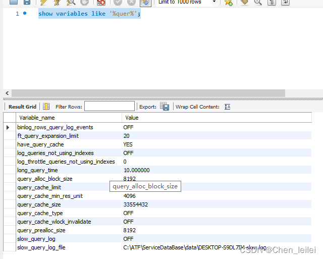

参数说明如下：

* slow_query_log：慢查询开启状态
* slow_query_log_file：慢查询日志存放的位置（一般设置为 MySQL 的数据存放目录）
* long_query_time：查询超过多少秒才记录
* log_queries_not_using_indexes 如果值设置为ON，则会记录所有没有利用索引的查询（注意：如果只是将log_queries_not_using_indexes设置为ON，而将slow_query_log设置为OFF，此时该设置也不会生效，即该设置生效的前提是slow_query_log的值设置为ON），一般在性能调优的时候会暂时开启。

#### 充分利用表上已经存在的索引

避免使用双%号的查询条件。如：a like '%123%'，（如果无前置%,只有后置%，是可以用到列上的索引的）

一个 SQL 只能利用到复合索引中的一列进行范围查询。如：有 a,b,c 列的联合索引，在查询条件中有 a 列的范围查询，则在 b,c 列上的索引将不会被用到。
在定义联合索引时，如果 a 列要用到范围查找的话，就要把 a 列放到联合索引的右侧，使用 left join 或 not exists 来优化 not in 操作，因为 not in 也通常会使用索引失效。

#### 禁止使用 SELECT * 必须使用 SELECT <字段列表> 查询

* SELECT * 消耗更多的 CPU 和 IO 以网络带宽资源
* SELECT * 无法使用覆盖索引
* SELECT <字段列表> 可减少表结构变更带来的影响

#### 禁止使用不含字段列表的 INSERT 语句

如：
```
insert into t values ('a','b','c');
```
应使用：
```
insert into t(c1,c2,c3) values ('a','b','c');
```

#### 建议使用预编译语句进行数据库操作

* 预编译语句可以重复使用这些计划，减少 SQL 编译所需要的时间，还可以解决动态 SQL 所带来的 SQL 注入的问题。
* 只传参数，比传递 SQL 语句更高效。
* 相同语句可以一次解析，多次使用，提高处理效率。


#### 避免数据类型的隐式转换

隐式转换会导致索引失效如:
```
select name,phone from customer where id = '111';
```

#### 避免使用子查询，可以把子查询优化为 join 操作

通常子查询在in子句中，且子查询中为简单 SQL(不包含 union、group by、order by、limit 从句) 时,才可以把子查询转化为关联查询进行优化。

子查询性能差的原因： 子查询的结果集无法使用索引，通常子查询的结果集会被存储到临时表中，不论是内存临时表还是磁盘临时表都不会存在索引，所以查询性能会受到一定的影响。特别是对于返回结果集比较大的子查询，其对查询性能的影响也就越大。由于子查询会产生大量的临时表也没有索引，所以会消耗过多的 CPU 和 IO 资源，产生大量的慢查询。

#### 避免使用 JOIN 关联太多的表

对于MySQL来说，是存在关联缓存的，缓存的大小可以由 join_buffer_size 参数进行设置。
在 MySQL 中，对于同一个SQL多关联（join）一个表，就会多分配一个关联缓存，如果在一个SQL中关联的表越多，所占用的内存也就越大。如果程序中大量的使用了多表关联的操作，同时 join_buffer_size 设置的也不合理的情况下，就容易造成服务器内存溢出的情况，就会影响到服务器数据库性能的稳定性。同时对于关联操作来说，会产生临时表操作，影响查询效率，**MySQL 最多允许关联 61 个表，建议不超过 5 个**。

#### 减少同数据库的交互次数

数据库更适合处理批量操作，合并多个相同的操作到一起，可以提高处理效率。

#### 对应同一列进行 or 判断时，使用 in 代替 or

in的值不要超过500个，in 操作可以更有效的利用索引，or 大多数情况下很少能利用到索引。

#### 禁止使用 order by rand() 进行随机排序

order by rand() 会把表中所有符合条件的数据装载到内存中，然后在内存中对所有数据根据随机生成的值进行排序，并且可能会对每一行都生成一个随机值，如果满足条件的数据集非常大，就会消耗大量的 CPU 和 IO 及内存资源。推荐在程序中获取一个随机值，然后从数据库中获取数据的方式。

#### WHERE 从句中禁止对列进行函数转换和计算

对列进行函数转换或计算时会导致无法使用索引。

不推荐：
```
where date(create_time)='20190101'
```
推荐：
```
where create_time >= '20190101' and create_time < '20190102'
```

#### 在明显不会有重复值时使用 UNION ALL 而不是 UNION

* UNION 会把两个结果集的所有数据放到临时表中后再进行去重操作
* UNION ALL 不会再对结果集进行去重操作

#### 拆分复杂的大 SQL 为多个小 SQL

* 大 SQL 逻辑上比较复杂，需要占用大量 CPU 进行计算的 SQL
* MySQL 中，一个 SQL 只能使用一个 CPU 进行计算
* SQL 拆分后可以通过并行执行来提高处理效率


#### 程序连接不同的数据库使用不同的账号，禁止跨库查询

* 为数据库迁移和分库分表留出余地
* 降低业务耦合度
* 避免权限过大而产生的安全风险


### 数据库操作行为规范

#### 超 100 万行的批量写 (UPDATE,DELETE,INSERT) 操作,要分批多次进行操作

**大批量操作可能会造成严重的主从延迟**

主从环境中,大批量操作可能会造成严重的主从延迟，大批量的写操作一般都需要执行一定长的时间，而只有当主库上执行完成后，才会在其他从库上执行，所以会造成主库与从库长时间的延迟情况

**binlog 日志为 row 格式时会产生大量的日志**

大批量写操作会产生大量日志，特别是对于 row 格式二进制数据而言，由于在 row 格式中会记录每一行数据的修改，我们一次修改的数据越多，产生的日志量也就会越多，日志的传输和恢复所需要的时间也就越长，这也是造成主从延迟的一个原因

**避免产生大事务操作**

大批量修改数据，一定是在一个事务中进行的，这就会造成表中大批量数据进行锁定，从而导致大量的阻塞，阻塞会对 MySQL 的性能产生非常大的影响。特别是长时间的阻塞会占满所有数据库的可用连接，这会使生产环境中的其他应用无法连接到数据库，因此一定要注意大批量写操作要进行分批。

#### 对于大表使用 pt-online-schema-change 修改表结构

* 避免大表修改产生的主从延迟
* 避免在对表字段进行修改时进行锁表

对大表数据结构的修改一定要谨慎，会造成严重的锁表操作，尤其是生产环境，是不能容忍的。
pt-online-schema-change 它会首先建立一个与原表结构相同的新表，并且在新表上进行表结构的修改，然后再把原表中的数据复制到新表中，并在原表中增加一些触发器。把原表中新增的数据也复制到新表中，在行所有数据复制完成之后，把新表命名成原表，并把原来的表删除掉。把原来一个 DDL 操作，分解成多个小的批次进行。

#### 禁止为程序使用的账号赋予 super 权限

* 当达到最大连接数限制时，还运行 1 个有 super 权限的用户连接
* super 权限只能留给 DBA 处理问题的账号使用

#### 对于程序连接数据库账号,遵循权限最小原则

* 程序使用数据库账号只能在一个 DB 下使用，不准跨库
* 程序使用的账号原则上不准有 drop 权限


## InnoDB存储引擎对MVCC的实现

### 一致性非锁定读和锁定读

#### 一致性非锁定读

对于 一致性非锁定读（Consistent Nonlocking Reads）的实现，通常做法是加一个版本号或者时间戳字段，在更新数据的同时版本号 + 1 或者更新时间戳。查询时，将当前可见的版本号与对应记录的版本号进行比对，如果记录的版本小于可见版本，则表示该记录可见。
在 InnoDB 存储引擎中，多版本控制 (multi versioning)就是对非锁定读的实现。如果读取的行正在执行 DELETE 或 UPDATE 操作，这时读取操作不会去等待行上锁的释放。相反地，InnoDB 存储引擎会去读取行的一个快照数据，对于这种读取历史数据的方式，我们叫它快照读 (snapshot read)

在Repeatable Read 和Read Committed两个隔离级别下，如果是执行普通的 select 语句（不包括 select ... lock in share mode ,select ... for update）则会使用 一致性非锁定读（MVCC）。并且在 Repeatable Read 下 MVCC 实现了可重复读和防止部分幻读。

#### 锁定读

如果执行的是下列语句，就是锁定读（Locking Reads）。

* select ... lock in share mode
* select ... for update
* insert、update、delete 操作

在锁定读下，读取的是数据的最新版本，这种读也被称为当前读（current read）。锁定读会对读取到的记录加锁：

* select ... lock in share mode：对记录加 S 锁，其它事务也可以加S锁，如果加 x 锁则会被阻塞
* select ... for update、insert、update、delete：对记录加 X 锁，且其它事务不能加任何锁

在一致性非锁定读下，即使读取的记录已被其它事务加上 X 锁，这时记录也是可以被读取的，即读取的快照数据。上面说了，在 Repeatable Read 下 MVCC 防止了部分幻读，这边的 “部分” 是指在 一致性非锁定读 情况下，只能读取到第一次查询之前所插入的数据（根据 Read View 判断数据可见性，Read View 在第一次查询时生成）。但是！如果是 当前读 ，每次读取的都是最新数据，这时如果两次查询中间有其它事务插入数据，就会产生幻读。所以， **InnoDB 在实现Repeatable Read 时，如果执行的是当前读，则会对读取的记录使用 Next-key Lock ，来防止其它事务在间隙间插入数据**。

### InnoDB 对 MVCC 的实现

MVCC 的实现依赖于：隐藏字段、Read View、undo log。在内部实现中，InnoDB 通过数据行的DB_TRX_ID和Read View来判断数据的可见性，如不可见，则通过数据行的 DB_ROLL_PTR 找到 undo log 中的历史版本。每个事务读到的数据版本可能是不一样的，在同一个事务中，用户只能看到该事务创建 Read View 之前已经提交的修改和该事务本身做的修改。

#### 隐藏字段

在内部，InnoDB 存储引擎为每行数据添加了三个 隐藏字段：

* DB_TRX_ID（6字节）：表示最后一次插入或更新该行的事务 id。此外，delete 操作在内部被视为更新，只不过会在记录头 Record header 中的 deleted_flag 字段将其标记为已删除
* DB_ROLL_PTR（7字节） 回滚指针，指向该行的 undo log 。如果该行未被更新，则为空
* DB_ROW_ID（6字节）：如果没有设置主键且该表没有唯一非空索引时，InnoDB 会使用该 id 来生成聚簇索引

#### ReadView
```
class ReadView {
  /* ... */
private:
  trx_id_t m_low_limit_id;      /* 大于等于这个 ID 的事务均不可见 */

  trx_id_t m_up_limit_id;       /* 小于这个 ID 的事务均可见 */

  trx_id_t m_creator_trx_id;    /* 创建该 Read View 的事务ID */

  trx_id_t m_low_limit_no;      /* 事务 Number, 小于该 Number 的 Undo Logs 均可以被 Purge */

  ids_t m_ids;                  /* 创建 Read View 时的活跃事务列表 */

  m_closed;                     /* 标记 Read View 是否 close */
}
```
Read View主要是用来做可见性判断，里面保存了当前对本事务不可见的其他活跃事务，主要有以下字段：

* m_low_limit_id：目前出现过的最大的事务 ID+1，即下一个将被分配的事务 ID。大于等于这个 ID 的数据版本均不可见
* m_up_limit_id：活跃事务列表 m_ids 中最小的事务 ID，如果 m_ids 为空，则 m_up_limit_id 为 m_low_limit_id。小于这个 ID 的数据版本均可见
* m_ids：Read View 创建时其他未提交的活跃事务 ID 列表。创建 Read View时，将当前未提交事务 ID 记录下来，后续即使它们修改了记录行的值，对于当前事务也是不可见的。m_ids 不包括当前事务自己和已提交的事务（正在内存中）
* m_creator_trx_id：创建该 Read View 的事务 ID

**事务可见性示意图：**
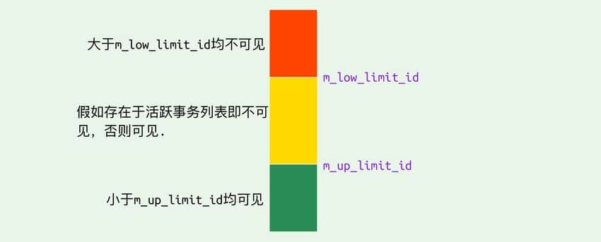

#### undo-log

undo log 主要有两个作用：

* 当事务回滚时用于将数据恢复到修改前的样子
* 另一个作用是 MVCC ，当读取记录时，若该记录被其他事务占用或当前版本对该事务不可见，则可以通过 undo log 读取之前的版本数据，以此实现非锁定读

**在InnoDB 存储引擎中undo log分为两种：insert undo log和update undo log：**

1. insert undo log：指在insert操作中产生的undo log。因为insert操作的记录只对事务本身可见，对其他事务不可见，故该undo log可以在事务提交后直接删除。不需要进行purge操作
**insert 时的数据初始状态：**
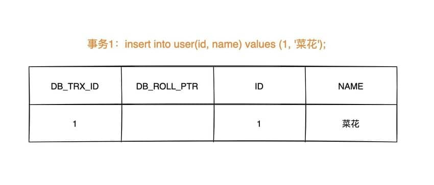

2. update undo log：update 或 delete 操作中产生的 undo log。该 undo log可能需要提供 MVCC 机制，因此不能在事务提交时就进行删除。提交时放入 undo log 链表，等待 purge线程 进行最后的删除
**数据第一次被修改时：**
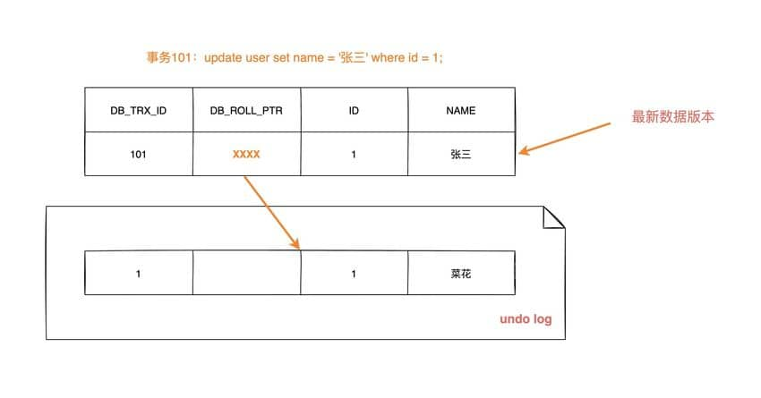
**数据第二次被修改时：**
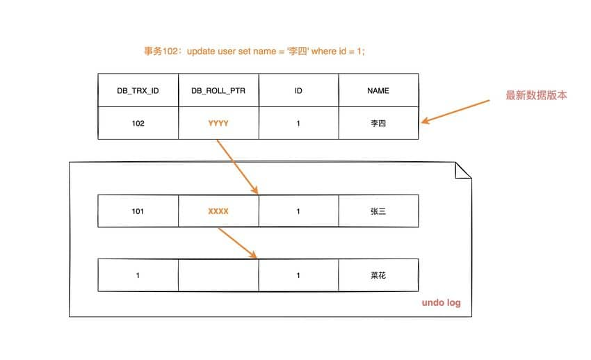

不同事务或者相同事务的对同一记录行的修改，会使该记录行的 undo log 成为一条链表，链首就是最新的记录，链尾就是最早的旧记录。

#### 数据可见性算法

在InnoDB存储引擎中，创建一个新事务后，执行每个select语句前，都会创建一个快照（Read View），快照中保存了当前数据库系统中正处于活跃（没有 commit）的事务的 ID 号。
其实简单的说保存的是系统中当前不应该被本事务看到的其他事务 ID 列表（即 m_ids）。当用户在这个事务中要读取某个记录行的时候，InnoDB 会将该记录行的 DB_TRX_ID 与 Read View 中的一些变量及当前事务 ID 进行比较，判断是否满足可见性条件。
具体的比较算法如下：
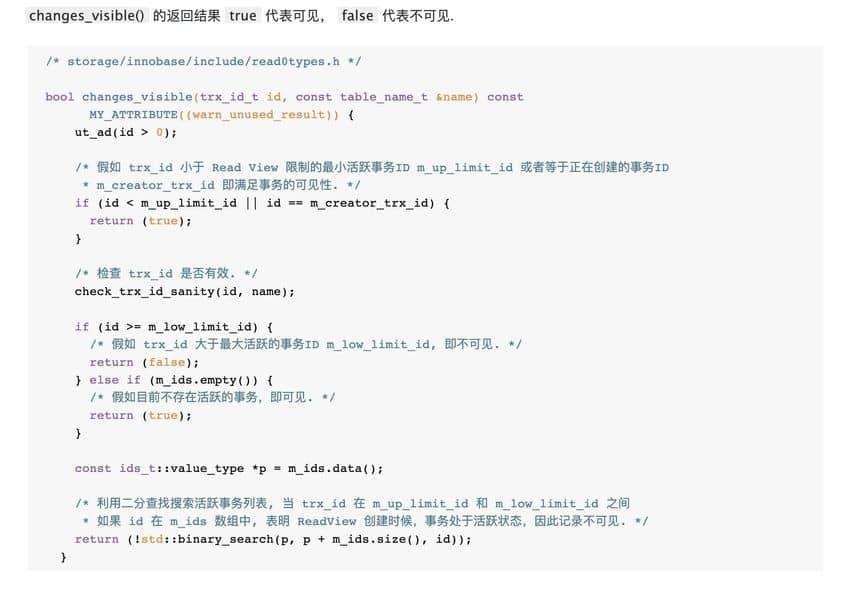

1. 如果记录 DB_TRX_ID < m_up_limit_id，那么表明最新修改该行的事务（DB_TRX_ID）在当前事务创建快照之前就提交了，所以该记录行的值对当前事务是可见的
2. 如果 DB_TRX_ID >= m_low_limit_id，那么表明最新修改该行的事务（DB_TRX_ID）在当前事务创建快照之后才修改该行，所以该记录行的值对当前事务不可见。跳到步骤 5
3. m_ids 为空，则表明在当前事务创建快照之前，修改该行的事务就已经提交了，所以该记录行的值对当前事务是可见的
4. 如果 m_up_limit_id <= DB_TRX_ID < m_low_limit_id，表明最新修改该行的事务（DB_TRX_ID）在当前事务创建快照的时候可能处于“活动状态”或者“已提交状态”；所以就要对活跃事务列表 m_ids 进行查找（源码中是用的二分查找，因为是有序的）
    * 如果在活跃事务列表 m_ids 中能找到 DB_TRX_ID，表明：① 在当前事务创建快照前，该记录行的值被事务 ID 为 DB_TRX_ID 的事务修改了，但没有提交；或者 ② 在当前事务创建快照后，该记录行的值被事务 ID 为 DB_TRX_ID 的事务修改了。这些情况下，这个记录行的值对当前事务都是不可见的。跳到步骤 5
    * 在活跃事务列表中找不到，则表明“id 为 trx_id 的事务”在修改“该记录行的值”后，在“当前事务”创建快照前就已经提交了，所以记录行对当前事务可见

5. 在该记录行的 DB_ROLL_PTR 指针所指向的 undo log 取出快照记录，用快照记录的 DB_TRX_ID 跳到步骤 1 重新开始判断，直到找到满足的快照版本或返回空


### RC 和 RR 隔离级别下 MVCC 的差异

在事务隔离级别RC和RR（InnoDB 存储引擎的默认事务隔离级别）下，InnoDB 存储引擎使用 MVCC（非锁定一致性读），但它们生成 Read View 的时机却不同：

* 在 RC 隔离级别下的 每次select 查询前都生成一个Read View (m_ids 列表)
* 在 RR 隔离级别下只在事务开始后 第一次select 数据前生成一个Read View（m_ids 列表）

### MVCC 解决不可重复读问题

虽然RC和RR都通过 MVCC 来读取快照数据，但由于 生成 Read View 时机不同，从而在 RR 级别下实现可重复读。
举个例子：
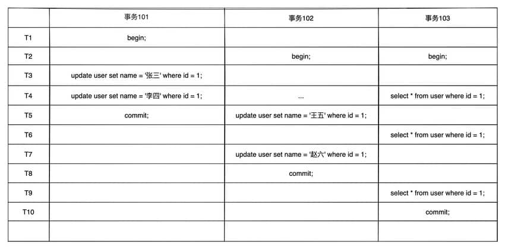

#### 在 RC 下 ReadView 生成情况

**1. 假设时间线来到 T4 ，那么此时数据行 id = 1 的版本链为：**


由于 RC 级别下每次查询都会生成Read View ，并且事务 101、102 并未提交，此时 103 事务生成的 Read View 中活跃的事务 m_ids 为：[101,102] ，m_low_limit_id为：104，m_up_limit_id为：101，m_creator_trx_id 为：103

* 此时最新记录的 DB_TRX_ID 为 101，m_up_limit_id <= 101 < m_low_limit_id，所以要在 m_ids 列表中查找，发现 DB_TRX_ID 存在列表中，那么这个记录不可见
* 根据 DB_ROLL_PTR 找到 undo log 中的上一版本记录，上一条记录的 DB_TRX_ID 还是 101，不可见
* 继续找上一条 DB_TRX_ID为 1，满足 1 < m_up_limit_id，可见，所以事务 103 查询到数据为 name = 菜花

**2. 时间线来到 T6 ，数据的版本链为：**
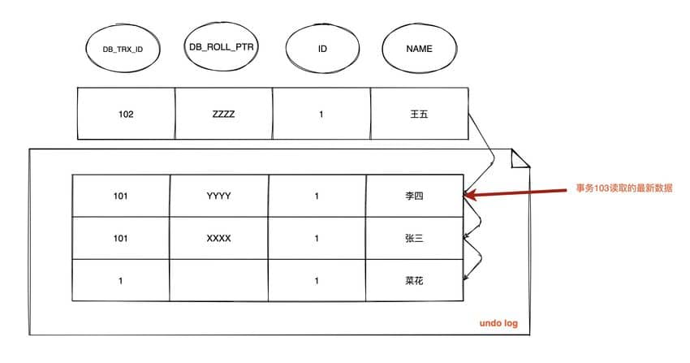

因为在 RC 级别下，重新生成 Read View，这时事务 101 已经提交，102 并未提交，所以此时 Read View 中活跃的事务 m_ids：[102] ，m_low_limit_id为：104，m_up_limit_id为：102，m_creator_trx_id为：103

* 此时最新记录的 DB_TRX_ID 为 102，m_up_limit_id <= 102 < m_low_limit_id，所以要在 m_ids 列表中查找，发现 DB_TRX_ID 存在列表中，那么这个记录不可见
* 根据 DB_ROLL_PTR 找到 undo log 中的上一版本记录，上一条记录的 DB_TRX_ID 为 101，满足 101 < m_up_limit_id，记录可见，所以在 T6 时间点查询到数据为 name = 李四，与时间 T4 查询到的结果不一致，不可重复读！

**3. 时间线来到 T9 ，数据的版本链为：**
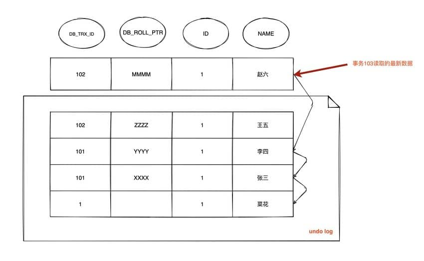

重新生成 Read View， 这时事务 101 和 102 都已经提交，所以 m_ids 为空，则 m_up_limit_id = m_low_limit_id = 104，最新版本事务 ID 为 102，满足 102 < m_low_limit_id，可见，查询结果为 name = 赵六

**总结： 在 RC 隔离级别下，事务在每次查询开始时都会生成并设置新的 Read View，所以导致不可重复读**

#### 在 RR 下 ReadView 生成情况

在可重复读级别下，只会在事务开始后第一次读取数据时生成一个 Read View（m_ids 列表）

**1. 在 T4 情况下的版本链为：**
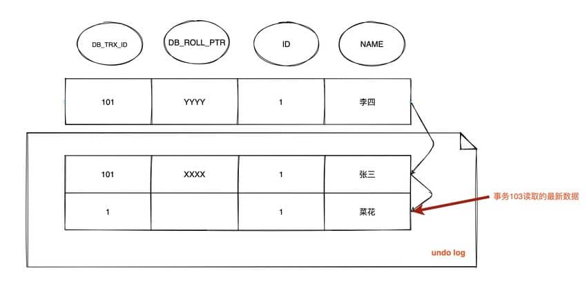

在当前执行 select 语句时生成一个 Read View，此时 m_ids：[101,102] ，m_low_limit_id为：104，m_up_limit_id为：101，m_creator_trx_id 为：103

此时和 RC 级别下一样：

* 最新记录的 DB_TRX_ID 为 101，m_up_limit_id <= 101 < m_low_limit_id，所以要在 m_ids 列表中查找，发现 DB_TRX_ID 存在列表中，那么这个记录不可见
* 根据 DB_ROLL_PTR 找到 undo log 中的上一版本记录，上一条记录的 DB_TRX_ID 还是 101，不可见
* 继续找上一条 DB_TRX_ID为 1，满足 1 < m_up_limit_id，可见，所以事务 103 查询到数据为 name = 菜花

**2. 时间点 T6 情况下：**
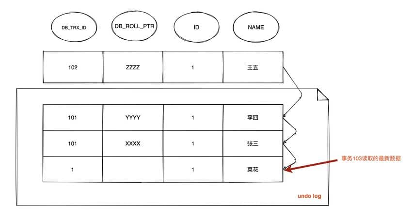

在 RR 级别下只会生成一次Read View，所以此时依然沿用 m_ids ：[101,102] ，m_low_limit_id为：104，m_up_limit_id为：101，m_creator_trx_id 为：103

* 最新记录的 DB_TRX_ID 为 102，m_up_limit_id <= 102 < m_low_limit_id，所以要在 m_ids 列表中查找，发现 DB_TRX_ID 存在列表中，那么这个记录不可见
* 根据 DB_ROLL_PTR 找到 undo log 中的上一版本记录，上一条记录的 DB_TRX_ID 为 101，不可见
* 继续根据 DB_ROLL_PTR 找到 undo log 中的上一版本记录，上一条记录的 DB_TRX_ID 还是 101，不可见
* 继续找上一条 DB_TRX_ID为 1，满足 1 < m_up_limit_id，可见，所以事务 103 查询到数据为 name = 菜花

**3. 时间点 T9 情况下：**
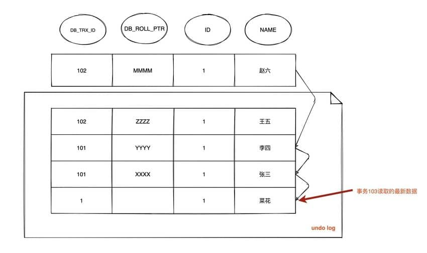

此时情况跟 T6 完全一样，由于已经生成了 Read View，此时依然沿用 m_ids ：[101,102] ，所以查询结果依然是 name = 菜花

### MVCC➕Next-key-Lock 防止幻读

InnoDB存储引擎在 RR 级别下通过 MVCC和 Next-key Lock 来解决幻读问题：

1. 执行普通 select，此时会以 MVCC 快照读的方式读取数据
在快照读的情况下，RR 隔离级别只会在事务开启后的第一次查询生成 Read View ，并使用至事务提交。所以在生成 Read View 之后其它事务所做的更新、插入记录版本对当前事务并不可见，实现了可重复读和防止快照读下的 “幻读”
2. 执行 select...for update/lock in share mode、insert、update、delete 等当前读
在当前读下，读取的都是最新的数据，如果其它事务有插入新的记录，并且刚好在当前事务查询范围内，就会产生幻读！InnoDB 使用 Next-key Lock来防止这种情况。当执行当前读时，会锁定读取到的记录的同时，锁定它们的间隙，防止其它事务在查询范围内插入数据。只要我不让你插入，就不会发生幻读


## 常见问题
### 能用 MySQL 直接存储文件（比如图片）吗？

可以是可以，直接存储文件对应的二进制数据即可。不过，还是建议不要在数据库中存储文件，会严重影响数据库性能，消耗过多存储空间。可以选择使用云服务厂商提供的开箱即用的文件存储或者对象存储服务，成熟稳定，价格也比较低。
**数据库只存储文件地址信息，文件由文件存储服务负责存储。**


### 表中有大字段 X（例如：text 类型），且字段 X 不会经常更新，以读为为主，将该字段拆成子表好处是什么？

如果字段里面有大字段（text,blob)类型的，而且这些字段的访问并不多，这时候放在一起就变成缺点了。 MYSQL 数据库的记录存储是按行存储的，数据块大小又是固定的（16K），每条记录越小，相同的块存储的记录就越多。此时应该把大字段拆走，这样应付大部分小字段的查询时，就能提高效率。当需要查询大字段时，此时的关联查询是不可避免的，但也是值得的。拆分开后，对字段的 UPDAE 就要 UPDATE 多个表了。


### MySQL 中 InnoDB 引擎的行锁是通过加在什么上完成（或称实现）的？

InnoDB 行锁是通过给索引上的索引项加锁来实现的，这一点 MySQL 与Oracle 不同，后者是通过在数据块中对相应数据行加锁来实现的。InnoDB 这种行锁实现特点意味着：只有通过索引条件检索数据，InnoDB 才使用行级锁，否则，InnoDB 将使用表锁！

### MySQL 中控制内存分配的全局参数，有哪些？

1. **Keybuffersize**
    * keybuffersize 指定索引缓冲区的大小，它决定索引处理的速度，尤其是索引读的速度。通过检查状态值Keyreadrequests 和 Keyreads，可以知道 keybuffersize 设置是否合理。比例 keyreads/keyreadrequests 应该尽可能的低，至少是1:100，1:1000 更好（上述状态值可以使用 SHOW STATUS LIKE‘keyread%'获得）。
    *  keybuffersize 只对 MyISAM 表起作用。即使你不使用 MyISAM 表，但是内部的临时磁盘表是 MyISAM 表，也要使用该值。可以使用检查状态值 createdtmpdisktables 得知详情。对于 1G 内存的机器，如果不使用 MyISAM 表，推荐值是 16M（8-64M）
    *  keybuffersize 设置注意事项 
        1. 单个 keybuffer 的大小不能超过 4G，如果设置超过 4G，就有可能遇到下面 3 个bug: http://bugs.mysql.com/bug.php?id=29446  http://bugs.mysql.com/bug.php?id=29419 http://bugs.mysql.com/bug.php?id=5731
        2. 建议 keybuffer 设置为物理内存的 1/4(针对 MyISAM 引擎)，甚至是物理内存的 30%~40%，如果 keybuffersize 设置太大，系统就会频繁的换页，降低系统性能。因为 MySQL 使用操作系统的缓存来缓存数据，所以我们得为系统留够足够的内存；在很多情况下数据要比索引大得多。
        3. 如果机器性能优越，可以设置多个keybuffer,分别让不同的 keybuffer 来缓存专门的索引；
    *  innodbbufferpool_size表示缓冲池字节大小，InnoDB 缓存表和索引数据的内存区域。mysql 默认的值是 128M。最大值与你的CPU 体系结构有关，在 32 位操作系统，最大值是 4294967295(2^32-1) ，在 64 位操作系统，最大值为18446744073709551615 (2^64-1)。
        1.  在 32 位操作系统中，CPU 和操作系统实用的最大大小低于设置的最大值。如果设定的缓冲池的大小大于 1G，设置 innodbbufferpoolinstances 的值大于 1
        2.  .数据读写在内存中非常快, innodbbufferpoolsize 减少了对磁盘的读写。 当数据提交或满足检查点条件后才一次性将内存数据刷新到磁盘中。然而内存还有操作系统或数据库其他进程使用, 一般设置 buffer pool 大小为总内存的 3/4 至 4/5。 若设置不当, 内存使用可能浪费或者使用过多。 对于繁忙的服务器, buffer pool 将划分为多个实例以提高系统并发性, 减少线程间读写缓存的争用。buffer pool 的大小首先受 innodbbufferpool_instances 影响, 当然影响较小。
    *  querycachesize 当 mysql 接收到一条 select 类型的 query时，mysql 会对这条 query 进行 hash 计算而得到一个 hash 值，然后通过该 hash 值到 query cache 中去匹配，如果没有匹配中，则将这个hash 值存放在一个 hash 链表中，同时将 query 的结果集存放进cache 中，存放 hash 值的链表的每一个 hash 节点存放了相应 query结果集在 cache 中的地址，以及该 query 所涉及到的一些 table 的相关信息；如果通过 hash 值匹配到了一样的 query，则直接将 cache 中相应的 query 结果集返回给客户端。如果 mysql 任何一个表中的任何一条数据发生了变化，便会通知 query cache 需要与该 table 相关的query 的 cache 全部失效，并释放占用的内存地址。query cache 优缺点：
        1.  query 语句的 hash 计算和 hash 查找带来的资源消耗。mysql 会对每条接收到的 select 类型的 query 进行 hash 计算然后查找该 query 的 cache 是否存在，虽然 hash 计算和查找的效率已经足够高了，一条 query 所带来的消耗可以忽略，但一旦涉及到高并发，有成千上万条 query 时，hash 计算和查找所带来的开销就的重视了；
        2.  query cache 的失效问题。如果表变更比较频繁，则会造成 query cache 的失效率非常高。表变更不仅仅指表中的数据发生变化，还包括结构或者索引的任何变化；
        3.  对于不同 sql 但同一结果集的 query 都会被缓存，这样便会造成内存资源的过渡消耗。sql 的字符大小写、空格或者注释的不同，缓存都是认为是不同的 sql（因为他们的 hash 值会不同）；
        4.  相关参数设置不合理会造成大量内存碎片，相关的参数设置会稍后介绍。
    *  readbuffersize 是 MySQL 读入缓冲区大小。对表进行顺序扫描的请求将分配一个读入缓冲区，MySQL 会为它分配一段内存缓冲区。readbuffersize 变量控制这一缓冲区的大小。如果对表的顺序扫描请求非常频繁，并且你认为频繁扫描进行得太慢，可以通过增加该变量值以及内存缓冲区大小提高其性能。

### 若一张表中只有一个字段 VARCHAR(N)类型，utf8 编码，则 N 最大值为多少(精确到数量级即可)?

由于 utf8 的每个字符最多占用 3 个字节。而 MySQL 定义行的长度不能超过65535，因此 N 的最大值计算方法为：(65535-1-2)/3。减去 1 的原因是实际存储从第二个字节开始，减去 2 的原因是因为要在列表长度存储实际的字符长度，除以 3 是因为 utf8 限制：每个字符最多占用 3 个字节。


### [SELECT * ] 和[SELECT 全部字段]的 2 种写法有何优缺点?

1. 前者要解析数据字典，后者不需要
2. 结果输出顺序，前者与建表列顺序相同，后者按指定字段顺序。
3. 表字段改名，前者不需要修改，后者需要改
4. 后者可以建立索引进行优化，前者无法优化
5. 后者的可读性比前者要高
