# Django框架
## 简介
版本选择使用TLS版本，长期支持
安装：
pip3 install django==2.2.12/3.2.11
检查是否安装成功：pip3 freeze | grep -i 'Django'

初始化项目：
在终端执行：django-admin startproject 项目名  即可

## 项目结构
### 启动服务
测试开发阶段：
进入项目目录文件夹后，执行python3 manage.py runserver 即可，在IDEA中同样配置即可

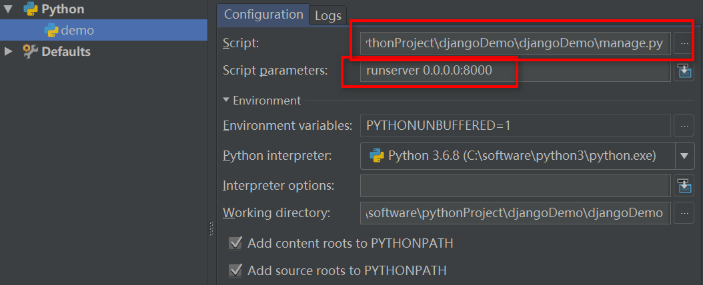

### 项目结构
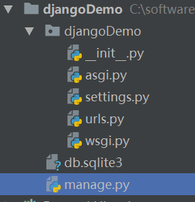

manage.py：包含项目管理的子命令，执行python3 manage.py可以看到所有的命令
项目同名文件夹：

* _ init_:python包的初始化文件
* wsgi.py：WEB服务网关的配置文件
* urls.py：项目的主路由配置-HTTP请求进入django时优先调用
* settings.py：项目的配置文件，包含项目启动时需要的配置

其中，setting.py中的配置名均要大写，小写会报错，引入自定义配置的话可使用：from django.conf import settings

## url和视图函数
urls.py默认为主路由配置，会匹配其中urlpatterns这个数组中的所有配置好的路由

### 视图函数
视图函数是一个用于接收http请求（HttpRequest对象）并通过HttpResponse对象返回响应的函数。
语法：
```
def xxx_view(request[,其他参数]): 
    return HttpResponse对象
```

## 路由配置
### path

* 导入：from django.urls import path
* 语法：path(route, views, name=None)
    参数：
    route：字符串类型，匹配的请求路径
    views：指定路径所对应的视图处理函数的名称
    name：为地址起别名，在模板中地址反向解析时使用

### path转换器
其实就是路径上的参数

* 语法：<转换器类型:自定义名>
* 作用：若转换器类型匹配到对应类型的数据，则将数据按照关键字传参方式传递给视图函数
 例如：path('page/\<int:page>',views.xxx)

转换器类型：

| 转换器类型 | 作用                                                    | 样例                                                 |
| ---------- | ------------------------------------------------------- | ---------------------------------------------------- |
| str        | 匹配除了'/'之外的非空字符串                             | "v1/users/< str:username>" 匹配  /v1/users/guoxiaona |
| int        | 匹配0或任何正整数                                       | "page/< int:page>" 匹配 /page/100                    |
| slug       | 匹配任意由ASCLL字母或数字以及连字符和下划线组成的短标签 | "detail/< slug:sl>" 匹配 /detail/this-is-django      |
| path       | 匹配非空字段，包括路径分隔符'/'                         | "v1/users/< path:ph>" 匹配 /v1/users/a/b/c           |

### re_path()
在url的匹配过程中可以使用正则表达式进行精确匹配

* 语法：re_path(reg,view,name=xxx)
* 正则表达式为命名分组模式(?P<name>pattern)；匹配提取参数后用关键字传参方式传递给视图函数

例如：

## 请求和响应
### 请求
HttpRequest对象通过属性描述了请求的所有相关信息，视图函数的第一个参数

* path_info：URL字符串
* method：HTTP请求方法
* GET：包含get请求的所有数据
* POST：包含post请求的所有数据
* FILES：包含所有的上传文件信息
* COOKIES：包含所有的cookies，键和值都为字符串
* session：表示当前的会话
* body：字符串，请求体的内容
* scheme：请求协议（http、https）
* request.get_full_path()：请求的完整路径
* META：请求中的元数据（消息头），如request.META['REMOTE_ADDR']：客户端IP地址


无论是GET请求还是POST，统一都由视图函数接收请求，通过判断request.method区分具体动作。

取消scrf验证，只需要在settings.py中MIDDLEWARE中的CsrfViewsMiddleWare的中间件就行

**注意**：

1. 应该使用request.META.get("HTTP_XXX")获取header中的值，其中前端传的key的值小写转为大写，横线“-”转为下划线“_”,并且加上前缀HTTP_，尤其注意header的key中不应该包含 HTTP前缀，以及符号"_ ",否则会取不到对应的值

### 响应
djanjo中的响应对象：HttpResponse
构造函数格式：HttpResponse(content=响应体,content_type=响应体数据类型,status=数据类型)

## Django的设计模式和模板层

### 模板配置
创建模板文件夹：<项目名>/templates
在settings.py中TEMPLATES配置项

1. BACKEND：指定模板的引擎
2. DIRS：模板的搜索目录
3. APP_DIRS：是否要在应用中的templates文件夹中搜索模板文件
4. OPTIONS：有关模板的选项

设置DIRS：‘DIRS’：[os.path.join(BASE_DIR,'templates')],

### 视图函数获取模板的方法
1、通过loader获取模板，通过HttpResponse进行响应。

from django.template import loader

t = loader.get_template("模板文件名")
html = t.render(字典数据)
return HttpResponse(html)

2、通过render()直接加载并响应模板
在视图函数中
from django.shortcuts import render
return render(request,"模板文件名",字典数据)

视图层与模板之间的交互：
视图函数中可以将python变量封装到**字典**中传递到模板
模板中我们可以使用{{变量名}}的语法调用传递进来的参数

模板的变量可以为字符串、整型、数组、元组、字典、方法、类实例化的对象

### 模板标签
将一些服务器端的功能嵌入到模板中，例如流程控制等。
标签语法：
`{ %  标签  % }`
`...`
`{ %  结束标签  % }`

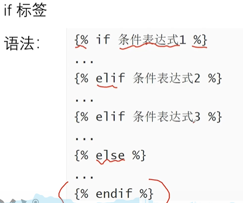
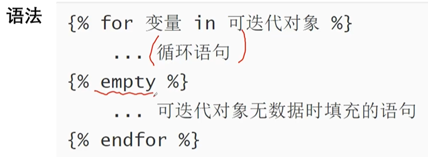
在for标签里面会有特殊的内置变量：forloop
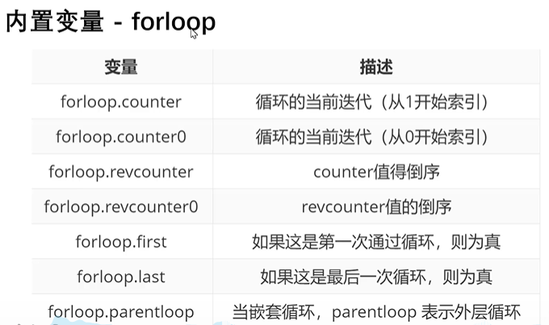

### 模板过滤器

在变量输出时对变量的值进行处理
可以通过使用过滤器来改变变量的输出显示
`语法：{{ 变量 | 过滤器1：‘参数值1’ | 过滤器2：‘参数值2’ ...  }}`
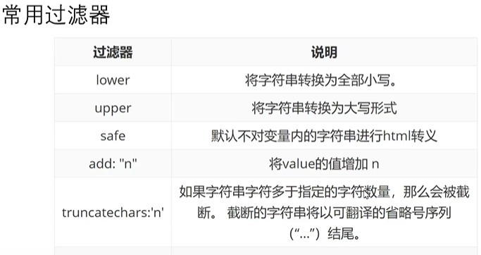

### 模板的继承
模板继承可以使父模板的内容重用，子模板直接继承父模板的全部内容并可以覆盖父模板中相应的块
语法：父模板中：

* 定义父模板中的block标签
* 标识出哪些在子模板中是允许被修改的
* block标签：在父模板中定义，可以在子模板中覆盖

子模块中：

* 继承模板extends标签（写在模板文件的第一行）例如``
* 子模板中重写父模板中的内容块
 ``
  子模板中用来覆盖父模板中block_name块的内容
  ``

重写的覆盖规则：

* 不重写，将按照父模板的效果展示
* 重写，则按照重写效果显示

注意：模板继承时，服务器端的动态内容无法继承，参数无法获取

### URL反向解析
url反向解析是指在视图或者模板中，用path定义的名称来动态查找或计算出相应的路由，根据path中的name关键字传参给url确定了唯一确定的名字，在模板或视图中，可以通过名字反向推断出此url信息。
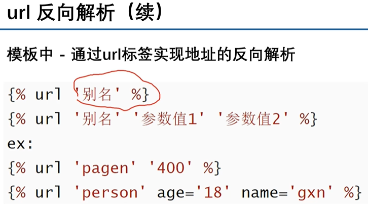

在视图函数中，可调用djanjo中的reverse方法进行反向解析：
from django.urls import reverse
reverse('别名',args=[], kwargs={})

## 静态文件
### 静态文件配置
在settings.py中配置
配置静态文件的访问路径：STATIC_URL = '/static/'
配置静态文件的存储路径：STATICFILES_DIRS
STATICFILES_DIRS保存的是静态文件在服务器端的存储位置

### 模板中访问静态文件
通过``标签访问静态文件

1. 加载static - ``
2. 使用静态资源 - ``

## 应用以及分布式路由

### 创建应用

1. 用manage.py中的子命令startapp 创建应用文件夹
    python3 manage.py startapp music
2. 在settings.py的INSTALLED_APPS列表中配置安装此应用

### 分布式路由
Djanjo中，主路由配置文件（urls.py）可以不处理用户具体路由，主路由配置文件可以做请求的分发（分布式请求处理），具体的请求可以由各自的应用来处理

#### 配置分布式路由
主路由中调用include函数
语法：include('app名字.url模块名')
作用：相当于将当前路由转到各个应用的路由配置文件的urlpatterns进行分布式处理

应用下配置urls.py，应用下没有这个文件，需要手动创建，内容和主路由完全一样

#### 应用下的模板

1. 应用下手动创建templates文件夹
2. settings.py中开启应用模板功能：TEMPLATE配置项中的'APP_DIRS'值为True即可
   应用下templates和外层templates都存在时，优先查找外层templates下的模板，然后就会按照INSTALLED_APPS下的应用顺序逐层查找
   

可以在应用下建一个应用同名的文件夹，防止同名的模板进行混淆

## 模型层及ORM
模型层负责和数据库交互

### Djanjo连接MySQL

#### 配置
linux：

* 安装mysqlclient，安装前需要确认是否安装了python3-dev和default-libmysqlclient-dev
* 安装好依赖后，执行pip3 install mysqlclient就好

windows安装的话，先登录https://www.lfd.uci.edu/~gohlke/pythonlibs/#mysqlclient网站下载安装包，
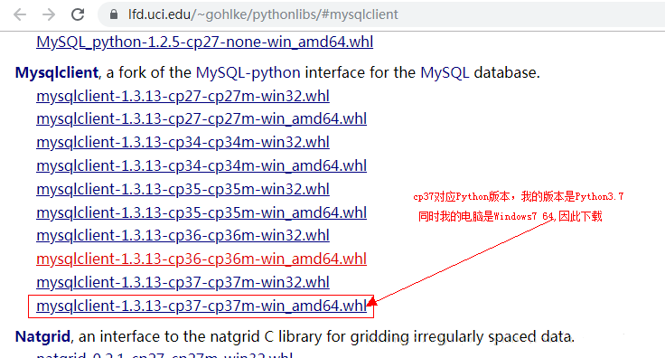
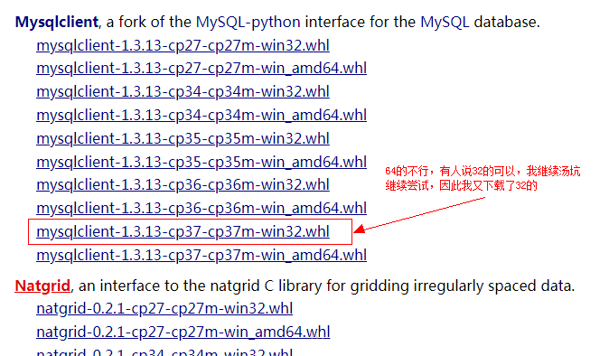
下载好后执行：
pip3 install mysqlclientXXX.whl 即可

#### 配置连接参数
```
DATABASES = {    
    'default': {        
        'ENGINE': 'django.db.backends.mysql',        
        'NAME': 'djangoDemo',      #连接数据库的名字  
        'USER': 'root',        
        'PASSWORD': '123qwe!@#',        
        'HOST': '127.0.0.1',        
        'PORT': '3306'   
 }
```
存储引擎包括：

* django.db.backends.mysql
* django.db.backends.sqlite3
* django.db.backends.oracle
* django.db.backends.postgresql

### 模型

* 模型是一个Python类，她是由djanjo.db.models.Model派生出的子类
* 一个模型类代表数据库中的一张表
* 模型类中每一个类属性都代表数据库中的一个字段
* 模型是数据交互的接口，是表示和操作数据库的方法和方式

### ORM框架
优点：

* 只需要面向对象编程，不需要面向数据库编写代码：对数据库的操作都转化成对类属性和方法的操作，不需要编写各种数据库的sql语句
* 实现了数据模型与数据库的解耦，屏蔽了不同数据库操作上的差异，不在关注mysql等数据库的内部细节，并且通过简单的配置就可以轻松更换数据库，不需要修改代码


### 数据库迁移
迁移是Djanjo同步对模型所做的更改（添加字段，删除模型等）到数据库模式的方式

1. 生成迁移文件 - 执行 
`python3 manage.py makemigrations /`
将应用下的models.py文件生成一个中间文件，并保存在migrations文件夹中
2. 执行迁移脚本程序 - 执行 
`python3 manage.py migrate`
执行迁移程序实现迁移，将每个应用下的migrations目录中的中间文件同步回数据库

数据库的迁移文件混乱的解决办法：
数据库中django_migrations表记录了migrate的'全过程'，项目个应用中的migrate文件应与之对应，否则migrate会报错
解决方案：

1. 删除所有migrations里所有的000?_XXXX.py(_ init_.py除外)
2. 删除数据库
3. 重新迁移生成数据库

### 字段类型

* BooleanField()
数据库类型：tinyint(1)
变成语言中：使用True或False来表示
在数据库中：使用1或0来表示具体的值

* CharField()
数据库类型：varchar
注意：必须指定max_length参数值

* DateField()
数据库类型：date
作用：表示日期
参数：
1.antu_now：每次保存对象时，自动设置该字段为当前时间（取值：True/False）
2.auto_now_add：当对象第一次创建时自动设置当前时间（取值：True/False）
3.default：设置指定的时间（取值：字符串格式时间如'2019-6-1'）
**以上三个参数只能多选一**

* DateTimeField()
数据库类型：datetime(6)
作用：表示日期和时间
参数同DateField

* FloatField()
数据库类型：double
编程语言中和数据库中都使用小数表示值

* DecimalField()
数据库类型：decimal(x,y)
编程语言中：使用小数表示该列的值
在数据库中：使用小数
参数：
1.max_digits：位数总数，包括小数点后的位数，该值必须大于等于decimal_places
2.decimal_places：小数点后的数字数量

* EmailField()
数据库类型：varchar
编程语言和数据库中使用字符串

* IntegerField()
数据库类型：int
编程语言和数据库中使用整型

* ImageField()
数据库类型：varchar(100)
作用：在数据库中为了保存图片的路径
编程语言和数据库中使用字符串

* TextField()
数据库类型：longtext
作用：表示不定长的字符数据

### 模型类-字段选项
字段选项：指定创建的列的额外的信息
允许出现多个字段选项，多个选项之间使用，隔开

* primary_key
如果设置为True，表示该列为主键，如果指定一个字段为主键，则此数据库不会创建id字段

* blank
设置为True时，字段可以为空，设置为False时，字段是必须填写的

* null
如果设置为True，表示该列允许为空，默认为False，如果此选项为False，建议加入default选项来设置默认值

* default
设置所在列的默认值

* db_index
如果设置为True，表示为该列增加索引

* unique
如果设置为True，表示该字段在数据库中的值必须唯一（不能重复出现）

* db_cloumn
指定列的名称，如果不指定的话则采用属性名作为列名

* verbose_name
设置此字段在admin界面上的显示名称
### 模型类-Meta类
使用内部Meta类来给模型赋予属性，Meta类下有很多内建的类属性，可对模型类做一些控制。
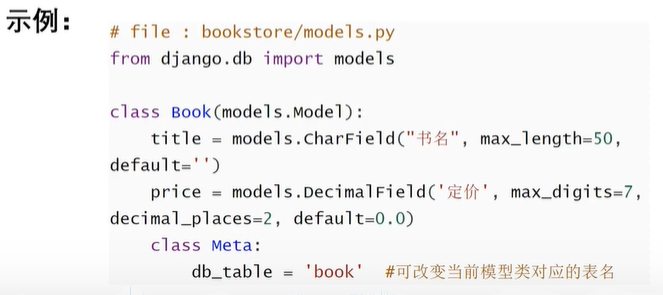

### 管理器对象
每个继承自models.Model的模型类，都会有一个oblects对象被同样继承下来，这个对象叫管理器对象。数据库的增删改查可以通过模型的管理器实现
```
class MyModel(models.Model):
    ...
MyModel.objects.create(...)  #objects是管理器对象
```
#### Django Shell
在Django提供了一个交互式的操作项目叫Django Shell，它能够在交互模式用项目工程的代码执行相应的操作，利用Django Shell可以代替编写view的代码来进行直接操作
注意：项目代码发生变化时，重新进入Django Shell
启动方式：python manage.py shell

#### 创建数据
Django ORM使用一种直观的方式把数据库中的数据表示成Python对象，创建数据中每一条记录就是创建一个数据对象
**方案1**：MyModel.objects.create(属性1=值1,属性2=值2,...)
成功则返回创建好的实体对象，失败则抛出异常
**方案2**：创建MyModel实例对象，并调用save()进行保存
obj = MyModel(属性=值,属性=值)
obj.属性= 值
obj.save()

#### 查询数据
通过MyModel.objects管理器方法调用查询方法

| 方法      | 说明                               |
| --------- | ---------------------------------- |
| all()     | 查询全部记录，返回QuerySet查询对象 |
| get()     | 查询符合条件的单一记录             |
| filter()  | 查询符合条件的多条记录             |
| exclude() | 查询符合条件之外的全部记录         |

* all()方法
用法：MyModel.objects.all()
作用：查询MyModel实体中所有的数据
返回值：QuerySet容器对象，内部存放MyModel实例
```
from music.models import Song
songs = Song.objects.all()
for song in songs:
    print("歌名",song.name, '价格：',song.price)
```
为了方便显示，可以在模型类中定义_str_方法，自定义QuerySet中的输出格式
```
def _str_(self):
    return '%s%s%S'%(self.name,self.author,self.price)
```

* values('列1', '列2',...)
用法：MyModel.objects.values(...)
作用：查询部分列的数据并返回
返回值：QuerySet，返回查询结果容器，容器内存字典，每个字典代表一条数据

* values_list('列1','列2',...)
用法：MyModel.objects.values_list(...)
作用：返回元组形式的查询结果
返回值：QuerySet容器对象，内部存放元组

* order_by()
用法：MyModel.objects.order_by('-列',列'')
作用：与all()方法不同，它会用SQL语句的ORDER BY子句对查询结果进行根据某个字段选择性的进行排序，默认是按照升序排序，降序排序则需要在列前增加'-'表示


输出结果只要是QuerySet，就可以连续使用下一个排序或者其他方法

* filter(条件)
语法：MyModel.objects.filter(属性1=值1,属性2=值2)
作用：返回包含此条件的全部数据集
返回值：QuerySet容器对象，内部存放MyModel实例，当多个属性在一起时为“与”关系

* exclude(条件)
语法：MyModel.objects.exclude(条件)
作用：返回不包含此条件的全部数据集

* get(条件)
语法：MyModel.objects.get(条件)
作用：返回满足条件的唯一一条数据
说明：该方法只能返回一条数据，查询结果多余一条数据则抛出出Model.MultipleObjectsReturned异常，查询结果如果没有数据则抛出Model.DoseNotExist异常

##### 查询谓词
定义：做更灵活的条件查询时需要使用查询谓词
说明：每一个查询谓词是一个独立的查询功能
类属性__ exact：等值匹配
__ contains：包含指定值
__ startswith：以 XXX开始
__ endsswith：以 XXX结束
__ gt：大于指定值
__ gte：大于等于
__ lt：小于
__ lte：小于等于
__ in：查找数据是否在指定范围内
__ range：查找数据是否在指定的区间范围内
例如：
```
Song.objects.filter(id_exact=1)
#等同于select * from song where id = 1`

Song.objects.filter(name__contains='w')
#等同于select * from song where name like '%w%'
```
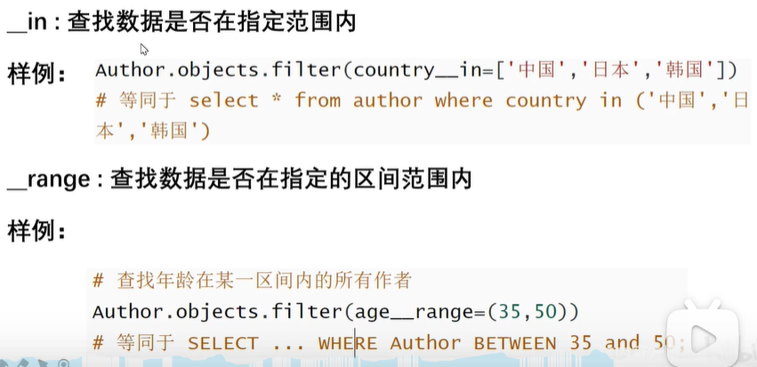
#### 更新数据
**修改单个实体的某些字段值得步骤**：

1. 查：通过get()得到要修改的实体对象
2. 改：通过对象.属性的方式修改数据
3. 保存：通过对象.save()保存数据

**批量更新数据**：

1. 直接调用QuerySet的update(属性=值)实现批量修改

#### 删除数据
**单个数据删除**：

1. 查找查询结果对应的一个对象
2. 调用这个数据对象的delete()方法实现删除

**伪删除**：
通常不会轻易的在业务李把数据真正删掉，取而代之的是做伪删除，即在表中添加一个布尔型字段(is_active)，默认为True，执行删除时，将欲删除数据的is_active字段置为False
**注意**：用伪删除时，确保显示数据的地方，均加了is_active=True的过滤查询

### F对象和Q对象
#### F对象
一个F对象代表数据库中某条记录的字段的信息
作用：

* 通常是对数据库中的字段值在获取的情况下进行操作
* 用于类属性(字段)之间的比较

语法：
```
from django.db.models inport F
F('列名')
```
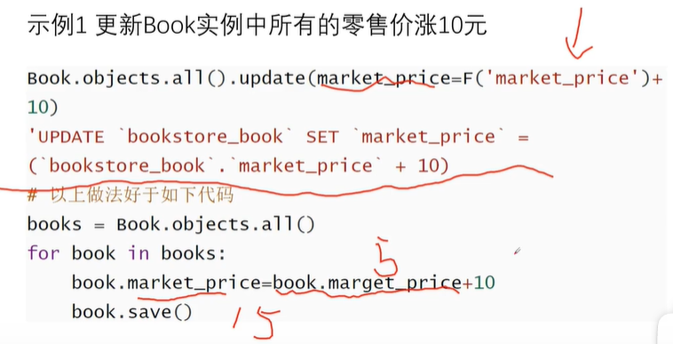
可以配合MySQL（行锁)实现多线程共享数据的更新
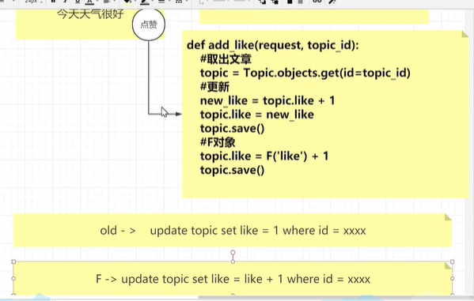

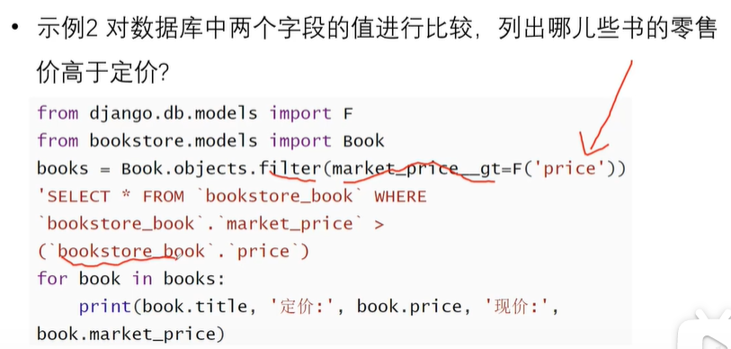
#### Q对象
当在获取查询结果集使用复杂的逻辑或|、逻辑非~等操作时可以借助于Q对象进行操作
Q对象在数据包django.db.models中，需要先导入在使用
如果想找出定价低于20元或清华大学出版社的全部书，可以写成：
`Book.objects.filter(Q(price__lt=20)|Q(pub="清华大学出版社"))`
作用：在条件中用来实现除and(&)以外的or(|)或not(~)操作
运算符：
& 与操作
|  或操作
~ 非操作
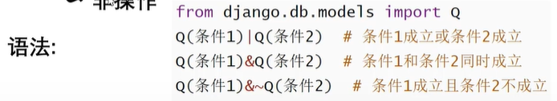

### 聚合查询
聚合查询是指对一个数据表中的一个字段的数据进行部分或全部进行统计查询，查bookstore_book数据表中的全部书的平均价格，查询所有书的总个数等，都要使用聚合查询
聚合查询分为整表聚合和分组聚合
#### 整表聚合
不带分组的聚合查询是指将全部数据进行集中统计查询
聚合函数：导入方法：from django.db.models import *
       聚合函数：Sum, Avg, Count, Max, Min
语法：MyModel.objects.aggregate(结果变量名=聚合函数('列'))
返回结果：结果变量名和值组成的字典，格式为：{"结果变量名"：值}
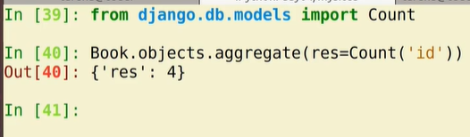

#### 分组聚合
分组聚合是指通过计算查询结果中每一个对象所关联的对象集合，从而得出总计值(也可以是平均值或总和)，即为查询集的每一项生成聚合。
语法：QuerySet.annotate(结果变量名=聚合函数('列'))
返回值：QuerySet

步骤：

1. 通过先用查询结果MyModel.objects.values查找查询要分组聚合的列，例如MyModel.objects.values('列1','列2')
2. 通过返回结果的QuerySet.annotate方法分组聚合得到分组结果
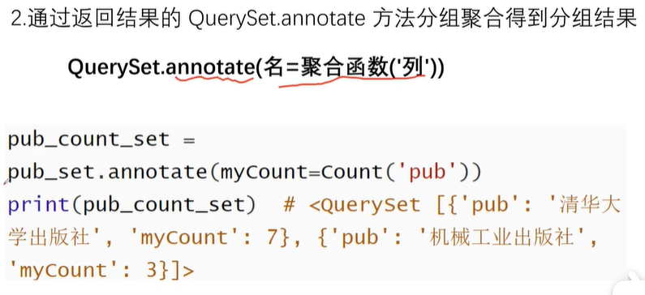
### 原生数据库查询
Django也可以支持直接使用sql语句的方式通信数据库，
查询：使用MyModel.objects.raw()进行数据库查询操作查询
语法：MyModel.objects.raw(sql语句,拼接参数)
返回值：RawQuerySet集合对象【只支持基础操作，比如循环】

**注意：使用原生语句时小心SQL注入**
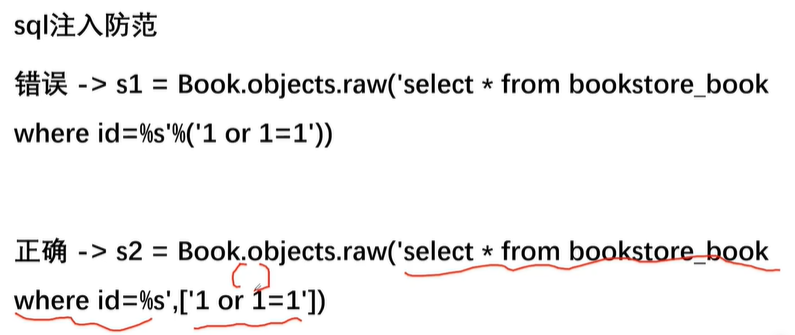

#### cursor
完全跨过模型类操作数据库-查询/更新/删除

1. 导入cursor所在的包：
`from django.db import connection`

2. 用创建cursor类的构造函数创建cursor对象，在使用cursor对象，为保证在出现异常时能释放cursor资源，通常使用with语句进行创建操作
```
from django.db import connection

with connection.cursor() as cur:
    cur.execute(''执行SQL语句,'拼接参数')
```
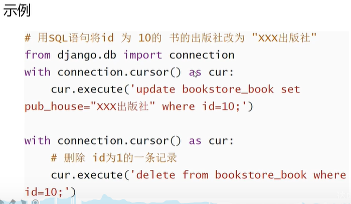

### 关系映射
#### 一对一
一对一表示现实事物间存在的一对一的对应关系
语法：OneToOneFiels(类名, on_delete = xxx)
```
class A(model.Model):
    ...
    
 class B(model.Model):
    属性 = models.OneToOneField(A , on_delete = xxx)
```
on_delete级联删除的动作有：

1. models.CASCADE，级联删除，Django模拟SQL约束ON DELETE CASCADE的行为，并删除包含ForeignKey的对象，注意：**仅仅是Django代码层面的模拟，并不是设置Mysql为级联**
2. models.PROTECT，抛出ProtectedError以阻止被引用对象的删除，等同于MySQL默认的RESTRICT
3. SET_NULL，设置ForignKey null，需要指定null = True
4. SET_DEFAULT 将ForeignKey设置为其默认值，必须设置ForeignKey的默认值

##### 创建数据

* 无外键的模型：

`author = Author.objects.create(name='王老师')`

* 有外键的模型类：

`wife1 = Wife.objects.create(name='王夫人', author = author)`
`wife1 = Wife.objects.create(name='王夫人',author_id=1)`

##### 查询数据
正向查询：
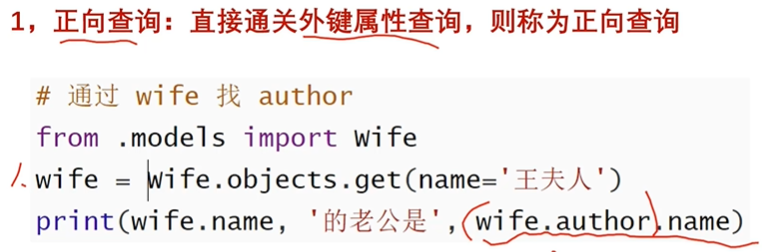
反向查询：
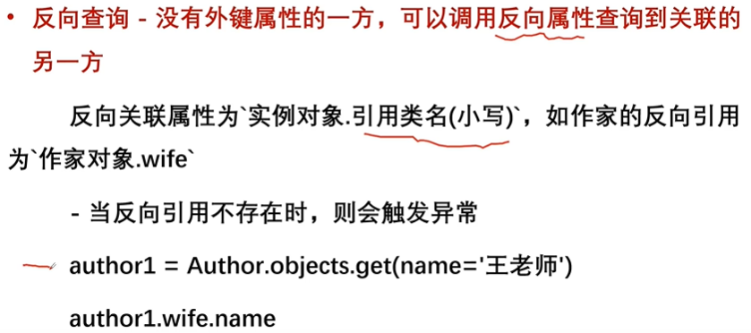

#### 一对多
当一个A对象可以关联多个B对象
语法：
`属性 = models.ForeignKey(类名 ， on_delete=xxx)`

##### 创建数据
先创建一，在创建多
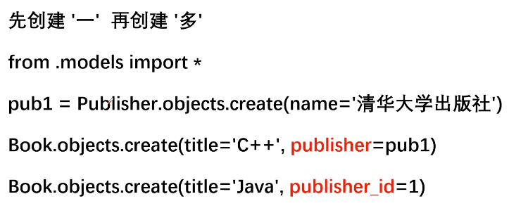

##### 查询数据
正向查询：
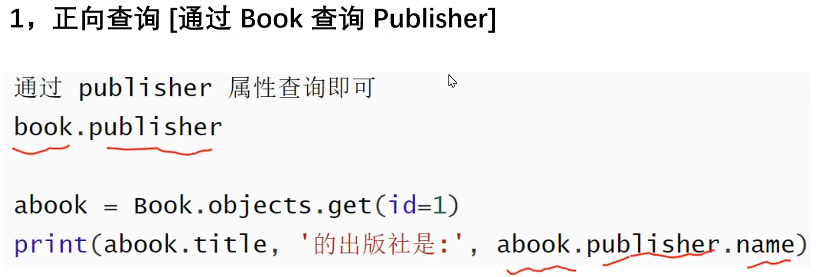
反向查询：
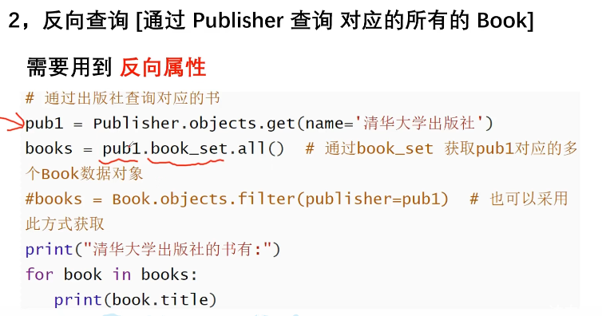
规则为对应的另外一个类名的小写加下划线加set，获取的集合可以继续操作，例如filter等

#### 多对多
mysql多对多通常需要多增加一张表来映射，而django自动完成多对多的关联
语法：在关联的两个类中的任意一个类中，增加：
`属性 = models.ManyToManyField(MyModel)`

##### 创建数据
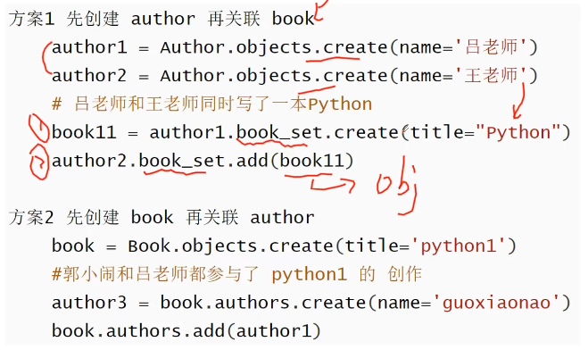
##### 查询数据
正向查询：
有多对多属性的对象查另一方
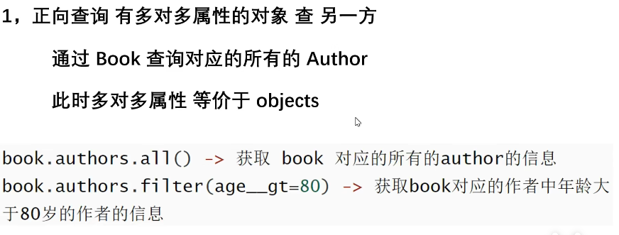
反向查询：
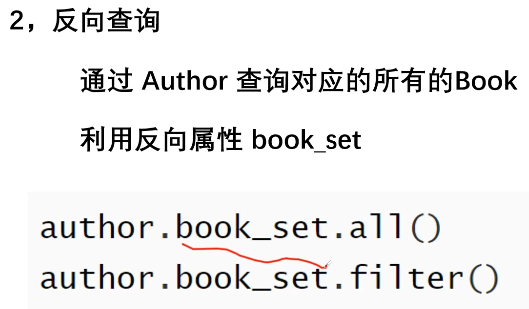

### 分页
Django提供了Paginator类可以方便的实现分页功能。
Paginator类位于django.core.paginator模块中。
#### Paginator对象
负责分页数据整体的管理
对象的构造方法：
`paginator = Paginator(object_list, per_page)`
参数：

* object_list：需要分页数据的对象列表
* per_page 每页数据个数

返回值：Paginator的对象

Paginator的属性：

* count：需要分页数据的对象总数
* num_pages：分页后的页面总数
* page_range：从1开始的range对象，用于记录当前页码数
* per_page：每页数据的个数

Paginator方法：
paginator对象.page(number)：
参数number为页码信息（从1开始），返回当前number页对应的页信息，如果提供的页码不存在，抛出InvalidPage异常
InvalidPage：总的异常基类，包含两个异常子类：

* PageNotAnInteger：当向page()传入一个不是整数的值时抛出
* EmptyPage：当向page()提供一个有效值，但是那个页面上没有任何对象时抛出

#### page对象
负责具体某一页的数据的管理。
**创建对象**：
Paginator对象的page()方法返回Page对象
page = paginator.page(页码)
**Page对象属性**：
object_list：当前页上所有数据对象的列表
number：当前页的序号，从1开始
paginator：当前page对象相关的Paginator对象
**Page对象方法**：
has_next()：如果有下一页返回True
has_previous()：如果有上一页返回True
has_other_pages()：如果有上一页或下一页返回True
next_page_number()：返回下一页的页码，如果下一页不存在，抛出InvalidPage异常
previous_page_number()：返回上一页的页码，如果上一页不存在，抛出InvalidPage异常


## admin管理后台
django提供了比较完善的后台管理数据库的接口，可供开发过程中调用和测试使用
django会搜集所有已注册的模型类，为这些模型类提供数据管理界面，供开发者使用
### admin配置步骤

* 创建后台管理账号，该账号为管理后台最高权限账号
`python manage.py createsuperuser`
根据提示设置用户名和密码就行
然后启动django项目，输入http://127.0.0.1:8000/admin/就会进入默认登录页面
### 注册自定义模型类
若要自己定义的模型类也能在/admin后台管理界面中显示和管理，需要将自己的类注册到后台管理界面
注册步骤：

1. 在应用app中的admin.py中导入注册要管理的模型models类，如from .models import Book
2. 调用admin.site.register方法进行注册，如：admin.site.register(自定义模型类)

此时显示的样式非常粗糙，可以通过**模型管理器**类来增加
作用：为后台管理界面添加便于操作的新功能
说明：后台管理器类须继承自django.contrib.admin里的ModelAdmin类
使用方法：

1. 在应用app下的admin.py里定义模型管理器类
```
class XXXManager(admin.ModelAdmin)
    ...
```

2. 绑定注册模型管理器和模型类
```
from django.contrib import admin
from .models import *
admin.site.register(模型类,XXXManager)
```
通常模型管理器类与模型类一一对应
模型管理器类常用的属性：

* list_display：数组，指示列名
* list_display_links：数组，显示点击后可以编辑数据的字段
* list_filter：数组，可以以哪些字段进行过滤
* search_fields：数组，可以以哪些字段进行模糊搜索
* list_editable：数组，设置哪些列可以直接在列表里调整


## Cookie和Session
Cookie可以通过HttpResponse设置

### session配置

1. setting.py中配置
向INSTALLED_APPS列表中添加：
```
INSTALLED_APPS = [
    'django.contrib.sessions'
]
```

2. 向MIDDLEWARE列表中添加：
```
MIDDLEWARE = [
    'django.contrib.sessions.middleware.SessionMiddleware'
]
```
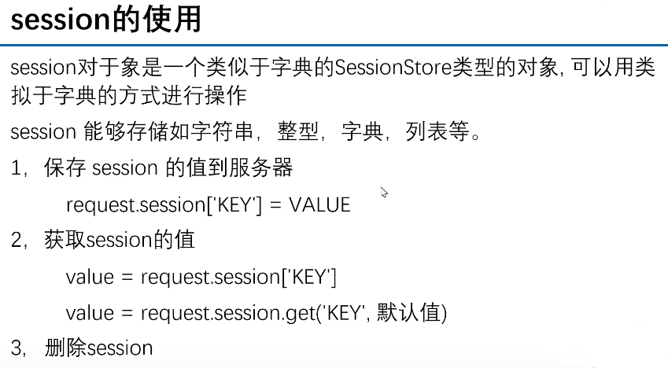

settings.py中相关配置项：
SESSION_COOKIE_AGE：指定sessionid在cookie中的保存时长（默认是两周），如：SESSION_COOKIE_AGE=60* 60* 24* 7* 2
SESSION_EXPIRE_AT_BROWSER_CLOSE = True，设置只要浏览器关闭时，session就失效（默认为False）
**注意：Django中的session数据存储在数据库中，所以使用session前需要确保已执行过migrate**

Django session的问题：

1. django_session表是单表设计，且该表数据量持续增持【浏览器故意删掉sessionid&过期数据未删除】
2. 可以每晚执行python manage.py clearsessions【该命令可删除已过期的session数据】

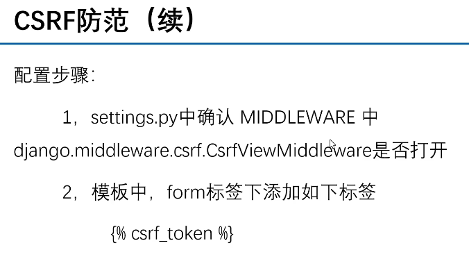
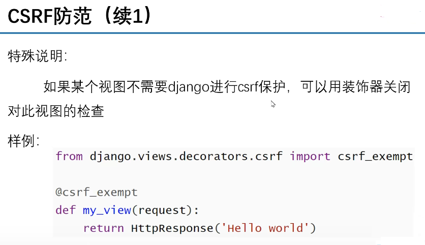


## 缓存
### 配置
#### 数据库缓存
将缓存的数据粗出在数据库中，尽管存储介质没有更换，但是当把一次负责查询的结果直接存储到表里，比如多个条件的过滤查询结果，可避免重复进行复杂查询，提升效率
配置如下：
```
CACHES = {    
    'default': {        
        'BACKEND': 'django.core.cache.backends.db.DatabaseCache',
        'LOCATION': 'my_cache_table',        
        'TIMEOUT': 300,        
        'OPTIONS': {            '
            MAX_ENTRIES': 10000,            
            'CULL_FREQUENCY': 5        
         }   
    }
}
```
数据库缓存设置后需要手动执行命令创建缓存表：
```
python manage.py createcachetable
```

#### 本地内存缓存
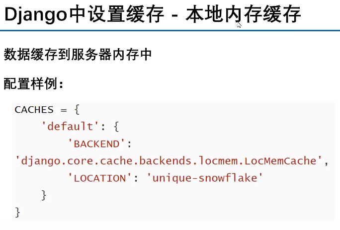
#### 文件系统缓存
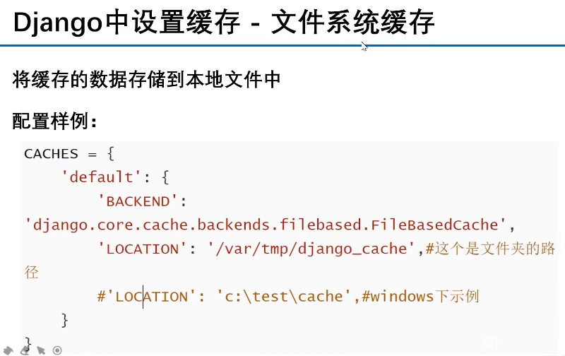

### 使用缓存
#### 整体缓存
##### 视图函数
使用装饰器
```
from django.views.decorators.cache import cache_page

@cache_page(30)     #30s后过期
def my_view(request):
    ...
```
##### 路由中
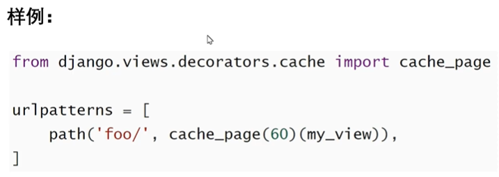
#### 局部缓存
**先引入cache对象**
方式一：
使用caches['CACHE配置key']导入具体对象
```
from django.core.cache import caches

cache1 = caches['myalias']
```
方式2：
from django.core.cache import cache 相当于直接引入CACHES配置项中的‘default’项

**缓存api的使用**

1. cache.set(key, value, timeout)存储缓存
key：缓存的key，字符串类型
value: Python对象
timeout: 缓存存储时间（s），默认为CACHES中的TIMEOUT值
返回值：None

2. cache.get(key)获取缓存，如果没有数据，则返回None
3. cache.add(key, value)，存储缓存，只在key不存在时生效，返回值True时存储成功，false为存储失败
4. cache.get_or_set(key, value, timeout)，如果未获取到数据则进行set操作，返回值为value
5. cache.set_many(dict, timeout)，批量存储缓存
dict：key和value的字典
timeout：存储时间（s）
返回值;插入不成功的key的数组
6. cache.get_many(key_list)，批量获取缓存数据
key_list：包含key的数组
返回值：取到的key和value的字典
7. cache.delete(key)，删除key的缓存数据，返回值为None
8. cache.delete_many(key_list)，批量删除，返回值，None

## 中间件

* 中间件是django请求/响应处理的钩子框架。它是一个轻量级的、低级的插件系统，用于全局改变Django的输入或输出
* 中间件以类的形式体现
* 每个中间件组件负责做一些特定的功能

### 编写中间件

* 中间件类必须继承自django.utils.deprecation.MiddelwareMixin类
* 中间件类必须实现下列五个方法中的一个或多个：
    1.   process_request(self, request):执行路由之前被调用，在每个请求上调用，返回None或HttpResponse对象
    2.   process_view(self, request, callback, callback_args, callback_kwargs)：调用视图之前被调用，在每个请求上调用，返回None或HttpResponse对象
    3.   process_response(self, request, response)：所有响应返回浏览器被调用，在每个请求上调用，返回HttpResponse对象
    4.   process_exception(self, request, exception)：当处理过程中抛出异常时调用，返回一个HttpResponse对象
    5.   process_template_response(self, request, response)：在视图函数执行完毕且视图返回的对象中包含render方法时被调用，该方法需要返回实现了render方法的响应对象
    **注意：中间件中的大多数方法在返回None时表示忽略当前操作进入下一项事件，当返回HttpResponse对象时表示此请求结束，直接返回给客户端**

### 注册中间件
settings.py中需要注册一下自定义的中间件
```
MIDDLEWARE = [
    ...
]
```
注意：配置为数组，中间件被调用时以‘先上到下’再‘由下到上’的顺序调用

## rest framework


## 项目部署

1.   在安装机器上安装和配置同版本的环境（python，数据库等）
2.   django项目迁移，把项目文件夹放置在服务器
3.   用uwsgi替代python manage.py runserver方法启动服务器
4.   配置nginx反向代理服务器
5.   用nginx配置静态文件路径，解决静态路径问题

### WSGI定义

WSGI Web服务器网关接口，是Python应用程序或框架和web服务器之间的一种接口，被广泛使用。
当开发结束后，完善的项目代码需要在一个搞笑稳定的环境中运行，这时可以使用WSGI

### uWSGI定义
uWSGI是WSGI的一种，它实现了http协议、WSGI协议以及uwsgi协议，uWSGI功能完善，支持协议众多，在python web圈热度极高，uWSGI主要以学习配置为主

### uWSGI安装
执行：`pip3 install uwsgi==版本号`
检查是否安装成功：`pip3 freeze | grep -i 'uwsgi'`

### 配置uWSGI
添加配置文件 项目同名文件夹/uwsgi.ini
如：mysite1/mysite1/uwsgi.ini
文件以[uwsgi]开头，有如下配置项：
套接字方式的IP地址：端口号,此模式需要有nginx
`socket=127.0.0.1:8000`
Http通信方式的IP地址:端口号
`http=127.0.0.1:8000`
项目当前工作目录：
`chdir=/home/.../my_project`
项目中wsgi.py文件的目录，相对于当前工作目录,是相对于chdir的相对路径
`wsgi-file=my_project/wsgi.py`
进程个数：
`process=4`
每个进程的线程个数：
`threads=2`
服务的pid记录文件
`pidfile=uwsgi.pid`
服务的目标日志文件位置：
`daemonize=uwsgi.log`
开启主进程管理模式：
`master=true`
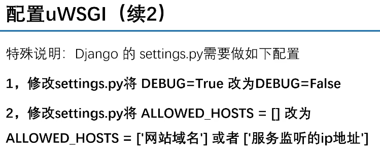

### uWSGI的运行管理
**启动uwsgi**:
cd 到uWSGI的配置文件所在目录：
`uwsgi --ini uwsgi.ini`
**停止uwsgi**：
cd 到uWSGI的配置文件所在目录：
`uwsgi --stop uwsgi.pid`
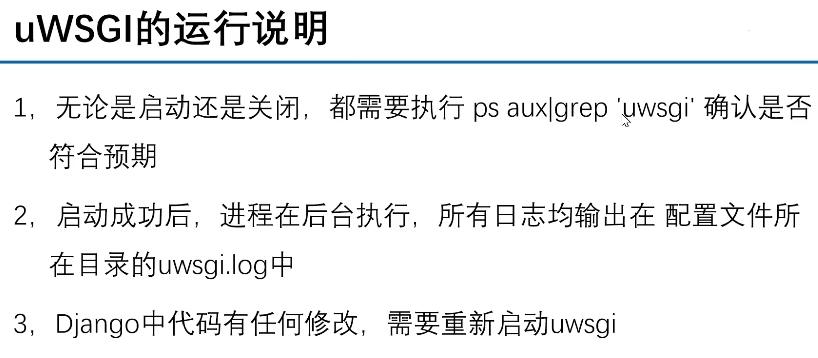
### nginx反向代理
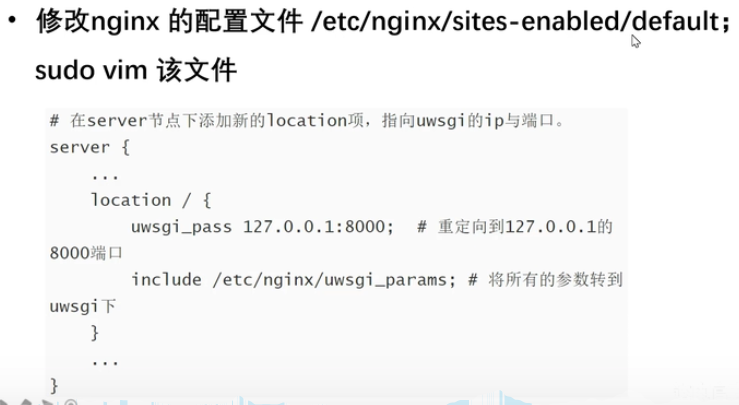
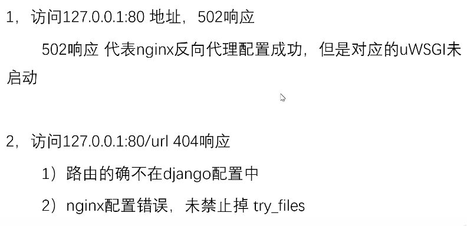

#### 静态文件配置
django框架settings.py中debug=False后，静态文件会无法正常加载了，样式会丢失，可以使用nginx加载静态文件
配置步骤：

1. 创建新路径，主要存放Django所有静态文件，如：/home/.../项目名_static/
2. 在Django的settings.py中添加新配置
`STATIC_ROOT = '/home/.../项目名_static/static'`
注意，此路径为存放所有正式环境中需要的配置文件
3. 进入项目，执行
`python manage.py collectstatic`
Django将项目所有静态文件复制到STATIC_ROOT中，包括Django内建的静态文件
4. Nginx配置添加新配置
```
server{
    ...
    location /static {
        # root 第一步创建文件夹的绝对路径
        root /home/.../项目名_static;
    }
    ...
}
```
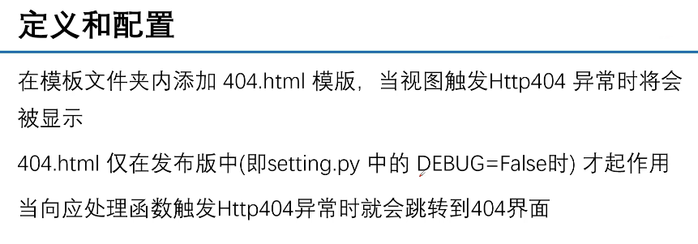
邮件告警：
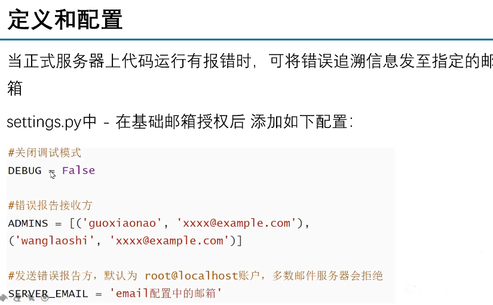
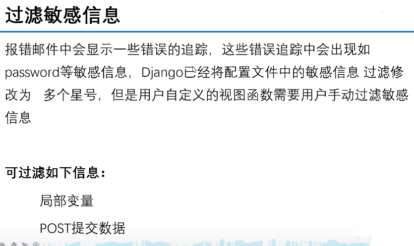
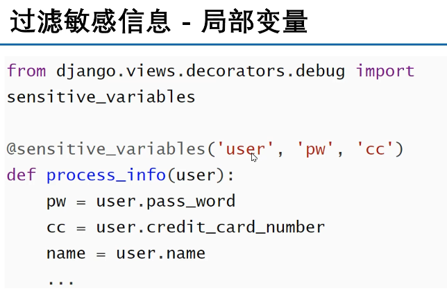
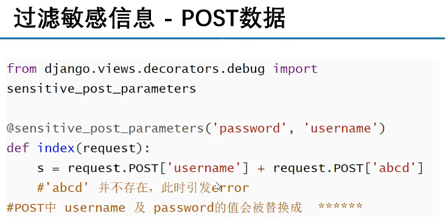
