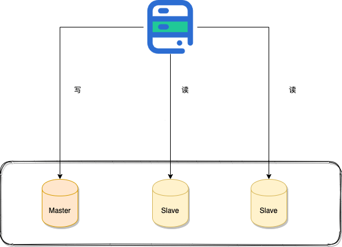
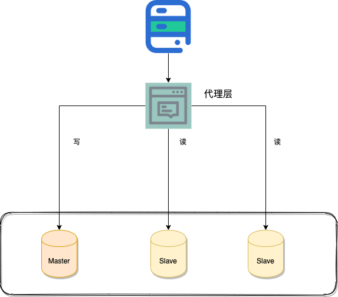
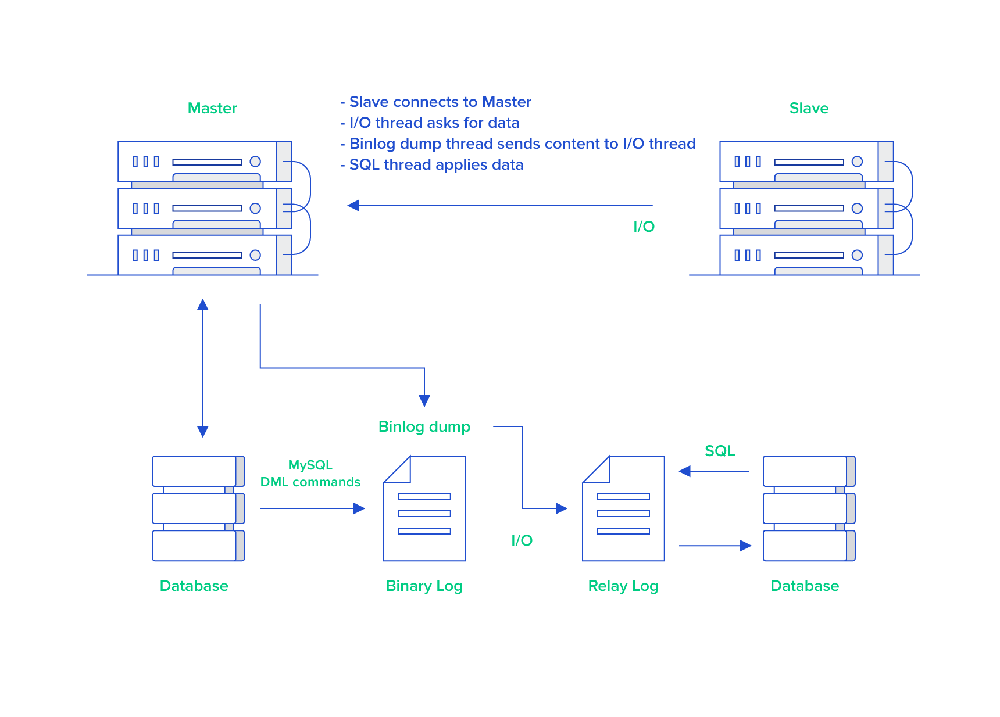
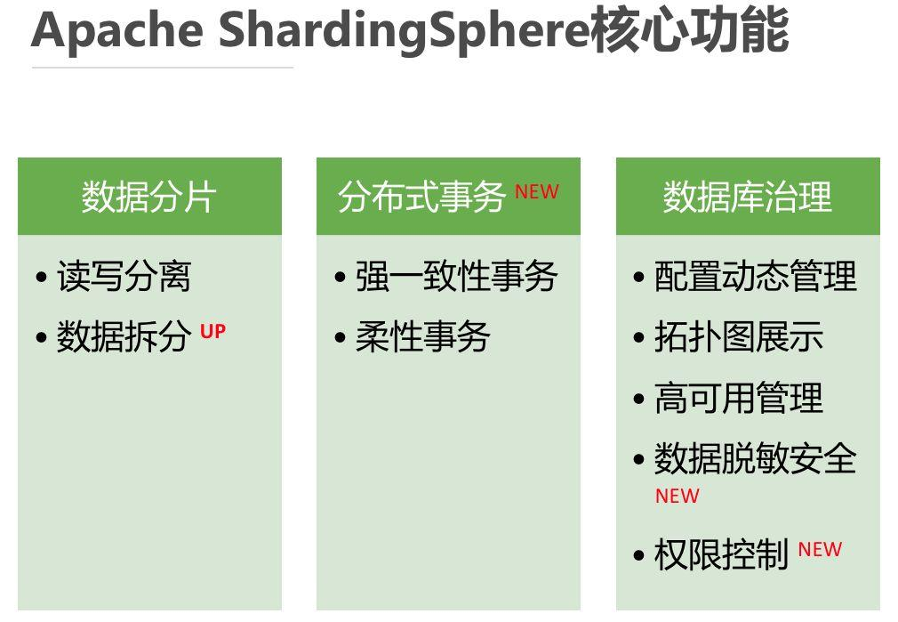

# 读写分离&分库分表

## 读写分离

读写分离主要是为了将对数据库的读写操作分散到不同的数据库节点上。 这样的话，就能够小幅提升写性能，大幅提升读性能。


一般情况下，我们都会选择一主多从，也就是一台主数据库负责写，其他的从数据库负责读。主库和从库之间会进行数据同步，以保证从库中数据的准确性。这样的架构实现起来比较简单，并且也符合系统的写少读多的特点。

### 读写分离会带来什么问题？如何解决？

读写分离对于提升数据库的并发非常有效，但是，同时也会引来一个问题：主库和从库的数据存在延迟，比如你写完主库之后，主库的数据同步到从库是需要时间的，这个时间差就导致了主库和从库的数据不一致性问题。这也就是我们经常说的 主从同步延迟 。

主从同步延迟问题的解决，没有特别好的一种方案（可能是我太菜了，欢迎评论区补充）。你可以根据自己的业务场景，参考一下下面几种解决办法。
#### 强制将读请求路由到主库处理

既然你从库的数据过期了，那我就直接从主库读取嘛！这种方案虽然会增加主库的压力，但是，实现起来比较简单，也是我了解到的使用最多的一种方式。比如 Sharding-JDBC 就是采用的这种方案。通过使用 Sharding-JDBC 的 HintManager 分片键值管理器，我们可以强制使用主库。
```
HintManager hintManager = HintManager.getInstance();
hintManager.setMasterRouteOnly();
// 继续JDBC操作
```
对于这种方案，你可以将那些必须获取最新数据的读请求都交给主库处理。

#### 延迟读取

还有一些朋友肯定会想既然主从同步存在延迟，那我就在延迟之后读取啊，比如主从同步延迟 0.5s,那我就 1s 之后再读取数据。这样多方便啊！方便是方便，但是也很扯淡。不过，如果你是这样设计业务流程就会好很多：对于一些对数据比较敏感的场景，你可以在完成写请求之后，避免立即进行请求操作。比如你支付成功之后，跳转到一个支付成功的页面，当你点击返回之后才返回自己的账户。

### 如何实现读写分离？

不论是使用哪一种读写分离具体的实现方案，想要实现读写分离一般包含如下几步：

1. 部署多台数据库，选择其中的一台作为主数据库，其他的一台或者多台作为从数据库。
2. 保证主数据库和从数据库之间的数据是实时同步的，这个过程也就是我们常说的主从复制。
3. 系统将写请求交给主数据库处理，读请求交给从数据库处理。

落实到项目本身的话，常用的方式有两种：

**1.代理方式**


我们可以在应用和数据中间加了一个代理层。应用程序所有的数据请求都交给代理层处理，代理层负责分离读写请求，将它们路由到对应的数据库中。提供类似功能的中间件有 MySQL Router（官方）、Atlas（基于 MySQL Proxy）、Maxscale、MyCat。
**2.组件方式**

在这种方式中，我们可以通过引入第三方组件来帮助我们读写请求。这也是我比较推荐的一种方式。这种方式目前在各种互联网公司中用的最多的，相关的实际的案例也非常多。如果你要采用这种方式的话，推荐使用 [sharding-jdbc](https://shardingsphere.apache.org/document/legacy/3.x/document/cn/manual/sharding-jdbc/usage/read-write-splitting/) ，直接引入 jar 包即可使用，非常方便。同时，也节省了很多运维的成本。

### 主从复制原理了解么？

MySQL binlog(binary log 即二进制日志文件) 主要记录了 MySQL 数据库中数据的所有变化(数据库执行的所有 DDL 和 DML 语句)。因此，我们根据主库的 MySQL binlog 日志就能够将主库的数据同步到从库中。

更具体和详细的过程如下：


1. 主库将数据库中数据的变化写入到 binlog
2. 从库连接主库
3. 从库会创建一个 I/O 线程向主库请求更新的 binlog
4. 主库会创建一个 binlog dump 线程来发送 binlog ，从库中的 I/O 线程负责接收
5. 从库的 I/O 线程将接收的 binlog 写入到 relay log 中。
6. 从库的 SQL 线程读取 relay log 同步数据本地（也就是再执行一遍 SQL ）。

你一般看到 binlog 就要想到主从复制。当然，除了主从复制之外，binlog 还能帮助我们实现数据恢复。

不知道大家有没有使用过阿里开源的一个叫做**canal**的工具。这个工具可以帮助我们实现 MySQL 和其他数据源比如 Elasticsearch 或者另外一台 MySQL 数据库之间的数据同步。很显然，这个工具的底层原理肯定也是依赖 binlog。canal 的原理就是模拟 MySQL 主从复制的过程，解析 binlog 将数据同步到其他的数据源。

另外，像咱们常用的分布式缓存组件 Redis 也是通过主从复制实现的读写分离。

**MySQL 主从复制是依赖于 binlog 。另外，常见的一些同步 MySQL 数据到其他数据源的工具（比如 canal）的底层一般也是依赖 binlog 。**

## 分库分表

读写分离主要应对的是数据库读并发，没有解决**数据库存储问题**。试想一下：如果 MySQL 一张表的数据量过大怎么办?换言之，我们该如何解决**MySQL的存储压力**呢？答案之一就是 分库分表。

### 何为分库？

分库就是将数据库中的数据分散到不同的数据库上。下面这些操作都涉及到了分库：

* 你将数据库中的用户表和用户订单表分别放在两个不同的数据库。
* 由于用户表数据量太大，你对用户表进行了水平切分，然后将切分后的 2 张用户表分别放在两个不同的数据库。

### 何为分表？

分表 就是对单表的数据进行拆分，可以是垂直拆分，也可以是水平拆分。

#### 垂直拆分

简单来说，垂直拆分是对数据表列的拆分，比如某张表的数据量太大，但是行数没有达到上限，就可以把一张列比较多的表拆分为多张表。举个例子：我们可以将用户信息表中的一些列单独抽出来作为一个表。

#### 水平拆分

简单来说，水平拆分是对数据表行的拆分，把一张行比较多的表拆分为多张表。举个例子：我们可以将用户信息表拆分成多个用户信息表，这样就可以避免单一表数据量过大对性能造成影响。

### 什么情况下需要分库分表？

遇到下面几种场景可以考虑分库分表：

* 单表的数据达到千万级别以上，数据库读写速度比较缓慢（分表）。
* 数据库中的数据占用的空间越来越大，备份时间越来越长（分库）。
* 应用的并发量太大（分库）。


### 分库分表会带来什么问题呢？

记住，你在公司做的任何技术决策，不光是要考虑这个技术能不能满足我们的要求，是否适合当前业务场景，还要重点考虑其带来的成本。引入分库分表之后，会给系统带来什么挑战呢？

* **join 操作** ： 同一个数据库中的表分布在了不同的数据库中，导致无法使用 join 操作。这样就导致我们需要手动进行数据的封装，比如你在一个数据库中查询到一个数据之后，再根据这个数据去另外一个数据库中找对应的数据。
* 事务问题 ：同一个数据库中的表分布在了不同的数据库中，如果单个操作涉及到多个数据库，那么数据库自带的事务就无法满足我们的要求了。
* 分布式 id ：分库之后， 数据遍布在不同服务器上的数据库，数据库的自增主键已经没办法满足生成的主键唯一了。我们如何为不同的数据节点生成全局唯一主键呢？这个时候，我们就需要为我们的系统引入分布式 id 了。
* ......

另外，引入分库分表之后，一般需要 DBA 的参与，同时还需要更多的数据库服务器，这些都属于成本。

### 分库分表有没有什么比较推荐的方案？

ShardingSphere 项目（包括 Sharding-JDBC、Sharding-Proxy 和 Sharding-Sidecar）是当当捐入 Apache 的，目前主要由京东数科的一些巨佬维护。


ShardingSphere 绝对可以说是当前分库分表的首选！ShardingSphere 的功能完善，除了支持读写分离和分库分表，还提供分布式事务、数据库治理等功能。另外，ShardingSphere 的生态体系完善，社区活跃，文档完善，更新和发布比较频繁。

### 分库分表后，数据怎么迁移呢？

分库分表之后，我们如何将老库（单库单表）的数据迁移到新库（分库分表后的数据库系统）呢？比较简单同时也是非常常用的方案就是停机迁移，写个脚本老库的数据写到新库中。比如你在凌晨 2 点，系统使用的人数非常少的时候，挂一个公告说系统要维护升级预计 1 小时。然后，你写一个脚本将老库的数据都同步到新库中。

如果你不想停机迁移数据的话，也可以考虑双写方案。双写方案是针对那种不能停机迁移的场景，实现起来要稍微麻烦一些。具体原理是这样的：

* 我们对老库的更新操作（增删改），同时也要写入新库（双写）。如果操作的数据不存在于新库的话，需要插入到新库中。 这样就能保证，咱们新库里的数据是最新的。
* 在迁移过程，双写只会让被更新操作过的老库中的数据同步到新库，我们还需要自己写脚本将老库中的数据和新库的数据做比对。如果新库中没有，那咱们就把数据插入到新库。如果新库有，旧库没有，就把新库对应的数据删除（冗余数据清理）。
* 重复上一步的操作，直到老库和新库的数据一致为止。

想要在项目中实施双写还是比较麻烦的，很容易会出现问题。我们可以借助上面提到的数据库同步工具 Canal 做增量数据迁移（还是依赖 binlog，开发和维护成本较低）。


## ShardingSphere5
官网见：https://shardingsphere.apache.org/document/current/cn/user-manual/shardingsphere-jdbc/spring-boot-starter/

### 分库分表（springboot+Mybatis-plus）
**依赖导入：**
```
<dependencies>
        <dependency>
            <groupId>org.springframework.boot</groupId>
            <artifactId>spring-boot-starter-web</artifactId>
        </dependency>

        <!-- https://mvnrepository.com/artifact/org.projectlombok/lombok -->
        <dependency>
            <groupId>org.projectlombok</groupId>
            <artifactId>lombok</artifactId>
            <version>${lombok.version}</version>
        </dependency>

        <!-- https://mvnrepository.com/artifact/mysql/mysql-connector-java -->
        <dependency>
            <groupId>mysql</groupId>
            <artifactId>mysql-connector-java</artifactId>
            <scope>runtime</scope>
        </dependency>

        <dependency>
            <groupId>org.springframework.boot</groupId>
            <artifactId>spring-boot-starter-jdbc</artifactId>
        </dependency>

        <!-- https://mvnrepository.com/artifact/com.baomidou/mybatis-plus-boot-starter -->
        <dependency>
            <groupId>com.baomidou</groupId>
            <artifactId>mybatis-plus-boot-starter</artifactId>
            <version>3.5.2</version>
        </dependency>

        <!-- https://mvnrepository.com/artifact/org.apache.shardingsphere/shardingsphere-jdbc-core-spring-boot-starter -->
        <dependency>
            <groupId>org.apache.shardingsphere</groupId>
            <artifactId>shardingsphere-jdbc-core-spring-boot-starter</artifactId>
            <version>5.2.0</version>
        </dependency>

        <dependency>
            <groupId>org.springframework.boot</groupId>
            <artifactId>spring-boot-starter-test</artifactId>
            <scope>test</scope>
        </dependency>
</dependencies>
```
**配置文件：**
```
spring:
  main:
    #  一个实体类对应三张表，覆盖，不然启动报错
    allow-bean-definition-overriding: true
  # Sharding-JDBC的配置
  shardingsphere:
    mode:
      type: Standalone
      repository:
        type: JDBC
    datasource:
      # 数据源（逻辑名字）
      names: m0,m1
      # 配置数据源
      m0:
        type: com.zaxxer.hikari.HikariDataSource
        driver-class-name: com.mysql.cj.jdbc.Driver
        url: jdbc:mysql://192.168.8.128:3306/test_0?characterEncoding=utf8&useSSL=true&createDatabaseIfNotExist=true&serverTimezone=GMT&nullNamePatternMatchesAll=true
        username: root
        password: Haha135790!
      m1:
        type: com.zaxxer.hikari.HikariDataSource
        driver-class-name: com.mysql.cj.jdbc.Driver
        url: jdbc:mysql://192.168.8.128:3307/test_1?characterEncoding=utf8&useSSL=true&createDatabaseIfNotExist=true&serverTimezone=GMT&nullNamePatternMatchesAll=true
        username: root
        password: Haha135790!
    # 分片的配置
    rules:
      sharding:
        # 表的分片策略
        tables:
          # 逻辑表的名称
          user:
            # 数据节点配置，采用Groovy表达式
            actual-data-nodes: m$->{0..1}.user_$->{0..1}
            database-strategy:
              standard:
                sharding-column: cid
                sharding-algorithm-name: user-data-inline

            #配置策略
            table-strategy:
              standard:
                sharding-column: name
                # 精确匹配
                sharding-algorithm-name: user-inline
            key-generate-strategy:
              column: cid
              key-generator-name: cid_snowflake
        sharding-algorithms:
          user-data-inline:
            type: INLINE
            props:
              algorithm-expression: m${cid % 2}
          user-inline:
            type: HASH_MOD
            props:
              sharding-count: 2
        default-sharding-column: cid
        binding-tables: user
        key-generators:
          cid_snowflake:
            type: SNOWFLAKE

    props:
      sql-show: true

logging:
  level:
    com.example.shardingjdbc: DEBUG

mybatis-plus:
  mapper-locations: classpath:mapper/*.xml
  type-aliases-package: com.example.shardingjdbc.entity
  global-config:
    db-config:
      #主键类型 AUTO:"数据库ID自增" INPUT:"用户输入ID",ID_WORKER:"全局唯一ID (数字类型唯一ID)", UUID:"全局唯一ID UUID";
      id-type: auto
      #字段策略 IGNORED:"忽略判断"  NOT_NULL:"非 NULL 判断")  NOT_EMPTY:"非空判断"
      field-strategy: NOT_EMPTY
      #数据库类型
      db-type: MYSQL
    configuration:
      # 是否开启自动驼峰命名规则映射:从数据库列名到Java属性驼峰命名的类似映射
      map-underscore-to-camel-case: true
      # 如果查询结果中包含空值的列，则 MyBatis 在映射的时候，不会映射这个字段
      call-setters-on-nulls: true
      # 这个配置会将执行的sql打印出来，在开发或测试的时候可以用
      log-impl: org.apache.ibatis.logging.stdout.StdOutImpl
```
其中有两个数据源，test_0库和test_1库，每个库中都包含user_0表和user_1表。

实体类：
```
import com.baomidou.mybatisplus.annotation.TableId;
import com.baomidou.mybatisplus.annotation.TableName;
import com.fasterxml.jackson.annotation.JsonFormat;
import lombok.AllArgsConstructor;
import lombok.Builder;
import lombok.Data;
import lombok.NoArgsConstructor;
import org.springframework.format.annotation.DateTimeFormat;

import java.util.Date;

@Data
@AllArgsConstructor
@NoArgsConstructor
@Builder
@TableName("user")
public class User {

    /**
     * 该配置会优先于ShardingSphere在配置文件中的主键生成策略
     * 所以，如果想使得ShardingSphere的主键策略生效，需要配置为AUTO
     * 但是配置了AUTO，但是没有配置ShardingSphere的主键生成策略，则会依赖于数据库本生的主键自增策略
     */
    @TableId(type = IdType.AUTO)
    private Long cid;

    private String name;

    private Boolean gender;

    private String data;

    @JsonFormat(pattern = "yyyy-MM-dd HH:mm:ss",timezone="GMT+8")
    @DateTimeFormat(pattern = "yyyy-MM-dd HH:mm:ss")
    private Date createTime;
}
```
**注意：**实体类这里需要注意主键的配置，Mybatis-plus的主键策略优先级高于ShardingSphere，上述配置是基于ShardingSphere的主键生成策略，如果想使得ShardingSphere的主键策略生效，需要配置为AUTO，但是配置了AUTO，但是没有配置ShardingSphere的主键生成策略，则会依赖于数据库本生的主键自增策略，如果都没有则会报错。

### 读写分离
依赖具体与分库分表一致
**配置文件：**
```
spring:
  main:
    #  一个实体类对应三张表，覆盖，不然启动报错
    allow-bean-definition-overriding: true
  # Sharding-JDBC的配置
  shardingsphere:
    mode:
      type: Standalone
      repository:
        type: JDBC
    datasource:
      # 数据源（逻辑名字）
      names: m0,m1
      # 配置数据源
      m0:
        type: com.zaxxer.hikari.HikariDataSource
        driver-class-name: com.mysql.cj.jdbc.Driver
        url: jdbc:mysql://192.168.8.128:3306/test?characterEncoding=utf8&useSSL=true&createDatabaseIfNotExist=true&serverTimezone=GMT&nullNamePatternMatchesAll=true
        username: root
        password: Haha135790!
      m1:
        type: com.zaxxer.hikari.HikariDataSource
        driver-class-name: com.mysql.cj.jdbc.Driver
        url: jdbc:mysql://192.168.8.128:3307/test?characterEncoding=utf8&useSSL=true&createDatabaseIfNotExist=true&serverTimezone=GMT&nullNamePatternMatchesAll=true
        username: root
        password: Haha135790!
    # 分片的配置
    rules:
      readwrite-splitting:
        data-sources:
          myds:
            static-strategy:
              write-data-source-name: m0
              read-data-source-names:
                - m1
            load-balancer-name: alg_round #自定义

        load-balancers:
          alg_round:
            type: ROUND_ROBIN

    props:
      sql-show: true

logging:
  level:
    com.example.shardingjdbc: DEBUG

mybatis-plus:
  mapper-locations: classpath:mapper/*.xml
  type-aliases-package: com.example.shardingjdbc.entity
  global-config:
    db-config:
      #主键类型 AUTO:"数据库ID自增" INPUT:"用户输入ID",ID_WORKER:"全局唯一ID (数字类型唯一ID)", UUID:"全局唯一ID UUID";
      id-type: auto
      #字段策略 IGNORED:"忽略判断"  NOT_NULL:"非 NULL 判断")  NOT_EMPTY:"非空判断"
      field-strategy: NOT_EMPTY
      #数据库类型
      db-type: MYSQL
    configuration:
      # 是否开启自动驼峰命名规则映射:从数据库列名到Java属性驼峰命名的类似映射
      map-underscore-to-camel-case: true
      # 如果查询结果中包含空值的列，则 MyBatis 在映射的时候，不会映射这个字段
      call-setters-on-nulls: true
      # 这个配置会将执行的sql打印出来，在开发或测试的时候可以用
      log-impl: org.apache.ibatis.logging.stdout.StdOutImpl
```

**说明：**

* 实体类的主键使用mybatis-plus的分布式主键，具体根据业务结合就好
* 配置容器化mysql的主从，开启binlog需要在配置文件目录的conf.d目录下新建my.cnf，并且配置binlog的配置来开启
* 若是开启了事务，则同一事务内的读写都会在主节点执行

binlog配置：
```
[mysqld]
#binlog格式
binlog_format = mixed
#存放地址，注意这个地址是docker容器里面的地址，不是宿主机里面的地址
log-bin=/var/lib/mysql/mysql-bin
server-id=123654
#存放时间
expire_logs_days=30
#最大文件大小
max_binlog_size=50m
#缓存大小
binlog_cache_size=10m
#最大缓存大小
max_binlog_cache_size=512m
```

# 负载均衡

负载均衡系统通常用于将任务比如用户请求处理分配到多个服务器处理以提高网站、应用或者数据库的性能和可靠性。常见的负载均衡系统包括 3 种：

1. DNS 负载均衡 ：一般用来实现地理级别的均衡。
2. 硬件负载均衡 ： 通过单独的硬件设备比如 F5 来实现负载均衡功能（硬件的价格一般很贵）。
3. 软件负载均衡 ：通过负载均衡软件比如 Nginx 来实现负载均衡功能。
