# 系统设计基础

## 系统设计必备基础

### RESTful API

我们在进行后端开发的时候，主要的工作就是为前端或者其他后端服务提供 API 比如查询用户数据的 API 。RESTful API 是一种基于 REST 构建的 API，它是一种被设计的更好使用的 API。

API（Application Programming Interface） 翻译过来是应用程序编程接口的意思。
但是， API 不仅仅代表后端系统暴露的接口，像框架中提供的方法也属于 API 的范畴。

RESTful API 经常也被叫做 REST API，它是基于 REST 构建的 API。这个 REST 到底是什么，我们后文在讲，涉及到的概念比较多。

RESTful API 可以让你看到 URL+Http Method 就知道这个 URL 是干什么的，让你看到了 HTTP 状态码（status code）就知道请求结果如何。像咱们在开发过程中设计 API 的时候也应该至少要满足 RESTful API 的最基本的要求（比如接口中尽量使用名词，使用 POST 请求创建资源，DELETE 请求删除资源等等，示例：GET /notes/id：获取某个指定 id 的笔记的信息）。

#### 解读 REST
REST 是 REpresentational State Transfer 的缩写。这个词组的翻译过来就是“表现层状态转化”。

* **资源（Resource）** ：我们可以把真实的对象数据称为资源。一个资源既可以是一个集合，也可以是单个个体。比如我们的班级 classes 是代表一个集合形式的资源，而特定的 class 代表单个个体资源。每一种资源都有特定的 URI（统一资源标识符）与之对应，如果我们需要获取这个资源，访问这个 URI 就可以了，比如获取特定的班级：/class/12。另外，资源也可以包含子资源，比如 /classes/classId/teachers：列出某个指定班级的所有老师的信息。
* **表现形式（Representational）**："资源"是一种信息实体，它可以有多种外在表现形式。我们把"资源"具体呈现出来的形式比如 json，xml，image,txt 等等叫做它的"表现层/表现形式"。
* **状态转移（State Transfer）** ：大家第一眼看到这个词语一定会很懵逼？内心 BB：这尼玛是啥啊？ 大白话来说 REST 中的状态转移更多地描述的服务器端资源的状态，比如你通过增删改查（通过 HTTP 动词实现）引起资源状态的改变。ps:互联网通信协议 HTTP 协议，是一个无状态协议，所有的资源状态都保存在服务器端。

综合上面的解释，我们总结一下什么是 RESTful 架构：

1. 每一个 URI 代表一种资源；
2. 客户端和服务器之间，传递这种资源的某种表现形式比如 json，xml，image,txt 等等；
3. 客户端通过特定的 HTTP 动词，对服务器端资源进行操作，实现"表现层状态转化"。

#### RESTful API 规范
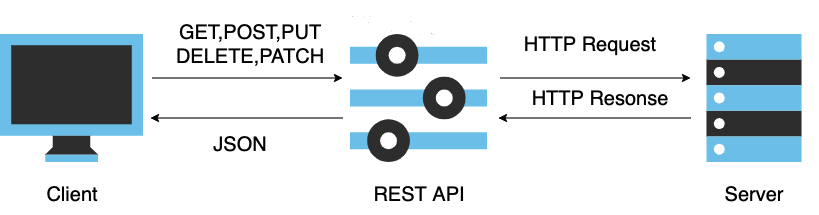

##### 动作

* GET：请求从服务器获取特定资源。举个例子：GET /classes（获取所有班级）
* POST ：在服务器上创建一个新的资源。举个例子：POST /classes（创建班级）
* PUT ：更新服务器上的资源（客户端提供更新后的整个资源）。举个例子：PUT /classes/12（更新编号为 12 的班级）
* DELETE ：从服务器删除特定的资源。举个例子：DELETE /classes/12（删除编号为 12 的班级）
* PATCH ：更新服务器上的资源（客户端提供更改的属性，可以看做作是部分更新），使用的比较少，这里就不举例子了。

##### 路径（接口命名）

路径又称"终点"（endpoint），表示 API 的具体网址。实际开发中常见的规范如下：

1. 网址中不能有动词，只能有名词，API 中的名词也应该使用复数。

因为 REST 中的资源往往和数据库中的表对应，而数据库中的表都是同种记录的"集合"（collection）。如果 API 调用并不涉及资源（如计算，翻译等操作）的话，可以用动词。比如：GET /calculate?param1=11&param2=33 。

2. 不用大写字母，建议用中杠 - 不用下杠 _ 。

比如邀请码写成 invitation-code而不是 invitation_code 。

3. 善用版本化 API。

当我们的 API 发生了重大改变而不兼容前期版本的时候，我们可以通过 URL 来实现版本化，比如 http://api.example.com/v1、http://apiv1.example.com 。版本不必非要是数字，只是数字用的最多，日期、季节都可以作为版本标识符，项目团队达成共识就可。

4. 接口尽量使用名词，避免使用动词。

RESTful API 操作（HTTP Method）的是资源（名词）而不是动作（动词）。

现在有这样一个 API 提供班级（class）的信息，还包括班级中的学生和教师的信息，则它的路径应该设计成下面这样：
```
GET    /classes：列出所有班级
POST   /classes：新建一个班级
GET    /classes/{classId}：获取某个指定班级的信息
PUT    /classes/{classId}：更新某个指定班级的信息（一般倾向整体更新）
PATCH  /classes/{classId}：更新某个指定班级的信息（一般倾向部分更新）
DELETE /classes/{classId}：删除某个班级
GET    /classes/{classId}/teachers：列出某个指定班级的所有老师的信息
GET    /classes/{classId}/students：列出某个指定班级的所有学生的信息
DELETE /classes/{classId}/teachers/{ID}：删除某个指定班级下的指定的老师的信息
```
理清资源的层次结构，比如业务针对的范围是学校，那么学校会是一级资源:/schools，老师: /schools/teachers，学生: /schools/students 就是二级资源。

##### 过滤信息（Filtering）

如果我们在查询的时候需要添加特定条件的话，建议使用 url 参数的形式。比如我们要查询 state 状态为 active 并且 name 为 guidegege 的班级：
```
GET    /classes?state=active&name=guidegege
```
比如我们要实现分页查询：
```
GET    /classes?page=1&size=10 //指定第1页，每页10个数据
```

##### 状态码（Status Codes）
状态码范围：

| 2xx：成功 | 3xx：重定向    | 4xx：客户端错误  | 5xx：服务器错误 |
| --------- | -------------- | ---------------- | --------------- |
| 200 成功  | 301 永久重定向 | 400 错误请求     | 500 服务器错误  |
| 201 创建  | 304 资源未修改 | 401 未授权       | 502 网关错误    |
|           |                | 403 禁止访问     | 504 网关超时    |
|           |                | 404 未找到       |                 |
|           |                | 405 请求方法不对 |                 |

#### RESTful 的极致 HATEOAS

>RESTful 的极致是 hateoas ，但是这个基本不会在实际项目中用到。

上面是 RESTful API 最基本的东西，也是我们平时开发过程中最容易实践到的。实际上，RESTful API 最好做到 Hypermedia，即返回结果中提供链接，连向其他 API 方法，使得用户不查文档，也知道下一步应该做什么。
比如，当用户向 api.example.com 的根目录发出请求，会得到这样一个返回结果
```
{"link": {
  "rel":   "collection https://www.example.com/classes",
  "href":  "https://api.example.com/classes",
  "title": "List of classes",
  "type":  "application/vnd.yourformat+json"
}}
```
上面代码表示，文档中有一个 link 属性，用户读取这个属性就知道下一步该调用什么 API 了。rel 表示这个 API 与当前网址的关系（collection 关系，并给出该 collection 的网址），href 表示 API 的路径，title 表示 API 的标题，type 表示返回类型 Hypermedia API 的设计被称为HATEOAS。
在 Spring 中有一个叫做 HATEOAS 的 API 库，通过它我们可以更轻松的创建出符合 HATEOAS 设计的 API。

### 命名

#### 常见命名规则以及适用场景

##### 驼峰命名法（CamelCase）

驼峰命名法应该我们最常见的一个，这种命名方式使用大小写混合的格式来区别各个单词，并且单词之间不使用空格隔开或者连接字符连接的命名方式

###### 大驼峰命名法（UpperCamelCase）

类名需要使用大驼峰命名法（UpperCamelCase）
正例：
```
ServiceDiscovery、ServiceInstance、LruCacheFactory
```
###### 小驼峰命名法（lowerCamelCase）

方法名、参数名、成员变量、局部变量需要使用小驼峰命名法（lowerCamelCase）。正例：
```
getUserInfo()
createCustomThreadPool()
setNameFormat(String nameFormat)
Uservice userService;
```

##### 蛇形命名法（snake_case）

测试方法名、常量、枚举名称需要使用蛇形命名法（snake_case）
在蛇形命名法中，各个单词之间通过下划线“_”连接，比如should_get_200_status_code_when_request_is_valid、CLIENT_CONNECT_SERVER_FAILURE。蛇形命名法的优势是命名所需要的单词比较多的时候，比如我把上面的命名通过小驼峰命名法给大家看一下：“shouldGet200StatusCodeWhenRequestIsValid”。感觉如何？ 相比于使用蛇形命名法（snake_case）来说是不是不那么易读？

##### 串式命名法（kebab-case）

在串式命名法中，各个单词之间通过连接符“-”连接，比如dubbo-registry。建议项目文件夹名称使用串式命名法（kebab-case），比如 dubbo 项目的各个模块的命名是下面这样的。
### 重构

重构就是利用设计模式(如组合模式、策略模式、责任链模式)、软件设计原则（如 SOLID 原则、YAGNI 原则、KISS 原则）和重构手段（如封装、继承、构建测试体系）来让代码更容易理解，更易于修改。

软件设计原则指导着我们组织和规范代码，同时，重构也是为了能够尽量设计出尽量满足软件设计原则的软件。正确重构的核心在于 步子一定要小，**每一步的重构都不会影响软件的正常运行，可以随时停止重构**。

常见的设计模式如下 ：
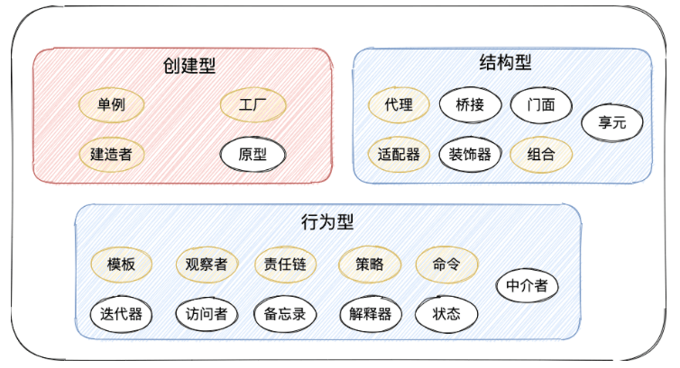

常见的软件设计原则如下 ：
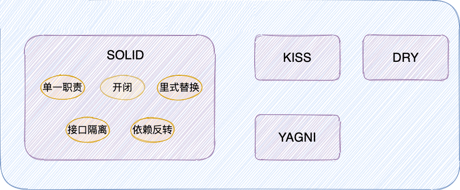

#### 为什么要重构？

在上面介绍重构定义的时候，我从比较抽象的角度介绍了重构的好处：重构的主要目的主要是提升代码&架构的灵活性/可扩展性以及复用性。

如果对应到一个真实的项目，重构具体能为我们带来什么好处呢？

1. **让代码更容易理解**： 通过添加注释、命名规范、逻辑优化等手段可以让我们的代码更容易被理解；
2. **避免代码腐化** ：通过重构干掉坏味道代码；
3. **加深对代码的理解** ：重构代码的过程会加深你对某部分代码的理解；
4. **发现潜在 bug** ：是这样的，很多潜在的 bug ，都是我们在重构的过程中发现的；


#### 何时进行重构？

重构在是开发过程中随时可以进行的，见机行事即可，并不需要单独分配一两天的时间专门用来重构。

##### 提交代码之前

《重构：改善代码既有设计》这本书介绍了一个 营地法则 的概念:

>编程时，需要遵循营地法则：保证你离开时的代码库一定比来时更健康。

这个概念表达的核心思想其实很简单：在你提交代码的之前，花一会时间想一想，我这次的提交是让项目代码变得更健康了，还是更腐化了，或者说没什么变化？项目团队的每一个人只有保证自己的提交没有让项目代码变得更腐化，项目代码才会朝着健康的方向发展。

##### 开发一个新功能之后&之前

在开发一个新功能之后，我们应该回过头看看是不是有可以改进的地方。在添加一个新功能之前，我们可以思考一下自己是否可以重构代码以让新功能的开发更容易。
一个新功能的开发不应该仅仅只有功能验证通过那么简单，我们还应该尽量保证代码质量。

##### Code Review 之后

Code Review 可以非常有效提高代码的整体质量，它会帮助我们发现代码中的坏味道以及可能存在问题的地方。并且， Code Review 可以帮助项目团队其他程序员理解你负责的业务模块，有效避免人员方面的单点风险。经历一次 Code Review ，你的代码可能会收到很多改进建议。

##### 捡垃圾式重构

当我们发现坏味道代码（垃圾）的时候，如果我们不想停下手头自己正在做的工作，但又不想放着垃圾不管，我们可以这样做：

* 如果这个垃圾很容易重构的话，我们可以立即重构它。
* 如果这个垃圾不太容易重构的话，我们可以先记录下来，当完成当下的任务再回来重构它。


##### 阅读理解代码的时候

搞开发的小伙伴应该非常有体会：我们经常需要阅读项目团队中其他人写的代码，也经常需要阅读自己过去写的代码。阅读代码的时候，通常要比我们写代码的时间还要多很多。我们在阅读理解代码的时候，如果发现一些坏味道的话，我们就可以对其进行重构。就比如说你在阅读张三写的某段代码的时候，你发现这段代码逻辑过于复杂难以理解，你有更好的写法，那你就可以对张三的这段代码逻辑进行重构。

#### 重构有哪些注意事项？

##### 单元测试是重构的保护网

单元测试可以为重构提供信心，降低重构的成本。我们要像重视生产代码那样，重视单元测试。另外，多提一句：持续集成也要依赖单元测试，当持续集成服务自动构建新代码之后，会自动运行单元测试来发现代码错误。

怎样才能算单元测试呢？ 网上的定义很多，很抽象，很容易把人给看迷糊了。我觉得对于单元测试的定义主要取决于你的项目，一个函数甚至是一个类都可以看作是一个单元。就比如说我们写了一个计算个人股票收益率的方法，我们为了验证它的正确性专门为它写了一个单元测试。再比如说我们代码有一个类专门负责数据脱敏，我们为了验证脱敏是否符合预期专门为这个类写了一个单元测试。

## 常用框架
### Spring
#### Spring AOP 和 AspectJ AOP 有什么区别？
Spring AOP 属于运行时增强，而 AspectJ 是编译时增强。 Spring AOP 基于代理(Proxying)，而 AspectJ 基于字节码操作(Bytecode Manipulation)。

Spring AOP 已经集成了 AspectJ ，AspectJ 应该算的上是 Java 生态系统中最完整的 AOP 框架了。AspectJ 相比于 Spring AOP 功能更加强大，但是 Spring AOP 相对来说更简单，如果我们的切面比较少，那么两者性能差异不大。但是，当切面太多的话，最好选择 AspectJ ，它比 Spring AOP 快很多。

#### Spring 框架中用到了哪些设计模式？

* 工厂设计模式 : Spring 使用工厂模式通过 BeanFactory、ApplicationContext 创建 bean 对象。
* 代理设计模式 : Spring AOP 功能的实现。
* 单例设计模式 : Spring 中的 Bean 默认都是单例的。
* 模板方法模式 : Spring 中 jdbcTemplate、hibernateTemplate 等以 Template 结尾的对数据库操作的类，它们就使用到了模板模式。
* 包装器设计模式 : 我们的项目需要连接多个数据库，而且不同的客户在每次访问中根据需要会去访问不同的数据库。这种模式让我们可以根据客户的需求能够动态切换不同的数据源。
* 观察者模式: Spring 事件驱动模型就是观察者模式很经典的一个应用。
* 适配器模式 : Spring AOP 的增强或通知(Advice)使用到了适配器模式、spring MVC 中也是用到了适配器模式适配Controller。

## 安全

### 认证授权基础

#### 认证 (Authentication) 和授权 (Authorization)的区别

* Authentication（认证） 是验证您的身份的凭据（例如用户名/用户 ID 和密码），通过这个凭据，系统得以知道你就是你，也就是说系统存在你这个用户。所以，Authentication 被称为身份/用户验证。
* Authorization（授权） 发生在 Authentication（认证） 之后。授权嘛，光看意思大家应该就明白，它主要掌管我们访问系统的权限。比如有些特定资源只能具有特定权限的人才能访问比如 admin，有些对系统资源操作比如删除、添加、更新只能特定人才具有。

#### RBAC 模型

系统权限控制最常采用的访问控制模型就是 RBAC 模型 。

RBAC 即基于角色的权限访问控制（Role-Based Access Control）。这是一种通过角色关联权限，角色同时又关联用户的授权的方式。
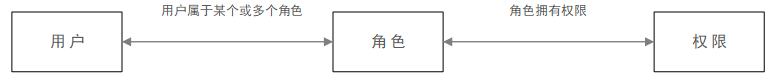

在 RBAC 中，权限与角色相关联，用户通过成为适当角色的成员而得到这些角色的权限。这就极大地简化了权限的管理。


#### 为什么 Cookie 无法防止 CSRF 攻击，而 Token 可以？

CSRF（Cross Site Request Forgery）一般被翻译为 跨站请求伪造 。那么什么是 跨站请求伪造 呢？说简单用你的身份去发送一些对你不友好的请求。

进行 Session 认证的时候，我们一般使用 Cookie 来存储 SessionId,当我们登陆后后端生成一个 SessionId 放在 Cookie 中返回给客户端，服务端通过 Redis 或者其他存储工具记录保存着这个 SessionId，客户端登录以后每次请求都会带上这个 SessionId，服务端通过这个 SessionId 来标示你这个人。如果别人通过 Cookie 拿到了 SessionId 后就可以代替你的身份访问系统了。Session 认证中 Cookie 中的 SessionId 是由浏览器发送到服务端的，借助这个特性，攻击者就可以通过让用户误点攻击链接，达到攻击效果。

但是，我们使用 Token 的话就不会存在这个问题，在我们登录成功获得 Token 之后，一般会选择存放在 localStorage （浏览器本地存储）中。然后我们在前端通过某些方式会给每个发到后端的请求加上这个 Token,这样就不会出现 CSRF 漏洞的问题。因为，即使有个你点击了非法链接发送了请求到服务端，这个非法请求是不会携带 Token 的，所以这个请求将是非法的。

### 认证授权

* JWT ：JWT（JSON Web Token）是一种身份认证的方式，JWT 本质上就一段签名的 JSON 格式的数据。由于它是带有签名的，因此接收者便可以验证它的真实性
* SSO(单点登录) ：SSO(Single Sign On) 即单点登录说的是用户登陆多个子系统的其中一个就有权访问与其相关的其他系统。


#### JWT 身份认证优缺点分析以及常见问题解决方案

##### Token 认证的优势

1.无状态
token 自身包含了身份验证所需要的所有信息，使得我们的服务器不需要存储 Session 信息，这显然增加了系统的可用性和伸缩性，大大减轻了服务端的压力。但是，也正是由于 token 的无状态，也导致了它最大的缺点：当后端在token 有效期内废弃一个 token 或者更改它的权限的话，不会立即生效，一般需要等到有效期过后才可以。另外，当用户 Logout 的话，token 也还有效。除非，我们在后端增加额外的处理逻辑。

2.有效避免了CSRF 攻击

3.适合移动端应用

使用 Session 进行身份认证的话，需要保存一份信息在服务器端，而且这种方式会依赖到 Cookie（需要 Cookie 保存 SessionId），所以不适合移动端。但是，使用 token 进行身份认证就不会存在这种问题，因为只要 token 可以被客户端存储就能够使用，而且 token 还可以跨语言使用。

4.单点登录友好

使用 Session 进行身份认证的话，实现单点登录，需要我们把用户的 Session 信息保存在一台电脑上，并且还会遇到常见的 Cookie 跨域的问题。但是，使用 token 进行认证的话， token 被保存在客户端，不会存在这些问题。

##### Token 认证常见问题以及解决办法

1.注销登录等场景下 token 还有效

与之类似的具体相关场景有：

1. 退出登录;
2. 修改密码;
3. 服务端修改了某个用户具有的权限或者角色；
4. 用户的帐户被删除/暂停。
5. 用户由管理员注销；

这个问题不存在于 Session 认证方式中，因为在 Session 认证方式中，遇到这种情况的话服务端删除对应的 Session 记录即可。但是，使用 token 认证的方式就不好解决了。我们也说过了，token 一旦派发出去，如果后端不增加其他逻辑的话，它在失效之前都是有效的。为了应对这类型问题，总结了下面几种方案：

* 将 token 存入内存数据库：将 token 存入 DB 中，redis 内存数据库在这里是不错的选择。如果需要让某个 token 失效就直接从 redis 中删除这个 token 即可。但是，这样会导致每次使用 token 发送请求都要先从 DB 中查询 token 是否存在的步骤，而且违背了 JWT 的无状态原则。
* 黑名单机制：和上面的方式类似，使用内存数据库比如 redis 维护一个黑名单，如果想让某个 token 失效的话就直接将这个 token 加入到 黑名单 即可。然后，每次使用 token 进行请求的话都会先判断这个 token 是否存在于黑名单中。
* 修改密钥 (Secret) : 我们为每个用户都创建一个专属密钥，如果我们想让某个 token 失效，我们直接修改对应用户的密钥即可。但是，这样相比于前两种引入内存数据库带来了危害更大，比如：1) 如果服务是分布式的，则每次发出新的 token 时都必须在多台机器同步密钥。为此，你需要将密钥存储在数据库或其他外部服务中，这样和 Session 认证就没太大区别了。 2) 如果用户同时在两个浏览器打开系统，或者在手机端也打开了系统，如果它从一个地方将账号退出，那么其他地方都要重新进行登录，这是不可取的。
* 保持令牌的有效期限短并经常轮换 ：很简单的一种方式。但是，会导致用户登录状态不会被持久记录，而且需要用户经常登录。

对于修改密码后 token 还有效问题的解决还是比较容易的，说一种我觉得比较好的方式：使用用户的密码的哈希值对 token 进行签名。因此，如果密码更改，则任何先前的令牌将自动无法验证。

2.token 的续签问题

token 有效期一般都建议设置的不太长，那么 token 过期后如何认证，如何实现动态刷新 token，避免用户经常需要重新登录？

1. 类似于 Session 认证中的做法：这种方案满足于大部分场景。假设服务端给的 token 有效期设置为30分钟，服务端每次进行校验时，如果发现 token 的有效期马上快过期了，服务端就重新生成 token 给客户端。客户端每次请求都检查新旧token，如果不一致，则更新本地的token。这种做法的问题是仅仅在快过期的时候请求才会更新 token ,对客户端不是很友好。
2. 每次请求都返回新 token :这种方案的的思路很简单，但是，很明显，开销会比较大。
3. token 有效期设置到半夜 ：这种方案是一种折衷的方案，保证了大部分用户白天可以正常登录，适用于对安全性要求不高的系统。
4. 用户登录返回两个 token ：第一个是 accessToken ，它的过期时间 token 本身的过期时间比如半个小时，另外一个是 refreshToken 它的过期时间更长一点比如为1天。客户端登录后，将 accessToken和refreshToken 保存在本地，每次访问将 accessToken 传给服务端。服务端校验 accessToken 的有效性，如果过期的话，就将 refreshToken 传给服务端。如果有效，服务端就生成新的 accessToken 给客户端。否则，客户端就重新登录即可。该方案的不足是：1) 需要客户端来配合；2) 用户注销的时候需要同时保证两个 token 都无效；3) 重新请求获取 token 的过程中会有短暂 token 不可用的情况（可以通过在客户端设置定时器，当accessToken 快过期的时候，提前去通过 refreshToken 获取新的accessToken）。

JWT 最适合的场景是不需要服务端保存用户状态的场景，如果考虑到 token 注销和 token 续签的场景话，没有特别好的解决方案，大部分解决方案都给 token 加上了状态，这就有点类似 Session 认证了。

#### SSO 单点登录

SSO英文全称Single Sign On，单点登录。SSO是在多个应用系统中，用户只需要登录一次就可以访问所有相互信任的应用系统。
##### 单点登录系统的好处

* **用户角度** :用户能够做到一次登录多次使用，无需记录多套用户名和密码，省心。
* **系统管理员角度** : 管理员只需维护好一个统一的账号中心就可以了，方便。
* **新系统开发角度**: 新系统开发时只需直接对接统一的账号中心即可，简化开发流程，省时。

##### SSO设计与实现
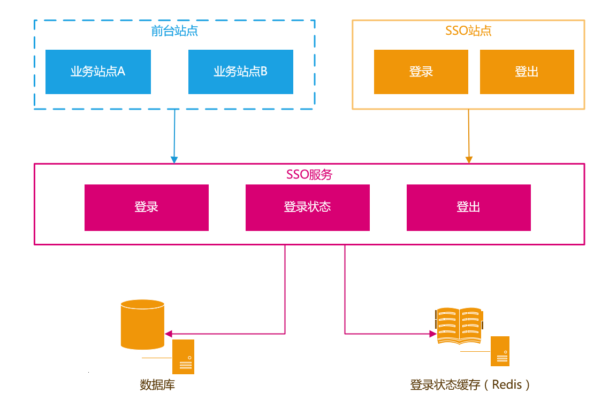

**跨域登录、登出**：

前面提到过，核心思路是客户端存储AuthToken，服务器端通过Redis存储登录信息。由于客户端是将AuthToken存储在Cookie中的。所以跨域要解决的问题，就是如何解决Cookie的跨域读写问题。

解决跨域的核心思路就是：

* 登录完成之后通过回调的方式，将AuthToken传递给主域名之外的站点，该站点自行将AuthToken保存在当前域下的Cookie中。
* 登出完成之后通过回调的方式，调用非主域名站点的登出页面，完成设置Cookie中的AuthToken过期的操作。
* 跨域登录（主域名已登录）
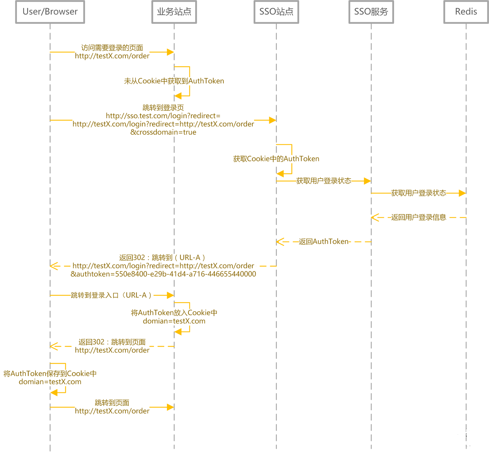

* 跨域登录（主域名未登录）
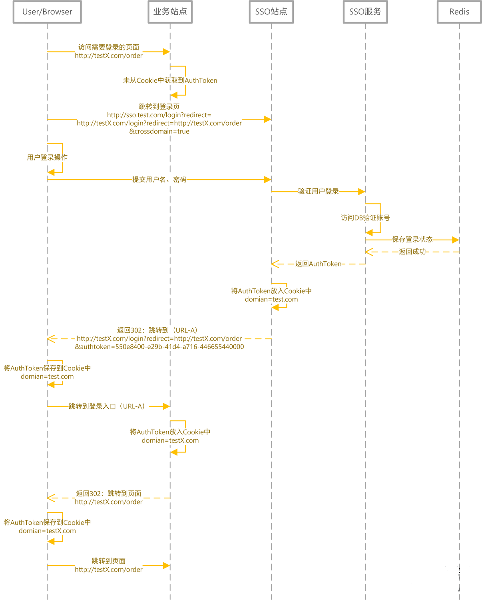


这次设计方案更多是提供实现思路。如果涉及到APP用户登录等情况，在访问SSO服务时，增加对APP的签名验证就好了。当然，如果有无线网关，验证签名不是问题。

### 敏感词过滤

系统需要对用户输入的文本进行敏感词过滤如色情、政治、暴力相关的词汇。敏感词过滤用的使用比较多的 Trie 树算法 和 DFA 算法。

#### 算法实现

##### Trie 树

Trie 树 也称为字典树、单词查找树，哈系树的一种变种，通常被用于字符串匹配，用来解决在一组字符串集合中快速查找某个字符串的问题。像浏览器搜索的关键词提示一般就是基于 Trie 树来做的。

假如我们的敏感词库中有以下敏感词：

* 高清有码
* 高清 AV
* 东京冷
* 东京热

我们构造出来的敏感词 Trie 树就是下面这样的：
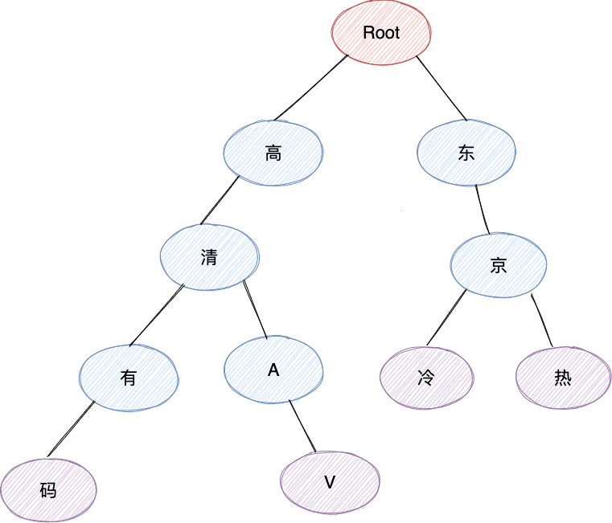

当我们要查找对应的字符串“东京热”的话，我们会把这个字符串切割成单个的字符“东”、“京”、“热”，然后我们从 Trie 树的根节点开始匹配。可以看出， Trie 树的核心原理其实很简单，就是**通过公共前缀来提高字符串匹配效率**。
Apache Commons Collecions这个库中就有 Trie 树实现。
```
Trie<String, String> trie = new PatriciaTrie<>();
trie.put("Abigail", "student");
trie.put("Abi", "doctor");
trie.put("Annabel", "teacher");
trie.put("Christina", "student");
trie.put("Chris","doctor");
Assertions.assertTrue(trie.containsKey("Abigail"));
assertEquals("{Abi=doctor, Abigail=student}",trie.prefixMap("Abi").toString());
assertEquals("{Chris=doctor,Christina=student}",trie.prefixMap("Chr").toString());
```
Aho-Corasick（AC）自动机是一种建立在 Trie 树上的一种改进算法，是一种多模式匹配算法，由贝尔实验室的研究人员 Alfred V. Aho 和 Margaret J.Corasick 发明。AC 自动机算法使用 Trie 树来存放模式串的前缀，通过失败匹配指针（失配指针）来处理匹配失败的跳转。
##### DFA

DFA（Deterministic Finite Automata)即确定有穷自动机，与之对应的是 NFA（Non-Deterministic Finite Automata，有穷自动机)。
Hutool提供了 DFA 算法的实现。
```
WordTree wordTree = new WordTree();
wordTree.addWord("大");
wordTree.addWord("大憨憨");
wordTree.addWord("憨憨");String text = "那人真是个大憨憨！";
// 获得第一个匹配的关键字
String matchStr = wordTree.match(text);System.out.println(matchStr);
// 标准匹配，匹配到最短关键词，并跳过已经匹配的关键词
List<String> matchStrList = wordTree.matchAll(text, -1, false, false);
System.out.println(matchStrList);
//匹配到最长关键词，跳过已经匹配的关键词
List<String> matchStrList2 = wordTree.matchAll(text, -1, false, true);
System.out.println(matchStrList2);
```
#### 开源项目

* **[ToolGood.Words](https://github.com/toolgood/ToolGood.Words)** ：一款高性能敏感词(非法词/脏字)检测过滤组件，附带繁体简体互换，支持全角半角互换，汉字转拼音，模糊搜索等功能。
* [**sensitive-words-filter**](https://github.com/hooj0/sensitive-words-filter) ：敏感词过滤项目，提供 TTMP、DFA、DAT、hash bucket、Tire 算法支持过滤。可以支持文本的高亮、过滤、判词、替换的接口支持。

## 定时任务

### 单机定时任务技术选型

#### Timer

java.util.Timer是 JDK 1.3 开始就已经支持的一种定时任务的实现方式。Timer 内部使用一个叫做 TaskQueue 的类存放定时任务，它是一个基于最小堆实现的优先级队列。TaskQueue 会按照任务距离下一次执行时间的大小将任务排序，保证在堆顶的任务最先执行。这样在需要执行任务时，每次只需要取出堆顶的任务运行即可！


Timer 使用起来比较简单，通过下面的方式我们就能创建一个 1s 之后执行的定时任务。
```
// 示例代码：TimerTask task = new TimerTask() {
    public void run() {
        System.out.println("当前时间: " + new Date() + "n" +
                "线程名称: " + Thread.currentThread().getName());
    }};System.out.println("当前时间: " + new Date() + "n" +
        "线程名称: " + Thread.currentThread().getName());Timer timer = new Timer("Timer");long delay = 1000L;
timer.schedule(task, delay);


//输出：
当前时间: Fri May 28 15:18:47 CST 2021n线程名称: main
当前时间: Fri May 28 15:18:48 CST 2021n线程名称: Timer
```

不过其缺陷较多，比如一个 Timer 一个线程，这就导致 Timer 的任务的执行只能串行执行，一个任务执行时间过长的话会影响其他任务（性能非常差），再比如发生异常时任务直接停止（Timer 只捕获了 InterruptedException ）。

#### ScheduledExecutorService

ScheduledExecutorService 是一个接口，有多个实现类，比较常用的是 ScheduledThreadPoolExecutor 。
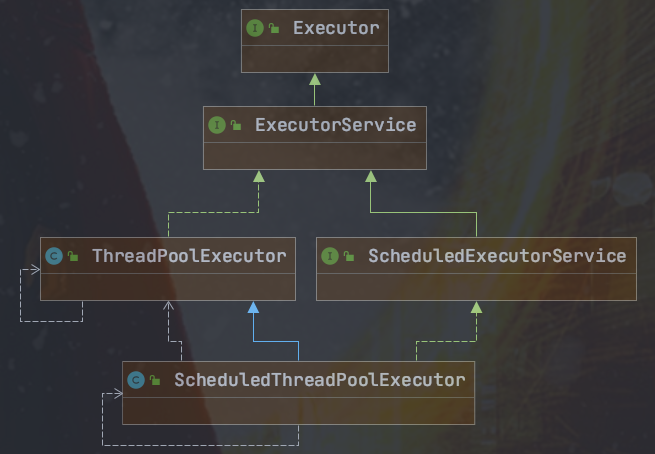

ScheduledThreadPoolExecutor 本身就是一个线程池，支持任务并发执行。并且，其内部使用 DelayQueue 作为任务队列。
```
// 示例代码：TimerTask repeatedTask = new TimerTask() {
    @SneakyThrows
    public void run() {
        System.out.println("当前时间: " + new Date() + "n" +
                "线程名称: " + Thread.currentThread().getName());
    }};System.out.println("当前时间: " + new Date() + "n" +
        "线程名称: " + Thread.currentThread().getName());ScheduledExecutorService executor = Executors.newScheduledThreadPool(3);long delay  = 1000L;long period = 1000L;
executor.scheduleAtFixedRate(repeatedTask, delay, period, TimeUnit.MILLISECONDS);Thread.sleep(delay + period * 5);
executor.shutdown();//输出：
当前时间: Fri May 28 15:40:46 CST 2021n线程名称: main
当前时间: Fri May 28 15:40:47 CST 2021n线程名称: pool-1-thread-1
当前时间: Fri May 28 15:40:48 CST 2021n线程名称: pool-1-thread-1
当前时间: Fri May 28 15:40:49 CST 2021n线程名称: pool-1-thread-2
当前时间: Fri May 28 15:40:50 CST 2021n线程名称: pool-1-thread-2
当前时间: Fri May 28 15:40:51 CST 2021n线程名称: pool-1-thread-2
当前时间: Fri May 28 15:40:52 CST 2021n线程名称: pool-1-thread-2
```
不论是使用 Timer 还是 ScheduledExecutorService 都无法使用 Cron 表达式指定任务执行的具体时间。

#### Spring Task

我们直接通过 Spring 提供的 @Scheduled 注解即可定义定时任务，非常方便！
```
/**
 * cron：使用Cron表达式。　每分钟的1，2秒运行
 */@Scheduled(cron = "1-2 * * * * ? ")public void reportCurrentTimeWithCronExpression() {
  log.info("Cron Expression: The time is now {}", dateFormat.format(new Date()));}
```
Spring Task 还是支持 Cron 表达式 的。Cron 表达式主要用于定时作业(定时任务)系统定义执行时间或执行频率的表达式，非常厉害，你可以通过 Cron 表达式进行设置定时任务每天或者每个月什么时候执行等等操作。咱们要学习定时任务的话，Cron 表达式是一定是要重点关注的。

但是，Spring 自带的定时调度只支持**单机**，并且提供的功能比较单一.
Spring Task 底层是基于 JDK 的 ScheduledThreadPoolExecutor 线程池来实现的。

#### 时间轮

Kafka、Dubbo、ZooKeeper、Netty 、Caffeine 、Akka 中都有对时间轮的实现。

时间轮简单来说就是一个环形的队列（底层一般基于数组实现），队列中的每一个元素（时间格）都可以存放一个定时任务列表。时间轮中的每个时间格代表了时间轮的基本时间跨度或者说时间精度，加入时间一秒走一个时间格的话，那么这个时间轮的最高精度就是 1 秒（也就是说 3 s 和 3.9s 会在同一个时间格中）。

下图是一个有 12 个时间格的时间轮，转完一圈需要 12 s。当我们需要新建一个 3s 后执行的定时任务，只需要将定时任务放在下标为 3 的时间格中即可。当我们需要新建一个 9s 后执行的定时任务，只需要将定时任务放在下标为 9 的时间格中即可。
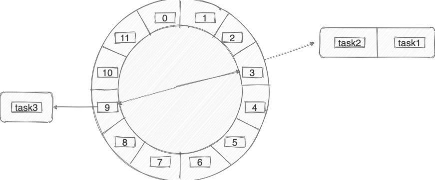

那当我们需要创建一个 13s 后执行的定时任务怎么办呢？这个时候可以引入一叫做 圈数/轮数 的概念，也就是说这个任务还是放在下标为 3 的时间格中， 不过它的圈数为 2 。除了增加圈数这种方法之外，还有一种 多层次时间轮 （类似手表），Kafka 采用的就是这种方案。


上图的时间轮，第 1 层的时间精度为 1 ，第 2 层的时间精度为 20 ，第 3 层的时间精度为 400。假如我们需要添加一个 350s 后执行的任务 A 的话（当前时间是 0s），这个任务会被放在第 2 层（因为第二层的时间跨度为 20 * 20=400>350）的第 350/20=17 个时间格子。当第一层转了 17 圈之后，时间过去了 340s ，第 2 层的指针此时来到第 17 个时间格子。此时，第 2 层第 17 个格子的任务会被移动到第 1 层。任务 A 当前是 10s 之后执行，因此它会被移动到第 1 层的第 10 个时间格子。这里在层与层之间的移动也叫做时间轮的升降级。参考手表来理解就好！

时间轮比较适合任务数量比较多的定时任务场景，它的任务写入和执行的时间复杂度都是 0（1）。

### 分布式定时任务技术选型

如果我们需要一些高级特性比如支持任务在分布式场景下的分片和高可用的话，我们就需要用到分布式任务调度框架了。通常情况下，一个定时任务的执行往往涉及到下面这些角色：

* 任务 ： 首先肯定是要执行的任务，这个任务就是具体的业务逻辑比如定时发送文章。
* 调度器 ：其次是调度中心，调度中心主要负责任务管理，会分配任务给执行器。
* 执行器 ： 最后就是执行器，执行器接收调度器分派的任务并执行。

#### Quartz

使用 Quartz 可以很方便地与 Spring 集成，并且支持动态添加任务和集群。但是，Quartz 使用起来也比较麻烦，API 繁琐,并且，Quzrtz 并没有内置 UI 管理控制台，不过你可以使用 quartzui 这个开源项目来解决这个问题。另外，Quartz 虽然也支持分布式任务。但是，它是在数据库层面，通过数据库的锁机制做的，有非常多的弊端比如系统侵入性严重、节点负载不均衡。有点伪分布式的味道。

优缺点总结：

* 优点： 可以与 Spring 集成，并且支持动态添加任务和集群。
* 缺点 ：分布式支持不友好，没有内置 UI 管理控制台、使用麻烦（相比于其他同类型框架来说）

#### Elastic-Job

Elastic-Job 是当当网开源的一个基于Quartz和ZooKeeper的分布式调度解决方案，由两个相互独立的子项目 Elastic-Job-Lite 和 Elastic-Job-Cloud 组成，一般我们只要使用 Elastic-Job-Lite 就好。

ElasticJob 支持任务在分布式场景下的分片和高可用、任务可视化管理等功能。
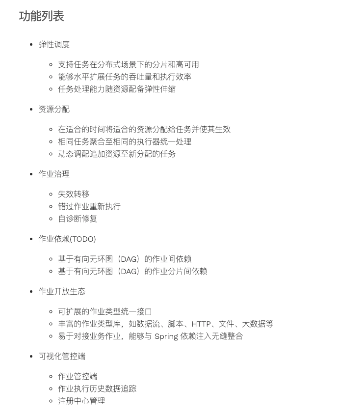

ElasticJob-Lite 的架构设计如下图所示：
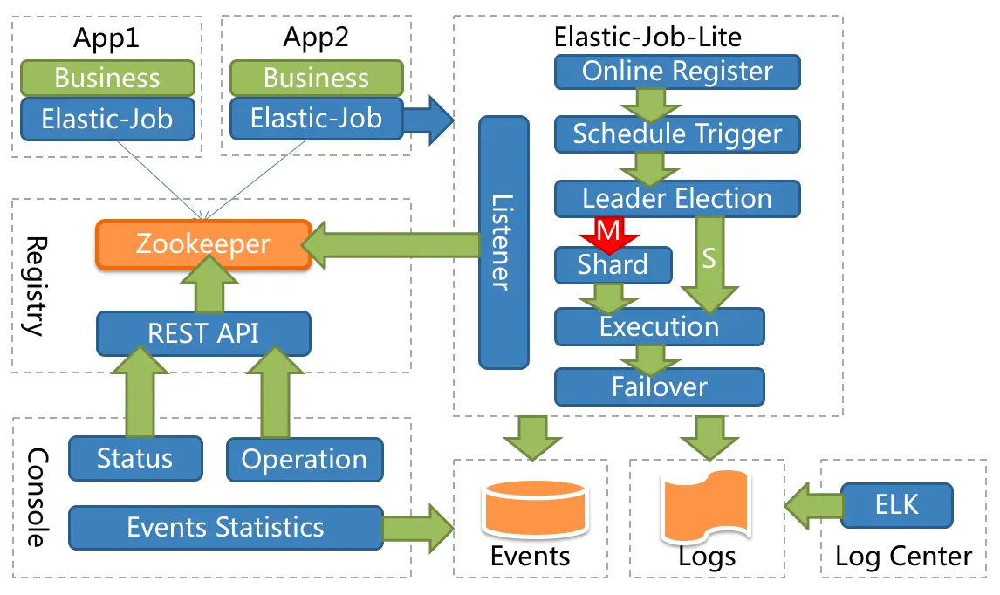

从上图可以看出，Elastic-Job 没有调度中心这一概念，而是使用 ZooKeeper 作为注册中心，注册中心负责协调分配任务到不同的节点上。

Elastic-Job 中的定时调度都是由执行器自行触发，这种设计也被称为去中心化设计（调度和处理都是执行器单独完成）。
```
@Component@ElasticJobConf(name = "dayJob", cron = "0/10 * * * * ?", shardingTotalCount = 2,
        shardingItemParameters = "0=AAAA,1=BBBB", description = "简单任务", failover = true)public class TestJob implements SimpleJob {
    @Override
    public void execute(ShardingContext shardingContext) {
        log.info("TestJob任务名：【{}】, 片数：【{}】, param=【{}】", shardingContext.getJobName(), shardingContext.getShardingTotalCount(),
                shardingContext.getShardingParameter());
    }}
```
优缺点总结：

* 优点 ：可以与 Spring 集成、支持分布式、支持集群、性能不错
* 缺点 ：依赖了额外的中间件比如 Zookeeper（复杂度增加，可靠性降低、维护成本变高）

#### XXL-JOB

XXL-JOB 于 2015 年开源，是一款优秀的轻量级分布式任务调度框架，支持任务可视化管理、弹性扩容缩容、任务失败重试和告警、任务分片等功能.
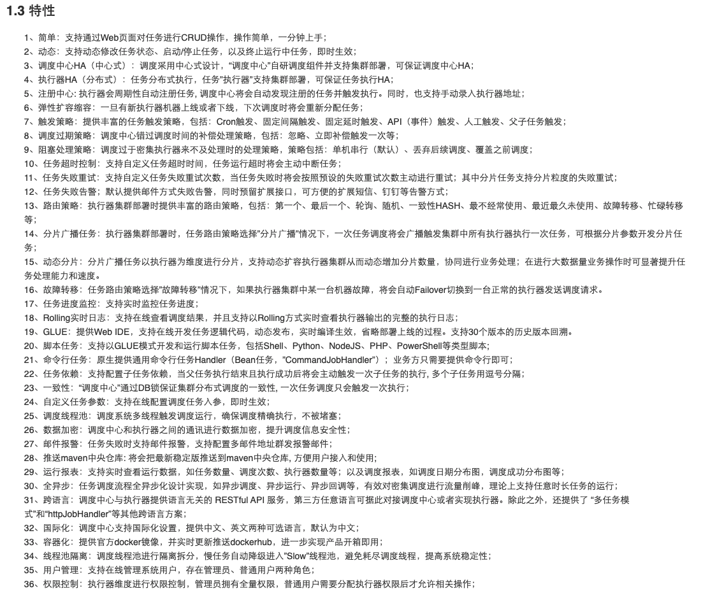

根据 XXL-JOB 官网介绍，其解决了很多 Quartz 的不足
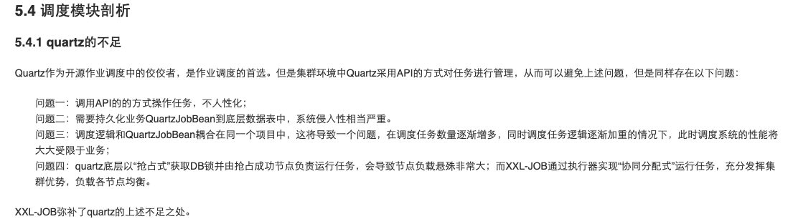

XXL-JOB 的架构设计如下图所示：
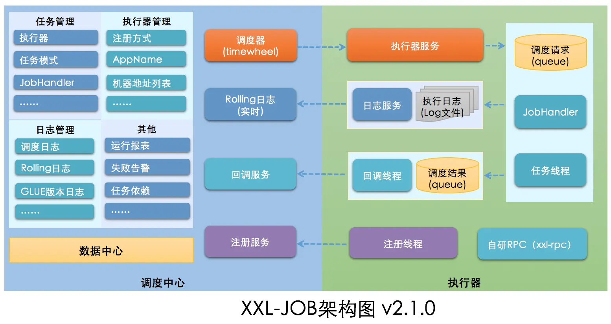

从上图可以看出，XXL-JOB 由 调度中心 和 执行器 两大部分组成。调度中心主要负责任务管理、执行器管理以及日志管理。执行器主要是接收调度信号并处理。另外，调度中心进行任务调度时，是通过自研 RPC 来实现的。

和 Quzrtz 类似 XXL-JOB 也是基于数据库锁调度任务，存在性能瓶颈。不过，一般在任务量不是特别大的情况下，没有什么影响的，可以满足绝大部分公司的要求。

不要被 XXL-JOB 的架构图给吓着了，实际上，我们要用 XXL-JOB 的话，只需要重写 IJobHandler 自定义任务执行逻辑就可以了，非常易用！
```
@JobHandler(value="myApiJobHandler")@Componentpublic class MyApiJobHandler extends IJobHandler {

    @Override
    public ReturnT<String> execute(String param) throws Exception {
        //......
        return ReturnT.SUCCESS;
    }}
```

还可以直接基于注解定义任务。
```
@XxlJob("myAnnotationJobHandler")public ReturnT<String> myAnnotationJobHandler(String param) throws Exception {
  //......
  return ReturnT.SUCCESS;}
```

优缺点总结：

* 优点：开箱即用（学习成本比较低）、与 Spring 集成、支持分布式、支持集群、内置了 UI 管理控制台。
* 缺点：不支持动态添加任务（如果一定想要动态创建任务也是支持的，参见：xxl-job issue277）。

#### PowerJob

由于 SchedulerX 属于人民币产品，我这里就不过多介绍。PowerJob 官方也对比过其和 QuartZ、XXL-JOB 以及 SchedulerX。
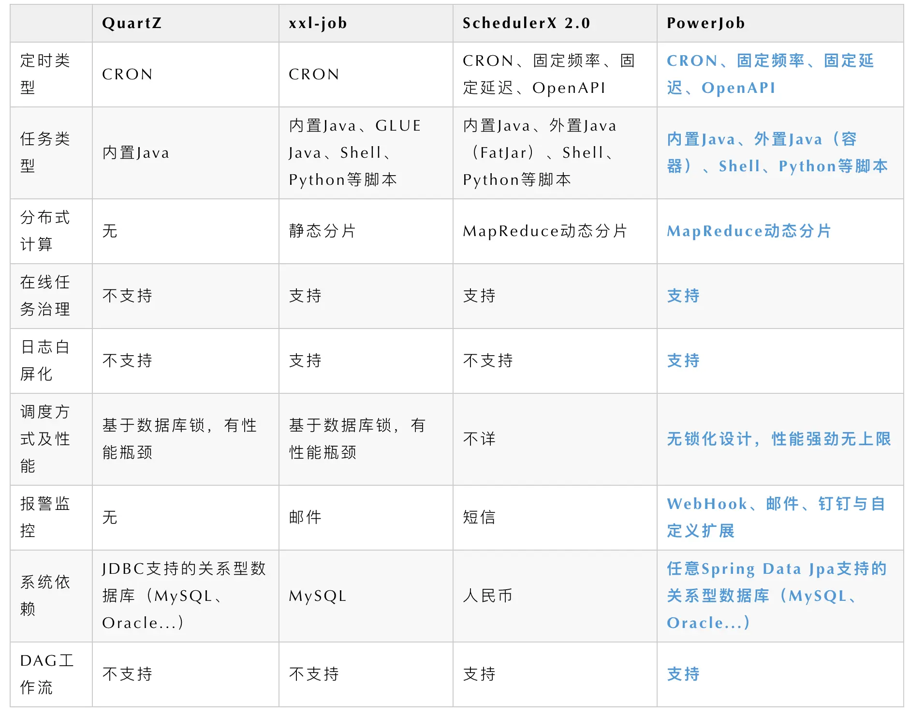
