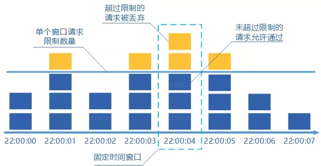
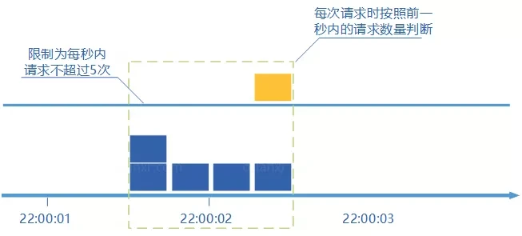
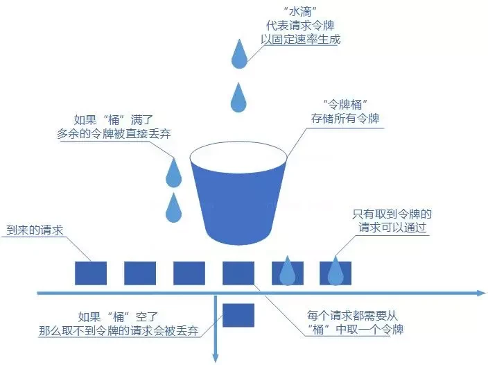

# 高可用系统设计

## 什么是高可用？可用性的判断标准是啥？

高可用描述的是一个系统在大部分时间都是可用的，可以为我们提供服务的。高可用代表系统即使在发生硬件故障或者系统升级的时候，服务仍然是可用的。

一般情况下，我们使用多少个 9 来评判一个系统的可用性，比如 99.9999% 就是代表该系统在所有的运行时间中只有 0.0001% 的时间是不可用的，这样的系统就是非常非常高可用的了！当然，也会有系统如果可用性不太好的话，可能连 9 都上不了。

除此之外，系统的可用性还可以用某功能的失败次数与总的请求次数之比来衡量，比如对网站请求 1000 次，其中有 10 次请求失败，那么可用性就是 99%。

## 系统不可用的情况

1. 黑客攻击
2. 硬件故障，比如服务器坏掉
3. 并发量/用户请求量激增导致整个服务宕掉或者部分服务不可用。
4. 代码中的坏味道导致内存泄漏或者其他问题导致程序挂掉。
5. 网站架构某个重要的角色比如 Nginx 或者数据库突然不可用。
6. 自然灾害或者人为破坏。
7. 。。。

## 有哪些提高系统可用性的方法

### 注重代码质量，测试严格把关

这个是最最最重要的，代码质量有问题比如比较常见的**内存泄漏**、**循环依赖**都是对系统可用性极大的损害。大家都喜欢谈限流、降级、熔断，但是我觉得从代码质量这个源头把关是首先要做好的一件很重要的事情。如何提高代码质量？比较实际可用的就是 CodeReview，不要在乎每天多花的那 1 个小时左右的时间，作用可大着呢！

另外，安利这个对提高代码质量有实际效果的宝贝：

* sonarqube ：保证你写出更安全更干净的代码！（ps: 目前所在的项目基本都会用到这个插件）。
* Alibaba 开源的 Java 诊断工具 Arthas 也是很不错的选择。
* IDEA 自带的代码分析等工具进行代码扫描也是非常非常棒的。

### 使用集群，减少单点故障

先拿常用的 Redis 举个例子！我们如何保证我们的 Redis 缓存高可用呢？答案就是使用集群，避免单点故障。当我们使用一个 Redis 实例作为缓存的时候，这个 Redis 实例挂了之后，整个缓存服务可能就挂了。使用了集群之后，即使一台 Redis 实例挂了，不到一秒就会有另外一台 Redis 实例顶上。

### 限流

流量控制（flow control），其原理是监控应用流量的 QPS 或并发线程数等指标，当达到指定的阈值时对流量进行控制，以避免被瞬时的流量高峰冲垮，从而保障应用的高可用性。

### 超时和重试机制设置

一旦用户请求超过某个时间的得不到响应，就抛出异常。这个是非常重要的，很多线上系统故障都是因为没有进行超时设置或者超时设置的方式不对导致的。我们在读取第三方服务的时候，尤其适合设置超时和重试机制。一般我们使用一些 RPC 框架的时候，这些框架都自带的超时重试的配置。如果不进行超时设置可能会导致请求响应速度慢，甚至导致请求堆积进而让系统无法再处理请求。重试的次数一般设为 3 次，再多次的重试没有好处，反而会加重服务器压力（部分场景使用失败重试机制会不太适合）。

### 熔断机制

超时和重试机制设置之外，熔断机制也是很重要的。 熔断机制说的是系统自动收集所依赖服务的资源使用情况和性能指标，当所依赖的服务恶化或者调用失败次数达到某个阈值的时候就迅速失败，让当前系统立即切换依赖其他备用服务。 比较常用的流量控制和熔断降级框架是 Netflix 的 Hystrix 和 alibaba 的 Sentinel。

### 异步调用

异步调用的话我们不需要关心最后的结果，这样我们就可以用户请求完成之后就立即返回结果，具体处理我们可以后续再做，秒杀场景用这个还是蛮多的。但是，使用异步之后我们可能需要 适当修改业务流程进行配合，比如用户在提交订单之后，不能立即返回用户订单提交成功，需要在消息队列的订单消费者进程真正处理完该订单之后，甚至出库后，再通过电子邮件或短信通知用户订单成功。除了可以在程序中实现异步之外，我们常常还使用消息队列，消息队列可以通过异步处理提高系统性能（削峰、减少响应所需时间）并且可以降低系统耦合性。

### 使用缓存

如果我们的系统属于并发量比较高的话，如果我们单纯使用数据库的话，当大量请求直接落到数据库可能数据库就会直接挂掉。使用缓存缓存热点数据，因为缓存存储在内存中，所以速度相当地快！

### 其他

1. 核心应用和服务优先使用更好的硬件
2. 监控系统资源使用情况增加报警设置。
3. 注意备份，必要时候回滚。
4. 灰度发布： 将服务器集群分成若干部分，每天只发布一部分机器，观察运行稳定没有故障，第二天继续发布一部分机器，持续几天才把整个集群全部发布完毕，期间如果发现问题，只需要回滚已发布的一部分服务器即可
5. 定期检查/更换硬件： 如果不是购买的云服务的话，定期还是需要对硬件进行一波检查的，对于一些需要更换或者升级的硬件，要及时更换或者升级。

# 限流

## 何为限流？为什么要限流？

针对软件系统来说，限流就是对请求的速率进行限制，避免瞬时的大量请求击垮软件系统。毕竟，软件系统的处理能力是有限的。如果说超过了其处理能力的范围，软件系统可能直接就挂掉了。
限流可能会导致用户的请求无法被正确处理，不过，这往往也是权衡了软件系统的稳定性之后得到的最优解。
现实生活中，处处都有限流的实际应用，就比如排队买票是为了避免大量用户涌入购票而导致售票员无法处理。

## 常见限流算法

### 固定窗口计数器算法

固定窗口其实就是时间窗口。固定窗口计数器算法 规定了我们单位时间处理的请求数量。

* 给定一个变量 counter 来记录当前接口处理的请求数量，初始值为 0（代表接口当前 1 分钟内还未处理请求）。
* 1 分钟之内每处理一个请求之后就将 counter+1 ，当 counter=33 之后（也就是说在这 1 分钟内接口已经被访问 33 次的话），后续的请求就会被全部拒绝。
* 等到 1 分钟结束后，将 counter 重置 0，重新开始计数。

这种限流算法无法保证限流速率，因而无法保证突然激增的流量。

就比如说我们限制某个接口 1 分钟只能访问 1000 次，该接口的 QPS 为 500，前 55s 这个接口 1 个请求没有接收，后 1s 突然接收了 1000 个请求。然后，在当前场景下，这 1000 个请求在 1s 内是没办法被处理的，系统直接就被瞬时的大量请求给击垮了。



### 滑动窗口计数器算法

**滑动窗口计数器算法**算的上是固定窗口计数器算法的升级版。

滑动窗口计数器算法相比于固定窗口计数器算法的优化在于：它把时间以一定比例分片 。

例如我们的接口限流每分钟处理 60 个请求，我们可以把 1 分钟分为 60 个窗口。每隔 1 秒移动一次，每个窗口一秒只能处理 不大于 60(请求数)/60（窗口数） 的请求， 如果当前窗口的请求计数总和超过了限制的数量的话就不再处理其他请求。

很显然， **当滑动窗口的格子划分的越多，滑动窗口的滚动就越平滑，限流的统计就会越精确。**


### 漏桶算法

我们可以把发请求的动作比作成注水到桶中，我们处理请求的过程可以比喻为漏桶漏水。我们往桶中以任意速率流入水，以一定速率流出水。当水超过桶流量则丢弃，因为桶容量是不变的，保证了整体的速率。

如果想要实现这个算法的话也很简单，准备一个队列用来保存请求，然后我们定期从队列中拿请求来执行就好了（和消息队列削峰/限流的思想是一样的）。


### 令牌桶算法

令牌桶算法也比较简单。和漏桶算法算法一样，我们的主角还是桶（这限流算法和桶过不去啊）。不过现在桶里装的是令牌了，请求在被处理之前需要拿到一个令牌，请求处理完毕之后将这个令牌丢弃（删除）。我们根据限流大小，按照一定的速率往桶里添加令牌。如果桶装满了，就不能继续往里面继续添加令牌了。


## 单机限流

单机限流可以直接使用 Google Guava 自带的限流工具类 RateLimiter 。 RateLimiter 基于令牌桶算法，可以应对突发流量。除了最基本的令牌桶算法(平滑突发限流)实现之外，Guava 的RateLimiter还提供了**平滑预热限流**的算法实现。

平滑突发限流就是按照指定的速率放令牌到桶里，而平滑预热限流会有一段预热时间，预热时间之内，速率会逐渐提升到配置的速率。

我们直接在项目中引入 Guava 相关的依赖即可使用。
```
<dependency>
    <groupId>com.google.guava</groupId>
    <artifactId>guava</artifactId>
    <version>31.0.1-jre</version>
</dependency>
```

下面是一个简单的 Guava 平滑突发限流的 Demo。
```
import com.google.common.util.concurrent.RateLimiter;

public class RateLimiterDemo {

    public static void main(String[] args) {
        // 1s 放 5 个令牌到桶里也就是 0.2s 放 1个令牌到桶里
        RateLimiter rateLimiter = RateLimiter.create(5);
        for (int i = 0; i < 10; i++) {
            double sleepingTime = rateLimiter.acquire(1);
            System.out.printf("get 1 tokens: %ss%n", sleepingTime);
        }
    }
}
```
输出：
```
get 1 tokens: 0.0s
get 1 tokens: 0.188413s
get 1 tokens: 0.197811s
get 1 tokens: 0.198316s
get 1 tokens: 0.19864s
get 1 tokens: 0.199363s
get 1 tokens: 0.193997s
get 1 tokens: 0.199623s
get 1 tokens: 0.199357s
get 1 tokens: 0.195676s
```

另外，Bucket4j 是一个非常不错的基于令牌/漏桶算法的限流库。相对于，Guava 的限流工具类来说，Bucket4j 提供的限流功能更加全面。不仅支持单机限流和分布式限流，还可以集成监控，搭配 Prometheus 和 Grafana 使用。不过，毕竟 Guava 也只是一个功能全面的工具类库，其提供的开箱即用的限流功能在很多单机场景下还是比较实用的。
Spring Cloud Gateway 中自带的单机限流的早期版本就是基于 Bucket4j 实现的。后来，替换成了 Resilience4j。**Resilience4j** 是一个轻量级的容错组件，其灵感来自于 Hystrix。自Netflix 宣布不再积极开发 Hystrixopen in new window 之后，Spring 官方和 Netflix 都更推荐使用 Resilience4j 来做限流熔断。

一般情况下，为了保证系统的高可用，项目的限流和熔断都是要一起做的Resilience4j 不仅提供限流，还提供了熔断、负载保护、自动重试等保障系统高可用开箱即用的功能。并且，Resilience4j 的生态也更好，很多网关都使用 Resilience4j 来做限流熔断的。

因此，在绝大部分场景下 Resilience4j 或许会是更好的选择。如果是一些比较简单的限流场景的话，Guava 或者 Bucket4j 也是不错的选择。

## 分布式限流

分布式限流常见的方案：

* 借助中间件架限流 ：可以借助 Sentinel 或者使用 Redis 来自己实现对应的限流逻辑。
* 网关层限流 ：比较常用的一种方案，直接在网关层把限流给安排上了。不过，通常网关层限流通常也需要借助到中间件/框架。就比如 Spring Cloud Gateway 的分布式限流实现RedisRateLimiter就是基于 Redis+Lua 来实现的，再比如 Spring Cloud Gateway 还可以整合 Sentinel 来做限流。

如果你要基于 Redis 来手动实现限流逻辑的话，建议配合 Lua 脚本来做。
网上也有很多现成的脚本供你参考，就比如 Apache 网关项目 [ShenYu](https://github.com/apache/incubator-shenyu) 的 RateLimiter 限流插件就基于 Redis + Lua 实现了令牌桶算法/并发令牌桶算法、漏桶算法、滑动窗口算法。

# 降级&熔断
